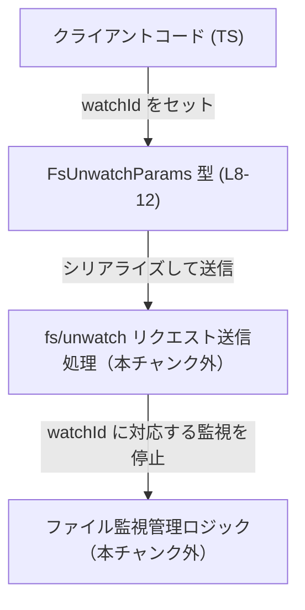
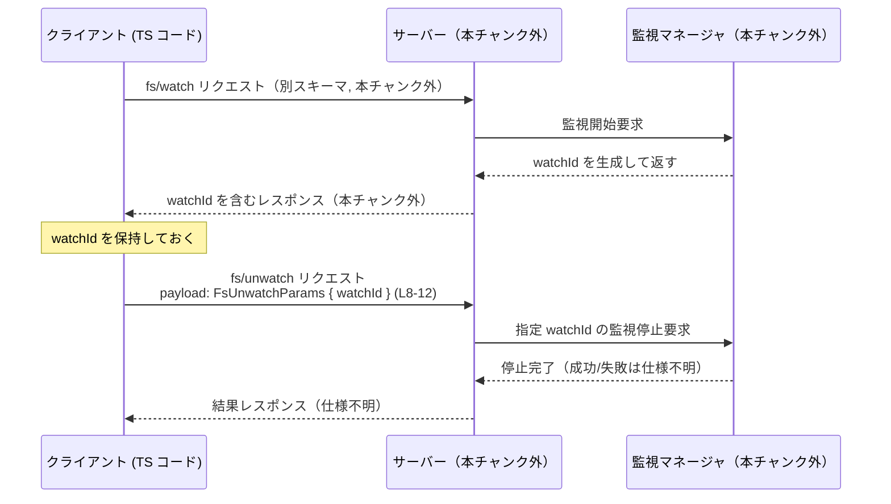

# app-server-protocol/schema/typescript/v2/FsUnwatchParams.ts

## 0. ざっくり一言

ファイル監視を停止するプロトコル呼び出しに対して、どの監視を停止するかを示す「watchId」だけを持つパラメータ型を TypeScript で定義した、自動生成コードです（`FsUnwatchParams.ts:L1-3,8-12`）。

---

## 1. このモジュールの役割

### 1.1 概要

- このモジュールは、以前に行ったファイルシステム監視（`fs/watch`）を停止するためのリクエストパラメータを表現する型 `FsUnwatchParams` を提供します（コメントより, `FsUnwatchParams.ts:L5-7,8`）。
- 具体的には、「どの監視を停止するか」を識別する文字列 `watchId` を 1 つだけ持つオブジェクト型です（`FsUnwatchParams.ts:L9-12`）。
- ファイル先頭のコメントにある通り、Rust から TypeScript 型を生成するツール `ts-rs` によって自動生成されています（`FsUnwatchParams.ts:L1-3`）。

### 1.2 アーキテクチャ内での位置づけ

コメントとファイルパスから、この型は「アプリケーションサーバーとの通信プロトコル v2 の TypeScript スキーマ」の一部として使われることが読み取れます（`FsUnwatchParams.ts:L3,8`）。

- クライアント側 TypeScript コードが `FsUnwatchParams` 型のオブジェクトを作成
- それをプロトコルメッセージ（おそらく `fs/unwatch` に対応）としてサーバーへ送信
- サーバー側が `watchId` を使って、対応するファイル監視を停止

という流れが想定されます。ただし、実際の送受信処理や RPC ハンドラはこのチャンクには含まれていません。



※ `fs/unwatch` という名前はコメントの「prior `fs/watch`」から推測されるものであり、実際のメソッド名はこのチャンクからは断定できません（`FsUnwatchParams.ts:L6,10`）。

### 1.3 設計上のポイント

コードから読み取れる設計上の特徴は次のとおりです。

- **自動生成ファイル**  
  - ファイル冒頭で「GENERATED CODE」「Do not edit manually」と明示されており、手動での編集は前提にしていません（`FsUnwatchParams.ts:L1-3`）。
- **純粋なデータ型のみ**  
  - 関数やメソッドは一切なく、`export type` によるオブジェクト型の定義のみを公開しています（`FsUnwatchParams.ts:L8-12`）。
- **識別子だけに絞った単純なスキーマ**  
  - 停止対象の監視を特定するための `watchId: string` のみを持ち、それ以外のオプションはありません（`FsUnwatchParams.ts:L9-12`）。
- **エラーハンドリング・検証ロジックはこのファイルにはない**  
  - 型レベルで `watchId` が string であることは保証しますが、「空文字でよいか」「存在しない ID のときどうするか」といった仕様やチェックは、別のレイヤーで扱われる設計です（このチャンクには現れません）。

---

## 2. 主要な機能一覧

このファイルが提供する主要な要素は 1 つだけです。

- `FsUnwatchParams` 型: ファイルシステム監視停止用リクエストのパラメータ。停止対象を表す `watchId` 文字列を 1 つ持つ。

---

## 3. 公開 API と詳細解説

### 3.1 型一覧（構造体・列挙体など）

このファイルで公開されている型は次の 1 つです。

| 名前 | 種別 | フィールド / 構造 | 役割 / 用途 | 定義位置 |
|------|------|-------------------|-------------|----------|
| `FsUnwatchParams` | 型エイリアス（オブジェクト型） | `{ watchId: string }` | 既存のファイル監視（`fs/watch`）を停止するためのリクエストパラメータ。停止対象の監視 ID を指定する。 | `FsUnwatchParams.ts:L8-12` |

`FsUnwatchParams` のフィールド詳細:

| フィールド名 | 型 | 必須/任意 | 説明 | 根拠 |
|-------------|----|-----------|------|------|
| `watchId` | `string` | 必須 | 「以前に `fs/watch` によって提供された監視識別子」であり、どの監視を停止するかを指定するために使われます。 | 型定義とコメントより（`FsUnwatchParams.ts:L9-12`） |

### 3.2 関数詳細（最大 7 件）

このファイルには関数・メソッドは定義されていません（`export type` のみ, `FsUnwatchParams.ts:L8-12`）。  
そのため、関数に対する詳細テンプレート適用は該当しません。

### 3.3 その他の関数

なし（このチャンクには関数定義が存在しません）。

---

## 4. データフロー

コメントと型名から想定される「ファイル監視を開始し、その後停止する」一連のデータフローを示します。RPC 名や返り値の詳細はこのチャンクにはないため、一般的なイメージとしての図になります。



重要な点:

- `FsUnwatchParams` は、2 回目のリクエスト（監視停止）で使用されるペイロードであり、「以前にどの監視を開始したか」を識別するための `watchId` を運ぶ役割を持ちます（`FsUnwatchParams.ts:L5-7,9-12`）。
- 実際の RPC メソッド名やレスポンス形式、エラー処理はこのチャンクには記述されていません。

---

## 5. 使い方（How to Use）

### 5.1 基本的な使用方法

以下は、TypeScript 側で `FsUnwatchParams` を使って監視停止リクエストを送るときの典型的なイメージです。  
送信関数 `sendFsUnwatch` は、このチャンクには存在しない想定上の関数です。

```typescript
// FsUnwatchParams 型をインポートする                        // このファイルで定義されている型
import type { FsUnwatchParams } from "./schema/typescript/v2/FsUnwatchParams"; // 実際のパスはプロジェクト構成によって変わる

// 以前 fs/watch のレスポンスなどから取得した watchId       // 開始時にサーバーから受け取った監視 ID
const watchId: string = "abc123";                            // 具体的な値の形式はプロトコル仕様次第（このチャンクからは不明）

// FsUnwatchParams 型のオブジェクトを組み立てる              // 必須フィールド watchId をセット
const params: FsUnwatchParams = {
    watchId,                                                 // string であればコンパイル時に型チェックを通る
};

// 想定上の RPC クライアントから fs/unwatch を送信する例      // sendFsUnwatch は本チャンクには定義されていない
await rpcClient.sendFsUnwatch(params);                       // params は { watchId: string } としてシリアライズされる想定
```

ポイント:

- TypeScript の型チェックにより、`watchId` が string 以外の型（number など）になっているとコンパイルエラーになります（型安全性）。
- 一方で、実行時には単なる JavaScript オブジェクトなので、「空文字」「存在しない ID」などはこの型だけでは判別できません。これはサーバー側の検証ロジックの責務になります（このチャンクには未記載）。

### 5.2 よくある使用パターン

**パターン 1: fs/watch の結果をそのまま使って停止する**

```typescript
// 想定: fsWatch が監視を開始し watchId を返す関数             // fsWatch の定義はこのチャンクにはない
async function startAndLaterStop() {
    const watchResult = await rpcClient.fsWatch(/* ... */);  // 監視開始（詳細は別スキーマ）
    const watchId: string = watchResult.watchId;             // サーバーから返された ID を取得

    // 何らかの条件で監視をやめたいとき
    const params: FsUnwatchParams = {
        watchId,                                             // 取得済みの ID をそのまま使用
    };
    await rpcClient.sendFsUnwatch(params);                   // 停止リクエストを送信
}
```

**パターン 2: watchId をマップで管理し、必要になったときに停止**

```typescript
const watchMap = new Map<string, string>();                  // 任意のキーと watchId を紐づける

function rememberWatch(key: string, watchId: string) {
    watchMap.set(key, watchId);                              // 後で停止するときのために保存
}

async function stopWatchByKey(key: string) {
    const watchId = watchMap.get(key);                       // 保存しておいた watchId を取得
    if (!watchId) {
        // 対応する監視がないので何もしない / ログ出力など
        return;
    }

    const params: FsUnwatchParams = { watchId };             // 必須フィールドをセット
    await rpcClient.sendFsUnwatch(params);                   // 停止リクエスト
    watchMap.delete(key);                                    // 管理上も削除
}
```

### 5.3 よくある間違い

**間違い例 1: `watchId` を number で扱ってしまう**

```typescript
// 間違い例: watchId を number として扱っている
const watchIdNum = 123;                                      // number 型
const paramsWrong: FsUnwatchParams = {
    // watchId: watchIdNum,                                  // コンパイルエラー: number を string に代入できない
    watchId: String(watchIdNum),                             // 正: 必要なら明示的に string に変換する
};
```

TypeScript の型付けにより、このような誤用はコンパイル時に検出されます（`FsUnwatchParams.ts:L8-12` が string 型であることが根拠）。

**間違い例 2: `watchId` を指定し忘れる**

```typescript
// 間違い例: 必須フィールド watchId を指定していない
// const params: FsUnwatchParams = {};                        // コンパイルエラー: watchId プロパティが欠けている

// 正しい例
const params: FsUnwatchParams = {
    watchId: "abc123",                                       // 必須フィールドを必ず指定
};
```

必須プロパティであるため、オブジェクトリテラルで `watchId` を省略するとコンパイルエラーになります（`FsUnwatchParams.ts:L9-12` より、`?` が付いていないことが根拠）。

### 5.4 使用上の注意点（まとめ）

- **自動生成コードのため手動編集しない**  
  - ファイル冒頭で明示されている通り、このファイルは `ts-rs` により生成されたものであり、手動で編集すると、再生成時に上書きされたり、Rust 側との整合性が崩れる可能性があります（`FsUnwatchParams.ts:L1-3`）。
- **`watchId` の値の妥当性チェックは別レイヤーで行う必要がある**  
  - TypeScript の型は `string` であることのみ保証し、値の中身（空/存在しない ID など）は保証しません。実際の妥当性チェックはサーバー側や上位ロジックで行う必要があります（妥当性に関する記述はこのチャンクにはありません）。
- **並行実行時の注意（プロトコル側の問題）**  
  - 同じ `watchId` に対する `fs/unwatch` を短時間に複数回送信した場合の扱い（2 回目以降は無視するか、エラーにするか）は、このファイルからは分かりません。クライアント側では「同じ ID に対する重複停止リクエスト」を避ける設計にしておくのが無難です（仕様は本チャンクには現れません）。
- **ランタイムでの型安全性**  
  - コンパイル後は plain JavaScript オブジェクトのため、外部から受け取ったデータをそのまま `FsUnwatchParams` として扱う場合は、ランタイムでのバリデーション（`typeof watchId === "string"` など）を別途行う必要があります。このファイルにはランタイムバリデーションは含まれていません。

---

## 6. 変更の仕方（How to Modify）

### 6.1 新しい機能を追加する場合

このファイル自体は「自動生成される成果物」であり、直接の変更は推奨されません（`FsUnwatchParams.ts:L1-3`）。

- **追加フィールドを持たせたい場合**  
  - 例: `reason: string` などを `FsUnwatchParams` に追加したい場合、
    - 生成元である Rust 側の型定義（`ts-rs` が参照している構造体や型）を変更し、
    - その上で `ts-rs` によるコード生成プロセスを再実行する必要があります。
  - 生成元の Rust ファイルやビルド手順は、このチャンクからは分かりません。
- **別のパラメータ型を追加したい場合**  
  - 同様に、Rust 側に新しい型を追加 → `ts-rs` の設定にそれを含める → 生成という流れになると考えられますが、具体的な構成はこのチャンクには現れません。

### 6.2 既存の機能を変更する場合

- **`watchId` の型を変えたい（例: number にしたい）**  
  - 直接 `FsUnwatchParams.ts` を編集すると、再生成時に失われる上、サーバー側 Rust 実装との型不整合を起こす可能性があります。
  - 必要であれば、生成元の Rust 型を変更し、`ts-rs` の生成設定を更新する必要があります。
- **後方互換性への影響**  
  - `watchId` の型変更やフィールド名変更は、既存クライアント/サーバー間の互換性に大きく影響します。プロトコルバージョン v2 とパスに含まれているので、互換性を壊す変更は通常、新バージョンのスキーマとして追加するのが一般的です（ただし、このプロジェクトの具体的な互換性方針は本チャンクからは分かりません）。

---

## 7. 関連ファイル

このチャンクには他ファイルの情報が含まれていないため、厳密な関連ファイルは特定できませんが、コメントや命名から次のようなファイルが存在する可能性があります。

| パス（推測を含む） | 役割 / 関係 | 根拠 |
|--------------------|------------|------|
| `schema/typescript/v2/FsWatchParams.ts` など | `fs/watch` 呼び出しのパラメータ型。`FsUnwatchParams` のコメントに「prior `fs/watch`」とあるため、開始側のスキーマが別途存在すると考えられます。 | コメント中の `fs/watch`（`FsUnwatchParams.ts:L6,10`） |
| 対応する Rust 側の型定義ファイル | `ts-rs` が元にした Rust 型定義。TypeScript 側スキーマとサーバー実装の整合性を保つための元データ。 | 「This file was generated by [ts-rs]」というコメント（`FsUnwatchParams.ts:L3`） |

いずれもこのチャンクには現れておらず、正確なパスや内容はコードからは分かりません。

---

### コンポーネントインベントリー（まとめ）

最後に、このチャンク内コンポーネントの一覧を行番号付きで再掲します。

| 種別 | 名前 | 概要 | 定義位置 |
|------|------|------|----------|
| 型エイリアス | `FsUnwatchParams` | ファイル監視停止用パラメータ。`watchId: string` 1 フィールドのみ。 | `FsUnwatchParams.ts:L8-12` |
| フィールド | `watchId` | 以前の `fs/watch` が返した監視識別子。停止対象を特定する。 | コメント + プロパティ宣言（`FsUnwatchParams.ts:L9-12`） |

このファイルには、関数・クラス・列挙体・テストコードなどは含まれていません（`FsUnwatchParams.ts:L1-12` 全体より）。
