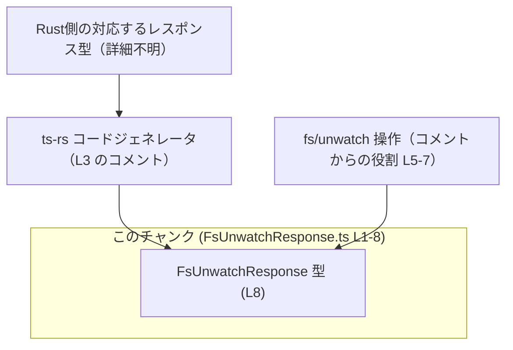
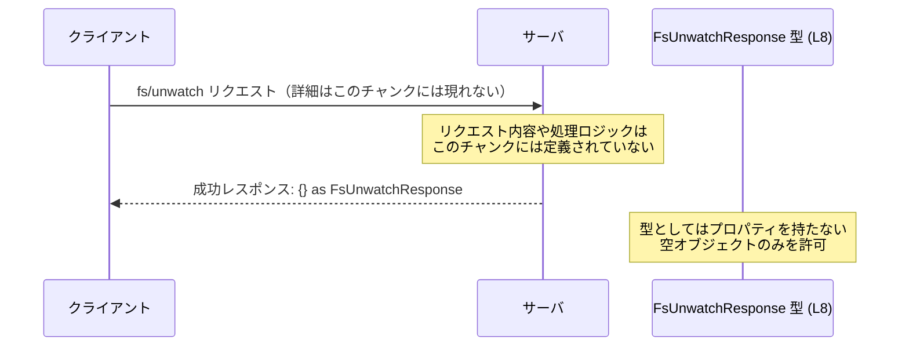

# app-server-protocol/schema/typescript/v2/FsUnwatchResponse.ts

## 0. ざっくり一言

`fs/unwatch` 操作の **成功レスポンス** を表す、**プロパティを一切持たない空オブジェクト型** を定義する自動生成ファイルです（L5-8）。

---

## 1. このモジュールの役割

### 1.1 概要

- このファイルは `FsUnwatchResponse` という TypeScript の **型エイリアス**（別名）を定義します（L8）。
- コメントより、この型は `fs/unwatch` という操作の **成功レスポンス** 用であると記載されています（L5-7）。
- 型の実体は `Record<string, never>` であり、「**任意の文字列キーを持てないオブジェクト**」＝事実上の空オブジェクト `{}` を表現します（L8）。

### 1.2 アーキテクチャ内での位置づけ

- ファイル先頭コメントにより、このファイルは **ts-rs** というツールによって Rust 側の定義から自動生成されていることが分かります（L1, L3）。
- `schema/typescript/v2` 以下にあることから、アプリケーションサーバーのプロトコル定義（スキーマ）の一部として、クライアント側 TypeScript コードから参照されることが想定されますが、使用箇所はこのチャンクには現れません。

この関係を、行番号つきで示した依存関係図は次のとおりです。



- `RustType`（Rust側の元型）と `FsUnwatchOp`（`fs/unwatch` 操作本体）の具体的な定義は、このチャンクには現れませんが、L3, L5-7 のコメントから存在が示唆されます。

### 1.3 設計上のポイント

コードとコメントから読み取れる設計上の特徴は以下のとおりです。

- **自動生成コード**  
  - ファイル先頭で「GENERATED CODE」「Do not edit this file manually」と明記されています（L1, L3）。  
  - 変更が必要な場合は、生成元（Rust コードや ts-rs の設定）を変更し、再生成する前提です。
- **状態を持たない型定義のみ**  
  - 実行時の処理や関数は一切なく、型定義だけのファイルです（L1-8）。
- **空レスポンスを厳密に表現**  
  - 成功レスポンスに payload（追加情報）を一切持たせない設計であることを `Record<string, never>` によって型レベルで表現しています（L5-8）。
- **エラーハンドリングとの役割分担**  
  - この型は「成功レスポンス」のみを表現するため、エラー時レスポンスの型は別に存在すると考えられますが、このチャンクには現れません（L5-7）。

---

## 2. 主要な機能一覧

このファイルが提供する主要な要素は 1 つです。

- `FsUnwatchResponse` 型: `fs/unwatch` 操作成功時のレスポンス型。プロパティを一切持たない空オブジェクトを表現する（L5-8）。

---

## 3. 公開 API と詳細解説

### 3.1 型一覧（構造体・列挙体など）

このチャンクに現れる公開型は次の 1 つです。

| 名前 | 種別 | 役割 / 用途 | 根拠 |
|------|------|-------------|------|
| `FsUnwatchResponse` | 型エイリアス | `fs/unwatch` 操作の成功レスポンス。`Record<string, never>` により、文字列キーを一切持たない空オブジェクトを表現する。 | app-server-protocol/schema/typescript/v2/FsUnwatchResponse.ts:L5-8 |

**型の意味（TypeScript の観点）**

```ts
export type FsUnwatchResponse = Record<string, never>;
```

- `Record<K, T>` は「キー `K` に対して値 `T` を持つオブジェクト型」を表します。
- `Record<string, never>` は「任意の文字列キーの値が `never`（到達不能な型）」であることを意味するため、
  - 実際には **プロパティを追加できないオブジェクト型** です。
  - そのため、`{}` のような空オブジェクトだけがこの型と互換になります。

例:

```ts
const ok: FsUnwatchResponse = {};                 // OK: 空オブジェクトは代入可能

const ng: FsUnwatchResponse = { removed: 1 };     // 型エラー: プロパティ 'removed' を持てない
// Type '{ removed: number; }' is not assignable to type 'Record<string, never>'.
```

### 3.2 関数詳細（最大 7 件）

このファイルには **関数やメソッドは一切定義されていません**（L1-8）。  
したがって、関数詳細テンプレートに従って説明できる対象はありません。

### 3.3 その他の関数

- なし（このチャンクには関数定義が存在しません）（L1-8）。

---

## 4. データフロー

このファイル自体にはロジックはありませんが、コメントから分かる範囲で `fs/unwatch` 操作におけるレスポンスのデータフローを示します。

### 4.1 `fs/unwatch` 成功時のレスポンスフロー

L5-7 のコメント:

```ts
/**
 * Successful response for `fs/unwatch`.
 */
```

から、`FsUnwatchResponse` が `fs/unwatch` 操作の **成功レスポンスの型** であることが分かります。

これを元にした、概念的なシーケンス図は次のとおりです。



- リクエストの型やサーバ内部の処理、HTTP/IPC の詳細などは、このチャンクには現れません。
- 型定義により、「`fs/unwatch` が成功したこと」だけが表現され、追加情報は一切返されない契約になっていると解釈できます（L5-8）。

---

## 5. 使い方（How to Use）

### 5.1 基本的な使用方法

`FsUnwatchResponse` は、`fs/unwatch` 操作の成功時レスポンスとして使うことが想定されています（L5-7）。  
典型的には、API 呼び出し関数の戻り値型として利用します。

```ts
// FsUnwatchResponse 型をインポートする例
import type { FsUnwatchResponse } from "./FsUnwatchResponse"; // 実際の相対パスはプロジェクト構成に依存

// fs/unwatch API を呼び出す関数の戻り値型として利用する例
async function unwatch(path: string): Promise<FsUnwatchResponse> {
    // 実際の通信処理やエラー処理はこのチャンクには定義されない
    const res = await callFsUnwatchApi(path);    // 仮の関数: 型は例として any とする
    return res as FsUnwatchResponse;             // 成功時には {} を返す想定
}

// 呼び出し側の利用例
async function main() {
    const res = await unwatch("/tmp/file.txt");  // res の型は FsUnwatchResponse
    // res にプロパティは存在しない（型的に）ため、値を参照する意味はない
    console.log("fs/unwatch 完了");
}
```

> 注: `callFsUnwatchApi` やインポートパスは説明用のダミーであり、このチャンクには定義されていません。

### 5.2 よくある使用パターン

1. **「成功/失敗」を分けて扱う結果型の一部として使う**

エラー情報を持つ型と組み合わせて、「成功時は空オブジェクト、失敗時はエラー情報」という形で表現できます。

```ts
// エラー時レスポンス型の例（このチャンクには定義されていないため、ここで仮定義）
type ErrorResponse = {
    message: string;                    // エラーメッセージ
};

// fs/unwatch の結果全体を表現する型の例
type FsUnwatchResult = FsUnwatchResponse | ErrorResponse;

function handleResult(result: FsUnwatchResult) {
    if ("message" in result) {          // ErrorResponse の場合
        console.error("unwatch 失敗:", result.message);
    } else {
        // FsUnwatchResponse の場合: 空オブジェクトであることが型的に保証される
        console.log("unwatch 成功");
    }
}
```

1. **戻り値を無視するパターン**

`FsUnwatchResponse` は情報を持たないため、呼び出し側では戻り値を無視しても問題ありません。

```ts
await unwatch("/tmp/file.txt");         // 戻り値を使わない（成功/失敗だけを例外などで管理）
```

### 5.3 よくある間違い

**誤り例: 成功レスポンスに情報が入ると思い込む**

```ts
// 誤り: FsUnwatchResponse が何か情報を持っていると期待している
async function wrongUsage() {
    const res: FsUnwatchResponse = await unwatch("/tmp/file.txt");

    // 下記のようなプロパティアクセスはコンパイルエラーになる
    // console.log(res.removedCount);    // プロパティ 'removedCount' は存在しない
}
```

**正しい理解**

```ts
async function correctUsage() {
    await unwatch("/tmp/file.txt");     // 成功したかどうかだけ確認し、レスポンス内容は使わない
}
```

- `FsUnwatchResponse` は「成功した」という **事実のみ** を表現し、追加情報は載らない契約になっています（L5-8）。

### 5.4 使用上の注意点（まとめ）

- **プロパティを前提にしない**  
  `FsUnwatchResponse` にプロパティが存在すると仮定したコードはコンパイルエラーになります（L8）。
- **型アサーションの乱用に注意**  
  `as FsUnwatchResponse` を乱用すると、実際にはプロパティがついたオブジェクトを空レスポンスとして扱ってしまう可能性があり、スキーマとの不整合を招きます。
- **エラー時レスポンスは別扱い**  
  この型は「成功レスポンス専用」です（L5-7）。エラー時レスポンス型は別途設計・確認する必要がありますが、このチャンクには定義されていません。

---

## 6. 変更の仕方（How to Modify）

### 6.1 新しい機能を追加する場合

このファイルは自動生成であり、「手で編集しないこと」が明示されています（L1, L3）。

- `fs/unwatch` 成功レスポンスに新しい情報（例: `removedCount` など）を追加したい場合:
  1. **生成元の Rust 側の型定義** を変更する必要があります。  
     - 生成元ファイルや型名はこのチャンクからは分かりません（L3）。
  2. `ts-rs` によるコード生成プロセスを再実行し、この TypeScript ファイルを再生成します（L3）。
- このファイルを直接編集しても、次回の自動生成で上書きされる可能性が高く、変更が失われます。

### 6.2 既存の機能を変更する場合

- **空レスポンスから有情報レスポンスへ変える影響**  
  - もし生成元を変更して `FsUnwatchResponse` にプロパティを追加すると、  
    - 既存のクライアントコードは「レスポンスに何もない前提」で書かれている可能性があります。  
    - ただし、型的には互換性が保たれる（空オブジェクトを期待するコードは、新しいプロパティを無視できる）場合もあります。
- **契約の確認**  
  - この型の契約は「成功したことを示すだけで、追加情報は返さない」です（L5-8）。  
  - 変更する際は、他の言語・プラットフォームのクライアントも含め、この契約をどう変えるかを事前に整理する必要があります。
- **影響範囲の把握**  
  - `FsUnwatchResponse` を参照しているすべての TypeScript ファイルを検索し、  
    - プロパティ未使用であれば影響小  
    - 型の union などに使われていれば、その union の扱いが変わる  
    といった影響を確認する必要があります。

---

## 7. 関連ファイル

このチャンクから直接参照される他ファイルはありません（import/export は `FsUnwatchResponse` のみで、外部参照を持たない）（L8）。

ただし、コメントから次のような関連が推測されます。

| パス / モジュール | 役割 / 関係 | 根拠 |
|------------------|------------|------|
| Rust 側の `fs/unwatch` 成功レスポンス型（具体的パス不明） | この TypeScript 型の生成元となる Rust の型定義。`ts-rs` によって本ファイルが生成されている。 | app-server-protocol/schema/typescript/v2/FsUnwatchResponse.ts:L3 |
| `fs/unwatch` 操作のリクエスト / ハンドラ定義（ファイル名不明） | `FsUnwatchResponse` を戻り値として利用するサーバ側ロジック。実体はこのチャンクには現れない。 | app-server-protocol/schema/typescript/v2/FsUnwatchResponse.ts:L5-7 |

> テストコードや他のバージョンのスキーマ（例: v1, v3 など）が存在するかどうかは、このチャンクだけからは分かりません。

---

## Bugs / Security / Contracts / Edge Cases / Tests / Performance / Observability（このチャンクから分かる範囲）

- **Bugs / Security**
  - 実行時ロジックがなく、単なる型エイリアスであるため、このファイル単体からはバグやセキュリティ上の問題は特定できません（L8）。
- **Contracts（契約）**
  - 成功レスポンスは「空オブジェクト」であり、追加情報を持たない（L5-8）。
  - ファイルは自動生成であり、手動変更しないという運用上の契約も明示されています（L1, L3）。
- **Edge Cases**
  - 型としては、`{}` は許可されますが、プロパティを持つオブジェクトは許可されません（`Record<string, never>` の性質）（L8）。
  - `null` や `undefined` は `FsUnwatchResponse` には代入できないため、レスポンスは常に「オブジェクトである」ことが期待されます。
- **Tests**
  - このチャンクにはテストコードは含まれておらず、関連テストの有無は不明です（L1-8）。
- **Performance / Scalability**
  - 型定義のみであり、実行時のオーバーヘッドはありません（L8）。
- **Observability**
  - ログ出力・メトリクスなど、観測性に関するコードは一切含まれていません（L1-8）。
