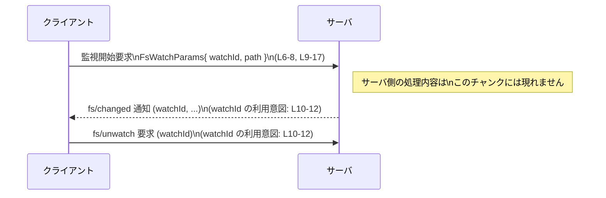

# app-server-protocol\schema\typescript\v2\FsWatchParams.ts コード解説

---

## 0. ざっくり一言

- ファイルシステム監視を開始するためのパラメータ（監視 ID と絶対パス）を表す TypeScript の型定義です。  
- Rust 側の型から `ts-rs` により自動生成された、プロトコル用のスキーマの一部です（L1–3）。

---

## 1. このモジュールの役割

### 1.1 概要

このモジュールは、**ファイルシステム監視を開始するリクエストのパラメータ**を表す `FsWatchParams` 型を提供します。

- 監視開始時に用いる接続スコープのウォッチ識別子 `watchId`（L10–13）
- 監視対象となる絶対パス `path`（L14–17）

を 1 つのオブジェクトとしてまとめています（L9–17）。

コメントには次の説明が付いています。

- 「Start filesystem watch notifications for an absolute path.」（絶対パスに対するファイル監視通知を開始する）（L6–8）
- `watchId` は `fs/unwatch` と `fs/changed` で使用される接続スコープの識別子である（L10–12）

### 1.2 アーキテクチャ内での位置づけ

このファイルは `schema/typescript/v2` 配下にあり、アプリケーションサーバのプロトコルの TypeScript スキーマの一部と考えられます（パスからの解釈）。  
`ts-rs` によって生成されており、Rust 側の型定義と 1 対 1 で対応する TypeScript 型として利用されます（L1–3）。

依存関係は次のとおりです。

- 依存している型
  - `AbsolutePathBuf`（`import type` により型としてのみ依存）（L4）
- この型を利用すると考えられるプロトコル要素
  - `fs/unwatch`, `fs/changed`（`watchId` の説明コメントより）（L10–12）

これを簡単な依存関係図で表すと、次のようになります。

```mermaid
graph TD
  subgraph "TS スキーマ層"
    FsWatchParams["FsWatchParams 型\n(L9-17)"]
    AbsolutePathBuf["AbsolutePathBuf 型\n(../AbsolutePathBuf, L4)"]
  end

  FsWatchParams -->|"path フィールド型"| AbsolutePathBuf

  %% コメントに現れるプロトコル名との関係
  FsWatchParams -->|"watchId 使用意図\n(L10-12)"| FsUnwatch["プロトコル操作\n\"fs/unwatch\"（コメントより）"]
  FsWatchParams -->|"watchId 使用意図\n(L10-12)"| FsChanged["プロトコル操作\n\"fs/changed\"（コメントより）"]
```

> 備考: `fs/unwatch` と `fs/changed` の具体的な実装や型定義は、このチャンクには現れません。

### 1.3 設計上のポイント

コードから読み取れる設計上の特徴は次のとおりです。

- **自動生成ファイルであること**  
  - 冒頭コメントで `ts-rs` による生成であり、手動編集禁止と明示されています（L1–3）。
- **型専用の依存**  
  - `import type { AbsolutePathBuf } from "../AbsolutePathBuf";` により、ビルド後の JavaScript には影響しない型専用インポートになっています（L4）。
- **純粋なデータコンテナ**  
  - `export type FsWatchParams = { ... }` というオブジェクト型のエイリアスのみで、関数や実行時ロジックは一切含まれていません（L9–17）。
- **プロトコル契約をコメントで明示**  
  - 監視対象が「絶対パス」であること（L6–8, L14–16）
  - `watchId` が「接続スコープ」であり `fs/unwatch` / `fs/changed` で使われること（L10–12）
  といったプロトコル上の契約がコメントで示されています。

---

## 2. 主要な機能一覧

このファイルが提供する機能（＝型）は 1 つだけです。

- `FsWatchParams`: ファイルシステム監視を開始する際に使用する、  
  「接続スコープのウォッチ ID」と「監視対象の絶対パス」をまとめたパラメータ型（L6–8, L9–17）。

---

## 3. 公開 API と詳細解説

### 3.1 型一覧（構造体・列挙体など）

#### コンポーネントインベントリー

| 名前 | 種別 | 主なフィールド | 役割 / 用途 | 定義位置（根拠） |
|------|------|----------------|-------------|-------------------|
| `FsWatchParams` | 型エイリアス（オブジェクト型） | `watchId: string`, `path: AbsolutePathBuf` | ファイル監視開始時に送信されるパラメータ。接続スコープの監視 ID と監視対象の絶対パスを保持する。 | `app-server-protocol\schema\typescript\v2\FsWatchParams.ts:L6-8, L9-17` |
| `AbsolutePathBuf` | 型（詳細不明） | – | 監視対象の「絶対パス」を表す型。TypeScript 側では本ファイルから `import type` されるのみで定義は別ファイル。 | `app-server-protocol\schema\typescript\v2\FsWatchParams.ts:L4` |

> `AbsolutePathBuf` の具体的な構造や実装は、このチャンクには現れません。

#### `FsWatchParams` のフィールド詳細

- `watchId: string`（L10–13）
  - 説明コメント: 「Connection-scoped watch identifier used for `fs/unwatch` and `fs/changed`.」（L10–12）
  - コネクションごとにユニークであることが期待される ID であり、後続の `fs/unwatch` / `fs/changed` メッセージで同じ監視を参照するために使われます。
- `path: AbsolutePathBuf`（L14–17）
  - 説明コメント: 「Absolute file or directory path to watch.」（L14–16）
  - 監視対象のファイルまたはディレクトリの「絶対パス」を表す型です。
  - `AbsolutePathBuf` の詳細は `../AbsolutePathBuf` モジュール側にあります（L4）。

### 3.2 関数詳細（最大 7 件）

このファイルには、**関数・メソッド・クラスの定義は一切存在しません**。

- 実行時ロジック／アルゴリズムはなく、純粋にデータの形（型）だけを表現するファイルです（L9–17）。
- そのため、このセクション（関数詳細テンプレート）に該当する関数はありません。

### 3.3 その他の関数

- 該当なし（このファイルには関数が定義されていません）。

---

## 4. データフロー

このファイル自体には処理ロジックはありませんが、コメントから読み取れる範囲で、`FsWatchParams` がプロトコル内でどのように使われるかの典型的なデータフローを図示します。

- クライアントは、ファイル監視を開始したいときに `FsWatchParams` オブジェクトを構成し、サーバに送信する（L6–8, L9–17）。
- サーバは接続スコープで `watchId` を記録しておき、変更通知 `fs/changed` や監視解除 `fs/unwatch` の際に同じ `watchId` を使う（L10–12）。



> 図はコメントに示された「`fs/unwatch` / `fs/changed` で `watchId` を使う」という情報（L10–12）から解釈した典型的なフローであり、実際のメッセージ名・ペイロード構造・エラー処理などの詳細は、このチャンクからは分かりません。

---

## 5. 使い方（How to Use）

### 5.1 基本的な使用方法

`FsWatchParams` は型エイリアスなので、「**この形のオブジェクトを作る**」という使い方になります。

以下は、クライアント側で監視開始リクエストを組み立てて送信するイメージのコード例です。

```typescript
// FsWatchParams 型をインポートする（相対パスはプロジェクト構成に応じて調整）
import type { FsWatchParams } from "./schema/typescript/v2/FsWatchParams"; // 例

// すでに AbsolutePathBuf 型の値があると仮定する
declare const projectRoot: AbsolutePathBuf; // ../AbsolutePathBuf で定義される型（実体は別ファイル）

// 監視開始用のパラメータを組み立てる
const params: FsWatchParams = {
    watchId: "conn-1:workspace-1", // 接続ごとにユニークであることが期待される ID（L10-12）
    path: projectRoot,             // 監視対象の絶対パス（L14-16）
};

// 何らかの手段でサーバに送信する（具体的な送信処理はこのリポジトリ外の関心事）
await sendRequest("fs/watch", params); // sendRequest は仮の関数
```

このコードは次の点を示します。

- `FsWatchParams` 型により、`watchId` と `path` の両方が必須であることがコンパイル時にチェックされます（L9–17）。
- `AbsolutePathBuf` 型の具体的な作り方は、このチャンクからは分からないため、例では既存の変数 `projectRoot` を仮定しています。

### 5.2 よくある使用パターン

**パターン 1: `watchId` の再利用**

`watchId` は監視開始・通知・監視解除の間で共有される識別子です（L10–12）。クライアント側でこの ID を管理するパターンが想定されます。

```typescript
import type { FsWatchParams } from "./schema/typescript/v2/FsWatchParams";

declare const projectRoot: AbsolutePathBuf;

const watchId = "conn-1:workspace-1";  // 1つの接続内で一意な ID を決める

// 監視開始
const watchParams: FsWatchParams = {
    watchId,
    path: projectRoot,
};
await sendRequest("fs/watch", watchParams);

// 後続で fs/unwatch に同じ watchId を使う（型やペイロードは別ファイル）
await sendRequest("fs/unwatch", { watchId }); // このオブジェクトの型はこのチャンクには現れない
```

**パターン 2: 複数監視の管理**

複数のディレクトリやファイルを監視する場合、`watchId` と `path` の対応をクライアント側で保持することが多いです。

```typescript
type WatchEntry = {
    id: string;                 // watchId
    path: AbsolutePathBuf;      // 対応するパス
};

const watches: WatchEntry[] = [];

function startWatch(id: string, path: AbsolutePathBuf) {
    const params: FsWatchParams = { watchId: id, path };

    watches.push({ id, path });
    return sendRequest("fs/watch", params);
}
```

### 5.3 よくある間違い（と考えられるもの）

コードとコメントから推測される「誤用になりそうなパターン」と「望ましい使い方」です。

```typescript
// 誤り例 1: 相対パスを渡してしまう
const params1: FsWatchParams = {
    watchId: "w1",
    // "src" だけでは絶対パスとは限らない
    // コメントでは "Absolute file or directory path" が要求されている（L14-16）
    path: "src" as unknown as AbsolutePathBuf,
};

// 望ましい例: 絶対パスを用意した上で渡す
const params2: FsWatchParams = {
    watchId: "w1",
    path: makeAbsolutePath("/home/user/project/src"), // makeAbsolutePath は仮の関数
};
```

```typescript
// 誤り例 2: 接続をまたいで同じ watchId を再利用する
// コメントでは "Connection-scoped watch identifier" とされており（L10-12）
// 接続ごとにスコープが分かれていることが示唆される。
const globalWatchId = "global-watch";

// 望ましい例: 接続ごとに異なる接頭辞などを付けて区別する
const connId = "conn-1";
const watchId = `${connId}:watch-1`; // 接続識別子を組み込む
```

> 実際に「どのような誤りがエラーになるか」はサーバ側の実装に依存し、このチャンクからは分かりません。上記はコメントに沿った一般的な注意点です。

### 5.4 使用上の注意点（まとめ）

- **絶対パスであること**  
  - `path` は「Absolute file or directory path」とコメントされており（L14–16）、相対パスや空文字列などはプロトコル的に不適切な可能性があります。
- **接続スコープの `watchId`**  
  - `watchId` は「Connection-scoped」と明示されているため（L10–12）、接続ごとに一意性を保つ設計が前提と考えられます。
- **TypeScript の型安全性**  
  - `FsWatchParams` はコンパイル時に `watchId` と `path` の存在と型を保証しますが、実行時に自動で検証してくれるわけではありません。受信側（サーバなど）でのバリデーションは別途必要です。
- **並行性・スレッド安全性**  
  - このファイルには実行時コードがないため、並行性制御やスレッド安全性は関与しません。並列に複数の監視を開始するかどうかは、上位ロジックの責務です。

---

## 6. 変更の仕方（How to Modify）

### 6.1 新しい機能を追加する場合

このファイルは `ts-rs` による自動生成ファイルであり、「DO NOT MODIFY BY HAND」と明示されています（L1–3）。  
したがって、**直接編集するのではなく、元になっている Rust 側の型定義を変更する**のが前提になります。

一般的な手順（ts-rs の通常の利用形態に基づく理解）は次のとおりです。

1. Rust 側で `FsWatchParams` に対応する構造体や型を探す  
   - 多くの場合、Rust 側の `struct FsWatchParams` または類似の名前の型に `#[ts_rs::TS]` 属性が付いていますが、具体的な位置はこのチャンクからは分かりません。
2. Rust 側の型にフィールドを追加／変更する  
   - 例: `recursive: bool` のようなフラグを追加したい場合、Rust の構造体にフィールドを追加します。
3. `ts-rs` のコード生成を再実行する  
   - これにより、本ファイルを含む TypeScript スキーマが再生成されます。
4. TypeScript 側の利用箇所を更新する  
   - 新フィールドが必須になった場合は、`FsWatchParams` を生成しているすべての箇所でフィールドを追加する必要があります。

### 6.2 既存の機能を変更する場合

既存フィールドの名前や意味を変更する際の注意点です。

- **影響範囲の確認**
  - `FsWatchParams` を参照するすべての TypeScript コード（監視開始リクエストを送る部分）に影響します。
  - `watchId` は `fs/unwatch` / `fs/changed` にも使われることがコメントされているため（L10–12）、これらのプロトコル操作の型や実装にも影響する可能性があります。
- **契約（前提条件）の保持**
  - `path` が絶対パスである、という契約（L14–16）を変更すると、サーバ側のファイル監視ロジックやセキュリティ要件に大きな影響が出ることが予想されます。
  - `watchId` の「接続スコープ」という前提（L10–12）を変える場合は、クライアント・サーバ間の識別子管理方式の再設計が必要になります。
- **テスト・検証**
  - このチャンクにはテストコードは含まれていませんが、プロトコル型を変更した場合は、  
    - 型生成（ts-rs）の結果が期待どおりか
    - クライアント・サーバ間のやり取りが破綻していないか  
    を確認する統合テストが重要です。

---

## 7. 関連ファイル

このモジュールと密接に関係すると考えられるファイル・モジュールを整理します。

| パス / モジュール指定 | 役割 / 関係 |
|-----------------------|------------|
| `../AbsolutePathBuf` | `path` フィールドに使用される `AbsolutePathBuf` 型を定義するモジュールです（L4）。実ファイル名（`.ts` / `.d.ts` など）はこのチャンクからは分かりませんが、監視対象パスの表現に関する中心的な役割を持ちます。 |
| Rust 側の `FsWatchParams` 相当の型 | `ts-rs` による生成元となる Rust の型定義です（L1–3 のコメントから存在が示唆されます）。具体的なファイルパスはこのチャンクには現れません。 |
| `fs/unwatch` 関連の型・ハンドラ | コメントにより、`watchId` が `fs/unwatch` で使用されることが示されています（L10–12）。これに対応する TypeScript の型・Rust 側のハンドラなどが別ファイルに存在すると考えられますが、場所は不明です。 |
| `fs/changed` 関連の型・ハンドラ | 同様に、変更通知 `fs/changed` で `watchId` が使用されることがコメントに示されています（L10–12）。通知メッセージの型や送信ロジックは別ファイルにあると考えられます。 |

---

### Bugs / Security / Edge Cases / 性能などの観点（このファイルから読み取れる範囲）

- **潜在的なバグ要因**
  - `path` が絶対パスでない場合の扱いは、このチャンクからは分かりません。サーバ側がチェックして拒否するか、相対パスとして扱うかなどは実装依存です。
- **セキュリティ**
  - 本ファイル自体は型定義のみですが、「任意の絶対パス」を監視対象にできる設計であるため、使用側ではどのパスを許可するか（サンドボックスディレクトリ内に限定するなど）の検討が重要です。これは一般的な注意点であり、このチャンクから具体的な制限は読み取れません。
- **エッジケース**
  - 空文字列の `watchId` や非常に長い ID、存在しないパスを渡した場合の挙動などは、このファイルからは不明です。
- **並行性・性能**
  - このファイルに実行時コードはなく、パフォーマンスや並行性への直接の影響はありません。監視数が多くなった際のスケーラビリティはサーバ側の実装次第です。

以上が、`app-server-protocol\schema\typescript\v2\FsWatchParams.ts` に関するコードベースから読み取れる範囲での解説になります。
