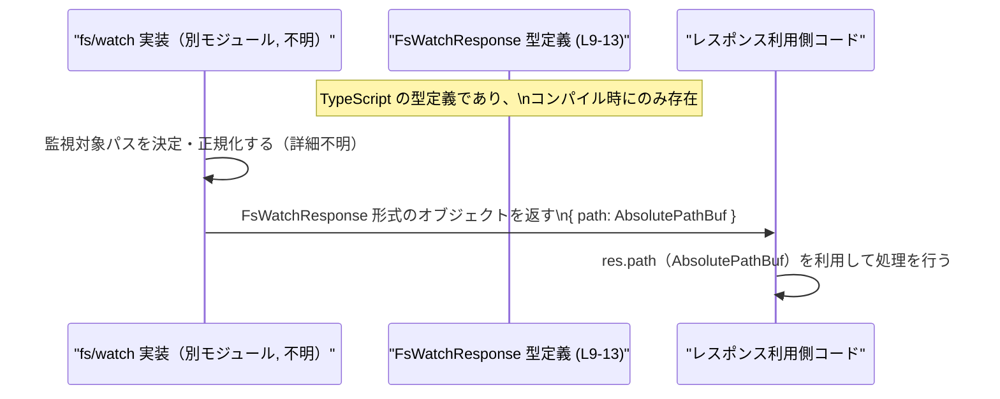

# app-server-protocol/schema/typescript/v2/FsWatchResponse.ts

## 0. ざっくり一言

- ファイルシステム監視 API `fs/watch` の **成功レスポンス** を表す、TypeScript のオブジェクト型 `FsWatchResponse` を定義する自動生成コードです（`FsWatchResponse.ts:L1-3, L6-9`）。

---

## 1. このモジュールの役割

### 1.1 概要

- このモジュールは、アプリケーションサーバーのプロトコルスキーマの一部として、`fs/watch` 操作が成功したときのレスポンス構造を TypeScript 型で表現します（コメントより、`Successful response for 'fs/watch'.` `FsWatchResponse.ts:L6-8`）。
- レスポンスには、監視対象に対応する **正規化（canonicalized）されたパス** が `path` フィールドとして含まれます（`FsWatchResponse.ts:L10-13`）。

### 1.2 アーキテクチャ内での位置づけ

- ファイル先頭コメントから、このファイルは `ts-rs` による **自動生成** であり、Rust 側の型定義から TypeScript スキーマを生成するパイプラインの一部であると分かります（`FsWatchResponse.ts:L1-3`）。
- このモジュールは、外部モジュール `"../AbsolutePathBuf"` から `AbsolutePathBuf` 型を import し、`path` フィールドの型として利用します（`FsWatchResponse.ts:L4, L10-13`）。
- 実際の `fs/watch` 処理やレスポンス生成ロジックは、このチャンクには現れていません。不明な点として、どのモジュールがこの型を利用してレスポンスを返すのかはコードからは分かりません。

依存関係を簡易な Mermaid 図で表すと次のようになります。

```mermaid
graph TD
  subgraph "schema/typescript/v2"
    FsWatchResponse["FsWatchResponse 型定義 (L9-13)"]
  end

  AbsolutePathBuf["\"../AbsolutePathBuf\" モジュール\nAbsolutePathBuf 型 (L4)"]

  FsWatchResponse --> AbsolutePathBuf
```

- `FsWatchResponse` は `AbsolutePathBuf` に依存しますが、逆方向の依存はこのチャンクには現れません。

### 1.3 設計上のポイント

- **自動生成コード**  
  - 先頭コメントで「GENERATED CODE」「Do not edit this file manually」と明示されており、手作業での変更は想定されていません（`FsWatchResponse.ts:L1-3`）。
- **シンプルな成功レスポンス型**  
  - `FsWatchResponse` は成功時レスポンスであることがコメントから分かります（`FsWatchResponse.ts:L6-8`）。エラー応答は別の型・モジュールで扱われている可能性がありますが、このチャンクには現れません（不明）。
- **パス表現の共通化**  
  - `path` の型として `AbsolutePathBuf` を利用することで、パスの表現を他のモジュールと共通化している構造になっています（`FsWatchResponse.ts:L4, L10-13`）。
- **状態やロジックを持たない**  
  - このモジュールは型エイリアスのみを提供し、クラスや関数・メソッドなどの実行時ロジックや状態は一切持ちません（`FsWatchResponse.ts:L1-13`）。

---

## 2. 主要な機能一覧

このファイルは型定義のみを提供しますが、機能的には次のように整理できます。

- `FsWatchResponse`: `fs/watch` 操作の **成功レスポンス** を表すオブジェクト型を提供します（`FsWatchResponse.ts:L6-9`）。
- `path` フィールド: ウォッチに対応する **正規化済みパス** を `AbsolutePathBuf` 型で表します（`FsWatchResponse.ts:L10-13`）。

---

## 3. 公開 API と詳細解説

### 3.1 型一覧（構造体・列挙体など）

| 名前              | 種別                             | 役割 / 用途                                                                                                      | 根拠 |
|-------------------|----------------------------------|------------------------------------------------------------------------------------------------------------------|------|
| `FsWatchResponse` | オブジェクト型の型エイリアス     | `fs/watch` の成功レスポンスを表す。`path` フィールドを必須で持つオブジェクト型として定義される。               | `FsWatchResponse.ts:L6-9` |
| `path`            | フィールド（型: `AbsolutePathBuf`） | ウォッチに対応する正規化済みパスを表す。レスポンスオブジェクトに必須で含まれるフィールド。                     | `FsWatchResponse.ts:L10-13` |
| `AbsolutePathBuf` | 外部モジュールからの型           | `path` の型として利用されるパス表現用の外部型。型名から絶対パスを表すと推測されますが、実体はこのチャンクには現れません。 | `FsWatchResponse.ts:L4` |

#### `FsWatchResponse` の契約（Contract）

コメントと型定義から読み取れる契約を整理します。

- **構造**  
  - オブジェクトであり、少なくとも `path` フィールドを持つ（`FsWatchResponse.ts:L9-13`）。
- **必須フィールド**  
  - `path`: 型は `AbsolutePathBuf`。省略不可（`?` が付いていないため）（`FsWatchResponse.ts:L10-13`）。
- **意味論（コメントに基づく）**  
  - `fs/watch` 成功時のレスポンスであり、`path` は「Canonicalized path associated with the watch.」と説明されている（`FsWatchResponse.ts:L10-12`）。
  - 正規化の具体的な定義（シンボリックリンク解決、`..` の除去など）はこのチャンクには現れません（不明）。

### 3.2 関数詳細（最大 7 件）

- このファイルには関数・メソッド・クラスは一切定義されていません（`FsWatchResponse.ts:L1-13`）。
- そのため、関数詳細テンプレートに従って解説すべき対象はありません。

### 3.3 その他の関数

- 補助関数・ラッパー関数なども定義されていません（`FsWatchResponse.ts:L1-13`）。

---

## 4. データフロー

このモジュールは静的な型定義のみですが、`fs/watch` 処理の成功時にどのように使われるかを、コメントに基づく想定フローとして整理します。

- `fs/watch` の実装（別モジュール、コードはこのチャンクには現れません）がファイル監視を開始し、成功時にレスポンスを生成します。
- そのレスポンスの形状をコンパイル時に規定するのが `FsWatchResponse` 型です（`FsWatchResponse.ts:L6-9`）。
- レスポンス利用側（クライアントコード）は `FsWatchResponse` 型注釈を通じて、少なくとも `path` フィールドが存在することを前提に処理できます（`FsWatchResponse.ts:L9-13`）。

これを簡易なシーケンス図として表すと次のようになります（実際の監視処理や転送経路はこのチャンクには現れないため、抽象的な表現にとどめます）。



- 実行時に `Schema` ノードは存在せず、あくまでコンパイル時の型チェックに利用される点に注意が必要です。

---

## 5. 使い方（How to Use）

### 5.1 基本的な使用方法

`FsWatchResponse` は、主に「`fs/watch` のレスポンスを扱う箇所の型注釈」として利用されることが想定されます。

```typescript
// FsWatchResponse 型をインポートする                            // 生成ファイルから型のみインポート
import type { FsWatchResponse } from "./FsWatchResponse";       // 実際のパスはプロジェクト構成に合わせて調整

// fs/watch のレスポンスを処理する関数の例                        // レスポンスを受け取ってログ出力する関数
function handleFsWatchResponse(res: FsWatchResponse) {         // res は FsWatchResponse 型
    // res.path の型は AbsolutePathBuf                           // path フィールドは必須
    console.log("watch path:", res.path);                      // ここでパスを利用した処理ができる
}
```

- この例のように、関数引数や戻り値に `FsWatchResponse` を指定することで、`path` フィールドの存在と型がコンパイル時に保証されます。

### 5.2 よくある使用パターン

#### パターン 1: 非同期 API の戻り値として使用

```typescript
import type { FsWatchResponse } from "./FsWatchResponse";

// fs/watch 相当の処理を行う関数の戻り値型として利用する例
async function startWatch(/* 省略 */): Promise<FsWatchResponse> {
    // 実装詳細はこのファイルからは分かりません（不明）          // ここでは型だけを宣言
    const res = await someRpcCall(/* ... */);                  // 何らかの RPC 呼び出しの結果を受け取る
    return res as FsWatchResponse;                             // 実際には適切なバリデーションが必要
}
```

- このように戻り値を `Promise<FsWatchResponse>` として宣言すると、呼び出し側は `await` 後の値が `path` を必ず持つことを前提にできます。

#### パターン 2: 型ガードでの利用

外部から受け取ったデータが `FsWatchResponse` かどうかを確認する型ガード関数の例です。

```typescript
import type { FsWatchResponse } from "./FsWatchResponse";

// unknown な値が FsWatchResponse かどうかを判定する型ガード      // 実行時チェックで安全に絞り込む
function isFsWatchResponse(value: unknown): value is FsWatchResponse {
    return typeof value === "object" && value !== null && "path" in value; // path プロパティの有無だけを確認
}

// 使用例
function handleUnknown(value: unknown) {
    if (isFsWatchResponse(value)) {                           // ここでは value が FsWatchResponse として扱える
        console.log("watch path:", value.path);               // path へのアクセスが型安全になる
    }
}
```

- `AbsolutePathBuf` の内部構造はこのチャンクには現れないため、上記のように最低限 `path` の存在のみをチェックする形が妥当です。

### 5.3 よくある間違い

#### 間違い例 1: 生成ファイルを直接編集する

```typescript
// 間違い例: このファイルに直接フィールドを追加してしまう          // 先頭コメントに反する操作
export type FsWatchResponse = {
    path: AbsolutePathBuf,
    // foo?: string,                                           // ← 手動で追加 (次回生成時に消える)
};
```

- このファイルは `ts-rs` による自動生成であり、コメントで「Do not edit this file manually」と明示されています（`FsWatchResponse.ts:L1-3`）。
- 手動で変更しても、次回のコード生成で上書きされるため、変更は失われます。

**正しい例（イメージ）:**

- Rust 側の元定義（このチャンクには現れません）を変更し、`ts-rs` の生成ステップを再実行して TypeScript コードを更新します。

#### 間違い例 2: 型注釈を省いて `any` として扱う

```typescript
// 間違い例: 型注釈を付けず any として扱う                       // 型安全性が失われる
function handle(res: any) {
    console.log(res.path.toUpperCase());                      // res.path が string でない場合、実行時エラーの可能性
}
```

**正しい例:**

```typescript
import type { FsWatchResponse } from "./FsWatchResponse";

function handle(res: FsWatchResponse) {                       // 型を明示する
    console.log(res.path);                                    // path の存在がコンパイル時に保証される
}
```

- `FsWatchResponse` を利用することで、`path` が必須であること、型が `AbsolutePathBuf` であることがコンパイル時にチェックされます。

### 5.4 使用上の注意点（まとめ）

- **自動生成ファイルのため手動編集禁止**  
  - 先頭コメントに明示されている通り、このファイルは `ts-rs` によって生成されており、直接編集すると次回生成で上書きされます（`FsWatchResponse.ts:L1-3`）。
- **`path` は必須フィールド**  
  - 型定義上 `path` はオプショナルでなく必須です（`?` なし）（`FsWatchResponse.ts:L9-13`）。  
    `FsWatchResponse` 型を前提とするコードは `path` の存在を仮定するため、デシリアライズ時などには `path` 欠如をエラーとして扱う必要があります。
- **`AbsolutePathBuf` の詳細は別モジュール依存**  
  - `path` の具体的な型構造・生成方法は `"../AbsolutePathBuf"` モジュール側にあり、このチャンクには現れません（`FsWatchResponse.ts:L4`）。`path` の利用や生成方法を変更する場合はその定義を参照する必要があります。
- **エラーケースは別型の可能性**  
  - コメントから「Successful response」であることは分かりますが、エラー時レスポンスの形式はこのチャンクには現れません。不明な点として、エラーケースをどのような型・チャンネルで表現しているかは別ファイルの確認が必要です。
- **並行性・セキュリティに関して**  
  - このモジュールは純粋な型定義のみで、実行時のスレッドや I/O を扱いません。そのため、並行性やセキュリティに関するロジックはここには存在しません（`FsWatchResponse.ts:L1-13`）。  
  - パスの正規化や検証に関するセキュリティ上の考慮点は、`fs/watch` の実装側（このチャンクには現れない）に依存します。

---

## 6. 変更の仕方（How to Modify）

### 6.1 新しい機能を追加する場合

このファイルは自動生成のため、**直接編集ではなく生成元を変更する**必要があります（`FsWatchResponse.ts:L1-3`）。

想定される手順（具体的なファイル名やコマンドは、このチャンクからは分かりません）:

1. **生成元の Rust 型を特定する**  
   - コメントから `ts-rs` による生成であることが分かるため（`FsWatchResponse.ts:L3`）、Rust 側に対応する構造体や型（例: `FsWatchResponse` など）が存在すると推測されます。  
   - その Rust 型定義を特定します（場所はこのチャンクには現れません）。

2. **Rust 側型にフィールドを追加する**  
   - 例: 新たなフラグ `recursive: bool` を追加したい場合は、Rust の構造体に対応するフィールドを追加します（推測ベース。具体的なシンタックスは Rust 側コードを参照）。

3. **`ts-rs` によるコード生成を再実行する**  
   - プロジェクトのビルドまたは専用スクリプトで `ts-rs` を実行し、TypeScript スキーマを再生成します。  
   - 生成ステップの具体的なコマンドや設定はこのチャンクからは分かりません（不明）。

4. **TypeScript 側利用箇所を更新する**  
   - 新しいフィールドを利用するコードを追加・更新します。  
   - 既存の `FsWatchResponse` 利用箇所が新フィールドを必要とするかどうかを確認します。

### 6.2 既存の機能を変更する場合

`FsWatchResponse` はプロトコルスキーマの一部であるため、変更はクライアントとの互換性に影響する可能性があります（ファイルパスから「protocol/schema」であると読み取れます）。

変更時の注意点:

- **型互換性・後方互換性**  
  - `path` フィールドの型や名前を変更すると、`FsWatchResponse` を利用している TypeScript コードでコンパイルエラーが発生します。  
  - さらに、このスキーマに対応する他言語のクライアント（Rust / Go など）がある場合、それらとの整合性も確認する必要があります（このチャンクには他言語側は現れません）。

- **変更手順（高レベル）**
  1. Rust 側の生成元型を変更する（フィールド名・型の変更など）。
  2. `ts-rs` による生成ステップを再実行し、このファイルを更新する（`FsWatchResponse.ts:L1-3` の方針に従う）。
  3. `FsWatchResponse` を利用しているすべての TypeScript コードを検索し、影響範囲を確認・修正する。
  4. 必要であればプロトコルのバージョン（例: `v2` → `v3`）を上げるなど、互換性の方針に従って運用する（バージョン付けのポリシー自体はこのチャンクには現れません）。

---

## 7. 関連ファイル

このモジュールと密接に関係するファイル・モジュールを、コードから分かる範囲で列挙します。

| パス / モジュール名        | 役割 / 関係 |
|---------------------------|------------|
| `app-server-protocol/schema/typescript/v2/FsWatchResponse.ts` | 本ドキュメントの対象ファイル。`fs/watch` 成功レスポンスの TypeScript 型 `FsWatchResponse` を定義する（`FsWatchResponse.ts:L6-13`）。 |
| `"../AbsolutePathBuf"`    | `FsWatchResponse` 内の `path` フィールドの型 `AbsolutePathBuf` を提供するモジュール（`FsWatchResponse.ts:L4, L10-13`）。実際のファイルパスや型構造はこのチャンクには現れません。 |
| （不明）Rust 側の生成元型 | コメントから `ts-rs` による自動生成であることが分かるため（`FsWatchResponse.ts:L3`）、Rust 側に対応する型定義が存在すると推測されますが、そのファイル位置や内容はこのチャンクには現れません。 |

- テストコードや他の `fs/watch` 関連スキーマ（例: リクエスト型、エラー応答型など）は、このチャンクには現れないため不明です。
