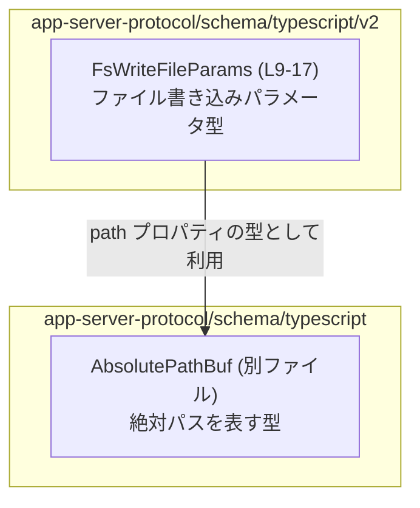
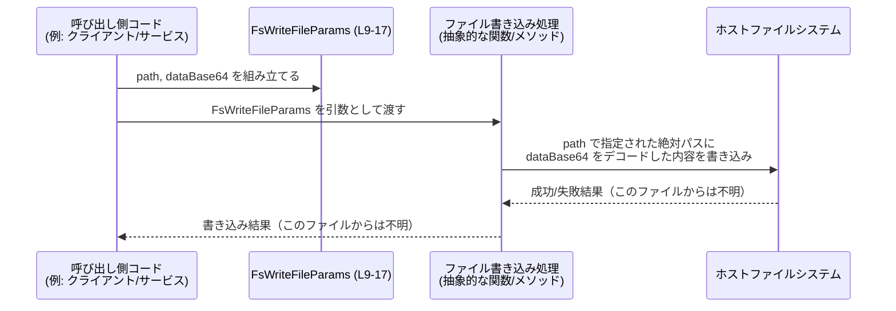

# app-server-protocol/schema/typescript/v2/FsWriteFileParams.ts コード解説

## 0. ざっくり一言

ホスト側ファイルシステムに対する「ファイルを書き込む」操作のためのパラメータを表す TypeScript 型（`FsWriteFileParams`）を定義した、自動生成スキーマファイルです。  
生成元ツールは `ts-rs` であり、手動編集は禁止されています（`// GENERATED CODE! DO NOT MODIFY BY HAND!` コメントより、FsWriteFileParams.ts:L1-3）。

---

## 1. このモジュールの役割

### 1.1 概要

- このモジュールは、ホストファイルシステムにファイルを書き込む処理に渡される **入力パラメータの型** を定義します（JSDoc コメントより、FsWriteFileParams.ts:L6-8）。
- パラメータは次の 2 つです（FsWriteFileParams.ts:L9-17）。
  - 書き込み先の **絶対パス**（`path: AbsolutePathBuf`）
  - ファイル内容を **Base64 文字列**としてエンコードしたもの（`dataBase64: string`）

この型は、おそらくアプリケーションサーバーのプロトコル層で、ファイル書き込みリクエストを表現するために利用されますが、実際にどの関数・メッセージで使われているかはこのチャンクからは分かりません。

### 1.2 アーキテクチャ内での位置づけ

- このファイルは `schema/typescript/v2` 以下にあり、**アプリケーションサーバーとの通信に利用するデータ構造の TypeScript 定義**に属すると解釈できます（ファイルパスとファイル先頭コメントからの解釈）。
- 外部の型として `AbsolutePathBuf` を **型のみインポート**しています（`import type`、FsWriteFileParams.ts:L4）。  
  これは「絶対パス」を表現する共通の型定義であり、本モジュールはそれを利用して `path` プロパティの型安全性を高めています。

依存関係を簡易に図示すると、次のようになります。



この図は、`FsWriteFileParams` 型が、絶対パス表現の責務を `AbsolutePathBuf` に委譲していることを示します。

### 1.3 設計上のポイント

コードから読み取れる設計上の特徴は次のとおりです。

- **自動生成コードであること**  
  - 冒頭コメントで `ts-rs` による生成と手動編集禁止が明記されています（FsWriteFileParams.ts:L1-3）。
  - 設計変更は TypeScript 側ではなく、生成元（Rust 側の ts-rs 対象構造体など）で行う前提と解釈できます。
- **型のみのモジュール**  
  - 実行時ロジックや関数は一切なく、1 つの型エイリアスをエクスポートするだけです（FsWriteFileParams.ts:L9-17）。
- **型レベルでの制約表現**  
  - 絶対パスを単なる `string` ではなく `AbsolutePathBuf` 型にしていることで、「絶対パスである」という意味情報を型で表現しています（FsWriteFileParams.ts:L10-13）。
- **バイナリを Base64 文字列として扱う方針**  
  - ファイル内容を `dataBase64: string` で表現し、コメントに「Base64 でエンコードされたファイル内容」と明記されています（FsWriteFileParams.ts:L14-17）。  
  - バイナリを直接扱わず、文字列（テキストプロトコル）としてやり取りする設計方針と解釈できます。

---

## 2. 主要な機能一覧

このファイルは「機能」というより「型」を提供しますが、API 観点で整理すると次の 1 点です。

- **ファイル書き込みパラメータ型定義**:  
  `FsWriteFileParams` 型で、ホストファイルシステムへのファイル書き込みのための入力を表現する（絶対パス + Base64 文字列データ）（FsWriteFileParams.ts:L6-8, L9-17）。

---

## 3. 公開 API と詳細解説

### 3.1 型一覧（構造体・列挙体など）

このファイルに登場する型／インポートの一覧です。

| 名前 | 種別 | 役割 / 用途 | 定義位置 |
|------|------|-------------|----------|
| `FsWriteFileParams` | 型エイリアス（オブジェクト型） | ホストファイルシステムにファイルを書き込む際のパラメータ。`path` と `dataBase64` を保持する。 | FsWriteFileParams.ts:L6-8, L9-17 |
| `AbsolutePathBuf` | 型インポート | `path` プロパティの型。絶対パスを表す共通型。実体は別ファイル（`../AbsolutePathBuf`）で定義される。 | FsWriteFileParams.ts:L4, L10-13 |

`FsWriteFileParams` のプロパティをもう少し詳しく整理します。

| プロパティ名 | 型 | 説明 | 根拠 |
|--------------|----|------|------|
| `path` | `AbsolutePathBuf` | 書き込み対象ファイルの「絶対パス」。相対パスではなく絶対パスであることがコメントで明示されている。 | FsWriteFileParams.ts:L10-13 |
| `dataBase64` | `string` | Base64 でエンコードされたファイル内容。デコードすると実際のバイト列になることが想定される。 | FsWriteFileParams.ts:L14-17 |

### 3.2 関数詳細

このファイルには関数・メソッド・クラスコンストラクタ等の「実行時ロジック」は定義されていません（FsWriteFileParams.ts:L1-17 すべて型定義・コメントのみ）。  
そのため、関数の詳細解説は該当しません。

### 3.3 その他の関数

- 該当なし（このチャンクには関数定義が一切現れません）。

---

## 4. データフロー

`FsWriteFileParams` は「ファイル書き込み処理に渡される入力」という役割を持つ型です。  
実装はこのチャンクには存在しませんが、**この型を利用した典型的なデータの流れ**を抽象的に表現すると次のようになります。



- ここで `W`（ファイル書き込み処理）は、この型を受け取る何らかの関数 / メソッドを **抽象的に表現したもの**です。このチャンクにはその具体的な実装は現れません。
- TypeScript レベルでは、`FsWriteFileParams` は単なる **データコンテナ**であり、ファイルシステム I/O やエラー処理・並行性制御などは別の実装に委譲されます。

---

## 5. 使い方（How to Use）

### 5.1 基本的な使用方法

この型を利用してファイル書き込み処理にパラメータを渡す、最小限の例を示します。  
ここでの `writeFileOnHost` 関数は、`FsWriteFileParams` を受け取る利用側の処理を説明するために本例内で仮に定義したものです。

```typescript
// FsWriteFileParams 型をインポートする                        // このファイル自身またはバレルファイルからのインポートを想定
import type { FsWriteFileParams } from "./FsWriteFileParams"; // パスはプロジェクト構成に応じて調整

// バイト列を Base64 文字列に変換するユーティリティ関数          // 実際には Node.js の Buffer など、環境に応じた実装を使う
function toBase64(data: Uint8Array): string {
    return Buffer.from(data).toString("base64");              // Node.js 環境の例
}

// FsWriteFileParams を受け取るファイル書き込み処理の例          // 実際の I/O 実装はプロジェクト側の責務
async function writeFileOnHost(params: FsWriteFileParams): Promise<void> {
    const bytes = Buffer.from(params.dataBase64, "base64");   // Base64 文字列をバイト列にデコード
    // ここで params.path を使ってホストファイルシステムに書き込む
    // 実際の API 呼び出しや権限チェックなどはプロジェクト依存
}

// 呼び出し側コードの例
async function main() {
    const fileBytes = new Uint8Array([0x48, 0x69]);           // "Hi" のようなバイト列の例
    const params: FsWriteFileParams = {                       // FsWriteFileParams 型のオブジェクトを作成
        path: "/absolute/path/to/file.bin" as any,            // 実際には AbsolutePathBuf 型に適合する値を渡す
        dataBase64: toBase64(fileBytes),                      // ファイル内容を Base64 文字列に変換
    };

    await writeFileOnHost(params);                            // パラメータを渡して書き込み処理を実行
}
```

ポイント:

- **型安全性**:  
  - TypeScript の型チェックにより、`FsWriteFileParams` オブジェクトを構築する際に `path` と `dataBase64` の両方が必須プロパティとして要求されます（FsWriteFileParams.ts:L9-17）。
- **実行時の検証は別途必要**:  
  - `dataBase64` が本当に正しい Base64 文字列であるか、`path` が許可されたパスであるかといった検証は、この型自体では行われません。利用側の実装で担保する必要があります。

### 5.2 よくある使用パターン

#### パターン1: テキストファイルの書き込み

```typescript
import type { FsWriteFileParams } from "./FsWriteFileParams";

function textToBase64(text: string): string {
    return Buffer.from(text, "utf8").toString("base64");      // UTF-8 テキストを Base64 に
}

const params: FsWriteFileParams = {
    path: "/var/log/app.log" as any,                          // テキストログファイルへの絶対パス
    dataBase64: textToBase64("ログメッセージ\n"),             // テキストを Base64 にして格納
};
```

#### パターン2: バイナリファイル（画像など）の書き込み

```typescript
import type { FsWriteFileParams } from "./FsWriteFileParams";

async function createImageParams(imageBytes: Uint8Array): Promise<FsWriteFileParams> {
    return {
        path: "/var/www/static/image.png" as any,             // 画像ファイルの絶対パス
        dataBase64: Buffer.from(imageBytes).toString("base64"),
    };
}
```

このように、ファイル内容の実体（テキスト・バイナリ）に関わらず、**Base64 文字列に変換した上で `dataBase64` に格納する**のが共通パターンです。

### 5.3 よくある間違い

コードから推測できる、起こりやすい誤用例とその修正例です。

```typescript
import type { FsWriteFileParams } from "./FsWriteFileParams";

// ❌ 誤り例 1: 相対パスを渡してしまう
const wrongParams1: FsWriteFileParams = {
    path: "./relative/path.txt" as any,                      // コメント上は「絶対パス」が期待されている
    dataBase64: "SGVsbG8=",                                  // "Hello" の Base64
};

// ✅ 望ましい例: 絶対パスを渡す
const correctParams1: FsWriteFileParams = {
    path: "/absolute/path.txt" as any,                       // OS の絶対パス形式に従う
    dataBase64: "SGVsbG8=",
};

// ❌ 誤り例 2: 生のテキストをそのまま dataBase64 に入れる
const wrongParams2: FsWriteFileParams = {
    path: "/tmp/file.txt" as any,
    dataBase64: "Hello world",                               // コメント上は Base64 が期待されるが生テキスト
};

// ✅ 望ましい例: テキストを Base64 に変換してから渡す
const correctParams2: FsWriteFileParams = {
    path: "/tmp/file.txt" as any,
    dataBase64: Buffer.from("Hello world", "utf8").toString("base64"),
};
```

- コメント上の契約では、`path` は「絶対パス」（FsWriteFileParams.ts:L10-12）、`dataBase64` は「Base64 でエンコードされたファイル内容」（FsWriteFileParams.ts:L14-16）とされています。
- TypeScript の型はどちらも `string` 系（`AbsolutePathBuf` の実体はこのチャンクには現れませんが文字列表現と推測されます）であるため、**コンパイル時に相対パス／非 Base64 を弾くことはできません**。  
  実装側での検証が重要です。

### 5.4 使用上の注意点（まとめ）

- **前提条件**
  - `path` はコメントどおり「絶対パス」であることが前提です（FsWriteFileParams.ts:L10-12）。  
    これに従わない場合、書き込み処理側で期待外の場所に書き込まれる可能性があります。
  - `dataBase64` には、**実際のファイル内容を Base64 エンコードした文字列**を格納することが前提です（FsWriteFileParams.ts:L14-16）。
- **エラーやセキュリティに関する注意**
  - この型自体はエラーや権限を扱いません。  
    実際には、書き込み先ディレクトリの権限、パスのサニタイズ（ディレクトリトラバーサル防止など）、ファイルサイズ制限などを、受け取る側で検証する必要があります。
- **パフォーマンス**
  - Base64 エンコードは元データに対してサイズが約 4/3 倍になります。  
    大きなファイルを書き込む用途では、メモリ消費や転送量が増える点に注意が必要です。
- **並行性**
  - この型自体は純粋なデータオブジェクトであり、内部状態を持たないため、複数スレッド／非同期タスク間で共有しても TypeScript 的には問題ありません。  
    実際のファイル書き込み処理の並列実行可否・ロック制御などは、利用側の I/O 実装の責務になります。

---

## 6. 変更の仕方（How to Modify）

### 6.1 新しい機能を追加する場合

ファイル冒頭に次のコメントがあり、この TypeScript ファイルが `ts-rs` による自動生成コードであることが明示されています（FsWriteFileParams.ts:L1-3）。

```typescript
// GENERATED CODE! DO NOT MODIFY BY HAND!

// This file was generated by [ts-rs](https://github.com/Aleph-Alpha/ts-rs). Do not edit this file manually.
```

そのため、**このファイルに直接プロパティや型を追加するのは推奨されません**。

新しい情報（例: ファイルパーミッション、フラグなど）をパラメータに追加したい場合は、一般的には次の流れになります（詳細はこのチャンクからは不明ですが、ts-rs の通常の運用に基づく一般論です）。

1. 生成元である Rust 側の構造体（おそらく `FsWriteFileParams` に対応する struct）にフィールドを追加する。
2. ts-rs の derive/属性を用いて、TypeScript 出力に反映されるようにする。
3. コード生成プロセスを再実行し、この TypeScript ファイルを再生成する。

### 6.2 既存の機能を変更する場合

既存プロパティの意味や型を変更する場合も、基本的には **生成元である Rust 側定義を変更する必要があります**。

変更時の注意点（推論できる範囲）:

- `path` の意味を変える（例: 相対パスも許可する）と、既存の呼び出し側やファイル書き込み処理の前提が崩れるおそれがあります。  
  コメントとの整合性にも注意が必要です（FsWriteFileParams.ts:L10-12）。
- `dataBase64` の型を `string` 以外に変更すると、既存の通信フォーマットやデコード処理と互換性がなくなる可能性があります（FsWriteFileParams.ts:L14-16）。
- 生成プロセスを変更した場合、関連する他のスキーマファイル（同じ v2 プロトコルの別メッセージ）への影響も確認する必要があります。

---

## 7. 関連ファイル

このモジュールから直接参照されている、または密接に関係すると考えられるファイルです。

| パス（相対・推定） | 役割 / 関係 |
|--------------------|------------|
| `app-server-protocol/schema/typescript/v2/AbsolutePathBuf.ts`（推定） | `import type { AbsolutePathBuf } from "../AbsolutePathBuf";`（FsWriteFileParams.ts:L4）で参照される型定義ファイル。絶対パスの表現や制約を提供し、`FsWriteFileParams.path` の意味を決定する。 |
| `app-server-protocol/schema/typescript/v2/index.ts` などのバレルファイル（存在は不明） | この型を外部に再エクスポートしている可能性がある集約モジュール。このチャンクには現れません。 |
| Rust 側の対応する struct 定義ファイル（パス不明） | `ts-rs` によりこの TypeScript ファイルを生成している元の定義。プロパティ追加・変更はこの Rust 側で行うことが想定されます（FsWriteFileParams.ts:L1-3 より）。 |

このチャンクにはテストコードや、この型を実際に使用する関数／クラスは現れないため、実際の利用箇所やテストの所在は不明です。
