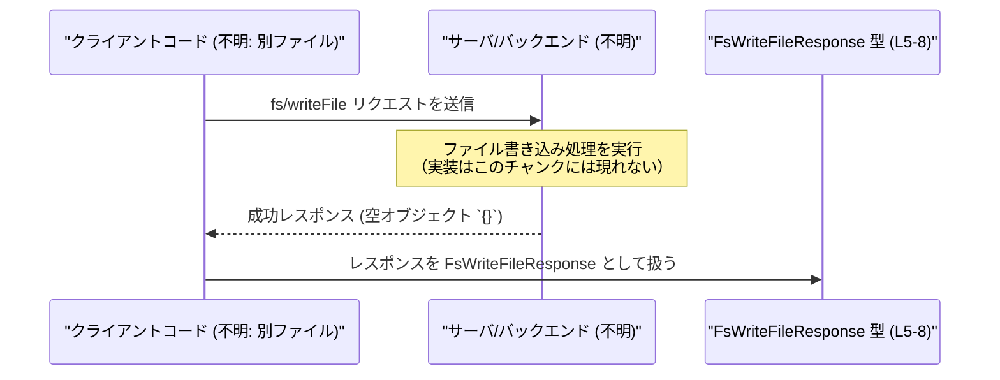

# app-server-protocol/schema/typescript/v2/FsWriteFileResponse.ts

## 0. ざっくり一言

`fs/writeFile` という操作の「成功レスポンス」を表す、**空オブジェクト型の TypeScript 定義**です（`Record<string, never>`）。  
成功時には特別なデータを返さないことを型レベルで表現しています。

---

## 1. このモジュールの役割

### 1.1 概要

- このモジュールは、`fs/writeFile` 操作の成功レスポンスを表現するための TypeScript 型 `FsWriteFileResponse` を定義します（`FsWriteFileResponse.ts:L5-8`）。
- 成功時にはペイロード（データ）が存在しないことを、`Record<string, never>` という「プロパティを持たないオブジェクト型」で表現しています（`FsWriteFileResponse.ts:L8-8`）。
- ファイル先頭のコメントから、このファイルは `ts-rs` によって自動生成されていることが分かります（`FsWriteFileResponse.ts:L1-3`）。

### 1.2 アーキテクチャ内での位置づけ

このチャンクから分かる範囲では、「fs/writeFile」というプロトコル・コマンドに紐づくレスポンス型です（`FsWriteFileResponse.ts:L5-7`）。  
他モジュールとの具体的な依存関係（どこから import されているか等）はこのチャンクには現れません。


- `A` の具体的な実装ファイル・関数名はこのチャンクには現れないため「不明」としています。
- 本ファイルは純粋に型定義のみを提供し、ロジックや I/O は持ちません。

### 1.3 設計上のポイント

- **自動生成コード**  
  - `// GENERATED CODE! DO NOT MODIFY BY HAND!`（`FsWriteFileResponse.ts:L1-1`）と `ts-rs` による生成コメント（`FsWriteFileResponse.ts:L3-3`）から、手動編集を前提としていないことが分かります。
- **状態を持たない**  
  - 実行時の処理や状態を持たず、型エイリアスのみを提供します（`FsWriteFileResponse.ts:L8-8`）。
- **成功・エラーの分離**  
  - コメントで「Successful response for `fs/writeFile`」と明示しているため（`FsWriteFileResponse.ts:L5-7`）、エラー応答は別の型／モジュールで扱う設計になっていると読み取れます（ただしエラー側の定義はこのチャンクには現れません）。
- **空レスポンスの明示**  
  - `Record<string, never>` を使うことで、「成功時レスポンスにはキーが存在しない」という制約を型レベルで表現しています（`FsWriteFileResponse.ts:L8-8`）。

---

## 2. 主要な機能一覧

このファイルが提供する機能は 1 つです。

- `FsWriteFileResponse`: `fs/writeFile` 成功時レスポンスの型。空オブジェクト（プロパティを持たない）であることを表現。

---

## 3. 公開 API と詳細解説

### 3.1 型一覧（構造体・列挙体など）

このファイルに定義されている型は次の 1 つです。

| 名前                  | 種別        | 役割 / 用途                                      | 定義位置                           |
|-----------------------|-------------|--------------------------------------------------|------------------------------------|
| `FsWriteFileResponse` | 型エイリアス | `fs/writeFile` の成功レスポンスを表す空オブジェクト型 | `FsWriteFileResponse.ts:L5-8` |

#### `FsWriteFileResponse = Record<string, never>`

**概要**

- `FsWriteFileResponse` は TypeScript の標準ユーティリティ型 `Record<K, V>` を用いて定義された型エイリアスです（`FsWriteFileResponse.ts:L8-8`）。
- `Record<string, never>` は「キーが `string` だが、値型が `never`」であるため、**実質的にプロパティを持ち得ないオブジェクト**を表します。

**型の意味（TypeScript 視点）**

```typescript
export type FsWriteFileResponse = Record<string, never>;
```

- `Record<string, never>` は「どんな `string` キーに対しても `never` を要求する」型です。
- `never` は「決して存在しない値」の型であり、値を代入することができません。
- したがって、`FsWriteFileResponse` 型を満たすオブジェクトにはプロパティを追加できず、**常に `{}`（空オブジェクト）に近い性質**になります。

**言語固有の安全性**

- `FsWriteFileResponse` に対してプロパティを追加しようとするとコンパイルエラーになります。

```typescript
const ok: FsWriteFileResponse = {};       // OK: 空オブジェクト

// const ng: FsWriteFileResponse = {       // コンパイルエラー
//   message: "done",                      // 'never' 型に 'string' を割り当てられない
// };
```

- これにより、「成功レスポンスには余計なデータを載せない」というプロトコル仕様を静的型チェックで保証できます。

**Errors / Panics / 並行性**

- この型はコンパイル時の型定義のみであり、実行時のエラー処理・例外・panic・並行実行とは直接関係しません。
- 並行性に関する制約（スレッドセーフかどうか等）は、このチャンクのコードからは分かりません。

**Edge cases（エッジケース）**

- **空オブジェクト**: `{}` は `FsWriteFileResponse` として有効です。
- **プロパティ付きオブジェクト**: 1 つでもプロパティを持つオブジェクトは `FsWriteFileResponse` としては不正（コンパイルエラー）になります。
- **`null` / `undefined`**: これらは `FsWriteFileResponse` には代入できません（通常のオブジェクト型と同様）。

**使用上の注意点**

- 成功レスポンスに追加情報（例えば書き込んだバイト数など）を持たせたい場合、この型定義や Rust 側の元定義を変更する必要がありますが、このファイルは自動生成のため**直接編集すべきではありません**（`FsWriteFileResponse.ts:L1-3`）。
- 実装側では、`FsWriteFileResponse` を返す際、単に空オブジェクト `{}` を返す形になると考えられますが、具体的な実装はこのチャンクには現れません。

### 3.2 関数詳細（最大 7 件）

このファイルには関数・メソッドは定義されていません（`FsWriteFileResponse.ts:L1-8` の範囲に `function` / `=>` などの関数定義は存在しません）。

### 3.3 その他の関数

- 補助関数やラッパー関数もこのチャンクには存在しません。

---

## 4. データフロー

このファイル単体では処理ロジックを持ちませんが、`fs/writeFile` 操作における成功レスポンスの型として想定されるデータフローを、分かる範囲で示します。



- **ポイント**:
  - 成功時、サーバは空の JSON オブジェクト `{}` を返し、それをクライアント側 TypeScript コードが `FsWriteFileResponse` として解釈していると考えられます。
  - エラー時のレスポンス形式・型はこのチャンクには現れないため不明です。

---

## 5. 使い方（How to Use）

### 5.1 基本的な使用方法

`FsWriteFileResponse` を使う側の典型的なコード例です。`fs/writeFile` を呼び出す関数からの戻り値にこの型を割り当てる形になります。

```typescript
// FsWriteFileResponse を import して使う例（実際のパスはこのチャンクには現れません）
import type { FsWriteFileResponse } from "./FsWriteFileResponse"; // 仮のパス

// fs/writeFile を呼び出す関数のシグネチャ例
async function writeFileRemote(path: string, contents: string): Promise<FsWriteFileResponse> {
    // 実際には RPC や HTTP リクエストなどを行う想定
    // このチャンクには実装は存在しないため例示のみです
    const res = await callRpc("fs/writeFile", { path, contents }); // 仮の関数

    // res を FsWriteFileResponse として扱う
    return res as FsWriteFileResponse;
}

// 呼び出し側
async function main() {
    const resp: FsWriteFileResponse = await writeFileRemote("/tmp/a.txt", "hello");

    // resp は空オブジェクトであり、プロパティは存在しない前提
    console.log(resp); // => {} を想定
}
```

> `callRpc` や import パスは例示であり、このチャンクには定義が存在しません。

### 5.2 よくある使用パターン

1. **成功したかどうかだけ見たい場合**

   ```typescript
   const resp: FsWriteFileResponse = await writeFileRemote("/tmp/a.txt", "hello");
   // プロパティを参照するのではなく、Promise が正常に resolve したこと自体で成功を判断する
   ```

2. **追加情報が不要な API として利用する場合**

   - `fs/writeFile` が「成功したかどうか」だけを伝えればよく、追加のメタデータ（サイズ、タイムスタンプなど）が不要なケースに適しています。

### 5.3 よくある間違い

```typescript
// 間違い例: レスポンスにプロパティを期待してしまう
async function wrongUsage() {
    const resp: FsWriteFileResponse = await writeFileRemote("/tmp/a.txt", "hello");

    // コンパイルエラーになる: 'FsWriteFileResponse' 上に 'message' プロパティは存在しない
    // console.log(resp.message);
}

// 正しい例: プロパティに依存せず、エラーは例外/別の経路で扱う
async function correctUsage() {
    try {
        await writeFileRemote("/tmp/a.txt", "hello");
        console.log("writeFile succeeded");
    } catch (e) {
        console.error("writeFile failed", e);
    }
}
```

### 5.4 使用上の注意点（まとめ）

- `FsWriteFileResponse` は **空の成功レスポンス**を表すため、アプリケーションロジックでこの型のプロパティに依存してはいけません。
- エラー情報や詳細な結果が必要な場合は、別のエラー型や結果型を確認する必要があります（このチャンクには定義されていません）。
- ファイルは `ts-rs` による自動生成であり、手動で編集すると Rust 側の定義との不整合が生じる可能性があります（`FsWriteFileResponse.ts:L1-3`）。

---

## 6. 変更の仕方（How to Modify）

### 6.1 新しい機能を追加する場合

- 追加情報（例: 書き込んだバイト数 `bytesWritten`）を成功レスポンスに含めたい場合、直接この TypeScript ファイルを変更するのではなく、
  - **元となる Rust 側の型定義**（`ts-rs` が参照している定義）を変更し、
  - `ts-rs` を再実行してこのファイルを再生成する、
 という手順が必要になります。
- このチャンクには Rust 側のファイルパスや生成スクリプトは現れないため、具体的な場所は不明です。

### 6.2 既存の機能を変更する場合

- `FsWriteFileResponse` の構造を変える（例えばプロパティを追加する）と、
  - `fs/writeFile` を利用している全てのクライアントコードに影響が出る可能性があります。
- 変更時に確認すべき点:
  - `FsWriteFileResponse` を import しているファイル（このチャンクからは参照不可能）。
  - Rust 側の対応するレスポンス型。
  - プロトコル仕様書や API ドキュメント（このチャンクには存在しません）。

---

## 7. 関連ファイル

このチャンクには、関連ファイルやモジュールへの import 文・参照は登場しません（`FsWriteFileResponse.ts:L1-8` には `import` が存在しません）。  
推測できる範囲での関係性のみ列挙します。

| パス / モジュール | 役割 / 関係 |
|-------------------|------------|
| Rust 側の `fs/writeFile` レスポンス型（パス不明） | `ts-rs` により本ファイルの元になっていると考えられます（`FsWriteFileResponse.ts:L3-3`）。 |
| `fs/writeFile` を呼び出すクライアントコード（ファイル不明） | `FsWriteFileResponse` を戻り値型として利用することが想定されます（`FsWriteFileResponse.ts:L5-7`）。 |

これ以上の詳細な依存関係やファイル構成は、このチャンクには現れないため不明です。
