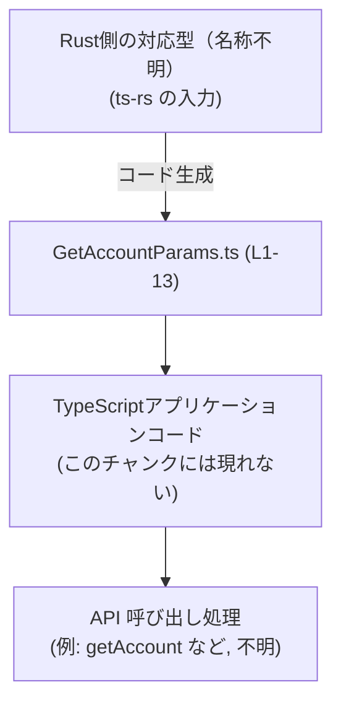
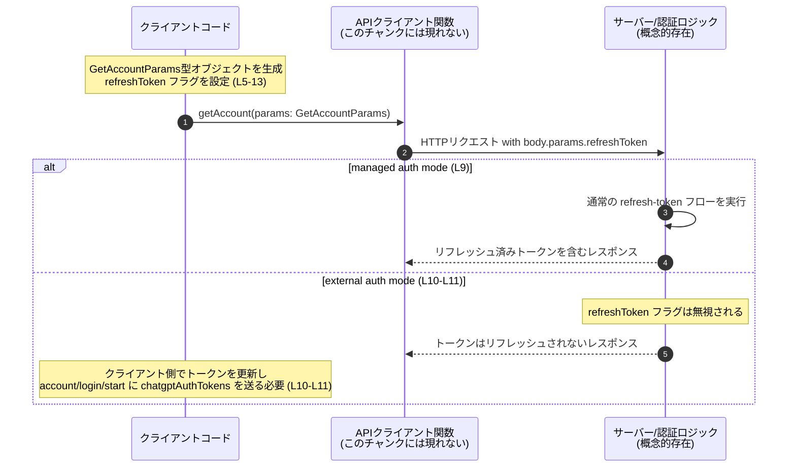

# app-server-protocol/schema/typescript/v2/GetAccountParams.ts

## 0. ざっくり一言

`GetAccountParams` という TypeScript 型エイリアスを定義し、「アカウント取得系（と推測される）API 呼び出し時に、トークンを能動的にリフレッシュするかどうか」を指定するブール値フラグを表現するファイルです（根拠:  型名と `refreshToken` の説明コメント, GetAccountParams.ts:L5-L13）。

---

## 1. このモジュールの役割

### 1.1 概要

- このモジュールは、ある API 呼び出し（型名から `GetAccount` 関連と推測される）のパラメータオブジェクトを TypeScript で表現するために存在しています（根拠: `export type GetAccountParams` 定義, GetAccountParams.ts:L5）。
- 現時点では `refreshToken: boolean` という 1 つのフラグのみを持ち、「レスポンスを返す前にプロアクティブなトークンリフレッシュを要求するかどうか」を指定します（根拠: JSDoc コメント, GetAccountParams.ts:L6-L12）。
- このファイルは Rust 側の型定義から `ts-rs` により自動生成されるため、TypeScript クライアント側で Rust サーバー側と型を一致させる目的もあります（根拠: 生成元コメント, GetAccountParams.ts:L1-L3）。

### 1.2 アーキテクチャ内での位置づけ

このモジュールが、Rust 側の型定義と TypeScript のアプリケーションコードの間の「スキーマ定義レイヤ」として機能している構造を図示します。



- Rust 側の型 → `ts-rs` → `GetAccountParams.ts` という生成フローがコメントにより示されています（根拠: GetAccountParams.ts:L1-L3）。
- 実際にこの型を受け取る関数や API クライアントはこのチャンクには現れていません。そのため、具体的な呼び出し元・呼び出し先は「不明」とします。

### 1.3 設計上のポイント

- **自動生成コードであること**  
  - 冒頭コメントにより、このファイルは手動編集禁止で `ts-rs` により生成されることが明示されています（根拠: GetAccountParams.ts:L1-L3）。
- **状態を持たない単純なデータ型**  
  - クラスや関数ではなく `type` エイリアスであり、オブジェクトの構造（プロパティとその型）だけを定義します（根拠: GetAccountParams.ts:L5-L13）。
- **ブール値フラグによる挙動切り替え**  
  - `refreshToken: boolean` により、サーバー側の認証モード（managed / external）における挙動の違いが説明されています（根拠: GetAccountParams.ts:L6-L12）。
- **エラーハンドリングはこのファイルでは行わない**  
  - このファイルは型定義のみであり、実行時ロジックやエラーハンドリングは存在しません（根拠: 関数・クラスの欠如, GetAccountParams.ts:L5-L13）。

---

## 2. 主要な機能一覧

このファイルが提供する主要な機能は 1 つです。

- `GetAccountParams` 型定義: API パラメータとして使用されるオブジェクト形状を定義し、その中で「トークンリフレッシュ要求フラグ」を型安全に表現する（根拠: GetAccountParams.ts:L5-L13）。

---

## 3. 公開 API と詳細解説

### 3.1 型一覧（構造体・列挙体など）

このチャンクに現れる型のインベントリーです。

| 名前               | 種別        | 役割 / 用途 | 根拠 |
|--------------------|-------------|-------------|------|
| `GetAccountParams` | 型エイリアス (`type`) | ある API 呼び出しのパラメータオブジェクトを表す。現在は `refreshToken` フラグのみを含む。 | GetAccountParams.ts:L5-L13 |

#### `GetAccountParams` のフィールド

| フィールド名      | 型       | 必須/任意 | 説明 | 根拠 |
|-------------------|----------|-----------|------|------|
| `refreshToken`    | `boolean` | 必須      | `true` の場合、レスポンス返却前にプロアクティブなトークンリフレッシュを要求する。managed auth mode では通常の refresh-token フローをトリガし、external auth mode では無視される。 | 定義と JSDoc, GetAccountParams.ts:L6-L7, L9-L11, L13 |

**TypeScript の型安全性の観点**

- `refreshToken: boolean` と型注釈されているため、TypeScript では `true` / `false` 以外の値（文字列 `"true"` など）を代入しようとするとコンパイルエラーになります（根拠: `boolean` 型指定, GetAccountParams.ts:L13）。
- `GetAccountParams` はオブジェクト型エイリアスであり、`refreshToken` を省略したオブジェクトを渡すと型チェックでエラーになります（プロパティに `?` が付いていないため、必須プロパティと解釈されます; 根拠: `refreshToken` に `?` がない, GetAccountParams.ts:L13）。

### 3.2 関数詳細

このファイルには、公開・非公開を含めて関数が一切定義されていません（根拠: `export type` 以外の関数定義構文が存在しない, GetAccountParams.ts:L5-L13）。  
そのため、「関数詳細」のテンプレートを適用すべき対象はありません。

### 3.3 その他の関数

- 該当なし（このチャンクには関数が存在しません）。

---

## 4. データフロー

このファイル自体には処理ロジックはありませんが、`refreshToken` フラグの説明コメントから、典型的な利用シナリオのデータフローを抽象的に示すことができます。

### 4.1 代表的なシナリオ

- クライアントコードが `GetAccountParams` オブジェクトを構築し、`refreshToken` を `true` または `false` に設定する（根拠: 型定義, GetAccountParams.ts:L5-L13）。
- このオブジェクトが API 呼び出し（関数名やエンドポイント名はこのチャンクには現れない）に渡され、サーバー側で認証モードに応じて挙動が変わる：
  - **managed auth mode**: トークンの通常の refresh フローがトリガされる。
  - **external auth mode**: このフラグは無視される。クライアント側でトークンをリフレッシュし、`account/login/start` に `chatgptAuthTokens` を渡す必要がある（根拠: JSDoc コメント, GetAccountParams.ts:L6-L12）。

### 4.2 シーケンス図（概念図）



- 図に出てくる `getAccount` や HTTP 呼び出しは、この型の典型的な使い方を示すための概念的な例であり、具体的な関数名・ルートはこのチャンクからは判別できません（「不明」）。

---

## 5. 使い方（How to Use）

### 5.1 基本的な使用方法

ここでは、`GetAccountParams` 型を受け取る仮の API クライアント関数 `getAccount` を想定した使用例を示します。  
関数自体はこのチャンクには存在しませんが、型の使い方のイメージとして有用です。

```typescript
// GetAccountParams 型をインポートする例                      // このファイルから型をインポートすると仮定
import type { GetAccountParams } from "./GetAccountParams";    // 実際のパスはプロジェクト構成に依存（不明）

// 仮の API クライアント関数のシグネチャ例                   // この関数はこのチャンクには存在しない
async function getAccount(params: GetAccountParams): Promise<void> {
    // ここで HTTP リクエストを投げるなどの処理を行う想定     // 実装は省略
}

// 呼び出し側コードの例
const params: GetAccountParams = {                             // GetAccountParams 型のオブジェクトを作成
    refreshToken: true,                                        // トークンの能動的リフレッシュを要求
};

await getAccount(params);                                      // 型安全に API を呼び出す
```

- `refreshToken` に `true` を設定すると、「レスポンスを返す前に能動的なトークンリフレッシュを要求する」という意味になります（根拠: GetAccountParams.ts:L6-L7）。
- `refreshToken` を `false` にする、または `false` と推論される値を渡すと、「リフレッシュは要求しない」挙動を意図します（`boolean` 型における通常の解釈; `false` の挙動はコメントには書かれていませんが、`true` のときのみ特別な意味が記載されているため、`false` で「要求しない」と解釈するのが自然です。ただしコードからの明示的な記述はありません）。

### 5.2 よくある使用パターン（推測を含まない範囲）

コメントから読み取れる、モードごとの使い方の前提条件です。

- **managed auth mode**  
  - `refreshToken: true` を指定すると、サーバー側で「通常の refresh-token フロー」が実行されます（根拠: GetAccountParams.ts:L9）。
- **external auth mode**  
  - `refreshToken` フラグは無視されるため、クライアント側でトークンをリフレッシュし、別エンドポイント `account/login/start` に `chatgptAuthTokens` を渡す必要があると記述されています（根拠: GetAccountParams.ts:L10-L11）。

### 5.3 よくある間違い（起こりうる誤用）

コードから直接「よくある間違い」は読み取れませんが、JSDoc の説明から想定される誤用例とその修正版を示します。

```typescript
// 誤用例（概念的な例）: external auth mode なのに
// refreshToken フラグを true にすればサーバーがリフレッシュしてくれると思い込む
const paramsWrong: GetAccountParams = {
    refreshToken: true,                                        // external auth mode では無視される (L10-L11)
};

// 正しい例（概念的な例）: external auth mode の場合は
// クライアント側でトークンをリフレッシュしてから account/login/start を呼ぶ
const paramsExternalMode: GetAccountParams = {
    refreshToken: false,                                       // あるいは true でも挙動は変わらないが無意味
};
// ここで chatgptAuthTokens を取得・更新する処理を行う想定
// その後、account/login/start に chatgptAuthTokens を渡して呼び出す (L10-L11)
```

- external auth mode では、`refreshToken` は無視されると明記されているため、このフラグに期待した挙動を求めるのは誤用に近いといえます（根拠: GetAccountParams.ts:L10-L11）。

### 5.4 使用上の注意点（まとめ）

- **必須プロパティである点**  
  - `refreshToken` はオプショナル（`?`）ではなく必須です。TypeScript ではこのプロパティを含まないオブジェクトは型エラーになります（根拠: GetAccountParams.ts:L13）。
- **external auth mode での無効化**  
  - external auth mode ではこのフラグは無視されるため、このモードで `refreshToken` を `true` にしても挙動が変わらないことに注意が必要です（根拠: GetAccountParams.ts:L10-L11）。
- **言語固有の安全性**  
  - TypeScript の静的型チェックにより、`refreshToken` に `boolean` 以外を渡したり、プロパティを欠落させた場合にコンパイルエラーとなり、実行時エラーを減らせます（根拠: `boolean` 型指定, GetAccountParams.ts:L13）。
  - ただし、純粋な JavaScript コードからこの型を意識せずに値を渡す場合は、実行時には型チェックが行われない点に留意が必要です（これは TypeScript の一般的特性であり、このファイル特有のコードでは表現されていません）。

---

## 6. 変更の仕方（How to Modify）

### 6.1 新しい機能を追加する場合

- このファイルは自動生成されており、先頭コメントに「手で編集するな」と明記されています（根拠: GetAccountParams.ts:L1-L3）。
- 新しいフィールドを `GetAccountParams` に追加したい場合は、**Rust 側の元の型定義または `ts-rs` の設定を変更する**のが正しい手順です。
  - 具体的な Rust ファイル名や型名はこのチャンクには現れないため、「不明」とします。
- TypeScript 側を直接編集しても、次回のコード生成で上書きされる可能性が高く、永続的な変更になりません。

### 6.2 既存の機能を変更する場合

- **`refreshToken` の型を変更する場合**  
  - たとえば `boolean` から `boolean | undefined` に変更して任意プロパティにしたいなどの要件がある場合も、Rust 側の型を変更し、`ts-rs` で再生成する必要があります（根拠: 自動生成コメント, GetAccountParams.ts:L1-L3）。
- **意味論的な契約（コントラクト）の変更**  
  - コメントに記載されている「managed auth mode では refresh フローをトリガ」「external auth mode では無視」という仕様を変えたい場合も、サーバー側ロジックおよび説明コメントの両方を合わせて変更する必要があります。
  - ただし、このファイルからはサーバー側ロジックの位置や実装は分かりません。

- 変更時に注意すべき契約（このチャンクから読み取れる範囲）:
  - `refreshToken = true` のときのみ特別な意味がある（プロアクティブなリフレッシュ要求）という契約（根拠: GetAccountParams.ts:L6-L9）。
  - external auth mode ではこのフラグが無視されるという契約（根拠: GetAccountParams.ts:L10-L11）。

---

## 7. 関連ファイル

このチャンク単体から、具体的な関連ファイルのパスや名前は特定できません。ただし、推測なしで言えることを整理します。

| パス / 名前 | 役割 / 関係 | 根拠 |
|------------|-------------|------|
| Rust 側の対応型（ファイル名・型名不明） | `ts-rs` によりこの TypeScript 型を生成する元となる Rust の型定義。 | 「This file was generated by ts-rs」との記述から、何らかの Rust 型が存在することだけは分かる (GetAccountParams.ts:L2-L3)。 |
| 同ディレクトリ `schema/typescript/v2/` 内の他ファイル | おそらく他の API 用スキーマ型が置かれていると考えられますが、このチャンクには具体名や関係が記載されていないため「不明」とします。 | パスはユーザー指定だが、内容はこのチャンクには現れない。 |

---

## 補足: Bugs/Security・Edge Cases・テスト・パフォーマンス観点

このファイルは単一の型定義のみのため、これらの観点をこのチャンクから読み取れる範囲でまとめます。

### Bugs / Security

- **バグの可能性**  
  - 型定義自体にロジックはないため、このファイル単体から直接的なバグは読み取れません。
- **セキュリティ影響**  
  - コメントにトークンリフレッシュや `chatgptAuthTokens` への言及があるため、セキュリティ関連の機能と関係しますが、実際のトークン処理はこのファイルには含まれていません（根拠: GetAccountParams.ts:L9-L11）。
  - 型レベルでは、`refreshToken` を必須にすることで「意図しないデフォルト値（例: `undefined`）による挙動のぶれ」を防ぐ効果があります。

### Contracts / Edge Cases

- **契約**  
  - `refreshToken` は必須の `boolean` である（根拠: GetAccountParams.ts:L13）。
  - `true` のときだけ特別な意味があり、external auth mode では無視される（根拠: GetAccountParams.ts:L6-L11）。
- **エッジケース**  
  - TypeScript では `refreshToken` を指定しない場合は型エラーになるため、実行時には「`refreshToken` が存在しない」というケースは原則想定していません。
  - JavaScript から利用する場合、`refreshToken` を省略したり、`null` や `"true"` を渡すなどの誤用が起こり得ますが、このファイルではそれらに対するガードやエラーハンドリングは定義されていません（型定義のみのため）。

### Tests

- このチャンクにはテストコードやテストに関するコメントは含まれていません。
- この型を使うロジック（API ハンドラやクライアント）が別途定義されているはずであり、そのレイヤでテストを書く必要がありますが、場所や内容は「不明」です。

### Performance / Scalability

- `GetAccountParams` は単一のブール値を含むだけの軽量なオブジェクトであり、性能面での懸念はほぼありません（このチャンクから読み取れる範囲）。
- 大量のリクエストでもこの型定義自体がボトルネックになることはないと考えられます（一般的な TypeScript 型定義の特性）。

---

このレポートは、与えられた `GetAccountParams.ts` のチャンクに含まれる情報に基づいており、それ以外のコードや設計については推測を避け、「不明」または「このチャンクには現れない」と明示しています。
