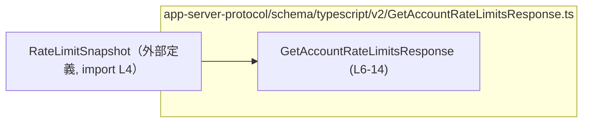
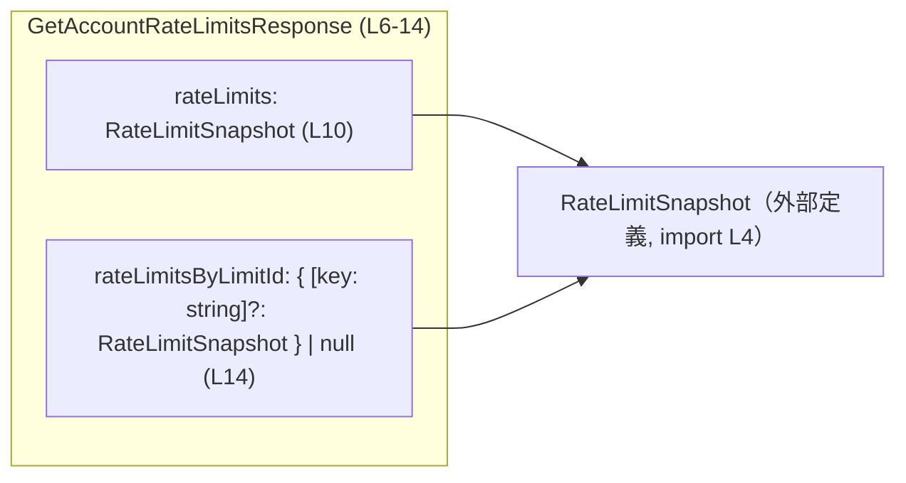
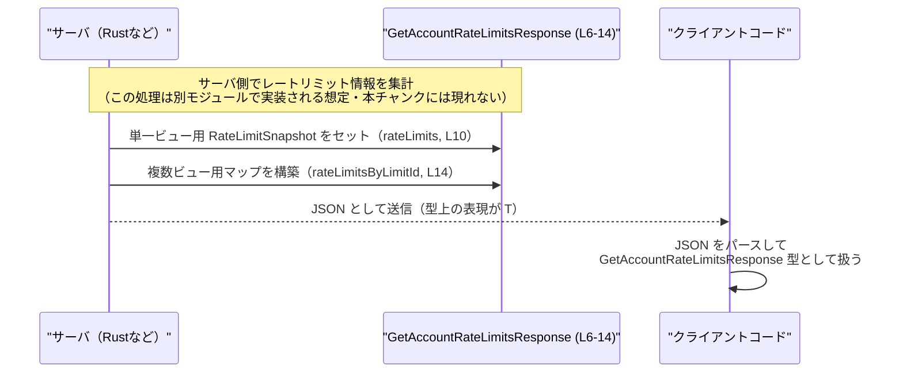

# app-server-protocol/schema/typescript/v2/GetAccountRateLimitsResponse.ts コード解説

## 0. ざっくり一言

`GetAccountRateLimitsResponse` は、「アカウントのレートリミット情報」をクライアントに返すための **レスポンス型** を表現する TypeScript の型エイリアスです。  
歴史的な単一バケット表現と、新しい複数バケット表現の両方を 1 つのオブジェクトで表します。  
（定義本体: `GetAccountRateLimitsResponse.ts:L6-14`）

---

## 1. このモジュールの役割

### 1.1 概要

- このモジュールは、アカウントのレートリミット（利用制限）情報をクライアントに返すレスポンスの **構造を型として定義** しています。
- 1 つ目のフィールド `rateLimits` は、過去との互換性を意識した「単一バケット」のビューです（コメントより: `GetAccountRateLimitsResponse.ts:L7-10`）。
- 2 つ目のフィールド `rateLimitsByLimitId` は、`limit_id` ごと（例: `codex`）に分割された「複数バケット」のビューです（コメントより: `GetAccountRateLimitsResponse.ts:L11-14`）。

### 1.2 アーキテクチャ内での位置づけ

コードから直接わかる依存関係は次の 1 点です。

- `GetAccountRateLimitsResponse` は `RateLimitSnapshot` 型に依存しています（import 文: `GetAccountRateLimitsResponse.ts:L4`）。

これを簡略化して Mermaid で表すと次のようになります。



- `RateLimitSnapshot` 自体の定義は、このチャンクには現れません（`GetAccountRateLimitsResponse.ts` には型定義のみの import が存在します）。

### 1.3 設計上のポイント

コードとコメントから読み取れる設計上の特徴は次のとおりです。

- **自動生成コードであること**  
  - 冒頭コメントに「GENERATED CODE! DO NOT MODIFY BY HAND!」とあります（`GetAccountRateLimitsResponse.ts:L1-3`）。
  - `ts-rs` によって生成されており、Rust 側の定義を元に TypeScript 型が作られていると読めます（コメント由来の情報）。

- **純粋なデータ型（状態のみ・ロジックなし）**  
  - このファイル内には関数・メソッド・クラスなどの実行ロジックは存在せず、**型エイリアス 1 つのみ** が定義されています（`GetAccountRateLimitsResponse.ts:L6-14`）。

- **後方互換性の配慮**  
  - `rateLimits` フィールドは "Backward-compatible single-bucket view; mirrors the historical payload." とコメントされており、過去のペイロード形式を維持する意図が読み取れます（`GetAccountRateLimitsResponse.ts:L7-9`）。

- **新旧 2 つのビューの共存**  
  - `rateLimitsByLimitId` フィールドで `limit_id` ごとの新しい複数バケットビューを提供しつつ、既存の単一ビューも残す構造になっています（コメントと型から: `GetAccountRateLimitsResponse.ts:L11-14`）。

- **エラーハンドリング・並行性**  
  - このファイルは型定義のみであり、エラー処理や並行処理に関するロジックは含まれていません。
  - TypeScript 型としては `null` や `undefined` を表現しており、**呼び出し側が null チェック・存在チェックを行う前提** の設計になっています。

---

## 2. 主要な「機能」（フィールド）一覧

このモジュールは関数を持たないため、ここではフィールド単位で「できること」を整理します。

- `rateLimits`: 単一バケットのレートリミット情報を `RateLimitSnapshot` として保持する（後方互換のためのビュー）。  
  （定義: `GetAccountRateLimitsResponse.ts:L7-10`）

- `rateLimitsByLimitId`: `limit_id`（例: `codex`）ごとのレートリミット情報を、文字列キーから `RateLimitSnapshot` へのマップとして保持する。マップ全体が `null` の場合もある。  
  （定義: `GetAccountRateLimitsResponse.ts:L11-14`）

---

## 3. 公開 API と詳細解説

### 3.1 型一覧（構造体・列挙体など）

このファイルに定義されている主な型は次の 1 つです。

| 名前 | 種別 | 役割 / 用途 | 定義位置 |
|------|------|-------------|----------|
| `GetAccountRateLimitsResponse` | 型エイリアス（オブジェクト型） | アカウントのレートリミット情報レスポンスのペイロード構造。歴史的な単一バケットビューと、`limit_id` ごとの複数バケットビューを同時に提供する。 | `GetAccountRateLimitsResponse.ts:L6-14` |

依存している型（このファイル内では定義されていないもの）:

| 名前 | 種別 | 役割 / 用途 | 出現位置 | 備考 |
|------|------|-------------|----------|------|
| `RateLimitSnapshot` | 型（詳細不明） | 各バケットのレートリミット状態を表すスナップショット。単一ビューおよび複数ビューの値型として利用される。 | import: `GetAccountRateLimitsResponse.ts:L4` / フィールド: `L10, L14` | 実際の構造はこのチャンクには現れない |

#### `GetAccountRateLimitsResponse` のフィールド構造

```typescript
export type GetAccountRateLimitsResponse = {               // L6
    /**
     * Backward-compatible single-bucket view; mirrors the historical payload.
     */
    rateLimits: RateLimitSnapshot,                         // L7-10
    /**
     * Multi-bucket view keyed by metered `limit_id` (for example, `codex`).
     */
    rateLimitsByLimitId: { [key in string]?: RateLimitSnapshot } | null, // L11-14
};
```

- `rateLimits: RateLimitSnapshot`  
  - 必須プロパティです。`undefined` や `null` は許容されていません（型定義上: `GetAccountRateLimitsResponse.ts:L10`）。
- `rateLimitsByLimitId: { [key in string]?: RateLimitSnapshot } | null`  
  - `null` か、文字列キーから `RateLimitSnapshot` へのマップです（`GetAccountRateLimitsResponse.ts:L14`）。
  - マップ内の各キーはオプショナル（`?`）であり、指定されていないキーに対するアクセスは `undefined` になりえます。

### 3.2 関数詳細

- このファイルには **関数定義・メソッド定義は存在しません**（全体のコードを確認した結果: `GetAccountRateLimitsResponse.ts:L1-14`）。
- したがって、ここで説明すべき「公開関数」はありません。

### 3.3 その他の関数

- 補助関数やラッパー関数も存在しません（このチャンクには現れません）。

---

## 4. データフロー

このファイルには実行ロジックがないため、「処理の流れ」というよりも **データ構造内での関係** を中心に説明します。

### 4.1 型内部のデータ関係（構造的データフロー）

`GetAccountRateLimitsResponse` の内部で、どのように `RateLimitSnapshot` が使われているかを図示します。



- `rateLimits` は「単一バケット用のスナップショット」として `RateLimitSnapshot` を 1 つ参照します。
- `rateLimitsByLimitId` は、複数の `RateLimitSnapshot` を `limit_id` ごとに参照するマップです。値は 0 個以上存在しうるほか、マップ自体が `null` の場合もあります。

### 4.2 典型的な利用イメージ（シーケンス図）

以下は、**一般的に想定される** 利用パターンの一例です（この具体的な処理はこのチャンクには現れず、あくまで利用イメージです）。



- この図は、**型定義から読み取れる構造** に基づいており、サーバが単一・複数ビュー両方をセットしたうえでクライアントに返す、という典型的な流れを表しています。
- 実際の実装やメソッド名などは、このチャンクには現れないため不明です。

---

## 5. 使い方（How to Use）

### 5.1 基本的な使用方法

この型を TypeScript 側で利用する、最も素朴な例です。  
`RateLimitSnapshot` の具体的な構造はこのファイルには現れないため、`declare` を使って既にどこかで提供されている前提の値として扱います。

```typescript
// 型のインポート                                              // 型だけをインポートする（実行時には影響しない）
import type { GetAccountRateLimitsResponse } from "./GetAccountRateLimitsResponse";  // 同ディレクトリを想定
import type { RateLimitSnapshot } from "./RateLimitSnapshot";                         // 実際の構造は別ファイル

// どこか別の場所で取得済みのスナップショットを仮定する        // このファイル内では構造が不明なため declare で表現
declare const singleBucketSnapshot: RateLimitSnapshot;           // 単一バケット用のスナップショット
declare const codexSnapshot: RateLimitSnapshot;                  // 例: limit_id = "codex" のスナップショット

// GetAccountRateLimitsResponse 型の値を構築する例
const response: GetAccountRateLimitsResponse = {                 // response の型は GetAccountRateLimitsResponse
    rateLimits: singleBucketSnapshot,                            // 必須フィールド: 単一バケットビュー（L10）
    rateLimitsByLimitId: {                                       // 複数バケットビュー（L14）
        codex: codexSnapshot,                                    // コメントにある例: limit_id = "codex"（L12）
        // 他の limit_id を必要に応じて追加
    },
};

// 利用例: 単一バケットビューだけを使う                          // 既存クライアントは従来どおり rateLimits だけ参照できる
console.log(response.rateLimits);

// 利用例: 複数バケットビューから特定 limit_id の情報を取得
const codexLimits = response.rateLimitsByLimitId?.codex;         // null や undefined を考慮してオプショナルチェーン
if (codexLimits) {
    console.log("codex limit exists");
}
```

ポイント:

- `rateLimits` は **常に存在する前提** でアクセスできます（型が `RateLimitSnapshot` のみ: `GetAccountRateLimitsResponse.ts:L10`）。
- `rateLimitsByLimitId` は `null` または `undefined` になりうるため、`?.` や null チェックが必要です（`GetAccountRateLimitsResponse.ts:L14`）。

### 5.2 よくある使用パターン

#### パターン 1: 後方互換クライアント（単一ビューのみ利用）

既存クライアントが、歴史的なペイロードと同じ構造だけを期待する場合の利用方法です。

```typescript
function handleLegacyClient(response: GetAccountRateLimitsResponse) { // レスポンス全体を受け取る
    const snapshot = response.rateLimits;                              // 単一ビューのみを使用（L10）

    // ここで snapshot の内容に応じて UI を更新するなどの処理を行う
    // RateLimitSnapshot の構造は別ファイルだが、この型のおかげで IDE で補完が効く
}
```

- `rateLimitsByLimitId` を一切見ないことで、旧来の挙動を保てます。

#### パターン 2: 新しいクライアント（複数ビューを優先利用）

`limit_id` ごとのレートリミットを細かく制御したいクライアントの例です。

```typescript
function getBucketSnapshot(
    response: GetAccountRateLimitsResponse,      // レスポンス全体
    limitId: string,                             // 取得したい limit_id
): RateLimitSnapshot | null {
    const map = response.rateLimitsByLimitId;    // 複数ビューのマップ（L14）

    if (!map) {                                  // マップ自体が null の場合
        return null;                             // 複数ビューは利用不可
    }

    const snapshot = map[limitId];               // キーで lookup（型上は RateLimitSnapshot | undefined）
    return snapshot ?? null;                     // 存在しなければ null を返す
}
```

- `rateLimitsByLimitId` が `null` の場合と、キーが存在しない場合の 2 段階のチェックが必要になります。
- TypeScript の型としては `map[limitId]` の戻り値は `RateLimitSnapshot | undefined` になるため、`?? null` などで扱いやすい形に変換するとよいです。

### 5.3 よくある間違い

#### 間違い例 1: `rateLimitsByLimitId` を非 null と仮定してしまう

```typescript
// 間違い例
function unsafeUse(response: GetAccountRateLimitsResponse) {
    // 型上は null の可能性があるが、チェックせずに直接アクセスしている       // L14 で `| null` と定義されている
    const codex = response.rateLimitsByLimitId["codex"];             // 実行時に rateLimitsByLimitId が null ならエラー
}
```

- 型定義上 `rateLimitsByLimitId` は `null` になりうるため（`GetAccountRateLimitsResponse.ts:L14`）、  
  `strictNullChecks` を有効にしていればコンパイルエラーになります。
- 実行時型チェックを行わないままアクセスすると、`Cannot read properties of null` のようなエラーにつながります。

**正しい例:**

```typescript
function safeUse(response: GetAccountRateLimitsResponse) {
    const map = response.rateLimitsByLimitId;
    if (!map) {
        // 複数ビューが提供されていないケースをハンドリング
        return;
    }

    const codex = map["codex"];          // ここでは map は非 null
    if (!codex) {
        // "codex" のバケットが定義されていない場合の処理
        return;
    }

    // codex は RateLimitSnapshot 型として安全に扱える
}
```

#### 間違い例 2: キーがオプショナルであることを意識しない

マップ型 `{ [key in string]?: RateLimitSnapshot }` では、任意のキーが **存在しない（プロパティ未定義）** ケースがあります（`GetAccountRateLimitsResponse.ts:L14`）。

```typescript
// 間違い例: キー存在を前提にしてしまう
function assumeKeyExists(response: GetAccountRateLimitsResponse) {
    const map = response.rateLimitsByLimitId;
    if (!map) return;

    // "codex" が必ず存在すると仮定している
    const codex = map["codex"];          // 実際には undefined の可能性がある
    // codex.<property> を直接使うと runtime error になる可能性
}
```

**正しい例:**

```typescript
function handleOptionalKey(response: GetAccountRateLimitsResponse) {
    const map = response.rateLimitsByLimitId;
    if (!map) return;

    const codex = map["codex"];
    if (!codex) {
        // バケットが存在しない場合のフォールバック
        return;
    }

    // codex を安全に利用する処理
}
```

### 5.4 使用上の注意点（まとめ）

- **`rateLimits` は常に存在する前提**  
  - 型が `RateLimitSnapshot` 単体であり、`null` や `undefined` は許容されません（`GetAccountRateLimitsResponse.ts:L10`）。
- **`rateLimitsByLimitId` は `null` を取りうる**  
  - 複数バケットビューが提供されないケースを考慮して、必ず null チェックを行う必要があります（`GetAccountRateLimitsResponse.ts:L14`）。
- **マップのキーはオプショナル**  
  - 任意の `limit_id` のプロパティが存在しないことがあるため、取り出した値の `undefined` チェックが必須です（`GetAccountRateLimitsResponse.ts:L14`）。
- **並行性**  
  - この型自体は純粋なデータ構造であり、スレッドセーフティや並行アクセスに関するロジックは含まれません。並行性の注意点は、この型を利用する上位層の実装に依存します。
- **パフォーマンス**  
  - TypeScript の型エイリアスであり、コンパイル後の JavaScript 実行時には存在しません。そのため **型定義自体がパフォーマンスやスケーラビリティに直接影響することはありません**。  
  - 実際のメモリ消費や処理コストは、レスポンスペイロードのサイズ（マップに含まれるバケット数など）と、それをどう処理するかによって決まります。

---

## 6. 変更の仕方（How to Modify）

### 6.1 新しい機能（フィールド）を追加する場合

このファイルは自動生成コードであり、冒頭に **「GENERATED CODE! DO NOT MODIFY BY HAND!」** と明記されています（`GetAccountRateLimitsResponse.ts:L1-3`）。  
そのため、**直接この TypeScript ファイルを編集することは想定されていません。**

新しいフィールドやビューを追加したい場合、一般的には次の流れになります（コメントに基づく推測を含みますが、方針としては妥当なものです）。

1. **Rust 側の定義を変更する**  
   - `ts-rs` で生成されていることから、Rust の構造体/型（`#[derive(TS)]` など）を変更する必要があります。
   - 具体的な Rust ファイルの場所や型名は、このチャンクからは分かりません（「このチャンクには現れない」情報です）。

2. **`ts-rs` を再実行して TypeScript の型を再生成する**  
   - 生成プロセスはこのリポジトリ固有であり、このチャンクからは詳細不明です。

3. **生成された新しい TypeScript 型に対してクライアントコードを対応させる**  
   - 新しいフィールドに対する null チェックや存在チェックを含めて、クライアント側のコードを修正する必要があります。

### 6.2 既存の機能（フィールド）を変更する場合

同様に、自動生成ファイルであることから **直接の編集は避けるべき** です。設計上の契約を崩さないため、特に次の点に注意する必要があります。

- **`rateLimits` を削除・オプショナル化しない**  
  - コメントにあるとおり「Backward-compatible single-bucket view」であり、歴史的なペイロードを期待するクライアントが存在することが示唆されています（`GetAccountRateLimitsResponse.ts:L7-9`）。
  - これを削除したり、`rateLimits?: RateLimitSnapshot` のように変更した場合、既存クライアントとの互換性が壊れる可能性があります。

- **`rateLimitsByLimitId` の null 許容性を変える場合は影響範囲が広い**  
  - `null` を禁止して常にマップを返すようにする変更（例: `{ [key: string]: RateLimitSnapshot }`）は、null チェックを前提に書かれているクライアントコードを壊す可能性があります。

- **変更前後の契約（Contract）確認**  
  - フィールドの必須性（必須 / オプション / null 許容）、キーの意味（`limit_id`）、値の型（`RateLimitSnapshot`）など、**API の契約** に関わる部分は変更前に十分に確認する必要があります。
  - 型定義の変更は、サーバ・クライアント双方のビルド・テストを通して検証されるべきです。

---

## 7. 関連ファイル

このモジュールと密接に関係するファイルは、コードから次の 1 つだけが明示されています。

| パス | 役割 / 関係 | 根拠 |
|------|------------|------|
| `./RateLimitSnapshot` | `RateLimitSnapshot` 型の定義を提供するモジュール。`GetAccountRateLimitsResponse` の `rateLimits` および `rateLimitsByLimitId` の値型として利用される。実際のフィールド構造はこのチャンクには現れない。 | import 文: `GetAccountRateLimitsResponse.ts:L4` とフィールド型参照: `L10, L14` |

その他、このレスポンス型を利用するリクエストやサーバ側の実装ファイル（例: `GetAccountRateLimits` を実装するエンドポイント）は、このチャンクには一切現れません。そのため、具体的なファイル名やパスは不明です。
