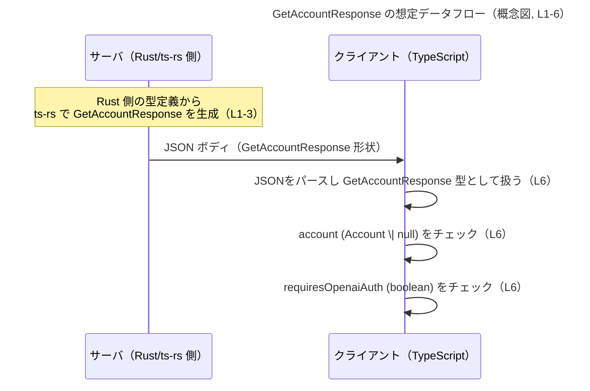

# app-server-protocol/schema/typescript/v2/GetAccountResponse.ts

## 0. ざっくり一言

- アカウント情報取得用のレスポンスオブジェクト `GetAccountResponse` の **TypeScript 型定義**を提供するファイルです（生成コード）（GetAccountResponse.ts:L1-3, L6）。

---

## 1. このモジュールの役割

### 1.1 概要

- このモジュールは、`GetAccountResponse` という型エイリアス（別名）をエクスポートし、  
  `account` と `requiresOpenaiAuth` という 2 つのプロパティを持つレスポンス形状を型レベルで表現します（GetAccountResponse.ts:L6）。
- `account` は `Account | null` で、アカウント情報が存在しない場合を `null` で表す設計になっています（GetAccountResponse.ts:L4, L6）。
- `requiresOpenaiAuth` は `boolean` で、何らかの「OpenAI 認証」の要否を表すフラグと解釈できますが、具体的な意味や利用箇所はこのチャンクからは分かりません（GetAccountResponse.ts:L6）。

### 1.2 アーキテクチャ内での位置づけ

- この型は `ts-rs` によって生成されたものであり、Rust 側の型定義から自動的に出力されていることがコメントから分かります（GetAccountResponse.ts:L1-3）。
- `GetAccountResponse` は、同じディレクトリにある `./Account` モジュールから型 `Account` を **型としてのみ** import しており（`import type`）、実行時依存ではなくコンパイル時の型チェック専用の依存関係です（GetAccountResponse.ts:L4）。
- 実際にどこから呼び出されるか（どの API エンドポイントに対応するかなど）は、このチャンクからは分かりませんが、型名から「アカウント取得系のレスポンス」に使われることが想定されます。

Mermaid 図で、型レベルの依存関係を示します。

```mermaid
graph TD
    title GetAccountResponse 型と依存関係（L1-6）

    subgraph "schema/typescript/v2 (L1-6)"
        GAR["GetAccountResponse (L6)"]
        ACC["Account 型（import ./Account, L4）"]
    end

    GAR --> ACC
```

- `GetAccountResponse` は `Account` に依存し、`Account` の存在しない状態を `null` で表す、という関係になっています（GetAccountResponse.ts:L4, L6）。

### 1.3 設計上のポイント

- **生成コードであること**  
  - 冒頭コメントにより、このファイルは `ts-rs` による生成コードであり、手動編集してはならないと明記されています（GetAccountResponse.ts:L1-3）。
- **型専用 import**  
  - `import type { Account } from "./Account";` により、コンパイル後の JavaScript には `Account` への import が残らない設計になっています。これは型情報だけを利用し、実行時依存を減らす意図と考えられます（GetAccountResponse.ts:L4）。
- **null を使った存在有無の表現**  
  - `account: Account | null` とすることで、「アカウント情報が取得できなかった / 無い」状態を `null` で表現する契約になっています（GetAccountResponse.ts:L6）。
- **ブールフラグによる条件表現**  
  - `requiresOpenaiAuth: boolean` により、追加の動作条件（ここでは OpenAI 認証の要否）を簡潔に持たせる構造になっています（GetAccountResponse.ts:L6）。
- **状態やエラーハンドリングのロジックを持たない**  
  - このファイルは型定義のみであり、関数やクラスは一切含みません（GetAccountResponse.ts:L1-6）。  
    そのため、エラー処理・並行性・副作用などのロジックは他のモジュール側で扱われます。

---

## 2. 主要な機能一覧

このファイルは実行ロジックを持たず、「型を定義する」という機能のみを提供します。

- `GetAccountResponse`: アカウント情報取得レスポンスの構造を表す型エイリアス（GetAccountResponse.ts:L6）。
- `account` プロパティ: `Account` 型のアカウント情報、または情報がないことを示す `null` を保持するフィールド（GetAccountResponse.ts:L4, L6）。
- `requiresOpenaiAuth` プロパティ: OpenAI 認証が必要かどうかを表す boolean フラグ（GetAccountResponse.ts:L6）。

---

## 3. 公開 API と詳細解説

### 3.1 型一覧（構造体・列挙体など）

#### 公開型

| 名前                | 種別       | フィールド                              | 役割 / 用途                                                                 | 根拠 |
|---------------------|------------|------------------------------------------|------------------------------------------------------------------------------|------|
| `GetAccountResponse`| 型エイリアス | `account: Account \| null`<br>`requiresOpenaiAuth: boolean` | アカウント取得レスポンスの形状を表すオブジェクト型。アカウント情報と、OpenAI 認証の要否フラグを含む。 | GetAccountResponse.ts:L4, L6 |

#### 依存する外部型

| 名前     | 種別 | 定義元         | 役割 / 関係                                                   | 根拠 |
|----------|------|----------------|----------------------------------------------------------------|------|
| `Account`| 型   | `"./Account"` モジュール | `GetAccountResponse.account` プロパティの具体的なアカウント情報の型として利用される。実際の定義はこのチャンクには含まれない。 | GetAccountResponse.ts:L4, L6 |

##### 契約とエッジケース（型レベル）

- `account` プロパティ（GetAccountResponse.ts:L6）
  - **契約**:  
    - `Account` 型の値か `null` のいずれかを取り、`undefined` にはならない型付けです。  
      つまり、「プロパティが欠けている」のではなく「存在しないことが明示的に `null` として表現される」契約になっています。
  - **エッジケース**:
    - `account === null` の場合、利用側は `Account` のプロパティへアクセスしてはなりません。  
      TypeScript の型システム上も `null` を許容しているため、`strictNullChecks` 有効時には null チェックが必要です。
- `requiresOpenaiAuth` プロパティ（GetAccountResponse.ts:L6）
  - **契約**:
    - 常に `true` か `false` のいずれかであり、プロパティ欠如や `null` は許されない型です。
  - **エッジケース**:
    - `true` の意味（例えば「まだ認証していないので認証フローに進む必要がある」のか、「既に認証が必要な状態にある」のか）は、型情報だけからは分かりません。  
      利用時はバックエンドの仕様と合わせて解釈する必要があります。

### 3.2 関数詳細（最大 7 件）

- このファイルには関数・メソッドは一切定義されていません（GetAccountResponse.ts:L1-6）。  
  したがって、関数レベルのアルゴリズム・エラー・パニック・並行性といった観点は、このファイル単体には存在しません。

### 3.3 その他の関数

- 該当なし（このチャンク内に関数定義は存在しません）（GetAccountResponse.ts:L1-6）。

---

## 4. データフロー

このファイル自体には処理ロジックがなく、「どのように使われるか」はコードから直接は分かりません。  
以下は、「GetAccountResponse が API レスポンスとして使われる」という **想定利用例** に基づいた概念的なデータフローです（実際の実装が同一とは限りません）。

1. サーバ側（おそらく Rust + `ts-rs`）で `GetAccountResponse` に対応する構造体を構築し、JSON として返す。
2. クライアント側 TypeScript コードが、その JSON を `GetAccountResponse` 型として扱う。
3. クライアントは `account` の null チェックと `requiresOpenaiAuth` の真偽によって後続処理を分岐する。



---

## 5. 使い方（How to Use）

### 5.1 基本的な使用方法

以下は、`fetch` を用いて API から `GetAccountResponse` を取得する想定の基本的な利用例です。  
エンドポイント URL やエラー処理はあくまで例であり、実際の値はこのチャンクからは分かりません。

```typescript
// 型定義をインポートする                                      // GetAccountResponse 型を利用する
import type { GetAccountResponse } from "./GetAccountResponse"; // このファイルの型（L6）
import type { Account } from "./Account";                       // account プロパティの型（L4）

// API から GetAccountResponse を取得する関数の例
async function fetchGetAccount(): Promise<GetAccountResponse> {  // 戻り値の型として GetAccountResponse を指定
    const res = await fetch("/api/account");                     // 実際のパスはアプリ固有
    if (!res.ok) {                                               // HTTP エラーの簡易チェック
        throw new Error("Failed to fetch account");
    }

    // 取得した JSON を GetAccountResponse 型として扱う
    const data = await res.json() as GetAccountResponse;        // 型アサーションで型情報を付与
    return data;
}

// 利用側のコード例
async function main() {
    const { account, requiresOpenaiAuth } = await fetchGetAccount();

    if (requiresOpenaiAuth) {                                   // OpenAI 認証が必要な場合の処理（L6）
        // 認証フローへ遷移するなど
        return;
    }

    if (account !== null) {                                     // account が null でない場合のみ Account として扱う（L6）
        // account は Account 型とみなせる
        console.log("user account", account);
    } else {
        // account が null の場合のハンドリング
        console.log("no account found");
    }
}
```

- この例では、`GetAccountResponse` を利用する側で **必ず `account !== null` をチェックしてから** `Account` として扱っている点が重要です（GetAccountResponse.ts:L6）。

### 5.2 よくある使用パターン

1. **レスポンスの分解とガード**

```typescript
async function handleAccount() {
    const response = await fetchGetAccount();                  // GetAccountResponse 型（例）

    // requiresOpenaiAuth を先にチェック
    if (response.requiresOpenaiAuth) {                         // boolean フラグで分岐（L6）
        // 認証を促す UI を表示
        return;
    }

    // account の null チェック
    const account: Account | null = response.account;          // Account | null 型（L4, L6）
    if (account === null) {
        // 未登録状態などの処理
        return;
    }

    // ここでは account は Account 型として安全に扱える
    console.log(account);
}
```

1. **型ガード関数を用いた安全な利用**

```typescript
// account が null でないことを判定する型ガード関数の例
function hasAccount(
    res: GetAccountResponse
): res is GetAccountResponse & { account: Account } { // account が Account の場合に絞り込む
    return res.account !== null;                      // null でないなら true
}

async function handleWithTypeGuard() {
    const res = await fetchGetAccount();

    if (!hasAccount(res)) {                           // account が null のケースをここで排除
        // 何らかのフォールバック処理
        return;
    }

    // ここから先では res.account は Account 型として扱える
    console.log(res.account);
}
```

### 5.3 よくある間違い

#### 1. `account` の null チェックを忘れる

```typescript
// 間違い例: null チェックをせずにプロパティアクセスしてしまう
async function badUsage() {
    const res = await fetchGetAccount();
    // res.account が null かもしれないのにプロパティアクセスしている
    // TypeScript の strictNullChecks を無効にしているとコンパイル時に気付きにくい
    console.log(res.account.id);     // 実行時にエラーになる可能性がある
}

// 正しい例: null チェックを行ってからアクセスする
async function goodUsage() {
    const res = await fetchGetAccount();

    if (res.account === null) {      // Account | null の null ケースを先に処理（L6）
        console.log("no account");
        return;
    }

    // ここでは res.account は Account 型に絞り込まれる
    console.log(res.account.id);
}
```

#### 2. 生成コードを直接編集してしまう

```typescript
// 間違い例: このファイルに直接フィールドを追加する
// export type GetAccountResponse = {
//     account: Account | null,
//     requiresOpenaiAuth: boolean,
//     newField: string, // ← 手動で追加してしまう
// };
```

- このファイルは **生成コード** であり、コメントで「手動で編集してはいけない」と明記されています（GetAccountResponse.ts:L1-3）。  
  手動で変更しても、次にコード生成を行った際に上書きされる可能性があります。

### 5.4 使用上の注意点（まとめ）

- **生成コードであること**
  - 直接編集せず、元となる Rust 側の定義を変更して再生成する必要があります（GetAccountResponse.ts:L1-3）。
- **`account` は `Account | null`**
  - 利用時には `null` チェックが必須です。チェックせずにプロパティアクセスすると実行時エラーの原因になります（GetAccountResponse.ts:L4, L6）。
- **`requiresOpenaiAuth` の意味は仕様に依存**
  - 型からは単なる `boolean` であり、その真偽が何を意味するかはバックエンドの仕様書や Rust 側のコメントを確認する必要があります（GetAccountResponse.ts:L6）。
- **並行性・スレッドセーフティ**
  - このモジュールは型定義のみで、副作用や共有状態を持たないため、並行実行に関する直接の懸念はありません（GetAccountResponse.ts:L1-6）。
- **セキュリティ**
  - 型定義自体はセキュリティ上のリスクを直接は持ちませんが、`requiresOpenaiAuth` の判定に依存して認可を行う場合は、バックエンド側での検証が必須です（型だけでは防げません）。

---

## 6. 変更の仕方（How to Modify）

### 6.1 新しい機能を追加する場合

このファイルは `ts-rs` による生成コードであり、直接変更すると再生成時に上書きされます（GetAccountResponse.ts:L1-3）。  
新しいフィールドや機能を追加したい場合は、**元となる Rust 側の定義**を変更する必要があります。

一般的な手順（概念的な流れ）:

1. Rust 側で `GetAccountResponse` に対応する構造体（または型）を定義しているファイルを特定する。  
   - このチャンクには Rust ファイルの場所は現れないため、リポジトリ構成や `ts-rs` の設定を確認する必要があります。
2. その Rust 構造体に新しいフィールドを追加する（例: `pub some_flag: bool` など）。
3. `ts-rs` による TypeScript コード生成コマンドを再実行する。
4. 生成された `GetAccountResponse.ts` に新しいフィールドが反映されていることを確認する。

### 6.2 既存の機能を変更する場合

既存フィールドの名前変更や型変更も、同様に Rust 側で行う必要があります。

変更時の注意点:

- **互換性（Contract）**
  - `account: Account | null` という契約を変更すると、クライアント側の `null` チェックロジックに影響します（GetAccountResponse.ts:L6）。
    - 例: `Account | null` を `Account` のみに変更すると、「null を期待している既存コード」が壊れます。
  - `requiresOpenaiAuth: boolean` の削除や型変更（例: `boolean` → `"required" | "optional"`）も、ブール値を前提にした分岐処理に影響します（GetAccountResponse.ts:L6）。
- **テスト**
  - 生成された型を利用している TypeScript コードのテスト（型エラー・ランタイムテスト）の更新が必要です。
  - 特に `account` の null ケースを扱うテストがある場合は、新しい契約に合わせて見直す必要があります。
- **後方互換性**
  - 既に配布済みのクライアントがある場合、フィールドの削除・意味の変更は慎重に行う必要があります。  
    型定義だけでなく、JSON フォーマットの互換性を意識する必要があります。

---

## 7. 関連ファイル

このチャンクから追跡できる直接の関連は次の通りです。

| パス / モジュール        | 役割 / 関係                                                                                      | 根拠 |
|--------------------------|---------------------------------------------------------------------------------------------------|------|
| `"./Account"`            | `Account` 型を定義するモジュール。`GetAccountResponse.account` プロパティの型として利用される。実際の中身はこのチャンクには現れない。 | GetAccountResponse.ts:L4, L6 |
| Rust 側の ts-rs 対象定義 | `ts-rs` によって本ファイルが生成される元の型定義。ファイルパスや名前はこのチャンクからは不明だが、コメントから存在が分かる。 | GetAccountResponse.ts:L1-3 |

---

### Bugs / Security / Tests / Performance の観点（補足）

- **Bugs（潜在的なバグ要因）**
  - `account` が `null` である可能性を無視したコードは、実行時エラーの原因になります（GetAccountResponse.ts:L6）。
- **Security**
  - 認可ロジックをフロントエンドの `requiresOpenaiAuth` だけに依存すると、不正クライアントによる改ざんリスクがあります。  
    バックエンド側での検証が必須であり、この型だけではセキュリティは担保されません。
- **Tests**
  - TypeScript 側では、型に対するテストというよりは、「`account` が null のケース」「`requiresOpenaiAuth` が true/false のケース」の動作確認テストが重要になります。
- **Performance / Scalability**
  - このファイルは型定義のみであり、実行時パフォーマンスへの直接の影響はほぼありません（`import type` で実行時依存も発生しません）（GetAccountResponse.ts:L4）。
