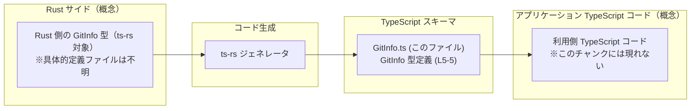
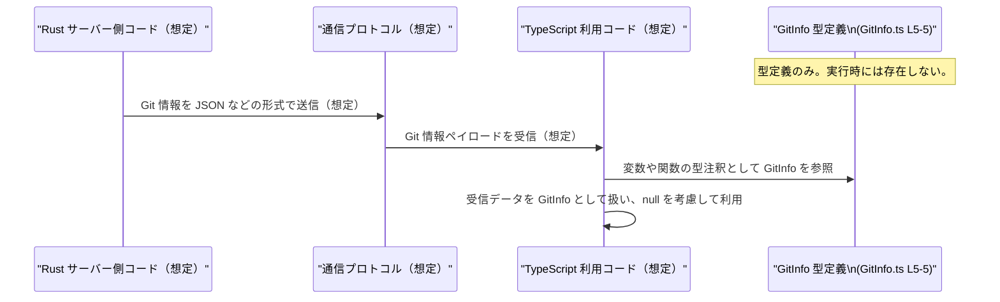

# app-server-protocol/schema/typescript/v2/GitInfo.ts コード解説

## 0. ざっくり一言

- `GitInfo.ts` は、`GitInfo` という **1 つの公開型エイリアス**だけを定義する、自動生成された TypeScript スキーマファイルです（GitInfo.ts:L1-5）。
- `GitInfo` は `sha`, `branch`, `originUrl` という 3 つのプロパティを持つオブジェクト型で、それぞれ `string | null` 型として定義されています（GitInfo.ts:L5-5）。

---

## 1. このモジュールの役割

### 1.1 概要

- このモジュールは、`app-server-protocol` の TypeScript スキーマ定義（`schema/typescript/v2`）の一部として、自動生成された型 `GitInfo` を提供します（GitInfo.ts:L1-5）。
- 冒頭コメントから、このファイルは Rust から TypeScript 型を生成するツール **ts-rs** によって生成されており、直接の編集は想定されていません（GitInfo.ts:L1-3）。
- 命名とフィールド名から、Git リポジトリ由来の情報（コミット SHA、ブランチ名、リモート URL など）を表現するデータ構造として利用されることが想定されますが、具体的な用途はこのチャンクからは断定できません（GitInfo.ts:L5-5）。

### 1.2 アーキテクチャ内での位置づけ

- コメントより、このファイルは **ts-rs** によって Rust 側の型定義から生成された TypeScript 側の対応型です（GitInfo.ts:L1-3）。
- ファイルパスから、`app-server-protocol` における「v2 スキーマ」の TypeScript 表現の一部と位置づけられます（GitInfo.ts:L1-5）。
- 実際の Rust 側の元型や、この型を利用する他の TypeScript ファイルは、このチャンクには現れません。

想定されるコンポーネント間の関係を、あくまで概念図として示します（Rust 側や利用コードの具体的なファイル／関数名は不明です）。



### 1.3 設計上のポイント

- **自動生成コード**  
  - `// GENERATED CODE! DO NOT MODIFY BY HAND!` というコメントにより、人手による編集が前提とされていないことが明示されています（GitInfo.ts:L1-1）。
  - ts-rs により Rust 側の型を機械的に反映する役割に特化しており、ロジックは一切含みません（GitInfo.ts:L1-3, L5-5）。

- **型エイリアスによるオブジェクト型定義**  
  - `export type GitInfo = { ... }` という形式で、構造を持つオブジェクト型を表現しています（GitInfo.ts:L5-5）。
  - クラスやインターフェースではなく、**型エイリアス**として定義されているため、純粋なデータ構造として扱われます。

- **nullable プロパティ**  
  - 各プロパティが `string | null` となっており、「プロパティは必ず存在するが、値として `null` を取りうる」という契約になっています（GitInfo.ts:L5-5）。
  - これは `prop?: string`（プロパティ自体が存在しないかもしれない）とは異なる設計です。利用側では **null チェック**が必須です。

- **エラー処理・並行性**  
  - 関数やメソッドが一切定義されていないため、このファイル単体には **実行時エラーや並行処理に関するロジックは存在しません**（GitInfo.ts:L1-5）。
  - 型チェックはコンパイル時に行われ、ランタイムの挙動はこのファイル外のコードに依存します。

---

## 2. 主要な機能一覧（コンポーネントインベントリー）

このファイルに存在する「コンポーネント」を一覧化します。

- 型定義
  - `GitInfo`: `sha`, `branch`, `originUrl` の 3 プロパティを持つオブジェクト型（GitInfo.ts:L5-5）。
- 関数・クラス・定数
  - このチャンクには **関数・クラス・定数定義は存在しません**（GitInfo.ts:L1-5）。

---

## 3. 公開 API と詳細解説

### 3.1 型一覧（構造体・列挙体など）

このファイルが外部に公開している主要な型は 1 つです。

| 名前 | 種別 | フィールド | 役割 / 用途 | 定義位置 |
|------|------|-----------|-------------|----------|
| `GitInfo` | 型エイリアス（オブジェクト型） | `sha: string \| null`, `branch: string \| null`, `originUrl: string \| null` | 命名とフィールド名から、Git リポジトリに関する識別情報や URL をまとめて保持するためのデータ構造として利用されることが想定されます（用途自体はこのチャンクからは確定できません）。 | `GitInfo.ts:L5-5` |

#### フィールド詳細

- `sha: string | null`（GitInfo.ts:L5-5）  
  - 意味: 命名から、Git コミットの SHA ハッシュを表す文字列と推測されます。
  - 契約: プロパティ自体は常に存在しますが、値が `null` の場合があります。
- `branch: string | null`（GitInfo.ts:L5-5）  
  - 意味: 命名から、ブランチ名を表す文字列と推測されます。
  - 契約: 同上、`null` の可能性があります。
- `originUrl: string | null`（GitInfo.ts:L5-5）  
  - 意味: 命名から、リモートリポジトリ（origin）の URL を表す文字列と推測されます。
  - 契約: 同上、`null` の可能性があります。

> ※ フィールド名の意味付け（コミット SHA、ブランチ名、リモート URL）は命名に基づく推測であり、このチャンクだけからは機能要件としては確定できません。

##### 型システム上のポイント（TypeScript 固有）

- `string | null` は **ユニオン型** です。コンパイラは、`null` の可能性を考慮した型チェックを行います。
- `sha?: string` との違い  
  - `sha: string | null` は「プロパティは必ず存在するが、値が `null` かもしれない」。  
  - `sha?: string` は「プロパティ自体が存在しないかもしれない」。  
  - 本ファイルでは前者の設計になっています（GitInfo.ts:L5-5）。

### 3.2 関数詳細

- このファイルには、**公開・非公開を問わず関数定義が存在しません**（GitInfo.ts:L1-5）。  
  そのため、このセクションで詳細に解説すべき関数はありません。

### 3.3 その他の関数

- 補助的な関数やラッパー関数も定義されていません（GitInfo.ts:L1-5）。

---

## 4. データフロー

このファイル自体には実行時ロジックがありませんが、`GitInfo` 型がどのように利用されるかの典型的な流れの「一例」を、概念的なデータフローとして示します。

> ここでのサーバー側・通信処理は、ファイルパスや ts-rs の一般的な用途から想定した例であり、**実際の実装はこのチャンクには現れません**。

### 概念的なシーケンス



### 要点

- `GitInfo` は **コンパイル時の型情報**であり、ランタイムには存在しません（GitInfo.ts:L5-5）。
- 実際のデータの送受信や Git 情報の構築は、このファイル外（Rust や他の TypeScript コード）で行われます。
- `string | null` の設計により、利用側では各フィールドが `null` の場合を考慮した分岐を行う必要があります。

---

## 5. 使い方（How to Use）

### 5.1 基本的な使用方法

ここでは、`GitInfo` 型をどのように利用するかの基本的な例を示します。  
実際のインポートパスはプロジェクト構成に依存しますが、ここでは同ディレクトリからの相対インポートを仮定しています（パスは例示であり、このチャンクからは確定できません）。

```typescript
// GitInfo 型をインポートする（型のみ参照するので import type を使用）
// 実際のパスはプロジェクト構成により異なる
import type { GitInfo } from "./GitInfo";  // GitInfo.ts:L5-5 の型を参照

// GitInfo 型の値を作成する基本例
const currentGitInfo: GitInfo = {         // 3 つのプロパティは必須（null は許可）
    sha: "abc123def456",                  // コミット SHA を表す文字列（想定）
    branch: "main",                       // ブランチ名（想定）
    originUrl: "git@github.com:org/repo.git", // リモート URL（想定）
};

// null を利用した例（情報が取得できない場合など）
const unknownGitInfo: GitInfo = {         // プロパティ自体は必ず存在
    sha: null,                            // 値を取得できない場合は null を代入
    branch: null,                         // 同上
    originUrl: null,                      // 同上
};
```

このコードでは、`GitInfo` の 3 プロパティがすべて指定されていることがコンパイル時にチェックされます。  
値を省略すると TypeScript コンパイラがエラーを出します（`strictNullChecks` が有効な場合）。

### 5.2 よくある使用パターン

#### パターン 1: null を考慮した表示処理

```typescript
import type { GitInfo } from "./GitInfo"; // GitInfo.ts:L5-5

// Git 情報を人間向けの文字列に整形する関数の例
function formatGitInfo(info: GitInfo): string {          // GitInfo 型を受け取る
    const sha = info.sha !== null ? info.sha : "(unknown SHA)";          // null の場合に代替文字列
    const branch = info.branch !== null ? info.branch : "(no branch)";   // 同上
    const origin = info.originUrl !== null ? info.originUrl : "(no origin)"; // 同上

    return `sha=${sha}, branch=${branch}, origin=${origin}`;             // 文字列にまとめて返す
}
```

- 各フィールドが `string | null` であるため、`info.sha.toUpperCase()` のように **直接メソッドを呼ぶとコンパイルエラー**となり、null チェックを促してくれます。
- これは TypeScript の型安全性によるもので、実行前にエラーの可能性を検出できます。

#### パターン 2: 非同期 API からの取得（概念的な例）

```typescript
import type { GitInfo } from "./GitInfo"; // GitInfo.ts:L5-5

// GitInfo を返す非同期関数の例（実際の通信実装はこのファイルにはない）
async function fetchGitInfo(): Promise<GitInfo> {              // Promise<GitInfo> を返す
    const response = await fetch("/api/git-info");             // 任意のエンドポイント（例）
    const data = await response.json();                        // JSON を取得

    // ここで data が GitInfo 形状であることは実行時には保証されないため、
    // 必要に応じてバリデーションを行うことが推奨されます。
    return data as GitInfo;                                    // 開発者責任で型アサーション
}

async function showGitInfo() {                                 // 呼び出し側の例
    const info = await fetchGitInfo();                         // GitInfo を取得（想定）
    if (info.sha !== null) {                                   // null かどうかをチェック
        console.log("Current SHA:", info.sha);                 // sha を安全に利用
    } else {
        console.log("SHA information is not available");       // null 時のフォールバック
    }
}
```

> 上記の API エンドポイント名やレスポンス形式は**例示**であり、このチャンクには現れません。

### 5.3 よくある間違い

想定される誤用と、その修正例です。

```typescript
import type { GitInfo } from "./GitInfo";

// 誤り例: null を考慮せずにメソッドを呼び出している
function printShaWrong(info: GitInfo) {
    // console.log(info.sha.toUpperCase());  // コンパイルエラー（sha が null かもしれない）
}

// 正しい例: null チェックを行う
function printShaCorrect(info: GitInfo) {
    if (info.sha !== null) {                // null でないことを確認
        console.log(info.sha.toUpperCase()); // ここでは sha は string として扱える
    } else {
        console.log("SHA is not available"); // null の場合の処理
    }
}
```

その他のよくある誤解:

- `sha?: string` と同じだと思ってしまう  
  → 実際には `sha` プロパティは **必須** であり、値として `null` か文字列を取ります（GitInfo.ts:L5-5）。
- `strictNullChecks` を無効にした状態で利用し、実行時に `null` に対してメソッドを呼んでしまう  
  → 型安全性が低下するため、`strictNullChecks` を有効にしたうえでの利用が推奨されます（一般的な TypeScript のベストプラクティス）。

### 5.4 使用上の注意点（まとめ）

- **null 判定の徹底**  
  - 全プロパティが `string | null` であるため、利用時には **毎回 null を考慮した分岐**を書くか、ヘルパー関数を用意する必要があります（GitInfo.ts:L5-5）。
- **ランタイムの型保証はない**  
  - TypeScript の型はコンパイル時のみ有効であり、`fetch` のような外部データを `GitInfo` と見なす場合は、実行時バリデーションを別途用意する必要があります。
- **自動生成ファイルの直接編集禁止**  
  - コメントで「手動編集禁止」が明記されているため、プロパティ追加・削除・型変更は **Rust 側の元定義や ts-rs の設定を変更して再生成**するのが前提です（GitInfo.ts:L1-3）。

---

## 6. 変更の仕方（How to Modify）

### 6.1 新しい機能を追加する場合（新しいフィールドの追加など）

このファイルは ts-rs により自動生成されているため、**直接編集しても次回の生成で上書きされる可能性が高い**と考えられます（GitInfo.ts:L1-3）。

一般的な手順（このチャンクからは Rust 側ファイル名や生成コマンドは不明）:

1. **Rust 側の定義を変更する**  
   - ts-rs で出力される元となる Rust の型（おそらく `struct GitInfo` など）に、新しいフィールドを追加します。
   - 例（Rust 側のイメージ。実際の定義はこのチャンクには現れません）:
     - `new_field: Option<String>` のようなフィールドを追加すると、TypeScript 側ではおそらく `string | null` として出力されます。

2. **ts-rs による型生成を再実行する**  
   - プロジェクト固有のビルド／コード生成コマンドを実行し、`GitInfo.ts` を再生成します。
   - これにより、新フィールドが自動的に TypeScript 側にも反映されます。

3. **TypeScript 側の利用コードを更新する**  
   - 新しいフィールドを利用したり、null 判定を追加するなどの変更を行います。

**注意点**

- `schema/typescript/v2` というパスから、このディレクトリは「バージョン 2 のスキーマ」を表していると考えられますが、**実際のバージョニングポリシーはこのチャンクには現れません**。
- 後方互換性が必要な場合は、新しいフィールドを必須にするかどうか、Rust 側と TypeScript 側の両方で慎重に検討する必要があります。

### 6.2 既存の機能を変更する場合（フィールドの型や意味の変更）

1. **変更の影響範囲の把握**
   - `GitInfo` 型を参照している TypeScript コード（関数の引数・戻り値・変数など）を検索し、どこでどのように使われているかを確認する必要があります。
   - このチャンクには利用箇所が現れないため、プロジェクト全体での検索が前提になります。

2. **契約の明確化**
   - 例えば `sha: string | null` を `sha: string` に変更すると、「必ず取得可能」という意味になります。
   - Rust 側で `Option<String>` から `String` に変更するなど、サーバー・クライアント双方で契約を揃える必要があります。

3. **テストの更新**
   - Git 情報を扱う機能があれば、そのテストで `GitInfo` 型の変更を反映する必要があります。
   - テストコードの具体的な場所は、このチャンクには現れません。

4. **直接編集を避ける**
   - あくまで Rust 側 + ts-rs での再生成を通じて変更することが推奨されます（GitInfo.ts:L1-3）。

---

## 7. 関連ファイル

このチャンクから確実に分かる関連ファイルは以下の通りです。

| パス | 役割 / 関係 |
|------|------------|
| `app-server-protocol/schema/typescript/v2/GitInfo.ts` | 本ドキュメントで解説している TypeScript 型定義ファイル。`GitInfo` 型エイリアスを 1 つだけ公開します（GitInfo.ts:L5-5）。 |

- 同じディレクトリ内に他のスキーマファイル（例: 他の型を定義する `.ts` ファイル）が存在する可能性はありますが、**このチャンクには現れないため、その有無や内容は不明です**。
- Rust 側の元定義ファイル（ts-rs の対象となる型）は存在すると考えられますが、具体的なパスやモジュール名はこのチャンクからは読み取れません。

---

### 付記: バグ・セキュリティ・エッジケースの観点（この型に起因しうるもの）

- **バグの潜在要因**
  - `string | null` を正しく扱わずに null 参照を起こすバグが発生する可能性があります。
  - `strictNullChecks` 無効時にはコンパイル時に検出されず、実行時エラーとなりやすい点に注意が必要です。

- **セキュリティ上の注意（利用側の一般論）**
  - `originUrl` を HTML に埋め込む場合、XSS（クロスサイトスクリプティング）などの攻撃ベクトルになりうるため、適切なエスケープが必要です。
  - これは `GitInfo` 型に固有というより、「URL や外部由来の文字列を UI やログに出力する際の一般的な注意点」です。

- **エッジケース**
  - 全フィールドが `null` の `GitInfo` が渡されるケース（Git 情報が取得できない環境など）が想定されますが、その扱い（UI での表示方法やログ出力方針など）はこのチャンクからは分かりません。
  - 利用側で「全 null の場合のデフォルト表示」などを決めておくと、扱いが明確になります。
