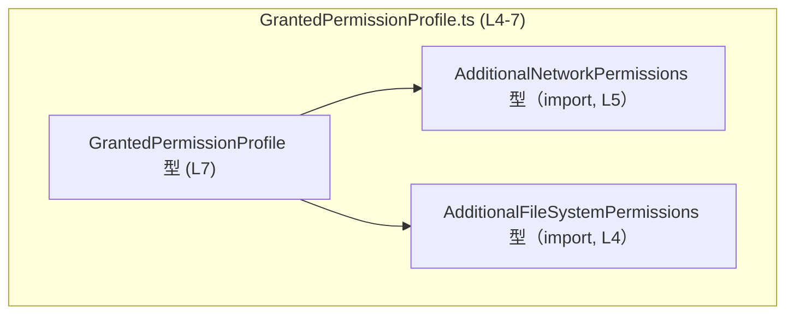
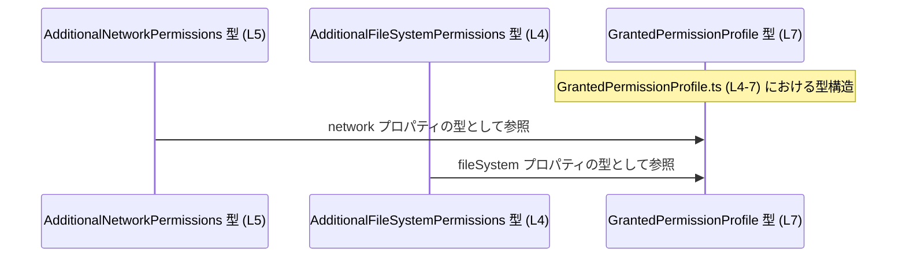

# app-server-protocol/schema/typescript/v2/GrantedPermissionProfile.ts コード解説

## 0. ざっくり一言

`GrantedPermissionProfile.ts` は、追加のネットワーク権限とファイルシステム権限をまとめて表現する **権限プロファイルの型定義** を提供する、ts-rs 生成の TypeScript ファイルです（`GrantedPermissionProfile.ts:L1-3,7`）。

---

## 1. このモジュールの役割

### 1.1 概要

- このモジュールは、Rust 側から ts-rs により生成された **権限設定のスキーマ表現** を TypeScript 型として提供します（`GrantedPermissionProfile.ts:L1-3`）。
- `GrantedPermissionProfile` 型は、  
  - `network`（追加ネットワーク権限）  
  - `fileSystem`（追加ファイルシステム権限）  
 という 2 つのオプショナルなプロパティを持つオブジェクト型です（`GrantedPermissionProfile.ts:L7`）。
- これにより、アプリケーションの他の部分で、権限構成の型安全な取り扱いが可能になります（型定義のみで実行時ロジックは含まれません）。

### 1.2 アーキテクチャ内での位置づけ

このモジュールは、2 つの外部の権限型に **型レベルで依存** しています。

- `AdditionalFileSystemPermissions` を型としてインポート（`GrantedPermissionProfile.ts:L4`）
- `AdditionalNetworkPermissions` を型としてインポート（`GrantedPermissionProfile.ts:L5`）
- それらをプロパティ型として利用した `GrantedPermissionProfile` をエクスポート（`GrantedPermissionProfile.ts:L7`）

以下は、このファイル内の型依存関係を表す Mermaid 図です（`GrantedPermissionProfile.ts:L4-7` を対象）。



※ `AdditionalNetworkPermissions` と `AdditionalFileSystemPermissions` の中身の定義は、このチャンクには現れません。

### 1.3 設計上のポイント

- **コード生成ファイル**  
  - 冒頭のコメントで「GENERATED CODE」「Do not edit this file manually」と明記されており、ts-rs による自動生成物であることが示されています（`GrantedPermissionProfile.ts:L1-3`）。
- **型専用インポート**  
  - `import type {...}` を使用しており、インポートはコンパイル時の型チェック専用で、実行時には削除されます（`GrantedPermissionProfile.ts:L4-5`）。  
    → 実行時バンドルへの影響を避けつつ、静的型安全性を確保する設計です。
- **オプショナルプロパティ**  
  - `network?` / `fileSystem?` として定義されており、権限プロファイルにおいて該当する種別の権限が存在しない状態も表現できます（`GrantedPermissionProfile.ts:L7`）。
- **状態やロジックを持たない純粋なスキーマ**  
  - 関数やクラス、実行コードは一切なく、オブジェクトの構造を表す型のみが定義されています（`GrantedPermissionProfile.ts:L1-7`）。  
    → 並行性・エラー処理・パフォーマンスに関する実行時の振る舞いは、このファイル単体からは発生しません。

---

## 2. 主要な機能一覧

このファイルは「機能」というより **型スキーマ** を 1 つ提供します。

- `GrantedPermissionProfile`: 追加のネットワーク権限とファイルシステム権限をまとめて表現する権限プロファイル型（`GrantedPermissionProfile.ts:L7`）。
  - `network` プロパティ: 追加ネットワーク権限を表すオプショナルなフィールド（`GrantedPermissionProfile.ts:L7`）。
  - `fileSystem` プロパティ: 追加ファイルシステム権限を表すオプショナルなフィールド（`GrantedPermissionProfile.ts:L7`）。

---

## 3. 公開 API と詳細解説

### 3.1 型一覧（構造体・列挙体など）

#### このファイルがエクスポートする型

| 名前                      | 種別                         | 役割 / 用途                                                                                           | 定義位置                          |
|---------------------------|------------------------------|--------------------------------------------------------------------------------------------------------|-----------------------------------|
| `GrantedPermissionProfile` | 型エイリアス（オブジェクト型） | 付与された権限プロファイルの構造を表す。ネットワークとファイルシステムの追加権限設定を保持するためのコンテナ。 | `GrantedPermissionProfile.ts:L7` |

#### 依存する外部型（このファイルからは再エクスポートされない）

| 名前                           | 種別           | 役割 / 関係                                                                                                   | 出現位置                          | 備考 |
|--------------------------------|----------------|--------------------------------------------------------------------------------------------------------------|-----------------------------------|------|
| `AdditionalFileSystemPermissions` | 型（詳細不明） | `GrantedPermissionProfile.fileSystem` プロパティの型として利用される（ファイルシステム権限の詳細を表すと推測されるが内容は不明） | `GrantedPermissionProfile.ts:L4` | 定義は別ファイル。 |
| `AdditionalNetworkPermissions`    | 型（詳細不明） | `GrantedPermissionProfile.network` プロパティの型として利用される（ネットワーク権限の詳細を表すと推測されるが内容は不明）     | `GrantedPermissionProfile.ts:L5` | 定義は別ファイル。 |

> 備考の「〜と推測される」は型名からの一般的な推測であり、実際のフィールド構造はこのチャンクからは分かりません。

#### `GrantedPermissionProfile` の詳細

**概要**

- `GrantedPermissionProfile` は、以下の 2 つのオプショナルプロパティを持つオブジェクト型です（`GrantedPermissionProfile.ts:L7`）。
  - `network?: AdditionalNetworkPermissions`
  - `fileSystem?: AdditionalFileSystemPermissions`
- いずれのプロパティも存在しない `{}` のようなオブジェクトも、この型としては許容されます（両方 `?` であるため / `GrantedPermissionProfile.ts:L7`）。  
  このようなケースの意味（「権限なし」など）は、このファイルからは分かりません。

**フィールド**

| フィールド名   | 型                            | 必須/任意      | 説明                                                                                                         | 定義位置                          |
|----------------|-------------------------------|----------------|--------------------------------------------------------------------------------------------------------------|-----------------------------------|
| `network`      | `AdditionalNetworkPermissions` | 任意（`?`付き） | ネットワーク関連の追加権限設定を格納するプロパティ。存在しない場合はネットワーク権限が指定されていない状態を表現可能。 | `GrantedPermissionProfile.ts:L7` |
| `fileSystem`   | `AdditionalFileSystemPermissions` | 任意（`?`付き） | ファイルシステム関連の追加権限設定を格納するプロパティ。存在しない場合はファイル権限が指定されていない状態を表現可能。 | `GrantedPermissionProfile.ts:L7` |

**Edge cases（エッジケース）**

この型定義から読み取れる代表的なエッジケースは次のとおりです（すべて `GrantedPermissionProfile.ts:L7` に基づきます）。

- `network` も `fileSystem` も未指定のオブジェクト  
  - 例: `{}` は `GrantedPermissionProfile` として型的に有効です。
  - その意味（完全に権限なし / デフォルト権限にフォールバック など）は、コードからは分かりません。
- `network` のみ指定されたオブジェクト  
  - 例: `{ network: /* AdditionalNetworkPermissions */ }`  
    → ネットワーク権限のみ追加されている状態を表現可能です。
- `fileSystem` のみ指定されたオブジェクト  
  - 例: `{ fileSystem: /* AdditionalFileSystemPermissions */ }`
- 追加プロパティの存在  
  - TypeScript の構造的型システムと「余剰プロパティチェック」の仕様により、変数代入/関数引数のコンテキストによっては、`GrantedPermissionProfile` に定義されていない追加プロパティを持つオブジェクトも実行時には存在しえます。  
    ただし、そのような余剰プロパティの扱いは、このファイル単体では規定していません。

**使用上の注意点**

- `network` / `fileSystem` はいずれも **オプショナル** であり、コード側で利用する際には `undefined` チェックを行う必要があります。  
  チェックを怠ると、`undefined` に対してプロパティアクセスするなどのランタイムエラーが発生しうる可能性があります。
- このファイルは **型定義のみ** であり、実際の権限検証や OS レベルのアクセス制御は一切行いません。  
  セキュリティ上の保証はこの型だけでは成立せず、権限チェックの実装側で適切に利用する必要があります。
- コメントで「Do not edit this file manually」とあるため（`GrantedPermissionProfile.ts:L1-3`）、  
  型の形を変更したい場合は、ts-rs が生成元とする Rust 側の型定義を変更し、再生成するのが前提と考えられます。  
  （生成元 Rust 型の具体的な場所はこのチャンクからは分かりません。）

### 3.2 関数詳細

- このファイルには、関数・メソッドは一切定義されていません（`GrantedPermissionProfile.ts:L1-7`）。  
  したがって、ここで詳細を記述すべき公開関数 API は存在しません。

### 3.3 その他の関数

- 補助関数やラッパー関数も定義されていません（`GrantedPermissionProfile.ts:L1-7`）。

---

## 4. データフロー

このファイルには実行時処理はありませんが、**型レベルのデータ構造の流れ**（どの型がどの型の一部として使われているか）を整理します。

- `GrantedPermissionProfile` は、`AdditionalNetworkPermissions` と `AdditionalFileSystemPermissions` の 2 つの型を **プロパティ型として内包** しています（`GrantedPermissionProfile.ts:L4-5,7`）。
- これを型レベルの「データフロー」として表すと、下図のように、2 つの権限型が `GrantedPermissionProfile` というコンテナ型に集約される構造になります。



この図は、あくまで **型依存関係の可視化** であり、実際にどのような関数やサービスが `GrantedPermissionProfile` を受け渡しするかといったアプリケーションレベルの処理フローは、このチャンクには現れません。

---

## 5. 使い方（How to Use）

> 注: ここで示すコード例は、`GrantedPermissionProfile` 型の一般的な利用方法を説明するためのものであり、実際にこのリポジトリに同名の関数やモジュールが存在することを示すものではありません。

### 5.1 基本的な使用方法

`GrantedPermissionProfile` は、権限構成を受け渡しする関数や設定オブジェクトの型として利用できます。

```typescript
// GrantedPermissionProfile 型をインポートする（パスはこのファイルと同階層を想定）
// 実際のパスはプロジェクト構成に依存するため、この例では "./GrantedPermissionProfile" としている
import type { GrantedPermissionProfile } from "./GrantedPermissionProfile";  // 型専用インポート

// 権限プロファイルを受け取り、何らかの初期化を行う関数の例
function initWithPermissions(profile: GrantedPermissionProfile) {           // 引数に GrantedPermissionProfile 型を指定
    // ネットワーク権限が指定されている場合のみ、ネットワーク関連の設定を行う
    if (profile.network) {                                                 // network はオプショナルなので存在チェックを行う
        // ここで profile.network を使ったネットワーク権限の適用処理を書く                         // 具体的なフィールドはこのチャンクからは不明
    }

    // ファイルシステム権限が指定されている場合のみ、ファイル関連の設定を行う
    if (profile.fileSystem) {                                              // fileSystem もオプショナルなので存在チェックを行う
        // ここで profile.fileSystem を使ったファイル権限の適用処理を書く                         // 具体的なフィールドは不明
    }
}

// GrantedPermissionProfile 型の値を作る例
const profile: GrantedPermissionProfile = {                                // 2 つのプロパティはいずれもオプショナル
    // network: ...                                                        // ネットワーク権限を指定したい場合に設定（型は AdditionalNetworkPermissions）
    // fileSystem: ...                                                     // ファイル権限を指定したい場合に設定（型は AdditionalFileSystemPermissions）
};

// 定義したプロファイルを関数に渡す
initWithPermissions(profile);                                              // 型チェックにより、profile の構造が検査される
```

このように、**オプショナルプロパティであることを前提に `undefined` チェックをしてから利用**することが重要です。

### 5.2 よくある使用パターン

#### パターン 1: 片方の権限だけを指定する

```typescript
import type { GrantedPermissionProfile } from "./GrantedPermissionProfile";  // 型をインポート

// ネットワーク権限のみを指定したプロファイルを構築する例
const networkOnlyProfile: GrantedPermissionProfile = {                      // GrantedPermissionProfile 型のオブジェクト
    // network: ...                                                         // ネットワーク権限（AdditionalNetworkPermissions 型）を設定
    // fileSystem は未指定                                                 // 省略しても型的に許容される（オプショナル）
};

// ファイルシステム権限のみを指定したプロファイルの例
const fsOnlyProfile: GrantedPermissionProfile = {                           // GrantedPermissionProfile 型の別の例
    // fileSystem: ...                                                      // ファイルシステム権限（AdditionalFileSystemPermissions 型）を設定
    // network は未指定                                                    // 省略可能
};
```

#### パターン 2: 権限が全くない／未指定のプロファイル

```typescript
import type { GrantedPermissionProfile } from "./GrantedPermissionProfile";  // 型をインポート

// 権限を明示的に一切指定しないプロファイル
const emptyProfile: GrantedPermissionProfile = {};                          // network, fileSystem ともに未指定だが型的に有効
```

`emptyProfile` の意味（「完全に禁止」「デフォルト権限」「まだ設定されていないだけ」など）は、  
この型定義からは読み取れません。利用側の仕様・ドキュメントを確認する必要があります。

### 5.3 よくある間違い

#### 間違い例: オプショナルプロパティを未チェックで使用する

```typescript
import type { GrantedPermissionProfile } from "./GrantedPermissionProfile"; // 型をインポート

const profile: GrantedPermissionProfile = {};                               // network / fileSystem を省略したオブジェクト

// 間違い例: network が必ずあると決め打ちして非 null アサーションを使う
console.log(profile.network!.toString());                                   // コンパイルは通るが、実行時には undefined.toString() でエラーになる可能性がある
```

#### 正しい例: `undefined` をチェックしてから使う

```typescript
import type { GrantedPermissionProfile } from "./GrantedPermissionProfile"; // 型をインポート

const profile: GrantedPermissionProfile = {};                               // network / fileSystem が未指定の例

if (profile.network) {                                                      // network が定義されている場合のみ処理する
    console.log(profile.network);                                           // ここでは profile.network は undefined ではないと推論される
} else {
    // ネットワーク権限がない場合の処理を書く                               // 例: デフォルト動作、エラー、スキップなど
}
```

### 5.4 使用上の注意点（まとめ）

- `network` / `fileSystem` はオプショナルであり、**存在チェックなしに利用しないこと**。
- この型は単なるスキーマであり、**実行時の権限チェックや OS レベルの保護は行わない**ことを理解して利用する必要があります。
- `import type` によるインポートであるため（`GrantedPermissionProfile.ts:L4-5`）、  
  実行環境における依存関係は発生せず、型情報はコンパイル時にのみ存在します。  
  そのため、ランタイムで型情報を利用したリフレクションのような用途には使えません。
- 並行性（マルチスレッド・非同期処理）に関する安全性は、この型定義自体とは無関係です。  
  実際の処理実装側で適切な同期・エラーハンドリングを行う必要があります。

---

## 6. 変更の仕方（How to Modify）

### 6.1 新しい機能を追加する場合

このファイルは ts-rs による **生成コード** であり、コメントで手動編集しないよう明示されています（`GrantedPermissionProfile.ts:L1-3`）。  
したがって、権限プロファイルに新しい要素（例: 「プロセス権限」など）を追加したい場合は、一般に次のような手順が必要になります。

1. **生成元の Rust 型を特定する**  
   - `ts-rs` によりこの TypeScript 型が生成されているため、Rust 側に対応する型（構造体など）が存在するはずですが、そのファイル位置・名称はこのチャンクからは分かりません。
2. **Rust 側の型に新しいフィールドを追加する**  
   - 例: `process: AdditionalProcessPermissions` のようなフィールドを Rust の型に追加（名前は例示であり、実在は不明）。
3. **ts-rs によるコード生成を再実行する**  
   - プロジェクトのビルド／生成スクリプトに従って TypeScript スキーマを再生成する。
4. **TypeScript 側の利用コードを更新する**  
   - 新しいプロパティを利用した処理を追加したり、既存コードにおける `switch` / `if` などの分岐を更新する。

このファイル自体を直接編集すると、次回の自動生成で上書きされる可能性があります。

### 6.2 既存の機能を変更する場合

`GrantedPermissionProfile` の既存プロパティ（`network` / `fileSystem`）の型や必須性を変更したい場合も、基本的な考え方は同じです。

- **影響範囲の確認**
  - `GrantedPermissionProfile` 型を利用しているすべての TypeScript コードに影響が及びます。
  - どのファイルがこの型を使っているかは、このチャンクでは分からないため、IDE の参照検索などが必要になります。
- **注意すべき契約（前提条件）**
  - 現状、`network` / `fileSystem` はオプショナルであることが型契約の一部です（`GrantedPermissionProfile.ts:L7`）。
  - これを必須に変えると、`GrantedPermissionProfile` を引数や変数型として利用しているコードでコンパイルエラーが発生します。
- **テストの再確認**
  - このファイルにはテストコードは含まれていません（`GrantedPermissionProfile.ts:L1-7`）。
  - 変更に伴い、権限関連のユースケースを扱うテスト（存在する場合）を更新し、再実行する必要があります。

---

## 7. 関連ファイル

このファイルと密接に関係するモジュールは、インポートされている 2 つの型です。

| パス / モジュール指定                     | 役割 / 関係                                                                                                   |
|------------------------------------------|--------------------------------------------------------------------------------------------------------------|
| `"./AdditionalFileSystemPermissions"`    | `AdditionalFileSystemPermissions` 型を提供するモジュール。`GrantedPermissionProfile.fileSystem` の型として利用される（`GrantedPermissionProfile.ts:L4,7`）。定義内容はこのチャンクには現れません。 |
| `"./AdditionalNetworkPermissions"`       | `AdditionalNetworkPermissions` 型を提供するモジュール。`GrantedPermissionProfile.network` の型として利用される（`GrantedPermissionProfile.ts:L5,7`）。定義内容はこのチャンクには現れません。 |

> 拡張子（`.ts`, `.d.ts` など）はインポート文からは直接分かりませんが、TypeScript の一般的な解決規則に従い、同名のソース/型定義ファイルが存在すると考えられます。

---

### 付記: バグ・セキュリティ・性能の観点（このファイル単体から分かる範囲）

- **バグの潜在箇所（利用側）**
  - `network` / `fileSystem` を `undefined` チェックせずに利用するとランタイムエラーを招く可能性があります（オプショナルであるため / `GrantedPermissionProfile.ts:L7`）。
- **セキュリティ**
  - この型は構造を表すだけで、実際の権限制御は別の実装に依存します。  
    型を正しく使っていても、権限チェック実装に問題があるとセキュリティホールになりえます。
- **性能・スケーラビリティ**
  - 型定義ファイルであり、実行時コストはありません（`import type` である点も含め / `GrantedPermissionProfile.ts:L4-5`）。  
    性能・スケーラビリティへの影響は、この型を利用する実処理側のコードに依存します。
- **観測性（ログ・メトリクス）**
  - このファイル自体にはロギングやメトリクス出力は存在しません（`GrantedPermissionProfile.ts:L1-7`）。
