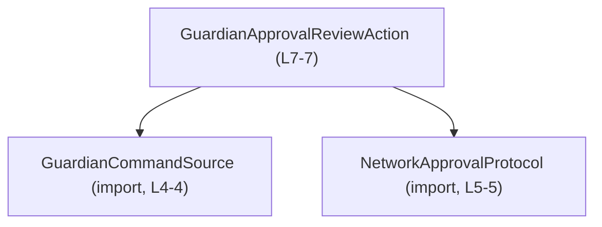
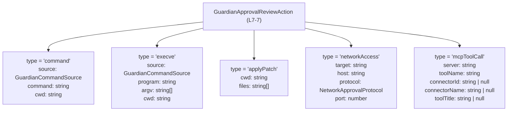
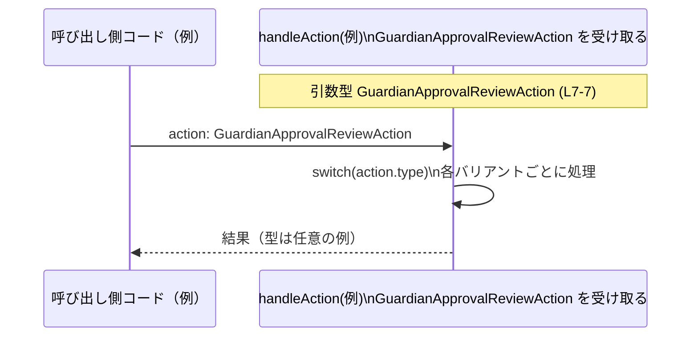

# app-server-protocol/schema/typescript/v2/GuardianApprovalReviewAction.ts

---

## 0. ざっくり一言

`GuardianApprovalReviewAction` 型は、`type` プロパティで区別される 5 種類のアクションオブジェクトを 1 つの **discriminated union（識別共用体）** として表現する、自動生成された TypeScript のスキーマ定義です（`GuardianApprovalReviewAction.ts:L1-3,7-7`）。

---

## 1. このモジュールの役割

### 1.1 概要

- このモジュールは、`GuardianApprovalReviewAction` という **型エイリアス**を 1 つだけ公開しています（`GuardianApprovalReviewAction.ts:L7-7`）。
- この型は 5 種類のオブジェクト型の union で、それぞれ `"type"` という string リテラルプロパティで区別される **discriminated union** になっています（`GuardianApprovalReviewAction.ts:L7-7`）。
- ファイル冒頭のコメントから、この型定義は `ts-rs` というツールにより自動生成され、手で編集しないことが明示されています（`GuardianApprovalReviewAction.ts:L1-3`）。

### 1.2 アーキテクチャ内での位置づけ

- このモジュールは、他の 2 つの型 `GuardianCommandSource` と `NetworkApprovalProtocol` に依存しています（`GuardianApprovalReviewAction.ts:L4-5`）。
- 逆方向（どこからこの型が使われているか）は、このチャンクからは分かりません（呼び出し側は不明）。

依存関係を簡略図にすると次のようになります。



### 1.3 設計上のポイント

- **自動生成コード**  
  - 先頭コメントで「GENERATED CODE」「Do not edit this file manually」と明示されています（`GuardianApprovalReviewAction.ts:L1-3`）。
- **discriminated union による型安全性**  
  - すべてのバリアントが `"type"` プロパティを持ち、その値が `"command" | "execve" | "applyPatch" | "networkAccess" | "mcpToolCall"` のいずれかに固定されています（`GuardianApprovalReviewAction.ts:L7-7`）。
  - これにより、`switch(action.type)` のような分岐で TypeScript が各バリアントのプロパティ型を自動で絞り込める設計になっています。
- **共通フィールドとバリアント固有フィールドの分離**  
  - 一部のバリアントは共通に `cwd: string` を持ちますが（`"command"`, `"execve"`, `"applyPatch"`）、他は持ちません（`"networkAccess"`, `"mcpToolCall"`）。型レベルでその違いが表現されています（`GuardianApprovalReviewAction.ts:L7-7`）。
- **外部定義型の利用**  
  - 実行元情報などと思われる `GuardianCommandSource` や、ネットワークプロトコル種別と思われる `NetworkApprovalProtocol` は別ファイルの型に委譲されており、このファイルには定義が現れません（`GuardianApprovalReviewAction.ts:L4-5,7-7`）。

---

## 2. 主要な機能一覧

このファイルは実行ロジックを持たず、「データ構造（型）」のみを提供します。その主要な役割は次の 1 点です（すべて `GuardianApprovalReviewAction.ts:L7-7`）。

- `GuardianApprovalReviewAction`:
  - 5 種類のアクションオブジェクトを表す discriminated union 型
    - `"command"` バリアント:  
      `{ type: "command"; source: GuardianCommandSource; command: string; cwd: string }`
    - `"execve"` バリアント:  
      `{ type: "execve"; source: GuardianCommandSource; program: string; argv: string[]; cwd: string }`
    - `"applyPatch"` バリアント:  
      `{ type: "applyPatch"; cwd: string; files: string[] }`
    - `"networkAccess"` バリアント:  
      `{ type: "networkAccess"; target: string; host: string; protocol: NetworkApprovalProtocol; port: number }`
    - `"mcpToolCall"` バリアント:  
      `{ type: "mcpToolCall"; server: string; toolName: string; connectorId: string | null; connectorName: string | null; toolTitle: string | null }`

---

## 3. 公開 API と詳細解説

### 3.1 型一覧（構造体・列挙体など）

#### 型インベントリー

| 名前                         | 種別          | 役割 / 用途                                                                 | 定義/使用箇所 |
|------------------------------|---------------|-------------------------------------------------------------------------------|----------------|
| `GuardianApprovalReviewAction` | 型エイリアス（union） | 5 種類のアクションオブジェクトを 1 つの discriminated union として表現する | `GuardianApprovalReviewAction.ts:L7-7` |

#### 外部依存型（このファイルでは定義されないもの）

| 名前                    | 種別        | 役割 / 用途                              | 定義状況 |
|-------------------------|-------------|-------------------------------------------|----------|
| `GuardianCommandSource` | import 型   | `"command"` / `"execve"` バリアントの `source` プロパティの型 | このチャンクには定義が現れない（`GuardianApprovalReviewAction.ts:L4-4,7-7`） |
| `NetworkApprovalProtocol` | import 型 | `"networkAccess"` バリアントの `protocol` プロパティの型 | このチャンクには定義が現れない（`GuardianApprovalReviewAction.ts:L5-5,7-7`） |

### 3.2 関数詳細（最大 7 件）

- このファイルには関数・メソッドが 1 つも定義されていません（`GuardianApprovalReviewAction.ts:L1-7`）。
- したがって、関数詳細テンプレートに沿って説明すべき対象はありません。

### 3.3 その他の関数

- 補助関数・ラッパー関数も定義されていません（`GuardianApprovalReviewAction.ts:L1-7`）。

---

## 4. データフロー

このファイル単体には処理ロジックはありませんが、`GuardianApprovalReviewAction` 内部での「`type` による構造の分岐」をデータフロー的に表すと次のようになります（`GuardianApprovalReviewAction.ts:L7-7`）。



- 1 つの変数 `action: GuardianApprovalReviewAction` は、実際には上記 5 通りのいずれかの形を取り得ます（`GuardianApprovalReviewAction.ts:L7-7`）。
- 実際の呼び出しコード側では、`action.type` の値に応じてそれぞれのフィールドを利用することになりますが、そのコードはこのチャンクには現れません。

### 4.1 典型的な利用シナリオ（イメージ）

以下は、この型を引数に取る外部コードの **例** であり、このリポジトリに存在するとは限りません。`GuardianApprovalReviewAction` の discriminated union と TypeScript の型安全性を示すためのものです。



---

## 5. 使い方（How to Use）

### 5.1 基本的な使用方法（例）

`GuardianApprovalReviewAction` を利用する典型的なコード例（このファイル外の仮想コード）です。`type` による分岐により、各バリアントのプロパティが安全に利用できます。

```typescript
// 仮想ファイル: handler.ts
import type {
    GuardianApprovalReviewAction,         // このファイルの公開型（L7-7）
} from "./GuardianApprovalReviewAction";

function handleAction(action: GuardianApprovalReviewAction) {  // 引数型に union を使用
    switch (action.type) {                                     // "type" で分岐することで
        case "command":
            // ここでは action は { type: "command"; source; command; cwd } に絞り込まれる
            console.log("command:", action.command);           // string 型として利用可能
            console.log("cwd:", action.cwd);                   // string 型
            // action.source は GuardianCommandSource 型（詳細はこのチャンクには現れない）
            break;

        case "execve":
            // ここでは action は execve バリアントに絞り込まれる
            console.log("program:", action.program);           // string
            console.log("argv:", action.argv.join(" "));       // string[]
            break;

        case "applyPatch":
            console.log("cwd:", action.cwd);                   // string
            console.log("files:", action.files);               // string[]
            break;

        case "networkAccess":
            console.log("target:", action.target);             // string
            console.log("host:", action.host);                 // string
            console.log("port:", action.port);                 // number
            // action.protocol は NetworkApprovalProtocol 型
            break;

        case "mcpToolCall":
            console.log("server:", action.server);             // string
            console.log("toolName:", action.toolName);         // string
            // 以下は null の可能性があるので null チェックが必要
            if (action.connectorId !== null) {
                console.log("connectorId:", action.connectorId);
            }
            break;
    }
}
```

この例から分かる TypeScript 特有のポイント:

- `type` が string リテラルで固定されているため、`switch` 文で **型の絞り込み（narrowing）** が自動的に行われます。
- フィールドに `| null` が含まれる場合（`connectorId` など）、null チェックを行わないと `strictNullChecks` 下ではコンパイルエラーとなります（`GuardianApprovalReviewAction.ts:L7-7`）。

### 5.2 よくある使用パターン（例）

#### 1. オブジェクトリテラルでの生成

```typescript
import type { GuardianApprovalReviewAction } from "./GuardianApprovalReviewAction";

// "command" バリアントの値を作る例
const actionCommand: GuardianApprovalReviewAction = {
    type: "command",                         // リテラル "command"（L7-7）
    source: /* GuardianCommandSource 値 */,  // 別ファイル定義の型
    command: "echo hello",                   // string
    cwd: "/tmp",                             // string
};

// "networkAccess" バリアントの値を作る例
const netAction: GuardianApprovalReviewAction = {
    type: "networkAccess",
    target: "example",                       // string
    host: "example.com",                     // string
    protocol: /* NetworkApprovalProtocol 値 */,
    port: 443,                               // number
};
```

- `type` の値とその他のプロパティの組み合わせが合っていないとコンパイルエラーになります（`GuardianApprovalReviewAction.ts:L7-7`）。

### 5.3 よくある間違い（想定される誤用と正しい例）

`GuardianApprovalReviewAction` の構造から想定される誤用例と、それに対する型安全な書き方です。

```typescript
import type { GuardianApprovalReviewAction } from "./GuardianApprovalReviewAction";

declare const action: GuardianApprovalReviewAction;

// ❌ 誤り例: バリアントを判定せずに特定プロパティへアクセスする
// console.log(action.command); // "networkAccess" バリアントなどでは存在しないプロパティ

// ✅ 正しい例: "type" でバリアントを判定してからアクセスする
if (action.type === "command") {
    console.log(action.command);   // このブロックでは command プロパティが存在することが保証される
}

// ❌ 誤り例: "mcpToolCall" バリアントで null 可能なプロパティをそのまま使う
// if (action.type === "mcpToolCall") {
//     console.log(action.connectorId.toUpperCase()); // connectorId は string | null なのでエラー
// }

// ✅ 正しい例: null チェックを行う
if (action.type === "mcpToolCall" && action.connectorId !== null) {
    console.log(action.connectorId.toUpperCase());
}
```

### 5.4 使用上の注意点（まとめ）

この型を利用する際の共通の注意点です（すべて `GuardianApprovalReviewAction.ts:L7-7` に基づく）。

- **`type` プロパティによる分岐が前提**
  - 各バリアント固有のプロパティ（`command`, `program`, `files`, `protocol`, `toolName` など）にアクセスする前に、`action.type` をチェックする必要があります。
- **null 可能なプロパティの扱い**
  - `"mcpToolCall"` バリアントの `connectorId`, `connectorName`, `toolTitle` は `string | null` です。使用時には null チェックが前提になります。
- **配列プロパティの中身**
  - `argv: string[]`, `files: string[]` は空配列も許容される型であり、要素数に関する制約は型からは読み取れません。要素数に関する前提条件がある場合は、利用側で別途チェックが必要です。
- **セキュリティ / バリデーション**
  - この型定義は構造のみを表し、値の検証やサニタイズは行いません。どのような文字列が `command` や `host` に許されるかといったポリシーは、この型を利用するコード側の責任になります。
- **並行性**
  - このファイルには状態や非同期処理が存在しないため、並行性やスレッドセーフティに関する懸念は、この型単体からは生じません。

---

## 6. 変更の仕方（How to Modify）

### 6.1 新しい機能を追加する場合（新バリアントの追加など）

- ファイル先頭に「GENERATED CODE! DO NOT MODIFY BY HAND!」とあり（`GuardianApprovalReviewAction.ts:L1-3`）、この TypeScript ファイルを直接編集することは想定されていません。
- 新しいアクション種別を追加したい場合、通常は **生成元**（ts-rs による元定義）を変更し、このファイルを再生成する必要があります。生成元がどのファイルかは、このチャンクからは分かりません。
- 型の観点から見た変更ポイント（あくまで構造上の話）:
  - 新バリアントを追加すると、`GuardianApprovalReviewAction` の union に新しいオブジェクト型が 1 つ追加される形になります。
  - それに伴い、この型を `switch(action.type)` などで exhaustively に扱っている箇所は、コンパイラにより「未処理のケース」として検出されるようになる可能性があります（このファイル外の話であり、このチャンクには現れません）。

### 6.2 既存の機能を変更する場合

- 同様に、このファイルを直接編集するのではなく、生成元を変更する必要があります（`GuardianApprovalReviewAction.ts:L1-3`）。
- 型変更による影響の例（構造上の話）:
  - 既存バリアントからプロパティを削除・型変更すると、そのプロパティを利用している呼び出し側コードはコンパイルエラーになります。
  - `string | null` を `string` に変えるなどの変更は、null チェックの有無に関する前提を変化させるため、利用側のロジックにも影響します。
- このチャンクにはテストコードや利用箇所は現れないため、実際の影響範囲を把握するには、リポジトリ全体の参照を別途確認する必要があります。

---

## 7. 関連ファイル

このモジュールと密接に関係するファイル（このチャンクに明示的に登場するもの）は次の通りです。

| パス（相対）                    | 役割 / 関係                                                                 |
|--------------------------------|------------------------------------------------------------------------------|
| `./GuardianCommandSource`      | `GuardianCommandSource` 型を提供するモジュール。`source` プロパティの型として利用される（`GuardianApprovalReviewAction.ts:L4-4,7-7`）。定義内容はこのチャンクには現れない。 |
| `./NetworkApprovalProtocol`    | `NetworkApprovalProtocol` 型を提供するモジュール。`protocol` プロパティの型として利用される（`GuardianApprovalReviewAction.ts:L5-5,7-7`）。定義内容はこのチャンクには現れない。 |

このファイルに対応する生成元（ts-rs が参照する元定義ファイル）は、コメントから存在が示唆されますが、このチャンクにはパス等の情報は現れず、「不明」です。
