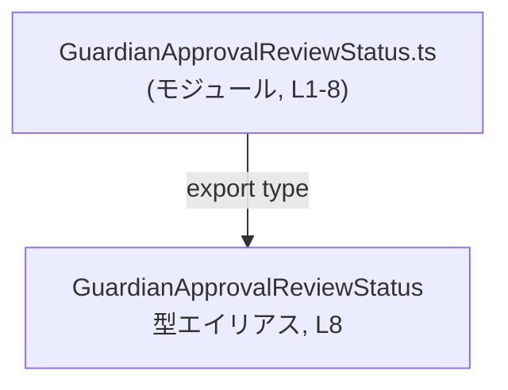

# app-server-protocol/schema/typescript/v2/GuardianApprovalReviewStatus.ts

## 0. ざっくり一言

guardian の承認レビューのライフサイクル状態を、5 つの文字列リテラルからなる TypeScript の型として定義する、スキーマ用の小さなモジュールです（自動生成コードであり、手動編集は想定されていません）。

---

## 1. このモジュールの役割

### 1.1 概要

- このモジュールは、guardian approval review（ガーディアン承認レビュー）のライフサイクル状態を表すための **文字列リテラルユニオン型** を 1 つだけ公開しています。  
  （`export type GuardianApprovalReviewStatus = ...`  
  — `GuardianApprovalReviewStatus.ts:L8-8`）
- 状態は `"inProgress"`, `"approved"`, `"denied"`, `"timedOut"`, `"aborted"` の 5 種類に限定されます（`GuardianApprovalReviewStatus.ts:L8-8`）。
- 先頭コメントと JSDoc により、このファイルはツールにより生成されており、かつ `[UNSTABLE]` とされる不安定な API であることが分かります（`GuardianApprovalReviewStatus.ts:L1-3,5-7`）。

### 1.2 アーキテクチャ内での位置づけ

このファイルは `schema/typescript/v2` 配下にあり、TypeScript から利用される **スキーマ定義用モジュール** として振る舞っています。

このチャンク内には `import` 文や他モジュールの参照が存在しないため、

- 依存先：なし（このファイルから他モジュールを参照していない）  
- 依存元：不明（どのモジュールがこの型を `import` しているかは、このチャンクには現れません）

と整理できます。

依存関係（このファイル内で完結する範囲）を Mermaid のグラフで表すと、次のようになります。



### 1.3 設計上のポイント

- **自動生成コード**  
  - 先頭コメントに `// GENERATED CODE! DO NOT MODIFY BY HAND!` と記載があります（`GuardianApprovalReviewStatus.ts:L1-1`）。  
  - また、`This file was generated by [ts-rs]` とあるため、ツールによる自動生成であることが明示されています（`GuardianApprovalReviewStatus.ts:L3-3`）。
- **型定義のみで、ロジックなし**  
  - 関数・クラス・変数などは一切定義されておらず、`export type` による型エイリアスのみを公開しています（`GuardianApprovalReviewStatus.ts:L8-8`）。
- **列挙的な状態表現**  
  - TypeScript の文字列リテラルユニオン型を用いて、状態を限定された 5 つの文字列に絞っています（`GuardianApprovalReviewStatus.ts:L8-8`）。
- **不安定（UNSTABLE）な API**  
  - JSDoc コメントに `[UNSTABLE] Lifecycle state for a guardian approval review.` とあり、この型はまだ変更される可能性があることが示唆されています（`GuardianApprovalReviewStatus.ts:L5-7`）。
- **状態管理の責務は持たない**  
  - 状態遷移やビジネスロジックは一切含まず、「どの値があり得るか」をコンパイル時に制約する役割に限られています。

---

## 2. 主要な機能一覧 / コンポーネントインベントリー

### 2.1 コンポーネントインベントリー（このチャンク）

このファイル内に現れる型・関数などのコンポーネント一覧です。

| 名前                          | 種別                          | 定義範囲           | 役割 / 用途                                                                 | 根拠 |
|-------------------------------|-------------------------------|--------------------|----------------------------------------------------------------------------|------|
| `GuardianApprovalReviewStatus` | 型エイリアス（文字列リテラルユニオン型） | L8-8              | guardian approval review のライフサイクル状態を、5 つの文字列からなる列挙的な型として表現する | `GuardianApprovalReviewStatus.ts:L5-8` |
| （なし）                      | 関数                          | —                  | このチャンクには関数定義は存在しません                                    | `GuardianApprovalReviewStatus.ts:L1-8` 全体から不在であることが分かる |

### 2.2 主要な機能（機能レベルの整理）

- guardian 承認レビュー状態の型定義  
  - `"inProgress"`, `"approved"`, `"denied"`, `"timedOut"`, `"aborted"` のいずれかであることを TypeScript の型レベルで保証する（`GuardianApprovalReviewStatus.ts:L8-8`）。
- API の契約表現  
  - この型を使うことで、「レビュー状態」というドメイン概念をコード上で明示し、自由な `string` と区別できる。

---

## 3. 公開 API と詳細解説

### 3.1 型一覧（構造体・列挙体など）

このファイルで公開されている主要な型は次の 1 つです。

| 名前 | 種別 | 役割 / 用途 | 根拠 |
|------|------|-------------|------|
| `GuardianApprovalReviewStatus` | 型エイリアス（文字列リテラルユニオン型） | guardian approval review のライフサイクル状態を表す。5 つの具体的な文字列値に限定し、型安全に状態を扱う。 | `GuardianApprovalReviewStatus.ts:L5-8` |

### 3.2 関数詳細（最大 7 件）

このファイルには **関数が 1 つも定義されていません**（`GuardianApprovalReviewStatus.ts:L1-8` に `function` / `=>` を伴う定義が存在しないことから分かります）。

代わりに、このモジュールの公開 API の中心である型 `GuardianApprovalReviewStatus` について、関数詳細テンプレートに近い形式で整理します。

#### `GuardianApprovalReviewStatus` （文字列リテラルユニオン型）

**概要**

- guardian approval review のライフサイクル状態を表すための型です（`GuardianApprovalReviewStatus.ts:L5-7`）。
- `"inProgress"`, `"approved"`, `"denied"`, `"timedOut"`, `"aborted"` の 5 ついずれかの文字列であることをコンパイル時に保証します（`GuardianApprovalReviewStatus.ts:L8-8`）。

**定義**

```typescript
// GuardianApprovalReviewStatus.ts:L8
export type GuardianApprovalReviewStatus =
    "inProgress" |
    "approved" |
    "denied" |
    "timedOut" |
    "aborted";
```

**各値の意味（名前から読み取れる範囲）**

コード内には各値の詳細説明はありませんが、英語名から次のような状態を表していると解釈できます（※名前からの解釈であり、厳密な仕様はこのチャンクからは分かりません）。

- `"inProgress"`: レビューが進行中の状態
- `"approved"`: レビューが承認された状態
- `"denied"`: レビューが拒否された状態
- `"timedOut"`: レビューがタイムアウトした状態
- `"aborted"`: レビューが中断（打ち切り）された状態

**戻り値 / 返り値に相当する情報**

- 関数ではないため「戻り値」はありませんが、この型を  
  - 関数の返り値型  
  - プロパティの型  
  として使うことで、「この位置には 5 つのいずれかの状態しか現れない」という契約を表現できます。

**内部処理の流れ（アルゴリズム）**

- この型は **実行時の処理やアルゴリズムを一切持ちません**。
- TypeScript の静的型付け機構によって、コンパイル時に  
  - `"inProgress" | "approved" | "denied" | "timedOut" | "aborted"` 以外の文字列が代入された場合に型エラーとなる  
  というチェックが行われます。

**Examples（使用例）**

1. 基本的な変数の型付け

```typescript
// GuardianApprovalReviewStatus 型の変数を宣言する
let status: GuardianApprovalReviewStatus = "inProgress"; // OK

// 他の許可された値への代入も OK
status = "approved";  // OK
status = "denied";    // OK
status = "timedOut";  // OK
status = "aborted";   // OK

// 許可されていない文字列はコンパイル時にエラー
// status = "pending"; // エラー: Type '"pending"' is not assignable ...
```

1. 関数の引数・戻り値に利用する例（定義例）

```typescript
// GuardianApprovalReviewStatus.ts 自体には含まれていない、利用側の例です。

// レビュー状態を受け取り、承認済みかどうか判定する関数の例
function isApproved(status: GuardianApprovalReviewStatus): boolean {
    return status === "approved"; // "approved" のときだけ true
}

// 利用例
const currentStatus: GuardianApprovalReviewStatus = "denied";
const approved = isApproved(currentStatus); // false
```

※この関数 `isApproved` はあくまで利用例であり、このファイルには実際には定義されていません。

**Errors / Panics**

- この型自体は **実行時のエラーや例外を発生させません**。  
  TypeScript の型定義であり、コンパイル後には JavaScript から消えるためです。
- しかし、次のような場合にはコンパイル時に型エラーが発生します。
  - 許可されていない文字列リテラルを代入した場合（例: `"pending"` を代入）  
  - `string` 型の値をそのまま `GuardianApprovalReviewStatus` に代入し、値が 5 つのいずれかであることが静的に分からない場合

**Edge cases（エッジケース）**

TypeScript の型システム上、次のようなケースで挙動が変わります。

- `null` / `undefined`  
  - `GuardianApprovalReviewStatus` には `null` や `undefined` は含まれていないため、  
    これらを代入すると型エラーになります。
- 大文字・小文字の違い  
  - `"approved"` と `"Approved"` は別の文字列として扱われます。  
    型に含まれているのは小文字の `"approved"` のみです（`GuardianApprovalReviewStatus.ts:L8-8`）。
- `any` 型経由の代入  
  - `any` 型を経由するとコンパイラのチェックが緩くなり、実行時に `"unknownStatus"` のような値が入り込む可能性があります。  
    これは TypeScript 全般の注意点であり、このファイルに特有の実装ではありません。

**使用上の注意点**

- **[UNSTABLE] の注意**  
  - JSDoc コメントに `[UNSTABLE]` とあるため、将来的に状態の種類が追加・変更・削除される可能性があります（`GuardianApprovalReviewStatus.ts:L5-7`）。  
    利用側では、「新しい状態が導入されても動作が破綻しないか」を意識する必要があります。
- **自動生成コードであること**  
  - 冒頭コメントにより「手で編集しないこと」が明示されています（`GuardianApprovalReviewStatus.ts:L1-3`）。  
    状態を変更/追加したい場合は、このファイルではなく生成元の定義やツール設定を変更するのが前提になります（生成元の詳細はこのチャンクからは分かりません）。
- **型安全性の前提**  
  - `GuardianApprovalReviewStatus` 型として値を受け取ることで、「5 つの状態のどれか」であることを前提に処理を書けます。  
    一方で、外部から生の `string` が入ってくる場合には、バリデーションや変換処理を別途実装する必要があります（このファイルには含まれていません）。

### 3.3 その他の関数

このファイルには補助関数やラッパー関数を含め、**一切の関数定義が存在しません**。

| 関数名 | 役割（1 行） |
|--------|--------------|
| （なし） | —（このチャンクには関数が定義されていません） |

---

## 4. データフロー

このモジュールは **型定義のみ** を提供しており、関数・メソッド・クラスなどの実行時挙動を持つ要素がありません。

- そのため、このファイル単体からは「実行時にどのコンポーネントがどのようにデータを渡すか」という意味でのデータフローや呼び出し関係は読み取れません。
- 実際のデータフローは、`GuardianApprovalReviewStatus` をどのような API モデルやサービス関数が利用しているかに依存しますが、それらはこのチャンクには現れていません。

この状況自体を示すためのシーケンス図を、あえて次のように表現します。


### 要点

- データそのもの（状態値）は `GuardianApprovalReviewStatus` 型で表現されますが、  
  それをどこで生成し、どこで消費するかは他モジュールの責務です。
- このファイルの役割は、「状態として取りうる値の集合」をコンパイル時に固定することにあります。

---

## 5. 使い方（How to Use）

### 5.1 基本的な使用方法

`GuardianApprovalReviewStatus` を変数やプロパティの型として使用する例です。

```typescript
// guardian_review.ts など、利用側のコード例（このファイルには含まれていません）

// GuardianApprovalReviewStatus 型の変数を定義する
let reviewStatus: GuardianApprovalReviewStatus = "inProgress"; // OK

// レビューが承認されたときに状態を更新
reviewStatus = "approved"; // OK

// タイポや未定義の状態を代入するとコンパイルエラー
// reviewStatus = "aproved"; // エラー (スペル違い)
// reviewStatus = "pending"; // エラー (許可されていない状態)
```

このように、`GuardianApprovalReviewStatus` を用いることで、状態が許可された 5 種類に限定されるため、  
スペルミスや想定外の状態値をコンパイル時に検出できます。

### 5.2 よくある使用パターン

1. **データモデルのプロパティとして利用**

```typescript
// 利用側のモデル定義例

interface GuardianApprovalReview {
    id: string;                          // レビューを識別する ID
    status: GuardianApprovalReviewStatus; // レビューの現在の状態
}

// 利用例
const review: GuardianApprovalReview = {
    id: "review-123",
    status: "denied", // OK
};
```

1. **状態に応じた分岐処理**

```typescript
function handleReviewStatus(status: GuardianApprovalReviewStatus): void {
    switch (status) {
        case "inProgress":
            // 進行中レビュー用の処理
            break;
        case "approved":
            // 承認済みレビュー用の処理
            break;
        case "denied":
            // 否認されたレビュー用の処理
            break;
        case "timedOut":
            // タイムアウト時の処理
            break;
        case "aborted":
            // 中断されたレビュー用の処理
            break;
        // default は不要: 型によって 5 ケースに限定されている
    }
}
```

`switch` 文では、`GuardianApprovalReviewStatus` 型であれば 5 つすべてを列挙しないとコンパイラが警告してくれるツール（型チェック + LSP）が利用しやすくなります。

### 5.3 よくある間違い

```typescript
// 間違い例: string 型を使ってしまう
interface BadReview {
    status: string; // どんな文字列でも入ってしまう
}

const bad: BadReview = {
    status: "approvd", // タイポも通ってしまう
};

// 正しい例: GuardianApprovalReviewStatus を使う
interface GoodReview {
    status: GuardianApprovalReviewStatus; // 型で状態を限定
}

const good: GoodReview = {
    status: "approved", // 許可された値のみ使用可能
    // status: "approvd"; // コンパイル時エラー
};
```

**ポイント**

- 状態を `string` で表すと、スペルミスや想定外の値がコンパイルを通ってしまいます。
- `GuardianApprovalReviewStatus` を使うことで、型レベルで状態のバリデーションが行われます。

### 5.4 使用上の注意点（まとめ）

- このファイルは自動生成されており、先頭コメントにある通り **手動で編集しないこと** が前提です（`GuardianApprovalReviewStatus.ts:L1-3`）。
- JSDoc に `[UNSTABLE]` とあるため、将来的に状態の種類が変わる可能性があります（`GuardianApprovalReviewStatus.ts:L5-7`）。  
  - 利用側コードは、新しい状態が追加されても落ちにくいように設計するか、バージョンアップのたびにコンパイルエラーを確認して対応する必要があります。
- この型は **実行時の安全性を直接保証するものではなく、コンパイル時の型安全性** を高めるためのものです。  
  - 例えば `any` を介した代入や、JavaScript からの呼び出しでは、チェックがすり抜ける可能性があります。

---

## 6. 変更の仕方（How to Modify）

### 6.1 新しい機能（新しい状態）を追加する場合

- ファイル先頭のコメントから、このコードは自動生成されていることが分かります（`GuardianApprovalReviewStatus.ts:L1-3`）。
- そのため、**このファイルを直接編集することは前提とされていません**。
- 新しい状態値（例: `"escalated"` など）を追加したい場合、一般的には次のような手順が必要になります：
  1. 生成元（ts-rs が依存する定義）に、新しい状態を追加する。  
     - 具体的な生成元の場所や言語（例: Rust の enum など）は、このチャンクからは分かりません。
  2. コード生成ツール（コメントでは ts-rs とされています）を実行して、このファイルを再生成する。
  3. 生成された新バージョンに対してコンパイルを実行し、利用側のコードで必要な分岐や処理を追加する。

※以上はコメントから読み取れる範囲と TypeScript スキーマ生成の一般的な流れに基づく説明であり、  
実際の生成手順はこのリポジトリの他ファイルやビルド設定を確認する必要があります。

### 6.2 既存の機能（状態）を変更する場合

- **状態名を変更・削除する場合の影響**
  - `"approved"` のような文字列を変更または削除すると、  
    その状態を使用しているすべての型・関数・ロジックがコンパイルエラーになります。
  - これは型が公開 API の一部であるため、変更の影響範囲は広くなる可能性があります。
- 変更時に注意すべき点
  - 生成元の定義を変更したら、必ずコード生成を再実行し、このファイルを更新する必要があります（手動編集は想定されていません）。
  - 変更後にコンパイルを実行し、`GuardianApprovalReviewStatus` を利用しているすべての箇所で、  
    `switch` 文の case 分岐などが新しい状態の集合に対応しているかを確認します。
  - JSDoc の `[UNSTABLE]` が示す通り、利用側のコードは「状態集合の変更」に追従できるようにしておく必要があります。

---

## 7. 関連ファイル

このチャンク単体からは、`GuardianApprovalReviewStatus` が具体的にどのファイルから参照されているか、またどのような生成元から出力されているかは特定できません。

| パス | 役割 / 関係 |
|------|------------|
| （不明） | このチャンクには `import` 文や生成元パス等が含まれていないため、関連ファイルは特定できません |

補足:

- コメントに `This file was generated by [ts-rs]` とあるため、**何らかのコード生成プロセス** が存在することは分かります（`GuardianApprovalReviewStatus.ts:L3-3`）。  
  しかし、その設定ファイルや生成元コードの場所はこのチャンクには現れていません。
- `schema/typescript/v2` というディレクトリ構造から、このファイルが「ある種の v2 スキーマの TypeScript 定義」の一部であることが推測できますが、  
  具体的にどの API やプロトコルの v2 に対応するかは、このチャンクからは断定できません。
