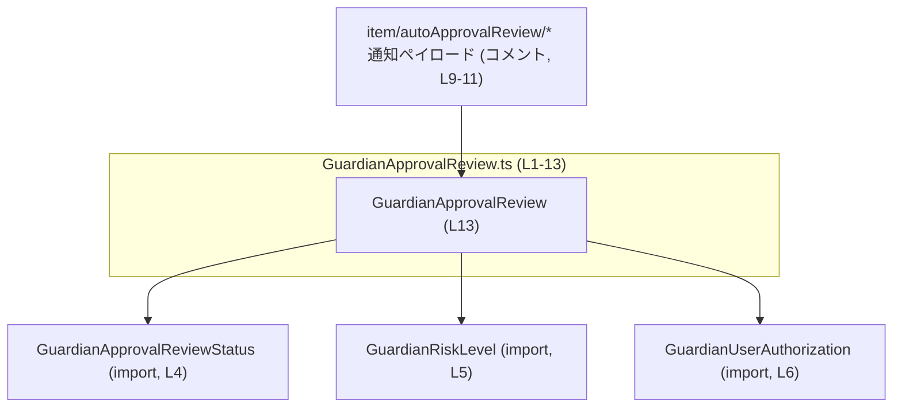
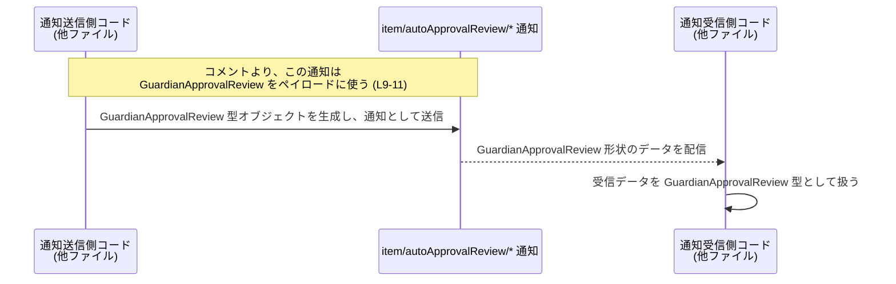

# app-server-protocol/schema/typescript/v2/GuardianApprovalReview.ts

## 0. ざっくり一言

一時的な「ガーディアン承認レビュー」情報を表す **通知ペイロード用の型エイリアス** を定義する TypeScript ファイルです（GuardianApprovalReview.ts:L8-13）。  
`item/autoApprovalReview/*` 通知で使われる JSON 形状を TypeScript の型として表現しています（GuardianApprovalReview.ts:L9-11）。

---

## 1. このモジュールの役割

### 1.1 概要

- このモジュールは、ガーディアン（Guardian）関連の **承認レビュー結果** を表現するペイロードの構造を定義します（GuardianApprovalReview.ts:L8-13）。
- 定義されているのは `GuardianApprovalReview` 型のみであり、関数やクラスなどの実行ロジックは含まれていません（GuardianApprovalReview.ts:L1-13）。
- コメントにより、この型は `[UNSTABLE]`（不安定）であり、将来形状が変わることが明示されています（GuardianApprovalReview.ts:L9-11）。

### 1.2 アーキテクチャ内での位置づけ

このファイルは **型定義レイヤ** に属し、通知処理やビジネスロジックから参照されることを想定した「スキーマ定義モジュール」です。

- `GuardianApprovalReview` は、3 つの外部型に依存しています（GuardianApprovalReview.ts:L4-6）。
  - `GuardianApprovalReviewStatus`（レビューの状態）（GuardianApprovalReview.ts:L4）
  - `GuardianRiskLevel`（リスクレベル）（GuardianApprovalReview.ts:L5）
  - `GuardianUserAuthorization`（ユーザー認可情報）（GuardianApprovalReview.ts:L6）
- コメントより、この型は `item/autoApprovalReview/*` 通知で使用されるペイロード形状であることが分かります（GuardianApprovalReview.ts:L9-11）。  
  通知の送受信ロジック自体は、このチャンクには現れません。

依存関係を Mermaid 図で表すと、次のようになります。



- `GAR --> GAS/GRL/GUA` は、`GuardianApprovalReview` がそれぞれの型をフィールドとして使用していることを表します（GuardianApprovalReview.ts:L13）。
- `Notif --> GAR` は、コメントに記載された「通知ペイロードとして使用する」関係を示します（GuardianApprovalReview.ts:L9-11）。

### 1.3 設計上のポイント

- **生成コードであること**  
  - 冒頭コメントで「GENERATED CODE! DO NOT MODIFY BY HAND!」と明示されています（GuardianApprovalReview.ts:L1-3）。  
    したがって、直接編集ではなく、`ts-rs` が生成する元定義側で変更する前提の設計です（生成元の詳細はこのチャンクには現れません）。
- **型のみ・ロジックなし**  
  - 関数、クラス、メソッドなどの実行ロジックは一切なく、1 つの型エイリアスのみをエクスポートしています（GuardianApprovalReview.ts:L13）。
- **`import type` による型専用依存**  
  - 3 つの依存は `import type` でインポートされており、コンパイル後の JavaScript には現れない型専用依存です（GuardianApprovalReview.ts:L4-6）。  
    これはバンドルサイズ削減と実行時依存の明確化に寄与します。
- **`null` 許容で状態を表現**  
  - `riskLevel`, `userAuthorization`, `rationale` の 3 フィールドは `X | null` 型で定義されており、「値が存在しない」状態を `null` で表現します（GuardianApprovalReview.ts:L13）。
- **[UNSTABLE] なインターフェース**  
  - コメントで「Temporary」「この shape はすぐに変わる予定」と明示されており（GuardianApprovalReview.ts:L9-11）、  
    下位互換性が保証されない一時的な API であることがわかります。

---

## 2. 主要な機能一覧（コンポーネントインベントリー）

このファイルが提供する「機能」はすべて型定義です。関数やクラスは存在しません（GuardianApprovalReview.ts:L1-13）。

| コンポーネント名 | 種別 | 概要 | 根拠 |
|------------------|------|------|------|
| `GuardianApprovalReview` | 型エイリアス（オブジェクト型） | ガーディアン承認レビューのステータス・リスクレベル・ユーザー認可・理由をまとめた通知ペイロードの形状 | GuardianApprovalReview.ts:L8-13 |

外部依存としてインポートされている型（このファイル内では再エクスポートされていないため公開 API ではありませんが、構造理解のために記載します）:

| コンポーネント名 | 種別 | このファイル内での役割 | 根拠 |
|------------------|------|------------------------|------|
| `GuardianApprovalReviewStatus` | 型（詳細は不明） | `status` フィールドの型として利用される | GuardianApprovalReview.ts:L4, L13 |
| `GuardianRiskLevel` | 型（詳細は不明） | `riskLevel` フィールドの型として利用される | GuardianApprovalReview.ts:L5, L13 |
| `GuardianUserAuthorization` | 型（詳細は不明） | `userAuthorization` フィールドの型として利用される | GuardianApprovalReview.ts:L6, L13 |

---

## 3. 公開 API と詳細解説

### 3.1 型一覧（構造体・列挙体など）

公開されている主要な型は `GuardianApprovalReview` 1 つです。

| 名前 | 種別 | 役割 / 用途 | 定義位置 |
|------|------|------------|----------|
| `GuardianApprovalReview` | 型エイリアス（オブジェクト型） | ガーディアン承認レビューの通知ペイロード形状を表す | GuardianApprovalReview.ts:L13 |

`GuardianApprovalReview` のフィールド詳細:

| フィールド名 | 型 | null許容 | 説明（名前と型から言える範囲） | 根拠 |
|-------------|----|---------|----------------------------------|------|
| `status` | `GuardianApprovalReviewStatus` | 不可 | 承認レビューの状態を表すステータス。どのようなステータス値があるかは、このチャンクには現れません。 | GuardianApprovalReview.ts:L4, L13 |
| `riskLevel` | `GuardianRiskLevel \| null` | 可 | リスクレベル。値が `null` の場合、リスクレベルが未設定または不明である状態を表すと解釈できますが、詳細はコードからは断定できません。 | GuardianApprovalReview.ts:L5, L13 |
| `userAuthorization` | `GuardianUserAuthorization \| null` | 可 | ユーザー認可情報。`null` の場合に何を意味するか（未認可／未決定など）は、このチャンクからは分かりません。 | GuardianApprovalReview.ts:L6, L13 |
| `rationale` | `string \| null` | 可 | レビュー結果や判断理由のテキスト。`null` の場合は理由が未記入であることを示すと考えられますが、厳密な意味は不明です。 | GuardianApprovalReview.ts:L13 |

### 3.2 関数詳細（最大 7 件）

このファイルには **関数・メソッド・クラスコンストラクタなどの実行ロジックは一切定義されていません**（GuardianApprovalReview.ts:L1-13）。  
そのため、関数詳細テンプレートに基づいて説明すべき対象はありません。

- **エラー処理・パニック**  
  - 実行時コードが存在しないため、このファイル自体が直接エラーや例外を発生させることはありません。
- **並行性**  
  - 共有状態や非同期処理も存在しないため、このファイル単体では並行性に関する考慮事項はありません。

### 3.3 その他の関数

- 定義されている関数はありません（GuardianApprovalReview.ts:L1-13）。

---

## 4. データフロー

このファイルには実行時ロジックは含まれておらず、あくまで「型レベルのデータ構造」だけが定義されています。  
したがって、**実際にどの関数がどのようにこの型をやり取りするか**は、このチャンクからは分かりません。

ただし、コメントに

> Temporary guardian approval review payload used by `item/autoApprovalReview/*` notifications. （GuardianApprovalReview.ts:L9-11）

とあるため、少なくとも「`item/autoApprovalReview/*` 通知におけるペイロード形状」を表す型であることは分かります。

以下の sequence diagram は、**コメントに基づく概念的な利用イメージ**であり、実際の実装がこの通りであるかどうかは、このチャンクからは分からないことに注意してください。



- 実際の JSON シリアライズ・ネットワーク送信・受信処理などは、このファイルには現れていないため、「他ファイル」としています。

型レベルの依存関係（`GuardianApprovalReview` がどの型をフィールドに持つか）は、前述の依存グラフ（1.2 節）に示した通りです。

---

## 5. 使い方（How to Use）

### 5.1 基本的な使用方法

このファイルで定義されている `GuardianApprovalReview` は、他の TypeScript コードから型としてインポートし、通知ペイロードやドメインオブジェクトの型として利用することが想定されます。

#### 型をインポートして利用する例

以下は、同一ディレクトリから相対インポートする例です。実際のパスはプロジェクト構成に依存します。

```typescript
// GuardianApprovalReview 型を型専用インポートする例                    // このファイルと同じディレクトリにあると仮定
import type { GuardianApprovalReview } from "./GuardianApprovalReview";   // 実際のパスはビルド設定に応じて調整する

// 依存する型も仮にインポート（定義は別ファイルにある）                 // ここでは例として示すだけで、このチャンクには現れない
import type { GuardianApprovalReviewStatus } from "./GuardianApprovalReviewStatus";
import type { GuardianRiskLevel } from "./GuardianRiskLevel";
import type { GuardianUserAuthorization } from "./GuardianUserAuthorization";

// 例として、外部から与えられる値を宣言する                            // 実際の値の定義は他のコードに依存する
declare const status: GuardianApprovalReviewStatus;                       // レビューの状態
declare const risk: GuardianRiskLevel;                                    // リスクレベル
declare const auth: GuardianUserAuthorization;                            // ユーザー認可情報

// GuardianApprovalReview 型の値を構築する                               // 4 つのフィールドをすべて指定する必要がある
const review: GuardianApprovalReview = {                                  // review は GuardianApprovalReview 型になる
    status,                                                               // status フィールド（null 不可）
    riskLevel: risk,                                                      // riskLevel フィールド（null 許容）
    userAuthorization: auth,                                              // userAuthorization フィールド（null 許容）
    rationale: "Manual review required",                                  // rationale フィールド（null 許容の string）
};
```

この例では、`GuardianApprovalReview` の **4 フィールドすべてが必須プロパティ**であり、`riskLevel` / `userAuthorization` / `rationale` は **値として `null` を取り得る**ことに注意が必要です（GuardianApprovalReview.ts:L13）。

### 5.2 よくある使用パターン

1. **すべての情報が揃っていない状態の表現**

```typescript
import type { GuardianApprovalReview } from "./GuardianApprovalReview";   // 型インポート

// リスクレベルと理由がまだ決まっていないケース                       // null で「未設定」を表現する例
declare const status: GuardianApprovalReview["status"];                   // 既存のステータス値

const pendingReview: GuardianApprovalReview = {                           // GuardianApprovalReview 型として構築
    status,                                                               // status のみ確定
    riskLevel: null,                                                      // リスクレベルは未設定
    userAuthorization: null,                                              // 認可情報も未設定
    rationale: null,                                                      // 理由テキストも未設定
};
```

- `riskLevel`, `userAuthorization`, `rationale` に `null` を代入することで、「情報がまだない」状態を表現できます（GuardianApprovalReview.ts:L13）。

1. **受け取ったレビューに基づいて分岐処理を行う**

```typescript
import type { GuardianApprovalReview } from "./GuardianApprovalReview";   // 型インポート

function handleReview(review: GuardianApprovalReview) {                   // GuardianApprovalReview を引数に取る関数
    if (review.riskLevel === null) {                                      // riskLevel が null かどうか確認
        // リスク未評価の場合の処理                                      // ここで早期リターンなどを行う
        return;
    }

    if (review.rationale !== null) {                                      // rationale が存在するか確認
        console.log("Rationale:", review.rationale);                      // 理由文字列を利用
    }

    // review.userAuthorization が null でないことを確認してから利用     // null チェックが重要
    if (review.userAuthorization !== null) {
        // userAuthorization を使った処理                                // 具体的な項目はこのチャンクには現れない
    }
}
```

### 5.3 よくある間違い

この型に特有の注意点として、**`null` 許容フィールドをそのまま非 null として扱ってしまう**ことが考えられます。

```typescript
import type { GuardianApprovalReview } from "./GuardianApprovalReview";

// ❌ よくない例: null チェックをせずに文字列メソッドを呼び出す
function logRationaleBad(review: GuardianApprovalReview) {
    // review.rationale は string | null 型                               // GuardianApprovalReview.ts:L13
    // strictNullChecks が無効な設定だと、コンパイル時にエラーにならない可能性がある
    console.log(review.rationale.toUpperCase());                          // ランタイムで null のときに例外になる可能性
}

// ✅ 良い例: null チェックを行ってから利用する
function logRationaleSafe(review: GuardianApprovalReview) {
    if (review.rationale === null) {                                      // null かどうかを確認
        console.log("No rationale provided");                             // 理由がない場合の処理
        return;
    }
    console.log(review.rationale.toUpperCase());                          // ここでは review.rationale は string として扱える
}
```

### 5.4 使用上の注意点（まとめ）

- **`null` 許容フィールドのチェックが必須**  
  - `riskLevel`, `userAuthorization`, `rationale` は `null` を取り得るため、利用前に `null` チェックを行う必要があります（GuardianApprovalReview.ts:L13）。
- **プロパティ自体は必須**  
  - 4 つのプロパティはすべてオブジェクトに必ず存在する形で定義されており（`?` ではない）、省略はできません（GuardianApprovalReview.ts:L13）。
- **型専用インポートの利用**  
  - 他ファイルから利用する場合も、可能であれば `import type` を使うことで、実行時依存を増やさずに済みます（このファイルのインポートスタイルに倣う形）（GuardianApprovalReview.ts:L4-6）。
- **インターフェースの不安定性**  
  - コメントで `[UNSTABLE]` とあり、「shape is expected to change soon」と明示されているため（GuardianApprovalReview.ts:L9-11）、この型に強く依存する実装は将来的な変更に備える必要があります。

---

## 6. 変更の仕方（How to Modify）

### 6.1 新しい機能を追加する場合

このファイルは `ts-rs` による **自動生成コード** であり、「DO NOT MODIFY BY HAND!」と明記されています（GuardianApprovalReview.ts:L1-3）。  
したがって、通常は **このファイルを直接編集して新機能を追加すべきではありません**。

- 新しいフィールドや型変更を行いたい場合の一般的な流れ（推測を含むため、ここでは一般論として記載します）:
  1. `ts-rs` が生成元とする Rust 側の構造体・型定義を変更する。  
     （このリポジトリ内のどのファイルが生成元かは、このチャンクには現れません）
  2. `ts-rs` を再実行して TypeScript 側のコードを再生成する。
- このチャンクのみからは、具体的な生成コマンドや設定ファイルの場所は分かりません。

### 6.2 既存の機能を変更する場合

`GuardianApprovalReview` 型の形状を変更する際に注意すべき点:

- **影響範囲**  
  - この型を参照しているすべての TypeScript コード（関数、コンポーネント、テストなど）が影響を受けます。  
    依存箇所の特定は、IDE の「型検索」や grep などで行う必要があります（このチャンクには依存元は現れません）。
- **契約の維持**  
  - コメントで「Temporary」「shape is expected to change」とあるため（GuardianApprovalReview.ts:L9-11）、  
    API 契約が安定していないことは前提ですが、それでも **通知ペイロードの互換性** をどこまで保つかは設計上の判断になります。
- **`null` の扱い変更**  
  - `riskLevel` などの `null` 許容を「非 null」に変更した場合、既存の呼び出し側コードで `null` を渡している箇所がコンパイルエラーもしくはランタイムエラーになる可能性があります。
- **テストの更新**  
  - この型を前提としたテスト（JSON シリアライズ/デシリアライズのスナップショット等）が存在する場合、それらも更新が必要ですが、このチャンクにはテストコードは現れません。

---

## 7. 関連ファイル

このモジュールが直接インポートしている型定義ファイルは次の 3 つです（GuardianApprovalReview.ts:L4-6）。

| パス | 役割 / 関係 | 根拠 |
|------|------------|------|
| `./GuardianApprovalReviewStatus` | `status` フィールドの型を提供する。レビューの状態を表す列挙や型であると考えられますが、このチャンクには定義内容は現れません。 | GuardianApprovalReview.ts:L4, L13 |
| `./GuardianRiskLevel` | `riskLevel` フィールドの型を提供する。リスクレベルを表す型であると考えられますが、詳細はこのチャンクには現れません。 | GuardianApprovalReview.ts:L5, L13 |
| `./GuardianUserAuthorization` | `userAuthorization` フィールドの型を提供する。ユーザー認可情報を表す型であると考えられますが、定義はこのチャンクには現れません。 | GuardianApprovalReview.ts:L6, L13 |

テストコードや、この型を実際に利用する通知処理・ビジネスロジックは、このチャンクには現れません（不明）。
