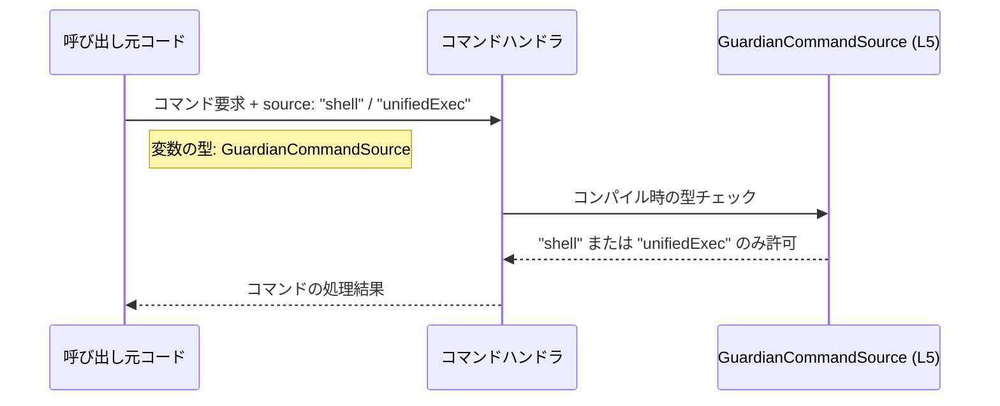

# app-server-protocol/schema/typescript/v2/GuardianCommandSource.ts

## 0. ざっくり一言

`GuardianCommandSource` は、文字列リテラル `"shell"` と `"unifiedExec"` のいずれかだけを取る型エイリアスです。  
生成コードであり、TypeScript 側のクライアントに「コマンドの発行元」を型として提供していると考えられます（`GuardianCommandSource.ts:L1-5`）。

---

## 1. このモジュールの役割

### 1.1 概要

- このモジュールは、`GuardianCommandSource` という **文字列リテラルのユニオン型** を 1 つエクスポートします（`GuardianCommandSource.ts:L5-5`）。
- コメントにより、Rust 側の型定義から `ts-rs` によって自動生成された TypeScript 表現であることが示されています（`GuardianCommandSource.ts:L1-3`）。
- これにより、TypeScript コードから「`"shell"` または `"unifiedExec"` だけを受け付ける」ことがコンパイル時に保証されます。

### 1.2 アーキテクチャ内での位置づけ

このファイル自身には他モジュールの import はなく、型定義のみが存在します（`GuardianCommandSource.ts:L1-5`）。  
そのため、**他のモジュールから参照される「型定義レイヤ」** に属するコンポーネントと位置づけられます。

実際にどのモジュールがこの型を利用しているかは、このチャンクには現れません（不明）。

```mermaid
graph TD
    subgraph Rust側
        R["Rust型 (不明)"]
    end

    subgraph TypeScriptスキーマ
        G["GuardianCommandSource 型 (L5)"]
    end

    subgraph アプリケーションコード（別ファイル・不明）
        A1["コマンド送信処理"]
        A2["コマンド受信/ハンドラ"]
    end

    R -- ts-rs により生成 --> G
    A1 --> G
    A2 --> G
```

上図は、このファイルのコメントと型定義から読み取れる範囲での概念的な依存関係を表しています。

### 1.3 設計上のポイント

- **生成コードであることが明示されている**  
  - 1 行目で「GENERATED CODE! DO NOT MODIFY BY HAND!」と宣言されています（`GuardianCommandSource.ts:L1-1`）。
  - 3 行目で `ts-rs` による生成であることが記載されています（`GuardianCommandSource.ts:L3-3`）。
- **責務の限定**  
  - エクスポートしているのは `GuardianCommandSource` という 1 つの型エイリアスのみであり、ロジックや関数は含まれていません（`GuardianCommandSource.ts:L5-5`）。
- **型安全性を重視した設計**  
  - `"shell" | "unifiedExec"` という **文字列リテラル型のユニオン** を用いることで、その他の任意の文字列をコンパイル時に排除できます（`GuardianCommandSource.ts:L5-5`）。
- **状態・エラー・並行性**  
  - 値を保持する構造体やクラスではなく、純粋な型定義のため、状態やエラーハンドリング、並行処理のロジックは一切含まれていません（`GuardianCommandSource.ts:L1-5`）。

---

## 2. 主要な機能一覧

このファイルは関数・クラスを一切持たず、次の 1 つの機能のみを提供します。

- `GuardianCommandSource` 型:  
  `"shell"` または `"unifiedExec"` のいずれかであることを表す文字列リテラル型（`GuardianCommandSource.ts:L5-5`）。

---

## 3. 公開 API と詳細解説

### 3.1 型一覧（構造体・列挙体など）

このチャンクに現れるコンポーネントのインベントリーです。

| 名前 | 種別 | 役割 / 用途 | 定義位置 |
|------|------|-------------|----------|
| `GuardianCommandSource` | 型エイリアス（文字列リテラルのユニオン） | `"shell"` または `"unifiedExec"` のいずれかだけを許可する型。コマンドの「発行元」を識別するために使われると考えられます（用途自体はこのチャンクからは不明）。 | `GuardianCommandSource.ts:L5-5` |

#### 型の性質（TypeScript 固有の安全性）

- この型で宣言された変数や引数には、**コンパイル時点で** `"shell"` または `"unifiedExec"` 以外の文字列を代入するとエラーになります（型システムによる静的検査）。
- 実行時には単なる `string` として扱われ、**追加のランタイムチェックは行われません**。未検査の外部入力に対しては、別途バリデーションが必要になります。

### 3.2 関数詳細（最大 7 件）

このファイルには関数・メソッドが定義されていません（`GuardianCommandSource.ts:L1-5`）。  
したがって、このセクションに詳細解説対象となる関数はありません。

### 3.3 その他の関数

- 該当なし（本チャンクには関数定義が存在しません）。

---

## 4. データフロー

このファイル単体では関数や処理フローは定義されていませんが、`GuardianCommandSource` がどのようにデータフローに関わるかを、**想定される典型的な利用パターンに基づく概念図**として示します。



- 実際の `H`（ハンドラ）の実装や返り値は、このチャンクには現れないため不明です。
- 型 `GuardianCommandSource` は、**「取りうる値を 2 パターンに制限する型レベルのフィルタ」**として、呼び出し元とハンドラの間のインタフェースに関与すると考えられます（`GuardianCommandSource.ts:L5-5`）。

---

## 5. 使い方（How to Use）

### 5.1 基本的な使用方法

`GuardianCommandSource` を他の TypeScript コードから利用する基本的な例です。  
ここでは、この型を引数に取る関数と、値の分岐処理を示します。

```typescript
// GuardianCommandSource 型をインポートする                    // 生成された型を読み込む
import type { GuardianCommandSource } from "./GuardianCommandSource"; // 相対パスは実際の配置に応じて調整

// コマンドの発行元に応じて処理を分岐する関数                 // source によって処理内容を切り替える
function handleCommand(source: GuardianCommandSource) {          // source は "shell" | "unifiedExec" のみ許可
    switch (source) {                                            // 文字列リテラル型に対する分岐
        case "shell":                                            // source === "shell" の場合
            console.log("コマンドはシェルから発行されました");       // shell 向けの処理
            break;
        case "unifiedExec":                                      // source === "unifiedExec" の場合
            console.log("コマンドは unifiedExec から発行されました"); // unifiedExec 向けの処理
            break;
        default:
            // GuardianCommandSource の型定義が正しければ、       // 型が "shell" | "unifiedExec" に限定されている限り
            // このブロックには到達しません（コンパイル時保証）。  // default は実質的にデッドコードになる
            const _exhaustiveCheck: never = source;
            throw new Error(`未知のsource: ${_exhaustiveCheck}`);
    }
}
```

この例から分かるように、TypeScript の文字列リテラル型により、`handleCommand` には `"shell"` か `"unifiedExec"` のどちらかのみが渡されることがコンパイル時に保障されます（`GuardianCommandSource.ts:L5-5` に基づく）。

### 5.2 よくある使用パターン

1. **API リクエストオブジェクトのフィールドとして利用**

```typescript
import type { GuardianCommandSource } from "./GuardianCommandSource";

// リクエストペイロードの型定義                                  // コマンド実行 API の入力スキーマ例
interface ExecuteCommandRequest {
    source: GuardianCommandSource;                               // "shell" | "unifiedExec"
    command: string;                                             // 実行するコマンド文字列
}

function sendExecuteCommand(req: ExecuteCommandRequest) {        // 型安全なリクエストオブジェクト
    // ここで req.source は 2 通りの文字列に限定される           // source の打ち間違えがコンパイル時に検出可能
    // 実際の送信処理は省略
}
```

1. **状態管理ストアの状態として利用**

```typescript
import type { GuardianCommandSource } from "./GuardianCommandSource";

interface CommandState {
    lastSource: GuardianCommandSource | null;                    // 直近の発行元（なければ null）
}

const state: CommandState = {                                   // 初期状態
    lastSource: null,
};

function updateLastSource(source: GuardianCommandSource) {       // 更新関数
    state.lastSource = source;                                   // source の不正値はコンパイル時に排除される
}
```

### 5.3 よくある間違い

#### 1. 任意の文字列型で宣言してしまう

```typescript
// 間違い例: string 型を使ってしまう
function handleCommandBad(source: string) {
    // "shelll" のようなタイプミスもコンパイルが通ってしまう      // 型安全性が失われる
}
```

```typescript
// 正しい例: GuardianCommandSource 型を使う
import type { GuardianCommandSource } from "./GuardianCommandSource";

function handleCommandGood(source: GuardianCommandSource) {
    // "shell" / "unifiedExec" 以外はコンパイルエラー               // 型で値を制限できる
}
```

#### 2. `any` / `unknown` から直接代入してしまう

```typescript
import type { GuardianCommandSource } from "./GuardianCommandSource";

declare const rawSource: any;                                   // 例: 外部から取得した値

// 間違い例: 直接代入（型アサーション）してしまう
const sourceBad = rawSource as GuardianCommandSource;           // コンパイルは通るが、実行時には任意の文字列が入りうる
```

この場合、実行時には `"shell"` / `"unifiedExec"` 以外の文字列が紛れ込む可能性があり、  
**TypeScript の型安全性が実行時には保証されない**ことに注意が必要です。

安全に扱うには、実行時バリデーションを行ってから代入します。

```typescript
function parseSource(value: unknown): GuardianCommandSource | null {
    if (value === "shell" || value === "unifiedExec") {         // 実行時の型ガード
        return value;                                           // 型が GuardianCommandSource に絞り込まれる
    }
    return null;                                                // 不正な入力
}
```

### 5.4 使用上の注意点（まとめ）

- **前提条件**
  - `GuardianCommandSource` 型を使うことで、コンパイル時には `"shell"` か `"unifiedExec"` のみを扱う設計になっています（`GuardianCommandSource.ts:L5-5`）。
- **エッジケース / 契約**
  - タイプシステム上は、`null` や `undefined` は `GuardianCommandSource` に含まれません。これらを許容する場合は、`GuardianCommandSource | null` 等を明示的に使う必要があります。
  - 外部入力（JSON, HTTP body など）から文字列を受け取る場合、**実行時チェックを行わない限り** TypeScript の型だけでは不正な値を防げません。
- **並行性・パフォーマンス**
  - 本ファイルは純粋な型定義のみであり、並行処理やパフォーマンスに直接影響するロジックは含まれていません（`GuardianCommandSource.ts:L1-5`）。

---

## 6. 変更の仕方（How to Modify）

### 6.1 新しい機能を追加する場合

コメントにより、このファイルは `ts-rs` による生成物であり、**手動で編集すべきではない**ことが明示されています（`GuardianCommandSource.ts:L1-3`）。

- 新しいコマンドソース種別（例: `"api"`）を追加したい場合:
  - この TypeScript ファイルを直接編集するのではなく、**元になっている Rust 側の型定義**（このチャンクには現れません）を変更し、その上で `ts-rs` による再生成を行う必要があります。
  - どの Rust ファイルが元になっているかは、このチャンクからは不明です。

TypeScript 側で行えるのは、生成された `GuardianCommandSource` を **利用する側のコード**（関数・インターフェースなど）に対する変更のみです。

### 6.2 既存の機能を変更する場合

- **値の追加・削除・名称変更**
  - `"shell"` / `"unifiedExec"` といった文字列リテラルを変更したい場合も、同様に Rust 側の元定義を修正して再生成する必要があります（`GuardianCommandSource.ts:L1-3`）。
- **影響範囲の確認**
  - このチャンクからは `GuardianCommandSource` を利用しているファイルは分かりません。
  - 実際に変更する際は、IDE の参照検索などで `GuardianCommandSource` を利用している箇所を洗い出し、条件分岐やシリアライズ処理への影響を確認する必要があります（この点は、このチャンクには現れないため一般論としての注意です）。

---

## 7. 関連ファイル

このチャンクには、他ファイルへの import / export 連鎖が書かれていないため、具体的な関連ファイル名は分かりません（`GuardianCommandSource.ts:L1-5`）。

推測できる範囲で整理すると、次のようなカテゴリのファイルと関係していると考えられますが、**ファイルパスや実体はこのチャンクには現れません**。

| パス / 種別 | 役割 / 関係 |
|------------|------------|
| Rust 側の型定義ファイル（パス不明） | `ts-rs` によって `GuardianCommandSource` 型の元になっていると推測される Rust の型定義。コメントから存在が示唆されますが、このチャンクには現れません（`GuardianCommandSource.ts:L1-3`）。 |
| TypeScript 側のアプリケーションコード（パス不明） | `GuardianCommandSource` を import して、コマンド処理の引数やペイロード型として利用する側のコード。具体的なファイルはこのチャンクには現れません。 |
| スキーマ集ディレクトリ（`app-server-protocol/schema/typescript/v2/`） | 本ファイルが配置されているディレクトリ。おそらく他の型定義ファイル群と同じレイヤと考えられますが、他ファイルの内容はこのチャンクには現れません。 |

---

### Bugs / Security / Tests などの補足（このファイルに関する範囲）

- **Bugs（バグの可能性）**
  - 本ファイルは 1 行の型エイリアスのみからなるため（`GuardianCommandSource.ts:L5-5`）、型定義そのものに起因するロジックバグは存在しません。
  - ただし、値の意味付けや利用側のバグ（例: `"shell"` と `"unifiedExec"` の扱いを取り違える）は、このチャンクからは判定できません。
- **Security（セキュリティ）**
  - この型がコマンドの発行元を表しているとすると、権限判定などに関わる可能性がありますが、利用箇所が不明なため、このチャンクからセキュリティ上の懸念を特定することはできません。
  - 一般論として、`any` などからの代入で実行時に不正な値が入りうる点には注意が必要です（5.3 参照）。
- **Contracts / Edge Cases（契約・エッジケース）**
  - 契約: `GuardianCommandSource` は `"shell" | "unifiedExec"` のどちらかである（`GuardianCommandSource.ts:L5-5`）。
  - エッジケース: `null` / `undefined` / その他の文字列は許容されない（型としては除外されている）。
- **Tests（テスト）**
  - 本ファイルにはテストコードは含まれていません（`GuardianCommandSource.ts:L1-5`）。
  - 生成コードであることから、テストは元の Rust 型や生成処理側で行われている可能性がありますが、このチャンクからは不明です。
- **Observability（観測性）**
  - ログ出力やメトリクスなどの観測用コードは一切含まれません（型定義のみのため）。

以上が、このチャンク（`GuardianCommandSource.ts:L1-5`）から読み取れる `GuardianCommandSource` 型の役割と利用上のポイントです。
