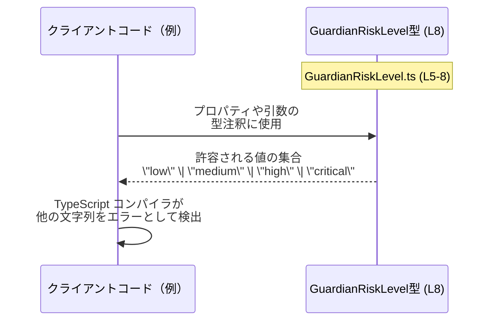

# app-server-protocol/schema/typescript/v2/GuardianRiskLevel.ts コード解説

## 0. ざっくり一言

- ガーディアン承認レビューによって割り当てられるリスクレベルを、4 種類の文字列リテラルに限定して表現する TypeScript の型エイリアスです（`"low" | "medium" | "high" | "critical"`）。  
  （根拠: GuardianRiskLevel.ts:L5-8）

---

## 1. このモジュールの役割

### 1.1 概要

- このモジュールは、ガーディアンの承認レビューにおけるリスクレベルを表すための共通型 `GuardianRiskLevel` を提供します（根拠: GuardianRiskLevel.ts:L5-8）。
- リスクレベルは `"low"`, `"medium"`, `"high"`, `"critical"` の 4 種類の文字列リテラルに制限されており、それ以外の文字列をコンパイル時に排除するための型安全性を提供します（根拠: GuardianRiskLevel.ts:L8-8）。
- ファイル先頭コメントから、この型定義は Rust 側から `ts-rs` によって自動生成されたものであり、手動変更を前提としていないことが分かります（根拠: GuardianRiskLevel.ts:L1-3）。

### 1.2 アーキテクチャ内での位置づけ

- このチャンクには、他の TypeScript ファイルやモジュールからの参照情報は現れていません。そのため、`GuardianRiskLevel` をどのコンポーネントが利用しているかは不明です（根拠: GuardianRiskLevel.ts:L1-8）。
- コメントから、このファイルは `ts-rs` によるコード生成物であり、元となる Rust 側の型定義が存在することのみが読み取れますが、そのファイルパス等は不明です（根拠: GuardianRiskLevel.ts:L1-3）。

代表的な（概念上の）依存関係イメージは以下のとおりです。利用側はこのチャンクには現れていないことを明示しています。

```mermaid
graph TD
  subgraph "GuardianRiskLevel.ts (L1-8)"
    GR["型: GuardianRiskLevel\n= \"low\" | \"medium\" | \"high\" | \"critical\""]
  end

  Client["利用コード（例）\n※このチャンクには現れない"]
  Client --> GR
```

### 1.3 設計上のポイント

- **リテラルユニオン型**  
  - 型は string のサブタイプとして、4 つの特定の文字列リテラルだけを許可する union 型になっています（根拠: GuardianRiskLevel.ts:L8-8）。
- **エクスポートされた公開 API**  
  - `export type` として定義されており、他モジュールからインポートして利用されることを前提とした公開 API です（根拠: GuardianRiskLevel.ts:L8-8）。
- **自動生成コード**  
  - 手動変更禁止であり、元のソースは Rust 側の構造体/列挙型などであることが示唆されています（根拠: GuardianRiskLevel.ts:L1-3）。自動生成であるため、変更は TS 側ではなく元の Rust 定義で行う設計になっていると解釈できます。
- **安定性の注意書き**  
  - JSDoc に `[UNSTABLE]` とあり、この型や値のバリエーションが将来的に変更される可能性があることが明示されています（根拠: GuardianRiskLevel.ts:L5-7）。

---

## 2. 主要な機能一覧

このファイルが提供する主要な機能は 1 つです。

- `GuardianRiskLevel`: ガーディアン承認レビューで割り当てられるリスクレベルを `"low" | "medium" | "high" | "critical"` の 4 値に限定する文字列リテラル union 型（根拠: GuardianRiskLevel.ts:L5-8）。

---

## 3. 公開 API と詳細解説

### 3.1 型一覧（構造体・列挙体など）

このファイルに定義されている公開型は次の 1 つです。

| 名前                | 種別                         | 役割 / 用途                                                                                         | 定義内容                                              | 根拠行 |
|---------------------|------------------------------|------------------------------------------------------------------------------------------------------|-------------------------------------------------------|--------|
| `GuardianRiskLevel` | 型エイリアス（リテラル union） | ガーディアン承認レビューで割り当てられるリスクレベルを、4 つの文字列値のいずれかに制約するための共通型 | `"low" \| "medium" \| "high" \| "critical"`           | GuardianRiskLevel.ts:L5-8 |

#### 型の性質（TypeScript 観点）

- `GuardianRiskLevel` は `string` の部分型であり、指定した 4 つ以外の文字列をコンパイル時にエラーとして扱うことができます（型システムの一般的性質）。
- ランタイムでは JavaScript の単なる文字列として扱われ、専用のクラスやオブジェクトではありません。この点は、`export type` による型エイリアスであり、値定義が存在しないことから分かります（根拠: GuardianRiskLevel.ts:L8-8）。

### 3.2 関数詳細（最大 7 件）

- このファイルには関数定義（`function`、`const f = () =>` など）は存在しません（根拠: GuardianRiskLevel.ts:L1-8）。
- したがって、関数詳細テンプレートを適用すべき対象はありません。

### 3.3 その他の関数

- 補助的な関数やラッパー関数も定義されていません（根拠: GuardianRiskLevel.ts:L1-8）。

---

## 4. データフロー

### 4.1 このモジュールが関与するデータの流れ（概念）

コード上、このファイルは型エイリアスのみを提供し、ランタイムの処理や関数呼び出しは含まれていません（根拠: GuardianRiskLevel.ts:L1-8）。  
そのため、**このチャンクだけから具体的なデータフローや呼び出し関係を特定することはできません**。

ただし、TypeScript の型として典型的に想定される利用イメージを、あくまで「例」として示します。これはこのファイル外の仮想コードを含み、**実際のリポジトリ構成はこのチャンクからは不明**です。



- 実際の実行時には `GuardianRiskLevel` 型は存在せず、値は単なる文字列として流れます。
- 型によって、コンパイル時に `"low" | "medium" | "high" | "critical"` 以外の文字列が誤って使われることを防ぐ、という意味で「データの妥当性チェック」に関わります。

---

## 5. 使い方（How to Use）

### 5.1 基本的な使用方法

以下は `GuardianRiskLevel` 型を、オブジェクトのプロパティとして利用する例です。  
インポートパスは例示であり、実際のパスはこのチャンクからは分かりません。

```typescript
// GuardianRiskLevel 型をインポートする（パスは例）                 // このファイルの export type を利用する
import type { GuardianRiskLevel } from "./GuardianRiskLevel";        // 実際の相対パスはリポジトリ構成に依存

// ガーディアンレビューの結果を表す型を定義する                    // GuardianRiskLevel をプロパティ型として利用
interface GuardianReviewResult {                                      // レビュー結果をまとめるインターフェース
    risk: GuardianRiskLevel;                                         // リスクレベルを GuardianRiskLevel で表現
    // 他のフィールド（例: reviewer, timestamp など）は省略           // 他プロパティはこのチャンクには現れない
}

// 正しい値の利用例                                                   // 許可されている文字列のみ代入できる
const okResult: GuardianReviewResult = {                             // GuardianReviewResult 型のオブジェクトを作成
    risk: "high",                                                    // "high" は GuardianRiskLevel の一つなので OK
};

// 間違った値（コンパイルエラーになる例）                              // 型の制約に違反する利用例
// const badResult: GuardianReviewResult = {                          // コメントアウトしないとコンパイルできない例
//     risk: "unknown",                                              // "unknown" は GuardianRiskLevel に含まれない
// };
```

- `"high"` のような定義済みの文字列はコンパイル時に許可されます。
- `"unknown"` のような定義外の文字列は、TypeScript の型チェックでエラーになります（型システム上の性質）。

### 5.2 よくある使用パターン

1. **関数引数として利用**

```typescript
import type { GuardianRiskLevel } from "./GuardianRiskLevel";  // 型エイリアスをインポート

// リスクレベルに応じてメッセージを返す関数                         // 引数の型を GuardianRiskLevel に制約
function describeRisk(level: GuardianRiskLevel): string {      // level は 4 値のいずれかに限定される
    switch (level) {                                           // level の値によって分岐
        case "low":
            return "Low risk";
        case "medium":
            return "Medium risk";
        case "high":
            return "High risk";
        case "critical":
            return "Critical risk";
    }
}
```

1. **オブジェクトの一部としてネスト利用**

```typescript
import type { GuardianRiskLevel } from "./GuardianRiskLevel";   // GuardianRiskLevel を再利用

type UserProfile = {                                            // ユーザープロファイルの一例
    name: string;                                               // 名前
    guardianRisk?: GuardianRiskLevel;                           // ガーディアンによるリスク評価（任意）
};
```

### 5.3 よくある間違い

```typescript
import type { GuardianRiskLevel } from "./GuardianRiskLevel";

// 間違い例: 型を使わずに単なる string にしてしまう                 // 型安全性を失う例
type ReviewResultBad = {                                        // 悪い例の型
    risk: string;                                               // string だと "low" 以外も許されてしまう
};

// 正しい例: GuardianRiskLevel を使用する                           // 許可された値のみに制限
type ReviewResultGood = {                                       // 良い例の型
    risk: GuardianRiskLevel;                                    // 4 つのリテラルに限定される
};

// 間違い例: 定義されていない文字列を使う                            // コンパイルエラーになる例
// const invalid: GuardianRiskLevel = "very_high";              // "very_high" は union 型に含まれない

// 正しい例: 定義済みリテラルを使う                                 // 許可された値
const valid: GuardianRiskLevel = "critical";                    // "critical" は union 型の一つ
```

### 5.4 使用上の注意点（まとめ）

- **コンパイル時のみの制約**  
  - `GuardianRiskLevel` は型エイリアスであり、実行時には存在しません。ランタイムでの検証は行われないため、外部入力を扱う場合は別途バリデーション処理が必要です（根拠: 型のみ定義で値定義なし GuardianRiskLevel.ts:L8-8）。
- **文字列リテラル以外の代入**  
  - `string` や `any` 型にキャストすると型安全性が失われます。`GuardianRiskLevel` 型のまま扱うことで IDE 補完とコンパイル時チェックの恩恵を受けられます。
- **不安定 API であること**  
  - `[UNSTABLE]` と記載されているため、値のバリエーションや名称が変更される可能性があります。その前提で利用コードのメンテナンス性を考慮する必要があります（根拠: GuardianRiskLevel.ts:L5-7）。

---

## 6. 変更の仕方（How to Modify）

### 6.1 新しい機能を追加する場合（新たなリスクレベルの追加）

自動生成コードであるため、本来は Rust 側の元定義を変更してから再生成する運用が想定されます（根拠: GuardianRiskLevel.ts:L1-3）。  
このチャンクから具体的な元定義の場所は分かりませんが、TS 側での変更影響だけを整理します。

- `GuardianRiskLevel` に新しいリテラル値を追加する場合は、union 型に文字列を追加することになります（例: `"unknown"` を追加）。（変更対象: GuardianRiskLevel.ts:L8-8）
- その結果:
  - `GuardianRiskLevel` を利用している全ての場所で、新しい値が型的に許可されるようになります。
  - `switch (level)` のような分岐がある場合、コンパイラの設定によっては新しいケースへの対応漏れを警告/エラーとして検出できる場合があります。

### 6.2 既存の機能を変更する場合（値の削除・名称変更）

- 既存リテラルの削除または名称変更（例: `"medium"` を削除、`"critical"` を `"severe"` に変更）を行うと、利用側でその文字列を使っている箇所はコンパイルエラーになります。
- 影響範囲の確認方法:
  - TypeScript のリファレンス検索（`GuardianRiskLevel` の参照、または `"medium"` の文字列リテラルの参照）を使って該当箇所を洗い出す必要があります。
- 契約上の注意:
  - `GuardianRiskLevel` は文字列リテラルの集合がそのまま「契約」となっているため、値集合の変更は外部 API 互換性に直接影響します。
- このチャンクにはテストコードや利用箇所が現れていないため、変更時にどのテストを更新すべきかは不明です（根拠: GuardianRiskLevel.ts:L1-8）。

---

## 7. 関連ファイル

このチャンクから直接分かる関連は、コード生成元ツールに関するコメントのみです。

| パス / 名称 | 役割 / 関係 |
|------------|------------|
| `ts-rs`（Rust クレート名、ファイルパス不明） | コメントより、この TypeScript 型は `ts-rs` によって Rust 側から自動生成されていることが分かります。元の Rust 型定義はこのチャンクには現れません（根拠: GuardianRiskLevel.ts:L1-3）。 |
| 不明       | `GuardianRiskLevel` を利用する TypeScript ファイル（サービス層、API クライアントなど）はこのチャンクには現れず、具体的な関連ファイルパスは不明です（根拠: GuardianRiskLevel.ts:L1-8）。 |

---

### 言語固有の安全性 / エラー / 並行性 についての補足

- **型安全性**:  
  - `GuardianRiskLevel` により、許可された 4 つの文字列以外の代入をコンパイル時に防止できます（TypeScript のリテラル union 型の性質）。
- **エラー**:  
  - ランタイムのエラー処理ロジックは含まれておらず、このファイルからは実行時エラーの発生条件等は読み取れません（根拠: GuardianRiskLevel.ts:L1-8）。
- **並行性**:  
  - 値は不変な文字列であり、スレッドやイベントループに関する並行性制御は一切含まれていません。このチャンクから並行処理に関する情報は得られません（根拠: GuardianRiskLevel.ts:L1-8）。
