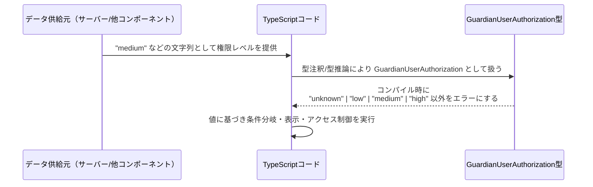

# app-server-protocol/schema/typescript/v2/GuardianUserAuthorization.ts コード解説

## 0. ざっくり一言

`GuardianUserAuthorization` は、ガーディアンによる承認レビューで割り当てられる認可レベルを、4 種類の文字列リテラルで表す TypeScript の型エイリアスです（`"unknown" | "low" | "medium" | "high"`）（GuardianUserAuthorization.ts:L5-8）。

---

## 1. このモジュールの役割

### 1.1 概要

- このモジュールは、**ガーディアン承認レビューに基づくユーザーの権限レベル**を表現するための単一の型 `GuardianUserAuthorization` を提供します（GuardianUserAuthorization.ts:L5-8）。
- 型は文字列リテラルのユニオン型（union type）で、許可される値を `"unknown"`, `"low"`, `"medium"`, `"high"` の 4 つに静的に制限します（GuardianUserAuthorization.ts:L8）。
- ファイル先頭のコメントから、自動生成されたコードであり、手動編集すべきでないことが明示されています（GuardianUserAuthorization.ts:L1-3）。

### 1.2 アーキテクチャ内での位置づけ

- ファイルパスから、この型は「app-server-protocol」の TypeScript スキーマ定義 (`schema/typescript/v2`) の一部として使用される想定ができますが、**実際にどのモジュールから参照されているかは、このチャンクだけからは分かりません**。
- 役割としては、アプリケーションの他の部分（API レスポンス型、ドメインモデル、UI 層など）から利用される**共通の型定義**です。

依存関係のイメージを簡単な Mermaid 図で表します。

```mermaid
graph TD
  %% GuardianUserAuthorization.ts (L1-8)
  subgraph "GuardianUserAuthorization.ts"
    GUA["型 GuardianUserAuthorization<br/>\"unknown\" | \"low\" | \"medium\" | \"high\""]
  end

  Caller["他のTypeScriptコード（利用側・詳細不明）"] --> GUA
```

- この図は、「他の TypeScript コード（利用側）」がこのファイルの `GuardianUserAuthorization` 型に依存する一方向の関係を示しています。
- 利用側の具体的なモジュール名や関数は、このチャンクには現れないため不明です。

### 1.3 設計上のポイント

- **自動生成コードであることが明示**  
  - ファイル先頭で「GENERATED CODE」「Do not edit this file manually」とあり、`ts-rs` によって生成されたことが書かれています（GuardianUserAuthorization.ts:L1-3）。  
  - 変更は元のスキーマ定義（Rust 側など、詳細不明）で行う前提の設計です。
- **文字列リテラルユニオンによる制約**  
  - `export type GuardianUserAuthorization = "unknown" | "low" | "medium" | "high";` という定義により、許可される文字列を 4 種類に限定し、コンパイル時にチェックできる構造です（GuardianUserAuthorization.ts:L8）。
- **[UNSTABLE] のラベル**  
  - JSDoc コメントに `[UNSTABLE] Authorization level assigned by guardian approval review.` とあり、この API が安定していないことが示されています（GuardianUserAuthorization.ts:L5-6）。  
  - これは将来値の追加・削除などが行われる可能性があることを示唆しますが、具体的な方針はこのチャンクからは分かりません。

---

## 2. 主要な機能一覧（コンポーネントインベントリー）

このファイルは 1 つの公開コンポーネント（型）だけを定義しています。

- `GuardianUserAuthorization`: ガーディアン承認レビューによって割り当てられた認可レベルを表す文字列リテラルユニオン型（GuardianUserAuthorization.ts:L5-8）。

機能としては「値の表現と型安全性の付与」のみで、関数やロジックは含まれていません。

---

## 3. 公開 API と詳細解説

### 3.1 型一覧（構造体・列挙体など）

| 名前                         | 種別                               | 役割 / 用途                                                                                       | 定義箇所                               | 許可される値                             |
|------------------------------|------------------------------------|----------------------------------------------------------------------------------------------------|----------------------------------------|------------------------------------------|
| `GuardianUserAuthorization`  | 型エイリアス（文字列リテラル union） | ガーディアン承認レビューで割り当てられる認可レベルを 4 段階＋未知状態で表現するための共通型です。 | GuardianUserAuthorization.ts:L5-8      | `"unknown"`, `"low"`, `"medium"`, `"high"` |

- TypeScript において、このような文字列リテラルユニオン型は「限定された選択肢」を表す際に広く用いられます。
- 実行時にはただの文字列として存在しますが、**コンパイル時には他の任意の文字列と区別され、型チェックが行われます。**

### 3.2 関数詳細（最大 7 件）

- **本ファイルには関数・メソッドの定義は存在しません**（GuardianUserAuthorization.ts:L1-8）。  
  そのため、このセクションで詳細解説すべき関数はありません。

### 3.3 その他の関数

- 補助関数やラッパー関数も定義されていません（GuardianUserAuthorization.ts:L1-8）。

---

## 4. データフロー

このファイル自体には処理ロジックはありませんが、`GuardianUserAuthorization` 型がアプリケーション内でどのように使われるかの典型的なデータフローをイメージとして示します。

### 4.1 典型的な利用フローの説明

1. サーバーあるいは別コンポーネントが、「ユーザーのガーディアン承認レベル」を決定し、それを `"unknown" | "low" | "medium" | "high"` のいずれかの文字列として表現します。
2. TypeScript 側では、この値に `GuardianUserAuthorization` 型を付与することで、取り得る値をコンパイル時に制約します（GuardianUserAuthorization.ts:L8）。
3. UI やビジネスロジック層では、この値をもとに表示を切り替えたり、アクセス制御を行ったりします。

### 4.2 データフロー（Mermaid シーケンス図）



- ここで `GuardianUserAuthorization` 型（T）はコンパイル時のみ存在し、実行時には単なる文字列である点に注意が必要です。
- データ供給元や具体的な呼び出し元のモジュールは、このチャンクには現れず不明です。

---

## 5. 使い方（How to Use）

### 5.1 基本的な使用方法

`GuardianUserAuthorization` 型を変数やプロパティに付けることで、許可される文字列を 4 種類に制限できます。

```typescript
// GuardianUserAuthorization 型をインポートする（パスはプロジェクト構成に依存）
import type { GuardianUserAuthorization } from "./GuardianUserAuthorization"; // パスは例

// ユーザーの認可レベルを保持する変数
let authLevel: GuardianUserAuthorization;                // authLevel は 4 種類の文字列のみをとる

authLevel = "low";                                       // OK: ユニオンに含まれる値
authLevel = "high";                                      // OK

// authLevel = "admin";                                  // コンパイルエラー: 型 '\"admin\"' を 'GuardianUserAuthorization' に代入できない
```

オブジェクトのプロパティとして使う例です。

```typescript
import type { GuardianUserAuthorization } from "./GuardianUserAuthorization"; // パスは例

interface GuardianUser {                                  // ガーディアン情報を持つユーザー
    id: string;                                           // ユーザーID
    authorization: GuardianUserAuthorization;             // ガーディアン承認レベル
}

const user: GuardianUser = {
    id: "user-123",
    authorization: "medium",                              // OK
    // authorization: "super-high",                       // NG: コンパイルエラー
};
```

### 5.2 よくある使用パターン

#### パターン 1: 条件分岐（switch）

```typescript
import type { GuardianUserAuthorization } from "./GuardianUserAuthorization"; // パスは例

function describeAuthLevel(level: GuardianUserAuthorization): string { // GuardianUserAuthorization を受け取る
    switch (level) {
        case "unknown":                                                // 4 種類すべてを列挙
            return "審査状況不明";
        case "low":
            return "限定的な承認";
        case "medium":
            return "標準的な承認";
        case "high":
            return "高いレベルの承認";
        // default:                                                   // 将来の値追加に備えて default を置く場合もある
        //     return "未定義の承認レベル";
    }
}
```

- `GuardianUserAuthorization` を引数に使うことで、`switch` での分岐が **網羅性チェック** の恩恵を受けやすくなります（型の値が増えた場合にコンパイルエラーになるなど）。

#### パターン 2: マッピング型として利用

```typescript
import type { GuardianUserAuthorization } from "./GuardianUserAuthorization"; // パスは例

// 各認可レベルごとに上限値を設定するマップ
const MAX_LIMIT_BY_AUTH: Record<GuardianUserAuthorization, number> = {
    unknown: 0,         // 実際の値は仕様に応じて決定
    low: 10,
    medium: 100,
    high: 1000,
};
```

- `Record<GuardianUserAuthorization, ...>` を使うことで、4 つすべてのキーが必要であることをコンパイル時に保証できます。

### 5.3 よくある間違い

```typescript
import type { GuardianUserAuthorization } from "./GuardianUserAuthorization"; // パスは例

// 間違い例: string 型を使ってしまう
function setAuthLevelWrong(level: string) {               // string だと何でも渡せてしまう
    // "invalid" や "super-high" など、定義されていない値も通ってしまう
}

// 正しい例: GuardianUserAuthorization を使う
function setAuthLevel(level: GuardianUserAuthorization) { // ユニオン型で制約する
    // level は 4 種類のみ
}
```

- 間違い例では、`string` 型にしてしまうことで、意図しない値がロジックに入り込む可能性があります。
- `GuardianUserAuthorization` 型を使用することで、**コンパイル時に異常な値を排除**できます。

### 5.4 使用上の注意点（まとめ）

- **自動生成ファイルを直接編集しない**  
  - ファイル先頭コメントに「GENERATED CODE」「Do not edit this file manually」とあるため（GuardianUserAuthorization.ts:L1-3）、この型に値を追加・削除したい場合は生成元の定義を変更する必要があります。
- **`"unknown"` の扱い**  
  - `"unknown"` は「権限レベルが分からない/評価されていない」状態を表現しているように読み取れます（GuardianUserAuthorization.ts:L8）。  
    実際の意味や扱いは仕様に依存し、このチャンクからは断定できませんが、ロジック上は特別扱いが必要になる可能性があります。
- **TypeScript の型ガードを併用する場合**  
  - 外部から任意の文字列を受け取る場合（例: JSON）、その値が `GuardianUserAuthorization` であると信じて `as GuardianUserAuthorization` とアサートするより、**バリデーションを行ってから型を保証する**方が安全です。
- **並行性・スレッド安全性**  
  - この型は単なる不変な文字列型であり、**並行性に関する特別な考慮事項はありません**。

---

## 6. 変更の仕方（How to Modify）

### 6.1 新しい機能を追加する場合

このファイルは `ts-rs` による自動生成コードであり、先頭コメントで「DO NOT MODIFY BY HAND」と明示されています（GuardianUserAuthorization.ts:L1-3）。したがって、直接の編集は前提にされていません。

新しい認可レベル（例: `"very_high"`）を追加したい場合の一般的な方針は次のとおりです。

1. **生成元の定義を変更する**  
   - このチャンク内には生成元（Rust 型定義など）の情報はないため、どのファイルかは不明です。  
   - `ts-rs` のドキュメントから、通常は Rust 側の型に `#[derive(TS)]` などを付けて生成することが多いですが、どの型かはここからは特定できません。
2. **コード生成を再実行する**  
   - 生成元を変更後、ビルドまたはコード生成スクリプトを実行し、`GuardianUserAuthorization.ts` を再生成します。
3. **利用側コードの修正**  
   - 追加した新しい値に対応する `switch` 文やマッピング (`Record<GuardianUserAuthorization, ...>`) を更新します。  
   - ユニオン型であるため、新しい値に未対応な箇所はコンパイルエラーとして検出されることが期待できます。

### 6.2 既存の機能を変更する場合

既存の値の名前変更や削除を行う場合も、基本方針は 6.1 と同じく「生成元を変更 → 再生成」です。

変更時に注意すべき点:

- **契約（Contract）の維持**  
  - `GuardianUserAuthorization` は外部とのインターフェース（プロトコルスキーマ）の一部であると考えられますが、このチャンクだけでは確定できません。  
  - 値の削除・名前変更は、既存クライアントとの互換性問題を引き起こす可能性があります。
- **影響範囲の確認**  
  - プロジェクト内で `GuardianUserAuthorization` を検索し、すべての利用箇所（`switch` 文、`Record` 定義など）を確認する必要があります。
- **テストの更新**  
  - 値の追加・削除があれば、それに依存するテストケースも更新が必要です。  
  - このチャンクにはテストコードは含まれていません（GuardianUserAuthorization.ts:L1-8）。

---

## 7. 関連ファイル

このチャンクだけから特定できる関連ファイルは限定的です。

| パス / 種別                           | 役割 / 関係                                                                                          |
|--------------------------------------|------------------------------------------------------------------------------------------------------|
| `app-server-protocol/schema/typescript/v2/GuardianUserAuthorization.ts` | 本ファイル。`GuardianUserAuthorization` 型の定義を提供する自動生成 TypeScript スキーマです。       |
| 生成元の定義ファイル（不明）         | コメントにより `ts-rs` による自動生成と分かりますが（GuardianUserAuthorization.ts:L1-3）、具体的な場所や言語（Rust など）はこのチャンクからは特定できません。 |
| 同ディレクトリ内の他の `*.ts` ファイル（不明） | `schema/typescript/v2` 以下に他のスキーマ定義ファイルが存在する可能性がありますが、このチャンクには一覧情報がありません。 |

---

## 付録: 契約・エッジケース・セキュリティなどの補足

### 契約（Contracts）

- `GuardianUserAuthorization` 型の契約は、「値は必ず `"unknown" | "low" | "medium" | "high"` のいずれかである」ということです（GuardianUserAuthorization.ts:L8）。
- この契約は TypeScript コンパイル時にのみ強制され、実行時には別途バリデーションを行わない限り保証されません。

### エッジケース

- **外部入力からのパース**  
  - JSON など外部から `string` として値を受け取る場合、`"UNKNOWN"`（大文字）や `"Low"` のような表記揺れ、または未知の文字列が入ってくる可能性があります。  
  - これらは `GuardianUserAuthorization` 型としては不正値であり、利用コード側でチェックする必要があります。
- **`"unknown"` の利用**  
  - `"unknown"` を「初期値」「不明な状態」「権限なし」のどれとして扱うかは仕様次第であり、このチャンクからは分かりません。  
  - 仕様に合わせて、他の 3 つの値と異なる扱いが必要となるケースがあります。

### Bugs / Security 観点

- この型定義そのものに実行時ロジックはないため、「バグ」という観点は主に利用側のコードに関係します。
- セキュリティ的には、**認可レベルを表す値**であるため:
  - 不適切に広い型（`string`）で扱う
  - `any` / `unknown` からの安易な型アサーション `as GuardianUserAuthorization`
  
  などは、意図しない権限レベルを許してしまうリスクにつながります。
- 型を正しく付けることが、権限チェックのバグを減らす一助になります。

### テスト

- このファイルにはテストコードは含まれていません（GuardianUserAuthorization.ts:L1-8）。
- 利用側のテスト例としては、例えば次のようなものが考えられます（あくまで一般例）:

```typescript
// Jest などのテストで、Record 定義が全ケースをカバーしていることを確認する例（擬似コード）

import type { GuardianUserAuthorization } from "./GuardianUserAuthorization";

const allLevels: GuardianUserAuthorization[] = ["unknown", "low", "medium", "high"];

test("すべてのガーディアン認可レベルに対して説明テキストが定義されている", () => {
    for (const level of allLevels) {
        const text = describeAuthLevel(level); // describeAuthLevel は利用側の関数
        expect(text).toBeDefined();
        expect(text.length).toBeGreaterThan(0);
    }
});
```

### パフォーマンス / スケーラビリティ

- この型はコンパイル時の型情報のみであり、実行時オーバーヘッドはほぼありません。
- 値が 4 種類と非常に少ないため、パフォーマンスやスケーラビリティの観点で問題になることは通常ありません。

### リファクタリングとトレードオフ

- 文字列リテラルユニオンを使うトレードオフ:
  - **利点**: 可読性が高く、JSON などの文字列ベースのプロトコルと相性が良い。
  - **欠点**: 値のスペルミスはコンパイル時に検出される一方、**実行時に外部から入る任意の文字列**に対する対策は別途必要。
- 他の表現（数値 enum など）に変える場合、プロトコル互換性やログの可読性に影響する可能性があります。

### オブザーバビリティ

- 値が文字列であるため、ログやメトリクスに出力した際に人間が意味を理解しやすいという利点があります。
- 特別なロギングやトレーシング機構はこのファイルには含まれていません（GuardianUserAuthorization.ts:L1-8）。
