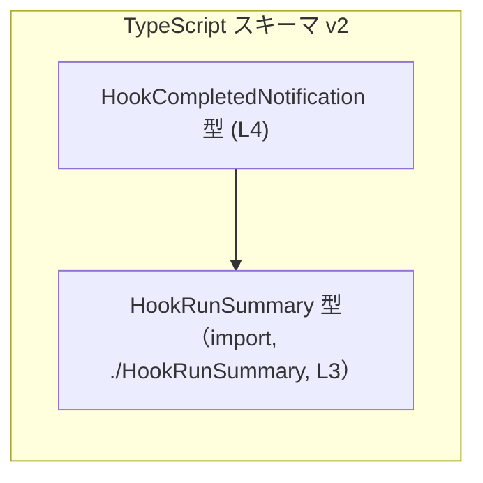
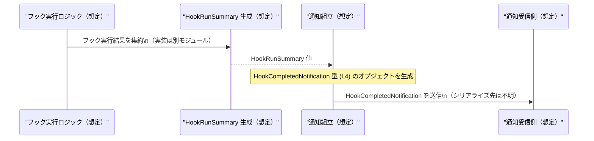

# app-server-protocol/schema/typescript/v2/HookCompletedNotification.ts コード解説

> 以下の行番号は、このファイル内の実際のコメント・コード行（空行を除く）に対して 1 から順に付与しています。

- L1: `// GENERATED CODE! DO NOT MODIFY BY HAND!`
- L2: `// This file was generated by [ts-rs](https://github.com/Aleph-Alpha/ts-rs). Do not edit this file manually.`
- L3: `import type { HookRunSummary } from "./HookRunSummary";`
- L4: `export type HookCompletedNotification = { threadId: string, turnId: string | null, run: HookRunSummary, };`

---

## 0. ざっくり一言

フック実行（Hook）の完了を通知するペイロードを表す、TypeScript のオブジェクト型エイリアスを 1 つだけ定義した、自動生成ファイルです（HookCompletedNotification.ts:L1-4）。

---

## 1. このモジュールの役割

### 1.1 概要

- このモジュールは、「フックの実行が完了した」というイベント通知のデータ構造を型レベルで表現するために存在しています（型名 `HookCompletedNotification` より解釈、HookCompletedNotification.ts:L4）。
- 通知には少なくとも以下の 3 つの情報が含まれる契約になっています。
  - `threadId`: スレッドを識別する文字列
  - `turnId`: ターン ID（存在しない場合は `null`）
  - `run`: フック実行の要約情報 `HookRunSummary`（別モジュールからの import, HookCompletedNotification.ts:L3）
- ファイル全体は ts-rs によって自動生成されており、手動編集は禁止であることがコメントに明記されています（HookCompletedNotification.ts:L1-2）。

### 1.2 アーキテクチャ内での位置づけ

ディレクトリ構成 `app-server-protocol/schema/typescript/v2` から、このファイルは「アプリケーションサーバーのプロトコル定義のうち、TypeScript で表現された v2 スキーマ」の一部であると解釈できます（パス名からの推測であり、このチャンク単体からは用途の詳細は分かりません）。

このモジュールレベルで確認できる依存関係は 1 つだけです。

- 依存先:
  - モジュール `"./HookRunSummary"` が提供する型 `HookRunSummary`（HookCompletedNotification.ts:L3）

これを簡単な依存関係図として表現すると、次のようになります。



> 図は、このチャンク内で確認できる「型間の依存関係」のみを表しています。`HookRunSummary` の中身や、この通知がどこから呼び出されるかは、このチャンクには現れません。

### 1.3 設計上のポイント

コードから読み取れる設計上の特徴は次のとおりです。

- **自動生成ファイルであること**  
  - `// GENERATED CODE! DO NOT MODIFY BY HAND!`（HookCompletedNotification.ts:L1）
  - `ts-rs` によって生成されたことと、手動で編集しないことが明示されています（HookCompletedNotification.ts:L2）。  
  → 型仕様を変更したい場合は、生成元（ts-rs の入力となる定義）を変更する設計になっています。生成元の場所はこのチャンクには現れません。

- **型専用の import を利用**  
  - `import type { HookRunSummary } from "./HookRunSummary";`（HookCompletedNotification.ts:L3）  
  - `import type` は TypeScript 特有の構文で、**型情報だけをコンパイル時に参照し、生成される JavaScript からは import を削除する**ためのものです。  
  → ランタイム依存を増やさずに型だけを共有する設計になっています。

- **シンプルなオブジェクト型エイリアス**  
  - `export type HookCompletedNotification = { ... }`（HookCompletedNotification.ts:L4）  
  - 3 つのプロパティを持つプレーンなオブジェクト型であり、メソッドやクラスは使われていません。

- **`null` を使った明示的な欠損値表現**  
  - `turnId: string | null`（HookCompletedNotification.ts:L4）  
  - TypeScript のユニオン型（`string | null`）により、「ターン ID が存在しないケース」をコンパイル時に表現し、呼び出し側に `null` への対応を強制する設計になっています。

- **エラー・並行性**  
  - このファイルには関数・メソッド・I/O 処理が一切なく、**型定義のみ**です。そのため、**エラー処理ロジックや並行処理の振る舞いは一切含まれていません**。  
  - 安全性は「型が強制するコンパイル時チェック」に限定されており、ランタイムでの検証や同期制御は別の層で行われる前提の設計です。

---

## 2. 主要な機能一覧

このモジュールが提供する「機能」は、すべて型レベルの契約です。

- `HookCompletedNotification` 型: フック完了通知のペイロード構造を表すオブジェクト型エイリアス（HookCompletedNotification.ts:L4）
- `HookRunSummary` 型の再利用: フック実行の要約情報を、別モジュールの型 `HookRunSummary` としてカプセル化し、それを `run` プロパティとして組み込む（HookCompletedNotification.ts:L3-4）

いずれも「実行時の処理」ではなく、「データ形状の定義」が主な役割です。

---

## 3. 公開 API と詳細解説

### 3.1 型一覧（構造体・列挙体など）

#### コンポーネントインベントリー（このチャンク内）

| 名前                         | 種別                    | 定義位置                              | 役割 / 用途 |
|------------------------------|-------------------------|----------------------------------------|-------------|
| `HookCompletedNotification`  | オブジェクト型エイリアス | HookCompletedNotification.ts:L4-4      | フック完了通知ペイロードの構造を表現する |
| `HookRunSummary`             | 外部型（import type）   | HookCompletedNotification.ts:L3-3      | フック実行の概要情報を表す型（詳細はこのチャンクには現れない） |

#### `HookCompletedNotification` のフィールド構造

`HookCompletedNotification` は次の 3 プロパティを持つオブジェクト型です（HookCompletedNotification.ts:L4）。

| プロパティ名 | 型                     | 説明 |
|--------------|------------------------|------|
| `threadId`   | `string`               | 通知が紐づくスレッドの識別子を表す文字列。値のフォーマットや意味はこのチャンクからは分かりません。 |
| `turnId`     | `string \| null`       | ターン ID。存在しない場合は `null`。`undefined` は許容されず、必ずキーは存在するが値が `string` か `null` のどちらか、という契約になっています。 |
| `run`        | `HookRunSummary`       | フック実行結果の概要情報。構造は `./HookRunSummary` モジュール側に定義されており、このチャンクには現れません（HookCompletedNotification.ts:L3）。 |

**TypeScript 特有の型安全性**

- `threadId` が `string` であることにより、たとえば数値 ID をそのまま渡そうとするとコンパイルエラーになります。  
  → ID の型表現を統一できる利点があります。
- `turnId` が `string | null` であるため、利用側は `null` を考慮しないとコンパイルエラーあるいは型エラーになる可能性があります。  
  → 「ターンが存在しないケース」を呼び出し側に意識させる設計です。
- `run` は `HookRunSummary` 型であり、関連情報を一つの構造体にまとめることで、型推論や IDE 支援（補完）が効きやすくなります。

### 3.2 関数詳細（最大 7 件）

このファイルには**関数・メソッド・クラスの定義は一切存在しません**（HookCompletedNotification.ts:L1-4 を確認した範囲）。

そのため、関数に対する詳細テンプレート（引数・戻り値・アルゴリズムなど）を適用できる対象はありません。

### 3.3 その他の関数

補助関数・ラッパー関数も定義されていません。

| 関数名 | 役割 |
|--------|------|
| なし   | このチャンクには関数が一切現れません。 |

---

## 4. データフロー

このファイルにはロジックがなく、型のみが定義されていますが、**型名と構造から推測される典型的なデータフローのイメージ**を示します。

> 重要: 以下は「利用イメージ」であり、実際の実装はこのチャンクには現れません。

1. 何らかの「フック」がアプリケーション内で実行される（実装は不明）。
2. フックの実行が完了したタイミングで、その結果を `HookRunSummary` 型の値としてまとめる（`./HookRunSummary` 側のロジック）。
3. 上記 `run`、対象スレッドの `threadId`、対応する `turnId`（ない場合は `null`）を用いて `HookCompletedNotification` 型のオブジェクトを生成する（型定義は HookCompletedNotification.ts:L4）。
4. 生成された `HookCompletedNotification` オブジェクトが、どこかの送信ロジックによってネットワークやメッセージキューなどに流される（具体的経路はこのチャンクには現れません）。

概念的なシーケンスを Mermaid のシーケンス図で表すと次のようになります。



**言語固有の安全性の観点**

- `HookCompletedNotification` の生成時に、TypeScript の型チェックにより
  - `threadId` が文字列であること
  - `turnId` が `string` または `null` であること
  - `run` が `HookRunSummary` であること  
  がコンパイル時に保証されます。
- 一方で、ランタイムで実際に受け取るデータがこの形になっているかどうかは、別途バリデーションを行わない限り保証されません。  
  → このファイルはあくまで「コンパイル時の契約」であり、**実行時の安全性や検証ロジックは別レイヤーの責務**になります。

---

## 5. 使い方（How to Use）

### 5.1 基本的な使用方法

ここでは、`HookCompletedNotification` 型の値を生成し、利用する基本例を示します。  
（注: 実際にどこから呼ばれるかはこのチャンクには現れないため、あくまで利用イメージです。）

```ts
// HookCompletedNotification 型をこのモジュールからインポートする例
import type { HookCompletedNotification } from "./HookCompletedNotification"; // 型のみを import

// フック完了通知オブジェクトを作成する
const notification: HookCompletedNotification = { // notification 変数は HookCompletedNotification 型
  threadId: "thread-123",                         // threadId は string 型
  turnId: "turn-1",                               // turnId は string | null 型。ここでは string を指定
  run: {                                          // run は HookRunSummary 型
    // HookRunSummary の具体的なフィールドはこのチャンクには現れないため、ここではコメントのみ
    // 例: status: "success", startedAt: "...", finishedAt: "..." などが想定されるが詳細は不明
  } as any,                                       // 実際には HookRunSummary 型に合わせた構造を指定する必要がある
};

// notification を何らかの送信処理に渡すイメージ
sendHookCompletedNotification(notification);       // sendHookCompletedNotification は別途定義される（このチャンクには現れない）

function sendHookCompletedNotification(
  payload: HookCompletedNotification,             // 引数型を HookCompletedNotification で受ける
) {
  // ここで payload を JSON にシリアライズしたり、WebSocket/HTTP で送信する等の処理を行う想定
  console.log(payload.threadId);                  // threadId は string として安全に参照できる
}
```

このコードは、「通知を構築して送る」という典型的な利用パターンを表していますが、送信方法や `HookRunSummary` の具体的な構造はこのチャンクからは分かりません。

### 5.2 よくある使用パターン

#### パターン 1: `turnId` の存在を確認して処理を分ける

`turnId` が `string | null` であるため、利用側では `null` の可能性を考慮した分岐を書く必要があります。

```ts
// HookCompletedNotification 型の値を受け取って処理する例
function handleNotification(notification: HookCompletedNotification) {  // notification は HookCompletedNotification 型
  if (notification.turnId !== null) {                                   // turnId が null でないかチェック
    console.log(`ターン ${notification.turnId} のフックが完了しました`);  // turnId は string として扱える
  } else {
    console.log(`ターン情報なしでスレッド ${notification.threadId} のフックが完了しました`); // turnId がないケース
  }

  // run プロパティについては HookRunSummary 型に応じた処理を行う必要がある（詳細はこのチャンクには現れない）
}
```

#### パターン 2: Optional チェーンや Null 合体演算子を使った安全な参照

TypeScript のオプショナルチェーンや null 合体演算子を用いて、`turnId` の有無に応じた処理を簡潔に書くこともできます。

```ts
function summaryLabel(notification: HookCompletedNotification): string {   // ラベル文字列を返す関数
  const turnPart = notification.turnId ?? "no-turn";                       // turnId が null の場合は "no-turn" に置き換える
  return `${notification.threadId}:${turnPart}`;                           // "threadId:turnId" 形式のラベルを返す
}
```

### 5.3 よくある間違い

この型から推測される、起こりやすい誤用例と正しい例を示します。

#### 誤用例 1: `turnId` を `undefined` にしてしまう

```ts
// 誤り: turnId に undefined を入れている
const badNotification: HookCompletedNotification = {
  threadId: "thread-123",
  // @ts-expect-error: Type 'undefined' is not assignable to type 'string | null'.
  turnId: undefined,                 // 型定義上は許可されていない
  run: {} as any,
};
```

正しい例:

```ts
// 正しい: turnId が存在しない場合は null を明示する
const okNotification: HookCompletedNotification = {
  threadId: "thread-123",
  turnId: null,                      // 存在しないことを null で表現
  run: {} as any,                    // 実際には HookRunSummary に合わせる
};
```

#### 誤用例 2: 型定義を直接変更してしまう

```ts
// 誤り: 自動生成ファイル内の型定義を手で書き換える（コメントで禁止されている）
/*
  // GENERATED CODE! DO NOT MODIFY BY HAND!
  // ... を無視して手動編集するのはよくない
*/
```

正しい方針:

- ファイル先頭に `GENERATED CODE! DO NOT MODIFY BY HAND!` と明記されているため（HookCompletedNotification.ts:L1-2）、  
  **型を変更したい場合は ts-rs の入力元（おそらく Rust 側の定義など）を変更し、再生成する必要があります。**
- 入力元がどこにあるかは、このチャンクには現れません。

### 5.4 使用上の注意点（まとめ）

- **手動編集禁止**  
  - ファイル先頭に明示されているとおり、このファイルを直接編集しない前提の設計です（HookCompletedNotification.ts:L1-2）。
  - 仕様変更は ts-rs の入力側で行い、このファイルは生成物として扱う必要があります。

- **`turnId` の null 取り扱い**  
  - `turnId` は `string | null` であり、`undefined` ではありません（HookCompletedNotification.ts:L4）。  
  - 呼び出し側では `null` の可能性を必ず考慮する必要があります。考慮しないと実行時に `null` に対して string メソッドを呼び出して例外が発生する可能性があります。

- **ランタイムバリデーションは別途必要**  
  - この型は TypeScript の型レベルの契約であり、実際に JSON などから受け取った生データがこの構造に従っているかは別途チェックする必要があります。
  - セキュリティ（例: 外部から来るデータの検証）やバリデーションは、別の層で実装する必要があります。このチャンクにはそうしたロジックは現れません。

- **並行性・エラー処理は含まれない**  
  - このファイルには非同期処理やロック、例外処理などは一切存在せず、並行性やエラー処理に関する挙動は定義されていません。
  - これらは通知を送受信する上位レイヤーのコードの責務となります。

---

## 6. 変更の仕方（How to Modify）

### 6.1 新しい機能を追加する場合

このファイルは ts-rs による自動生成ファイルであり、コメントにより**手動編集が禁止**されています（HookCompletedNotification.ts:L1-2）。そのため、機能追加（フィールド追加など）を行う場合は、次の方針になります。

1. **生成元を特定する**  
   - コメントより、生成ツールは `ts-rs` であることが分かります（HookCompletedNotification.ts:L2）。  
   - 具体的にどの Rust 型や定義から生成されているかは、このチャンクからは分かりません。

2. **生成元の定義を変更する**  
   - たとえば「通知に `completedAt` フィールドを追加したい」場合、ts-rs の入力となる型定義側に `completedAt` 相当のフィールドを追加します。
   - この操作は、このチャンクには現れない別ファイルで行う必要があります。

3. **ts-rs による再生成を行う**  
   - 生成コマンドやビルド手順はこのチャンクには現れませんが、ビルドプロセスの一部として再生成が行われる前提です。

4. **利用側コードを更新**  
   - 新たに追加されたフィールドを利用するコードを TypeScript 側で更新します。

### 6.2 既存の機能を変更する場合

既存フィールドの型を変更したい場合も、基本的には上記と同様に「生成元定義を変更 → 再生成」という流れになります。

変更時に注意すべき点:

- **契約の変更の影響範囲**  
  - `threadId` や `turnId`、`run` の型を変更すると、この型を利用しているすべての箇所のコンパイルが影響を受けます。
  - 特に `turnId` の `null` 許容をやめるなどの変更は、多数の呼び出し側コード修正を伴う可能性があります。

- **後方互換性**  
  - このファイルのパスに `v2` が含まれていることから、スキーマのバージョン管理が行われている可能性があります（パス名からの推測）。互換性を保つために、新しいバージョンのスキーマとして別ディレクトリを作る設計も考えられますが、実際にどうしているかはこのチャンクには現れません。

- **テストの再確認**  
  - このチャンクにはテストコードは現れませんが、スキーマに依存するテストがプロジェクトの別の場所に存在する可能性があります。型定義を変えたら、関連テストの再実行・修正が必要になります。

---

## 7. 関連ファイル

このチャンクから直接分かる関連モジュールは 1 つだけです。

| パス / モジュール名  | 役割 / 関係 |
|----------------------|------------|
| `"./HookRunSummary"` | `HookCompletedNotification` の `run` プロパティの型 `HookRunSummary` を提供するモジュール（HookCompletedNotification.ts:L3）。ファイル拡張子や中身の詳細はこのチャンクには現れません。 |

その他、この型を利用しているコード（送信ロジック、受信ロジック、テストコードなど）は、このチャンクには現れません。そのため、実際にどのコンポーネントから呼び出されているか、どのような並行性制御やエラー処理が行われているかについては不明です。
