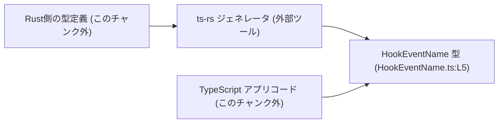
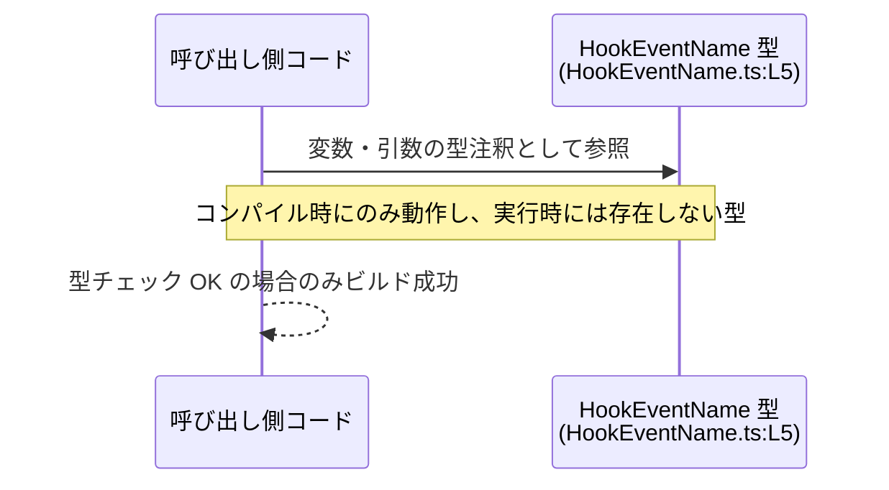

# app-server-protocol/schema/typescript/v2/HookEventName.ts

## 0. ざっくり一言

`HookEventName` という **フックイベント名を表す文字列リテラル・ユニオン型**を 1 つだけ公開する、自動生成された TypeScript の型定義ファイルです（`HookEventName.ts:L1-5`）。

---

## 1. このモジュールの役割

### 1.1 概要

- このファイルは、`HookEventName` という型エイリアス（`type`）を定義しています（`HookEventName.ts:L5`）。
- `HookEventName` は、次の 5 個の文字列リテラルのいずれかに限定されたユニオン型です（`HookEventName.ts:L5`）。

  - `"preToolUse"`
  - `"postToolUse"`
  - `"sessionStart"`
  - `"userPromptSubmit"`
  - `"stop"`

- ファイル先頭コメントから、この型は Rust コードから [ts-rs](https://github.com/Aleph-Alpha/ts-rs) によって自動生成されていることが分かります（`HookEventName.ts:L1-3`）。

### 1.2 アーキテクチャ内での位置づけ

- パス `schema/typescript/v2` およびコメントから、このファイルは「アプリケーションサーバプロトコル v2」の **スキーマ定義の一部として生成された TypeScript 型**であると読み取れます（`HookEventName.ts:L1-3`）。
- 具体的な利用箇所（どのモジュールから参照されるか）は、このチャンクには現れていません。

想定される生成・利用関係を、コードから読み取れる範囲＋一般的な ts-rs の利用形態として図示します（Rust 側や利用コードの具体的なパスは、このチャンクからは不明です）。



### 1.3 設計上のポイント

コードとコメントから読み取れる設計上の特徴は次のとおりです。

- **自動生成コード**  
  - `// GENERATED CODE! DO NOT MODIFY BY HAND!` と `ts-rs` による生成コメントにより、手動編集しない前提であることが明示されています（`HookEventName.ts:L1-3`）。
- **型レベルのみの定義**  
  - 定義されているのは `export type HookEventName = ...` のみであり、クラス・関数・定数など実行時に残る要素はありません（`HookEventName.ts:L5`）。
  - そのため **ランタイムオーバーヘッドはゼロ**で、コンパイル時の型検査専用です。
- **列挙的な文字列ユニオン**  
  - 5 つのイベント名文字列をユニオン型で列挙することで、**許可される文字列値を限定**する設計になっています（`HookEventName.ts:L5`）。
- **状態やエラー処理は持たない**  
  - フィールドやロジックを持たない単一の型定義だけなので、内部状態やエラーハンドリングのコードは存在しません（`HookEventName.ts:L1-5`）。

---

## 2. 主要な機能一覧

このモジュールが提供する機能は 1 つだけです。

- `HookEventName` 型:  
  フックイベント名を表す文字列を、5 種類のリテラル値に制約するユニオン型（`HookEventName.ts:L5`）。

---

## 3. 公開 API と詳細解説

### 3.1 型一覧（構造体・列挙体などのコンポーネントインベントリー）

このファイルに登場する公開コンポーネント（型）の一覧です。

| 名前            | 種別           | 定義箇所               | 役割 / 用途 |
|-----------------|----------------|------------------------|------------|
| `HookEventName` | 型エイリアス   | `HookEventName.ts:L5` | フックイベント名を `"preToolUse"` / `"postToolUse"` / `"sessionStart"` / `"userPromptSubmit"` / `"stop"` のいずれかに制約するユニオン型 |

#### `HookEventName` 型の詳細

**概要**

- `HookEventName` は次の 5 つの文字列だけを許容する **文字列リテラル・ユニオン型**です（`HookEventName.ts:L5`）。

  ```typescript
  export type HookEventName =
      "preToolUse"
    | "postToolUse"
    | "sessionStart"
    | "userPromptSubmit"
    | "stop";
  ```

- この型を使うことで、「イベント名を表す引数やフィールドに、誤った文字列が渡される」ことをコンパイル時に防ぐことができます（TypeScript の一般的な型安全性の特性）。

**型の意味**

- `"preToolUse"`: ツール実行前のフックイベント名であることを示す文字列リテラル（`HookEventName.ts:L5`）。
- `"postToolUse"`: ツール実行後のフックイベント名であることを示す文字列リテラル（`HookEventName.ts:L5`）。
- `"sessionStart"`: セッション開始時のフックイベント名を表す文字列リテラル（`HookEventName.ts:L5`）。
- `"userPromptSubmit"`: ユーザープロンプト送信時のフックイベント名を表す文字列リテラル（`HookEventName.ts:L5`）。
- `"stop"`: 処理停止に関連するフックイベント名を表す文字列リテラル（`HookEventName.ts:L5`）。

※ これら文字列の**具体的な意味やいつ発火するかなどの挙動**は、このチャンクには登場しません。名前から用途は推測できますが、コード上の根拠はありません。

**TypeScript による安全性**

- `HookEventName` 型が付いた変数・引数には、上記 5 つ以外の文字列は代入できません。  
  これは **コンパイル時エラー** として検出されます（型システムによる制約）。
- ただし、この制約は TypeScript コンパイラが動作する段階に限られ、生成された JavaScript には型情報は残りません（TypeScript の仕様）。

**エラー・並行性への影響**

- このファイル自体には実行時ロジックがないため、ランタイムエラーや競合状態（レースコンディション）を生むコードは存在しません（`HookEventName.ts:L1-5`）。
- 安全性は **「間違った文字列を使えない」というコンパイル時の型エラー**として提供されます。

### 3.2 関数詳細（最大 7 件）

- このファイルには関数・メソッド・クラスなどの **実行時に呼び出される API は一切定義されていません**（`HookEventName.ts:L1-5`）。
- したがって、関数詳細テンプレートを適用できる対象はありません。

### 3.3 その他の関数

- なし（関数定義そのものが存在しません）。

---

## 4. データフロー

このファイルには実行時処理が含まれないため、**厳密な意味での「データフロー」や「呼び出し関係」**は記述されていません（`HookEventName.ts:L1-5`）。

ここでは、一般的な TypeScript の型ユニオンがどのように利用されるかという **想定上の利用フロー**を、あくまで参考として示します。実際の利用箇所や処理内容は、このチャンクには現れていません。



- 呼び出し側コードは、イベント名を扱う変数・引数・戻り値などに `HookEventName` 型を付与します。
- TypeScript コンパイラは、`HookEventName` 型と、実際に使われている文字列リテラルが一致しているかをチェックします。
- 一致しない場合（例: `"preToolUse"` を `"pretooluse"` と誤記した場合）、ビルド時にエラーとなり、実行ファイルは生成されません。

---

## 5. 使い方（How to Use）

### 5.1 基本的な使用方法

`HookEventName` 型を変数や関数の引数・戻り値に付けることで、**イベント名として使える文字列を 5 つに限定**できます。

> パスはプロジェクト構成に依存するため、以下の `import` の相対パスは例示です。

```typescript
// HookEventName 型をインポートする（パスは実際の配置に応じて調整する）
import type { HookEventName } from "./HookEventName";   // HookEventName.ts:L5 で定義されている型を参照

// HookEventName 型の変数を宣言する
let eventName: HookEventName;                           // eventName は 5 種類の文字列のいずれかしか代入できない

// 許可された文字列を代入する（OK）
eventName = "preToolUse";                               // OK: ユニオン型の一員（HookEventName.ts:L5）
eventName = "stop";                                     // OK: 同上

// eventName = "other";                                // NG: 型エラー（"other" は HookEventName に含まれていない）
```

このようにすることで、IDE 補完や型チェックにより、誤ったイベント名の使用を防ぎやすくなります。

### 5.2 よくある使用パターン

#### パターン 1: 関数の引数として利用する

```typescript
import type { HookEventName } from "./HookEventName";   // HookEventName.ts:L5

// フックイベント名とペイロードを受け取る関数の例
function handleHook(eventName: HookEventName, payload: unknown) {  // eventName を 5 種類に制限
    switch (eventName) {                                           // ユニオン型なので switch が書きやすい
        case "preToolUse":
            // ツール実行前の処理
            break;
        case "postToolUse":
            // ツール実行後の処理
            break;
        case "sessionStart":
            // セッション開始時の処理
            break;
        case "userPromptSubmit":
            // ユーザープロンプト送信時の処理
            break;
        case "stop":
            // 停止時の処理
            break;
    }
}
```

- `switch` 文で全ケースを列挙しやすくなり、IDE による網羅性チェックも期待できます（TypeScript の一般的な機能）。

#### パターン 2: 型の一部として埋め込む

```typescript
import type { HookEventName } from "./HookEventName";   // HookEventName.ts:L5

// イベントオブジェクトの型定義例
interface HookEvent {
    name: HookEventName;                                // イベント名を制約
    data: unknown;                                      // ペイロード（実際の型は用途に応じて決める）
}
```

- `HookEvent` の `name` に不正な文字列が入らないようにできます。

### 5.3 よくある間違い

#### 間違い例 1: 任意の string を受け取る形にしてしまう

```typescript
// 間違い例: string 型にしてしまうと、どんな文字列でも受け取れてしまう
function handleHookWrong(eventName: string) {           // 型チェックがほとんど効かない
    // "pretooluse" などのタイポにもコンパイラは気付けない
}
```

#### 正しい例

```typescript
import type { HookEventName } from "./HookEventName";   // HookEventName.ts:L5

// 正しい例: HookEventName 型を使う
function handleHookCorrect(eventName: HookEventName) {  // 5 つの文字列だけが許可される
    // eventName の値は "preToolUse" | "postToolUse" | "sessionStart"
    //                 | "userPromptSubmit" | "stop" のいずれかに限定される
}
```

### 5.4 使用上の注意点（まとめ）

- **実行時検証は別途必要**  
  - `HookEventName` は TypeScript の型であり、コンパイル後の JavaScript には存在しません。  
    ランタイムで外部入力（JSON など）を検証したい場合は、別途バリデーションロジックが必要です。
- **自動生成ファイルのため直接編集しない**  
  - ファイル先頭コメントに「DO NOT MODIFY BY HAND」とあるため、直接このファイルを修正すると、再生成時に上書きされる可能性があります（`HookEventName.ts:L1-3`）。
- **ユニオン型の変更は利用側コードに影響**  
  - ユニオンのメンバーを追加・削除・変更すると、それを利用している TypeScript コードはコンパイルエラーになる可能性があります（一般論）。
- **並行性・スレッド安全性**  
  - 実行時のオブジェクトや共有状態を持たないため、このファイル自体はスレッド安全性や並行性に関する考慮は不要です。

### 5.5 不具合・セキュリティ上の注意

- この型定義単体からは、直接的なセキュリティホール（XSS、SQL インジェクションなど）は読み取れません（`HookEventName.ts:L1-5`）。
- ただし、**型はあくまでコンパイル時のみ有効**であるため、「`HookEventName` 型だから安全」と考えて実行時チェックを省略すると、外部入力が想定外の文字列を含んでいても受け入れてしまう可能性があります。  
  実行時のバリデーションは別途必要です。

---

## 6. 変更の仕方（How to Modify）

### 6.1 新しいフックイベントを追加する場合

コードから読み取れる範囲での変更方針を整理します。

- このファイルは `ts-rs` による自動生成ファイルであり、コメントで手動編集禁止が明示されています（`HookEventName.ts:L1-3`）。
- 新しいフックイベント名を追加したい場合、**この TypeScript ファイルではなく、生成元の Rust 側の型定義**を変更する必要があると考えられます（ts-rs の一般的な利用方法に基づく）。

一般的な手順（生成元コード側での作業）:

1. Rust 側の、`HookEventName` に対応する型定義（列挙体や文字列ユニオン相当）に、新しいイベント名を追加する。  
   ※ 具体的なファイルパスや型名は、このチャンクには現れません。
2. `ts-rs` を用いて TypeScript コードを再生成する。
3. 再生成後の `HookEventName.ts` に、追加された文字列リテラルが含まれていることを確認する。

変更による影響:

- `HookEventName` を使っている TypeScript コードは、新しいイベント名を使用可能になります。
- `switch` 文で `HookEventName` を網羅的に扱っている場合、IDE やコンパイラ設定によっては、新しいケースをハンドリングする必要があると警告されることがあります。

### 6.2 既存のイベント名を変更・削除する場合

- こちらも同様に、生成元の Rust 側の型定義を変更し、`ts-rs` により再生成する必要があります（`HookEventName.ts:L1-3`）。
- 既存の文字列リテラルを変更・削除した場合、`HookEventName` を使っている TypeScript コードのうち、該当の文字列を参照している箇所は **コンパイルエラー**になります（型ユニオンから外れるため）。

変更時の注意点:

- **契約（Contract）の維持**  
  - `HookEventName` が「プロトコルの公開インターフェース」である場合、イベント名の変更・削除はクライアント側との互換性に直接影響します。  
    この点は仕様レベルの問題であり、このチャンク単体からは詳細は分かりませんが、一般的には慎重なバージョニング管理が必要です。
- **テストの更新**  
  - このファイルにはテストコードは含まれていません（`HookEventName.ts:L1-5`）。  
    生成元または利用側のテストで、イベント名の変更が反映されているか確認する必要があります（テストの有無や場所はこのチャンクには現れません）。

---

## 7. 関連ファイル

このチャンクには、直接の関連ファイルのパスや名前は記述されていません。ただし、コメントから推測できる関係を、事実と推測を分けて整理します。

| パス / 名称                             | 役割 / 関係 |
|----------------------------------------|------------|
| Rust 側の生成元型定義（パス不明）      | コメントに「This file was generated by ts-rs」とあるため、この型に対応する Rust の型定義が存在すると考えられますが、具体的なパスや型名はこのチャンクには示されていません（`HookEventName.ts:L1-3`）。 |
| `ts-rs` ツール                         | Rust から TypeScript の型定義を生成する外部ツールとしてコメントに明記されています（`HookEventName.ts:L2-3`）。 |
| `HookEventName` を利用する TypeScript コード（パス不明） | `export type HookEventName ...` によりエクスポートされていることから、どこかの TypeScript ファイルからインポートされて利用されることが想定されますが、具体的な利用箇所はこのチャンクには現れていません（`HookEventName.ts:L5`）。 |

---

このファイルは非常に小さいですが、プロトコル上のイベント名という「意味のある列挙的な文字列」を、TypeScript の型システムで安全に扱うための重要な型定義になっています。
