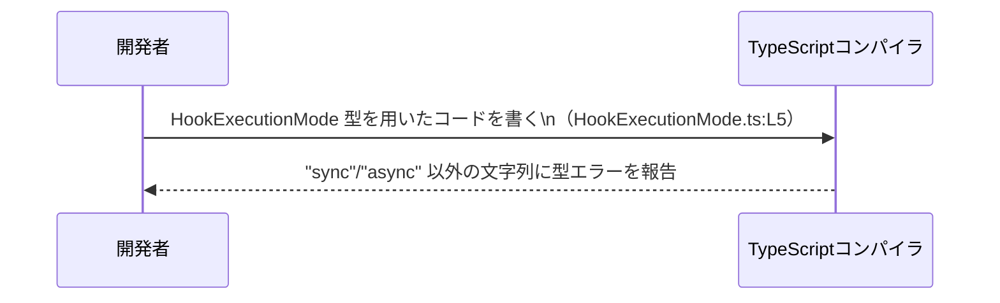

# app-server-protocol/schema/typescript/v2/HookExecutionMode.ts コード解説

## 0. ざっくり一言

- フック（hook）の「実行モード」を `"sync"` または `"async"` のどちらかに限定して表現するための、TypeScript の文字列リテラル型エイリアスです（`HookExecutionMode.ts:L5-5`）。
- Rust から `ts-rs` によって自動生成されており、このファイル自体を手で編集しない前提になっています（`HookExecutionMode.ts:L1-3`）。

---

## 1. このモジュールの役割

### 1.1 概要

- このモジュールは、フックの実行モードを表すための型 `HookExecutionMode` を提供します（`HookExecutionMode.ts:L5-5`）。
- 実行モードは `"sync"`（同期）か `"async"`（非同期）の 2 値のいずれかに限定され、TypeScript の型システムでコンパイル時にチェックされます。

### 1.2 アーキテクチャ内での位置づけ

コメントから、このファイルは Rust コードから `ts-rs` によって自動生成されていることが分かります（`HookExecutionMode.ts:L1-3`）。  
そのため、アーキテクチャ上は「Rust 側の型定義」と「TypeScript クライアントコード」を橋渡しする型定義の一部と解釈できます。


> Rust 側の定義や実際の利用コードは、このチャンクには現れないため詳細は不明です。

### 1.3 設計上のポイント

- **自動生成コード**  
  - `// GENERATED CODE! DO NOT MODIFY BY HAND!`（`HookExecutionMode.ts:L1-1`）、  
    `Do not edit this file manually.`（`HookExecutionMode.ts:L3-3`）から、このファイルを直接編集しない設計になっています。
- **型レベルのみの責務**  
  - `export type HookExecutionMode = "sync" | "async";` による型エイリアス定義のみが存在し（`HookExecutionMode.ts:L5-5`）、実行時ロジックや状態は持ちません。
- **文字列リテラルユニオン型**  
  - `"sync"` と `"async"` の 2 つの文字列リテラルだけを許可するユニオン型として設計されており（`HookExecutionMode.ts:L5-5`）、型安全なモード指定を目的としていると解釈できます。

---

## 2. 主要な機能一覧

このファイルが提供する「機能」は、1 つの型定義に集約されています。

- `HookExecutionMode` 型:  
  フックの実行モードを `"sync"` / `"async"` の 2 値に限定する文字列リテラルユニオン型です（`HookExecutionMode.ts:L5-5`）。

---

## 3. 公開 API と詳細解説

### 3.1 型一覧（構造体・列挙体など）

| 名前                | 種別                                       | 役割 / 用途                                                                 | 定義位置                         |
|---------------------|--------------------------------------------|------------------------------------------------------------------------------|----------------------------------|
| `HookExecutionMode` | 型エイリアス（string リテラルユニオン型） | フック実行モードを `"sync"` か `"async"` のどちらかに制限するための型です。 | `HookExecutionMode.ts:L5-5` |

#### `HookExecutionMode` 型

**概要**

- TypeScript の文字列リテラル型を用いて、許可される値を `"sync"` または `"async"` のみに制約する型です（`HookExecutionMode.ts:L5-5`）。
- JavaScript 実行時には存在せず、コンパイル時の型チェック専用の仕組みです。

**定義**

```typescript
// HookExecutionMode.ts:L5-5
export type HookExecutionMode = "sync" | "async";
```

**意味**

- `"sync"`: 同期的な実行モードを表す文字列リテラル。
- `"async"`: 非同期的な実行モードを表す文字列リテラル。
- どちらでもない任意の `string` は、`HookExecutionMode` には代入できません（コンパイル時エラーになります）。

**型安全性・エラー・並行性の観点**

- **型安全性**  
  - 変数やプロパティに `HookExecutionMode` を指定すると、`"sync"` / `"async"` 以外の文字列を指定した場合に TypeScript コンパイラがエラーにします。
- **実行時エラー**  
  - `HookExecutionMode` はあくまで静的型です。外部入力（JSON など）から受け取った文字列に対して、この型だけでは実行時の検証は行われません。  
    必要に応じて、ユーザーコード側で `"sync"` / `"async"` かをチェックする必要があります。
- **並行性（concurrency）**  
  - この型自体はデータ構造を持たないため、並行性／スレッド安全性に関するロジックは含まれません。  
    並行に利用しても、型定義としては特別な制約はありません。

**エッジケース**

- コンパイル時:
  - `let m: HookExecutionMode = "parallel";` のように `"sync"` / `"async"` 以外を代入すると型エラーになります。
  - `let s: string = "sync"; let m: HookExecutionMode = s;` のように「一般の `string`」を代入しようとすると、TypeScript は `"string` を `"sync" | "async"` に代入できない」と判断してエラーにします。
- 実行時:
  - 適切なランタイムチェックを行わないまま外部入力を `HookExecutionMode` として扱うと、実行時には不正な文字列が紛れ込む可能性があります（型はトランスパイル後に消えるため）。

**使用上の注意点**

- この型は `export type` で定義されているため、**型専用の import（`import type`）** を用いるとバンドルサイズに影響を与えません。
- JSON 等の外部入力に対しては、`HookExecutionMode` だけでは検証が行われないため、必要ならユーザー側で型ガード関数を定義して検証することが推奨されます（例は後述）。

### 3.2 関数詳細（最大 7 件）

- このファイルには関数定義は存在しません（`HookExecutionMode.ts:L1-5`）。  
  したがって、詳細解説対象となる公開関数もありません。

### 3.3 その他の関数

- このチャンクには関数・メソッド・クラス定義は一切現れません（`HookExecutionMode.ts:L1-5`）。

---

## 4. データフロー

このファイルには実行時ロジックは含まれませんが、**型によるデータフロー（コンパイル時チェック）の観点**で整理します。

### 4.1 型チェックのフロー（概念図）

開発者が `HookExecutionMode` を用いてコードを書くときのコンパイル時フローを示します。



- `HookExecutionMode` は `"sync" | "async"` のユニオン型であるため（`HookExecutionMode.ts:L5-5`）、  
  TypeScript は代入や引数として渡される文字列がこの 2 値のいずれかかどうかをコンパイル時に検証します。
- 実際のフック実行処理がどのモジュールで行われるか、このチャンクには現れないため不明です。

---

## 5. 使い方（How to Use）

### 5.1 基本的な使用方法

代表的な使い方として、「設定オブジェクトのプロパティ型」として利用する例です。

```typescript
// HookExecutionMode を型としてインポートする                         // 型専用インポート（実行時には存在しない）
import type { HookExecutionMode } from "./HookExecutionMode";        // 実際のパスはプロジェクト構成に依存（このチャンクからは不明）

// フック設定を表すインターフェースを定義する                         // HookExecutionMode をプロパティ型に使用
interface HookConfig {
    name: string;                                                    // フック名
    mode: HookExecutionMode;                                         // 実行モード: "sync" | "async" のみ許可
}

// 正しい代入例                                                          // "sync" は HookExecutionMode に含まれる
const hook1: HookConfig = {
    name: "beforeSave",
    mode: "sync",
};

// 正しい代入例                                                          // "async" も許可される
const hook2: HookConfig = {
    name: "afterSave",
    mode: "async",
};

// 間違い例（コンパイルエラー）                                           // "parallel" は HookExecutionMode に含まれない
const hook3: HookConfig = {
    name: "beforeDelete",
    // @ts-expect-error: Type '"parallel"' is not assignable to type 'HookExecutionMode'
    mode: "parallel",
};
```

- `HookExecutionMode` は **型としてのみ**存在するため、`import type` で読み込むのが自然です。
- `"parallel"` のような許可されていない文字列は、コンパイル時にエラーになります。

### 5.2 よくある使用パターン

#### 1. 関数の引数・返り値として利用する

```typescript
import type { HookExecutionMode } from "./HookExecutionMode";  // 型専用インポート

// 実行モードによって処理を分岐する関数のシグネチャ例
function executeHook(mode: HookExecutionMode): void {          // mode は "sync" | "async" のみ
    if (mode === "sync") {
        // 同期フックの処理                                  // ここでは同期として扱える前提
    } else {
        // 非同期フックの処理                                // mode は "async" に絞られている
    }
}
```

- `switch` や `if` での分岐において、`mode` が `"sync"` / `"async"` のいずれかに限定されていることがコンパイル時に保証されます。

#### 2. 外部入力を検証する型ガードと併用する

`HookExecutionMode` は実行時には存在しないため、外部入力（API レスポンスやユーザー入力）に対しては型ガードで検証するのが典型です。

```typescript
import type { HookExecutionMode } from "./HookExecutionMode";  // 型専用インポート

// HookExecutionMode かどうかを判定する型ガード関数の例
function isHookExecutionMode(value: unknown): value is HookExecutionMode {
    return value === "sync" || value === "async";              // 許可する文字列を明示的にチェック
}

// 例: JSON から読み取った設定を検証する
const rawMode: unknown = JSON.parse('"sync"');                 // 外部入力なので unknown とする

if (isHookExecutionMode(rawMode)) {
    // ここでは rawMode は HookExecutionMode として扱える            // コンパイラも HookExecutionMode に絞り込む
    const mode: HookExecutionMode = rawMode;
} else {
    // 不正な値が来た場合のエラーハンドリング
}
```

- このような型ガードは、このファイルには含まれていませんが（`HookExecutionMode.ts:L1-5`）、`HookExecutionMode` を安全に使ううえで有用です。

### 5.3 よくある間違い

#### 間違い: 一般的な `string` をそのまま代入する

```typescript
import type { HookExecutionMode } from "./HookExecutionMode";

declare const fromConfig: string;                                  // string 型のまま

// 間違い例: 一般の string を直接代入しようとする
// @ts-expect-error: Type 'string' is not assignable to type 'HookExecutionMode'
const mode1: HookExecutionMode = fromConfig;
```

- `string` は `"sync" | "async"` よりも広い型なので、直接代入するとコンパイルエラーになります。

#### 正しい例: 型ガードやナローイングを行う

```typescript
import type { HookExecutionMode } from "./HookExecutionMode";

// 型ガードを使って HookExecutionMode に絞り込む例
function isHookExecutionMode(value: string): value is HookExecutionMode {
    return value === "sync" || value === "async";
}

declare const fromConfig: string;                                 // 設定から読み取った文字列

let mode2: HookExecutionMode;

if (isHookExecutionMode(fromConfig)) {
    mode2 = fromConfig;                                          // ここでは HookExecutionMode として代入可能
} else {
    // デフォルト値にフォールバックするなどの処理
    mode2 = "sync";
}
```

### 5.4 使用上の注意点（まとめ）

- `HookExecutionMode` は **型レベルのみの制約**であり、実行時に自動で検証はされません。
  - 外部入力を扱う場合は、型ガード関数などで `"sync"` / `"async"` かどうかを明示的にチェックする必要があります。
- このファイルは `ts-rs` により自動生成されているため（`HookExecutionMode.ts:L1-3`）、**直接編集しない**ことが前提です。
- フックのモードを新たに追加したい場合などは、元になっている Rust 側の定義を変更し、再生成する必要があります（元定義自体はこのチャンクには現れません）。

---

## 6. 変更の仕方（How to Modify）

### 6.1 新しい機能を追加する場合

このファイルは自動生成であり、変更は元の定義側で行うべきです（`HookExecutionMode.ts:L1-3`）。

- **新しいモード文字列を追加したい場合の一般的な流れ（推奨ルート）**
  1. 元となる Rust 側の型定義（例: enum や struct）に新しいモードを追加する。  
     - ただし、その具体的なファイルや型名はこのチャンクには現れないため不明です。
  2. `ts-rs` を再実行して TypeScript の型を再生成する。
  3. 生成された `HookExecutionMode` に新しい文字列リテラルが追加される。
  4. 既存の TypeScript コードで、`switch` 文などの分岐が新しいモードに対応しているかを確認する。

### 6.2 既存の機能を変更する場合

- **このファイルを直接編集することは想定されていません。**  
  - コメントに「Do not edit this file manually.」と明記されています（`HookExecutionMode.ts:L3-3`）。
- Rust 側の定義を変更した場合、型の意味が変わることになります。
  - `"sync"` / `"async"` のどちらかを削除・名称変更すると、既存の TypeScript コードでコンパイルエラーが発生する可能性があります。
  - これにより、既存コードの分岐ロジックや設定ファイルの値も見直す必要があります。

---

## 7. 関連ファイル

このチャンクから **直接判明する関連ファイル** はありません。

| パス | 役割 / 関係 |
|------|------------|
| （不明） | Rust 側の元定義ファイル。`ts-rs` により本ファイルが生成されていることから、存在が推測されますが、このチャンクには現れません。 |

- テストコードや、この `HookExecutionMode` を実際に利用している TypeScript ファイルも、このチャンクには現れません。

---

### まとめ

- `HookExecutionMode` は、フックの実行モードを `"sync"` / `"async"` の 2 値に制約する TypeScript の文字列リテラルユニオン型です（`HookExecutionMode.ts:L5-5`）。
- ファイルは `ts-rs` による自動生成であり、手動編集は行わず、元の Rust 定義を変更して再生成する設計になっています（`HookExecutionMode.ts:L1-3`）。
- 型安全性の向上に役立ちますが、実行時の入力検証は別途行う必要があります。
