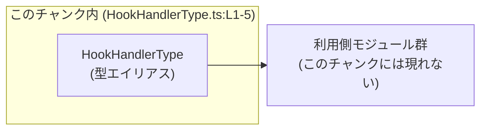
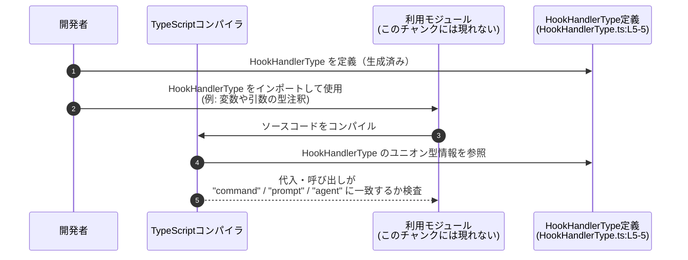

# app-server-protocol/schema/typescript/v2/HookHandlerType.ts

## 0. ざっくり一言

`HookHandlerType` は、フックハンドラーの「種類」を `"command" | "prompt" | "agent"` のいずれかに制約する TypeScript の文字列リテラル・ユニオン型を公開する、自動生成ファイルです（`HookHandlerType.ts:L1-5`）。

---

## 1. このモジュールの役割

### 1.1 概要

- このモジュールは、**フックハンドラーの種別を表す共通の型** を提供します。
- 自動生成された型エイリアス `HookHandlerType` により、利用側コードで扱う種別値を 3 つの文字列リテラルに限定します（`HookHandlerType.ts:L5-5`）。
- コメントにより、`ts-rs` ツールによる自動生成であり手動編集禁止であることが明示されています（`HookHandlerType.ts:L1-3`）。

### 1.2 アーキテクチャ内での位置づけ

このチャンク内では、`HookHandlerType` を定義してエクスポートするところまでが確認できます。どのモジュールがこの型を利用しているかは、このチャンクからは分かりません。



- `H`: 本ファイルで定義される型エイリアス `HookHandlerType`（`HookHandlerType.ts:L5-5`）。
- `U`: この型をインポートして利用するモジュール。具体的なファイル・モジュール名は、このチャンクには現れません。

### 1.3 設計上のポイント

- **自動生成コード**  
  - 先頭コメントで「GENERATED CODE」「Do not edit this file manually」と明示されています（`HookHandlerType.ts:L1-3`）。
  - 生成ツールとして `ts-rs` が使われていることが記載されています（`HookHandlerType.ts:L3-3`）。
- **型による値の制約**  
  - 通常の `string` ではなく `"command" | "prompt" | "agent"` という文字列リテラル・ユニオン型にすることで、コンパイル時に値をチェックできます（`HookHandlerType.ts:L5-5`）。
- **状態やロジックを持たない**  
  - 関数やクラスは定義されておらず、実行時ロジックや状態は持ちません（このチャンク全体）。
- **エラーハンドリングや並行性の要素はない**  
  - 型定義のみのため、実行時エラー処理や並行処理に関するコードは存在しません。

---

## 2. 主要な機能一覧

このファイルにおける「機能」は、型定義のみです。

- `HookHandlerType` 型エイリアス:  
  フックハンドラー種別を `"command" | "prompt" | "agent"` のいずれかに制限する公開型です（`HookHandlerType.ts:L5-5`）。

---

## 3. 公開 API と詳細解説

### 3.1 型一覧（構造体・列挙体など）

このチャンクに現れる公開型は 1 つです。

| 名前               | 種別         | 定義位置                     | 役割 / 用途                                                                 | 値のバリエーション                            |
|--------------------|--------------|------------------------------|------------------------------------------------------------------------------|-----------------------------------------------|
| `HookHandlerType`  | 型エイリアス | `HookHandlerType.ts:L5-5`   | フックハンドラーの種別を表す文字列リテラル・ユニオン型。利用側で種別を安全に表現するために使われます。 | `"command"` / `"prompt"` / `"agent"`         |

#### `HookHandlerType = "command" | "prompt" | "agent"`

**概要**

- 3 種類の文字列リテラル `"command"`, `"prompt"`, `"agent"` のいずれかだけを取れる型を定義しています（`HookHandlerType.ts:L5-5`）。
- これにより、`HookHandlerType` 型を付けた変数・引数・フィールドには、それ以外の文字列をコンパイル時に代入できなくなります。

**型の意味**

```typescript
export type HookHandlerType = "command" | "prompt" | "agent";
```

- 通常の `string` ではなく、**文字列リテラル・ユニオン型**になっています。
  - `type X = "a" | "b";` のように、取りうる値を列挙した型です。
- `export` が付いているため、他のモジュールからインポートして利用できます（`HookHandlerType.ts:L5-5`）。

**内部処理**

- 型エイリアスであり、実行時処理はありません。
- TypeScript コンパイラがコンパイル時に「その変数が `"command"` / `"prompt"` / `"agent"` のいずれかか」をチェックするための情報としてのみ使われます。

**Examples（使用例）**

> 以下は、このファイル外での典型的な使用方法の例です。インポートパスは同一ディレクトリにあると仮定したものです。

```typescript
// HookHandlerType をインポートする（同じディレクトリにある前提の例）
import type { HookHandlerType } from "./HookHandlerType";  // HookHandlerType.ts:L5-5 で定義された型を利用

// HookHandlerType を引数として受け取る関数の例
function registerHook(handlerType: HookHandlerType) {      // handlerType は "command" | "prompt" | "agent" のいずれかに限定
    // ここでは handlerType の具体的な扱いはこのチャンクからは分かりません
}

// 正しい使用例
const t1: HookHandlerType = "command";                     // OK: ユニオンの一要素
const t2: HookHandlerType = "prompt";                      // OK
const t3: HookHandlerType = "agent";                       // OK

// コンパイルエラーになる例
// const t4: HookHandlerType = "cmd";                      // NG: "cmd" はユニオンに含まれていないためコンパイルエラー
```

**Errors / Panics**

- この型自体は実行時コードを持たないため、直接エラーやパニックを発生させることはありません。
- TypeScript コンパイル時に、次のような型エラーが検出されます。
  - ユニオンに含まれない文字列を代入しようとした場合。
  - 関数の引数などで `HookHandlerType` を要求しているのに、一般の `string` を渡し、値が保証されていない場合。

**Edge cases（エッジケース）**

- `"command"`, `"prompt"`, `"agent"` 以外の文字列:  
  - 直接リテラルを代入した場合はコンパイルエラーになります。
  - 外部入力や `any` / `unknown` からの代入など、型システム外の経路による値は、ランタイムで別途検証する必要があります（これは TypeScript 全般の性質です）。
- 大文字・小文字の違い:  
  - `"Command"`, `"COMMAND"` など、綴りが一致しない文字列はユニオンに含まれないため、コンパイルエラーになります。

**使用上の注意点**

- **外部入力の検証が必要**  
  - 例えば JSON や HTTP リクエストから `"type"` フィールドを受け取る場合、TypeScript の型だけでは `"command" | "prompt" | "agent"` の値であることは保証されません。
  - ランタイムで `if (value === "command" || ...)` などのチェックを行い、そのうえで `HookHandlerType` として扱う必要があります。
- **手動編集禁止**  
  - コメントに「Do not edit this file manually」とあるため（`HookHandlerType.ts:L1-3`）、この型を変えたい場合は、生成元（ts-rs 側）の定義を変更し、再生成するのが前提と考えられます。

### 3.2 関数詳細（最大 7 件）

このファイルには関数定義は存在しません（このチャンク全体）。

### 3.3 その他の関数

- なし（このチャンクには関数やメソッドは定義されていません）。

---

## 4. データフロー

このファイル単体には実行時処理がないため、**実行時のデータフローは存在しません**。  
ただし、TypeScript の型チェックという観点では、次のような概念的なフローが想定されます（あくまで TypeScript の一般的挙動です）。



- この図は、**型定義がコンパイル時に参照されて値の妥当性が検査される**という、一般的な TypeScript の流れを示しています。
- 実際にどのモジュールが `HookHandlerType` を利用しているかは、このチャンクからは分かりません。

---

## 5. 使い方（How to Use）

### 5.1 基本的な使用方法

`HookHandlerType` を引数やフィールドの型として用い、取りうる値を 3 つに制限するのが基本的な利用方法です。

```typescript
// HookHandlerType をインポートする（同一ディレクトリ想定の相対パス例）
import type { HookHandlerType } from "./HookHandlerType";  // HookHandlerType.ts:L5-5

// Hook の設定を表す型の例
interface HookConfig {                                     // Hook の設定情報を表す（例）
    name: string;                                         // Hook の名前
    handlerType: HookHandlerType;                         // ハンドラー種別: "command" | "prompt" | "agent"
}

// 使用例
const config: HookConfig = {                              // HookConfig 型のオブジェクトを作成
    name: "sample",                                       // 任意の名前
    handlerType: "command",                               // OK: ユニオンの一要素
    // handlerType: "cmd",                                // NG: コンパイルエラー
};
```

### 5.2 よくある使用パターン

1. **関数の引数として種別を受け取る**

```typescript
import type { HookHandlerType } from "./HookHandlerType";  // 型をインポート

function executeHook(type: HookHandlerType) {              // 種別を引数で受け取る
    switch (type) {                                        // ユニオン型に対する switch
        case "command":
            // "command" 用の処理
            break;
        case "prompt":
            // "prompt" 用の処理
            break;
        case "agent":
            // "agent" 用の処理
            break;
        // default:  // ユニオンが網羅されていればここは不要にできる
    }
}
```

1. **外部入力の検証に使う（簡易例）**

```typescript
import type { HookHandlerType } from "./HookHandlerType";

// unknown な文字列を HookHandlerType に絞り込む型ガードの例
function isHookHandlerType(value: unknown): value is HookHandlerType {
    return value === "command" || value === "prompt" || value === "agent";
}

function fromExternalInput(raw: string): HookHandlerType | undefined {
    if (isHookHandlerType(raw)) {                          // ランタイムで値をチェック
        return raw;                                        // ここでは raw は HookHandlerType として扱える
    }
    return undefined;                                      // 不正な値の場合
}
```

### 5.3 よくある間違い

```typescript
import type { HookHandlerType } from "./HookHandlerType";

// 間違い例: 型注釈を付けず、一般の string として扱ってしまう
let handlerType1 = "command";          // 型は string。別の文字列も代入できてしまう
handlerType1 = "anything";             // コンパイル上は許可される

// 正しい例: HookHandlerType を付けて値を制約する
let handlerType2: HookHandlerType = "command";   // "command" | "prompt" | "agent" 以外は代入不可
// handlerType2 = "anything";                   // コンパイルエラーになる
```

- 型を付けないと `string` 型として扱われ、`"command"` 以外の値も通ってしまう点に注意が必要です。

### 5.4 使用上の注意点（まとめ）

- **型はコンパイル時のみ有効**  
  - JavaScript にトランスパイルされると型情報は消えるため、外部入力に対するチェックはランタイムで行う必要があります。
- **自動生成ファイルは直接編集しない**  
  - コメントで手動編集禁止が明示されているため（`HookHandlerType.ts:L1-3`）、値のバリエーションを増やす・変更する場合は、生成元（ts-rs 側）の定義を変更して再生成することが前提になります。

---

## 6. 変更の仕方（How to Modify）

### 6.1 新しい機能を追加する場合（例: 種別を増やしたい場合）

このファイルは `ts-rs` による自動生成と明記されているため（`HookHandlerType.ts:L1-3`）、直接編集するのではなく、**生成元の定義を変更して再生成する**のが前提と考えられます。

一般的な手順の例（このリポジトリ固有の構成はこのチャンクからは分かりません）:

1. `ts-rs` の生成元（通常は Rust 側の型定義など）で、フックハンドラー種別に対応する型に新しいバリアントを追加する。
2. `ts-rs` のコード生成コマンドを実行し、`HookHandlerType.ts` を再生成する。
3. 生成された `HookHandlerType` に新しい文字列リテラルが含まれていることを確認する。
4. 利用側コードで、新しい種別にも対応した処理を追加する。

### 6.2 既存の機能を変更する場合

- `"command"`, `"prompt"`, `"agent"` の文字列を変更・削除したい場合も、同様に**生成元定義の変更 → 再生成**が推奨されます。
- 変更時の注意点:
  - 既存の利用箇所（`switch` 文、比較など）が新しいユニオンに対応しているかを確認します。
  - TypeScript のコンパイルエラーが、修正漏れ箇所の検出に役立ちます。
  - 文字列リテラル名を変更すると、既存のデータファイルや外部 API との整合性が崩れる可能性があるため、外部との契約がある場合は特に注意が必要です（この点は、このチャンクからは存在の有無は分かりません）。

---

## 7. 関連ファイル

このチャンクから直接参照できるのはこのファイル自身のみですが、コメントから以下のような関連が推測されます。

| パス / 種別                          | 役割 / 関係 |
|--------------------------------------|-------------|
| `app-server-protocol/schema/typescript/v2/HookHandlerType.ts` | 本ファイル。`HookHandlerType` 型エイリアスの定義を提供する（`HookHandlerType.ts:L5-5`）。 |
| （生成元 Rust コード / ts-rs 設定）*ファイル名不明* | コメントにある `ts-rs` により本ファイルが生成されていると記載されていますが、具体的な生成元ファイル名やパスはこのチャンクには現れません（`HookHandlerType.ts:L3-3`）。 |

> このチャンクにはテストコードや他の TypeScript ファイルへの具体的な参照が含まれていないため、より詳細な依存関係やデータフローは、このファイルだけからは分かりません。
