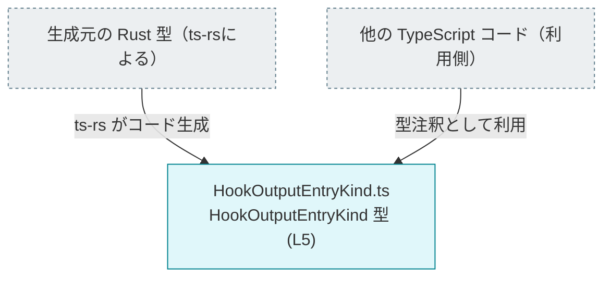
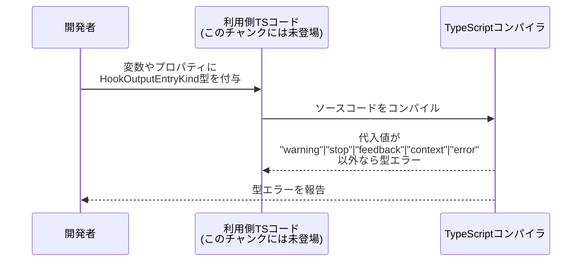

# app-server-protocol/schema/typescript/v2/HookOutputEntryKind.ts コード解説

## 0. ざっくり一言

- Hook（フック）の出力エントリの「種類」を、5 種類の文字列リテラルに限定して表現する TypeScript の型エイリアスを定義した、自動生成ファイルです（根拠: `HookOutputEntryKind.ts:L1-3, L5-5`）。

---

## 1. このモジュールの役割

### 1.1 概要

- このモジュールは、Hook の出力エントリに付与される種別を表す `HookOutputEntryKind` 型を提供します（根拠: `HookOutputEntryKind.ts:L5-5`）。
- `HookOutputEntryKind` は `"warning" | "stop" | "feedback" | "context" | "error"` の 5 つの文字列のいずれかだけを許容する、文字列リテラル・ユニオン型です（根拠: `HookOutputEntryKind.ts:L5-5`）。
- ファイル全体は `ts-rs` によって自動生成されており、手動編集しないことが明示されています（根拠: `HookOutputEntryKind.ts:L1-3`）。

### 1.2 アーキテクチャ内での位置づけ

コメントから、この型は Rust コードから `ts-rs` により生成された TypeScript スキーマの一部であることが分かります（根拠: `HookOutputEntryKind.ts:L1-3`）。  
他にどのモジュールから利用されているかは、このチャンクには現れません。

概念的な位置づけを示す依存関係図は次のとおりです。



- `RustModel` はコメントから存在が推測できる「生成元の Rust 型」です（根拠: `HookOutputEntryKind.ts:L1-3`）。
- `Consumer`（利用側の TypeScript コード）がどこにあるか、実際に存在するかは、このチャンクには現れません。ここでは一般的な利用イメージとして示しています。

### 1.3 設計上のポイント

- **自動生成ファイル**  
  - 冒頭コメントにより、「手動で編集してはならない自動生成ファイル」であることが明示されています（根拠: `HookOutputEntryKind.ts:L1-3`）。
  - 変更は生成元（Rust 側の型定義）で行う前提の設計です。
- **文字列リテラル・ユニオン型による限定**  
  - `HookOutputEntryKind` は 5 種類の文字列リテラルに限定されたユニオン型として定義されており、任意の `string` ではなく特定の値だけを許容します（根拠: `HookOutputEntryKind.ts:L5-5`）。
  - これにより、TypeScript のコンパイル時に値のミススペルなどを検出できます。
- **状態やロジックを持たない**  
  - このファイルには関数やクラス、実行時ロジックは一切含まれておらず、型情報のみを提供します（根拠: `HookOutputEntryKind.ts:L5-5`）。
  - したがって、実行時エラー処理・並行性（並列実行）・パフォーマンスに関する考慮は、このファイル単体では不要です。

---

## 2. 主要な機能一覧

- `HookOutputEntryKind` 型の定義: Hook 出力エントリの「種類」を `"warning" | "stop" | "feedback" | "context" | "error"` の 5 値に限定する文字列リテラル・ユニオン型（根拠: `HookOutputEntryKind.ts:L5-5`）。

---

## 3. 公開 API と詳細解説

### 3.1 型一覧（構造体・列挙体など）―コンポーネントインベントリー

このファイルで定義されている公開コンポーネントは 1 つです。

| 名前                  | 種別                               | 役割 / 用途                                                                                                     | 定義箇所（根拠）                 |
|-----------------------|------------------------------------|------------------------------------------------------------------------------------------------------------------|-----------------------------------|
| `HookOutputEntryKind` | 型エイリアス（文字列リテラル・ユニオン） | Hook の出力エントリの種別を表す型。値を `"warning"`, `"stop"`, `"feedback"`, `"context"`, `"error"` のいずれかに限定する。 | `HookOutputEntryKind.ts:L5-5` |

#### `HookOutputEntryKind` の意味

- 許容される値（すべて文字列リテラル）:
  - `"warning"`
  - `"stop"`
  - `"feedback"`
  - `"context"`
  - `"error"`  
  （根拠: `HookOutputEntryKind.ts:L5-5`）

これ以外の文字列は `HookOutputEntryKind` 型としてはコンパイルエラーになります（TypeScript の言語仕様上の性質です）。

### 3.2 関数詳細（最大 7 件）

- このファイルには関数・メソッドは定義されていません（根拠: `HookOutputEntryKind.ts:L1-5`）。
- したがって、関数に関するエラー条件・エッジケース・並行性上の注意点は、このモジュール単体では存在しません。

### 3.3 その他の関数

- 補助関数やラッパー関数も定義されていません（根拠: `HookOutputEntryKind.ts:L1-5`）。

---

## 4. データフロー

このファイルには実行時の処理はなく、型定義のみが存在します。  
したがって、**実行時データフロー**は直接はありませんが、**コンパイル時にどのように使われるか**という観点で概念的なフローを示します。



- 上記の「利用側 TS コード」は、このチャンクには現れません。一般的な TypeScript の利用スタイルを示した概念図です。
- 型エラーはコンパイル時に検出されるため、実行時の例外やセキュリティ問題に直接つながる処理は、このファイル単体では存在しません。

---

## 5. 使い方（How to Use）

### 5.1 基本的な使用方法

`HookOutputEntryKind` を他の TypeScript ファイルから import して、変数・関数の引数・戻り値・オブジェクトのプロパティなどに型として付与します。

> パスはプロジェクト内の実際の配置に合わせて調整する必要があります。ここでは同一ディレクトリからの相対パスの一例です。

```typescript
// HookOutputEntryKind 型を型としてインポートする例
import type { HookOutputEntryKind } from "./HookOutputEntryKind";  // 実際のパスは構成に応じて変更

// Hook の結果エントリを表すインターフェースの例
interface HookOutputEntry {                                              // Hook の出力1件を表す型の例
    kind: HookOutputEntryKind;                                          // 種別: "warning" 等のいずれか
    message: string;                                                    // メッセージ本文
}

// HookOutputEntryKind を引数に取る関数の例
function handleHookEntry(entry: HookOutputEntry) {                      // HookOutputEntry を受け取る関数
    if (entry.kind === "warning") {                                     // "warning" の場合のハンドリング
        console.warn(entry.message);
    } else if (entry.kind === "error") {                                // "error" の場合のハンドリング
        console.error(entry.message);
    } else {
        console.log(entry.message);                                     // その他は情報としてログ出力
    }
}
```

- `"warn"` など定義されていない文字列を `kind` に代入しようとすると、コンパイル時に型エラーとなります。これは `HookOutputEntryKind` が文字列リテラル・ユニオン型であるためです（根拠: `HookOutputEntryKind.ts:L5-5`）。

### 5.2 よくある使用パターン

1. **プロパティとして利用する**

```typescript
import type { HookOutputEntryKind } from "./HookOutputEntryKind";

interface HookResult {                                                  // Hook 全体の結果の例
    entries: {
        kind: HookOutputEntryKind;                                      // 各エントリの種別
        message: string;
    }[];
}
```

1. **関数のパラメータ・戻り値として利用する**

```typescript
import type { HookOutputEntryKind } from "./HookOutputEntryKind";

// HookOutputEntryKind を返す関数の例
function decideNextAction(kind: HookOutputEntryKind): HookOutputEntryKind {
    if (kind === "error") {
        return "stop";                                                  // 許容されたリテラルなのでコンパイル成功
    }
    return kind;                                                        // そのまま返す
}
```

1. **判別可能な共用体（discriminated union）の判別キーとして利用する**

```typescript
import type { HookOutputEntryKind } from "./HookOutputEntryKind";

type HookEntry =
    | { kind: "warning";  message: string; }
    | { kind: "stop";     message: string; }
    | { kind: "feedback"; message: string; }
    | { kind: "context";  message: string; }
    | { kind: "error";    message: string; };

function process(entry: HookEntry) {
    switch (entry.kind) {                                               // kind による分岐
        case "warning":
            // ...
            break;
        case "stop":
            // ...
            break;
        // 他のケースも同様
    }
}
```

- 判別可能な共用体のキーとして `HookOutputEntryKind` の値がそのまま使えるため、分岐の漏れなども TypeScript のチェックで検出しやすくなります。

### 5.3 よくある間違い

#### 1. 任意の `string` 型を使ってしまう

```typescript
// 間違い例: 種別を string 型で定義してしまう
interface BadHookEntry {
    kind: string;                                   // 何でも入ってしまい、型安全性が低い
    message: string;
}
```

```typescript
// 正しい例: HookOutputEntryKind を利用して種別を限定する
import type { HookOutputEntryKind } from "./HookOutputEntryKind";

interface GoodHookEntry {
    kind: HookOutputEntryKind;                      // "warning" 等の5値に限定
    message: string;
}
```

#### 2. 定義されていない文字列リテラルを使う

```typescript
import type { HookOutputEntryKind } from "./HookOutputEntryKind";

const kind: HookOutputEntryKind = "warn";          // 間違い例: "warn" は型に含まれない → コンパイルエラー
//                      ~~
// Type '"warn"' is not assignable to type 'HookOutputEntryKind'.
```

```typescript
const kind2: HookOutputEntryKind = "warning";      // 正しい例: 型が許容する値
```

- このようなコンパイルエラーにより、タイポや仕様外値の利用が実行前に検出され、バグ・セキュリティ問題の発生を抑制できます。

### 5.4 使用上の注意点（まとめ）

- **自動生成ファイルを直接編集しないこと**  
  - コメントに「手動で変更してはならない」と明記されています（根拠: `HookOutputEntryKind.ts:L1-3`）。  
    直接編集すると、生成元の Rust 型との不整合が生じるおそれがあります。
- **許容される値は 5 種類のみ**  
  - `"warning"`, `"stop"`, `"feedback"`, `"context"`, `"error"` 以外の文字列は `HookOutputEntryKind` として利用できません（根拠: `HookOutputEntryKind.ts:L5-5`）。
- **実行時には型情報が失われる点に注意**  
  - TypeScript の型はコンパイル時のみ存在し、実行時には JavaScript になります。  
    実行時に値の妥当性検証を行う場合は別途ランタイムチェック（例えば `if (kind === "warning" || kind === "stop" ... )`）が必要です。
- **並行性・スレッド安全性に関する特別な注意点はない**  
  - 型定義のみであり、共有状態やミューテーションを含まないため、このファイル自体が並行性問題の原因になることはありません。

---

## 6. 変更の仕方（How to Modify）

### 6.1 新しい機能を追加する場合（新しい種類の追加など）

このファイルは `ts-rs` により自動生成されるため、**直接編集せず生成元である Rust 側の型定義を変更する**必要があります（根拠: `HookOutputEntryKind.ts:L1-3`）。

一般的な手順は次のようになります（Rust 側の具体的な型名などは、このチャンクには現れないため不明です）。

1. **生成元の Rust 型を探す**
   - `ts-rs` で TypeScript が生成されていることから、対応する Rust の型（おそらく enum など）が存在します（根拠: `HookOutputEntryKind.ts:L1-3`）。
   - プロジェクト内で `HookOutputEntryKind` に相当する Rust 型を検索します。
2. **Rust 型に新しいバリアント（種類）を追加する**
   - 例として、新しい種類 `"info"` を追加したい場合、Rust 側の enum に情報用のバリアントを追加します。
3. **`ts-rs` によるコード生成を再実行する**
   - ビルドスクリプトや専用コマンドなど、プロジェクトの手順に従い TypeScript スキーマの再生成を行います。
4. **生成された `HookOutputEntryKind.ts` を確認する**
   - 新しい文字列リテラルがユニオン型に追加されていることを確認します。
5. **利用側 TypeScript コードで新しい種類に対応する**
   - `switch` 文や `if` 分岐で新しい種類に対する処理を追加します。

### 6.2 既存の機能を変更する場合

既存の文字列リテラルや意味を変える場合も、同様に **Rust 側の型を変更し、`ts-rs` により再生成**する必要があります。

変更時に注意すべき点:

- **契約（前提条件）の変更**
  - 既存の `"warning"` などの値名を変更・削除すると、TypeScript 側の利用箇所がコンパイルエラーになります。  
    このエラーを手掛かりに、すべての利用箇所を更新する必要があります。
- **後方互換性**
  - プロトコルとして外部クライアントと通信している場合、既存の値を削除・変更すると互換性に影響する可能性があります。  
    この点はプロジェクト全体の仕様に依存し、このチャンクだけからは判断できません。
- **テスト**
  - このファイル自体にはテストコードは含まれていません（根拠: `HookOutputEntryKind.ts:L1-5`）。  
    実際のテストの有無・内容は、このチャンクには現れないため不明です。変更後は関連テストを確認・追加することが望ましいです。

---

## 7. 関連ファイル

このチャンクには他ファイルの具体的な一覧は現れませんが、ファイルパスから、同じディレクトリに関連するスキーマ定義が存在することが推測できます。

| パス                                            | 役割 / 関係 |
|-------------------------------------------------|------------|
| `app-server-protocol/schema/typescript/v2`      | TypeScript で表現された app-server プロトコル v2 のスキーマを含むディレクトリ。本ファイル `HookOutputEntryKind.ts` もその 1 つです（ディレクトリ構成から判断）。他の具体的なファイル名や内容は、このチャンクには現れません。 |

- 生成元の Rust ファイル（`ts-rs` により TypeScript を生成している側）のパス・型名は、このチャンクには現れないため不明です。ただし、コメントから「存在する」こと自体は分かります（根拠: `HookOutputEntryKind.ts:L1-3`）。

---

### まとめ（安全性・エッジケース・性能などの観点）

- **安全性 / バグ防止**
  - 文字列リテラル・ユニオン型により、種別のタイポや仕様外値の利用をコンパイル時に検出できます（根拠: `HookOutputEntryKind.ts:L5-5`）。
- **エッジケース**
  - `HookOutputEntryKind` 型として宣言された変数に、定義されていない文字列を代入しようとするとコンパイルエラーになります。  
    それ以外の実行時エッジケースは、この型定義単体には存在しません。
- **セキュリティ**
  - このファイルは型定義のみであり、入出力処理や権限チェックなどは含まれていません。  
    直接的なセキュリティリスクはありませんが、実行時に外部から受け取るデータをこの型に合わせて検証する実装は別途必要です。
- **性能 / スケーラビリティ**
  - TypeScript の型定義であり、実行時のパフォーマンスへの影響はありません。  
    コンパイル時の型チェックにのみ影響しますが、この程度の小さなユニオン型は通常問題になりません。
- **監視・ログ（オブザーバビリティ）**
  - ログ出力やメトリクス収集などの仕組みはこのファイルには含まれていません。  
    それらは `HookOutputEntryKind` を利用する側のコードで実装されることになります。
