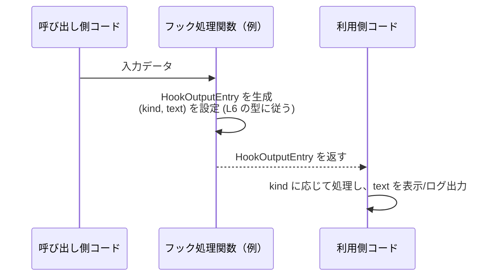

# app-server-protocol/schema/typescript/v2/HookOutputEntry.ts コード解説

## 0. ざっくり一言

- フック処理の出力エントリを表す TypeScript の**型エイリアス** `HookOutputEntry` を 1 つだけ定義しているファイルです（HookOutputEntry.ts:L6）。
- Rust 側から `ts-rs` で自動生成された、**アプリケーションサーバープロトコル用のスキーマ型**であり、手動で編集しないことが明示されています（HookOutputEntry.ts:L1-3）。

---

## 1. このモジュールの役割

### 1.1 概要

- このモジュールは、`HookOutputEntry` 型を通して「`kind` と `text` を持つオブジェクト」の構造を表現します（HookOutputEntry.ts:L6）。
- コメントから、この型は `ts-rs` によって他言語（一般には Rust）から自動生成されたものであり、**プロトコルのスキーマ定義**として利用されることが分かります（HookOutputEntry.ts:L1-3）。
- 型名から、フック処理の「出力 1 件」を表す用途で使われると解釈できますが、用途の詳細はこのチャンクには現れていません。

### 1.2 アーキテクチャ内での位置づけ

- ディレクトリ構成 `app-server-protocol/schema/typescript/v2` から、アプリケーションサーバーとの通信プロトコルの **TypeScript 用スキーマ群の一部**と位置づけられます。
- このファイルは `HookOutputEntryKind` 型に依存しており（HookOutputEntry.ts:L4）、`kind` フィールドの型として利用します（HookOutputEntry.ts:L6）。
- このファイルを利用する側（別ファイル）は、この `HookOutputEntry` 型を import して型注釈に使うと考えられますが、その具体的なファイルはこのチャンクには現れません。

```mermaid
graph TD
  subgraph "schema/typescript/v2 (HookOutputEntry.ts:L1-6)"
    HOE["HookOutputEntry.ts\nHookOutputEntry 型"]
    HOEK["HookOutputEntryKind.ts\nHookOutputEntryKind 型（別ファイル）"]
  end

  HOE -->|import type (L4)| HOEK
```

> この図は、`HookOutputEntry.ts` が `HookOutputEntryKind.ts` に型レベルで依存していること（`import type`）を示します。`HookOutputEntryKind` の具体的な定義はこのチャンクには現れません。

### 1.3 設計上のポイント

- **型のみ定義し、実行時コードを持たない**
  - `export type HookOutputEntry = { ... }` という型エイリアス定義のみで、関数やクラスはありません（HookOutputEntry.ts:L6）。
- **型専用の import**
  - `import type` を使うことで、`HookOutputEntryKind` の import がコンパイル後には消え、実行時には依存を持たない設計になっています（HookOutputEntry.ts:L4）。
- **自動生成コードであることの明示**
  - コメントで「GENERATED CODE」「Do not edit this file manually」と明示されており（HookOutputEntry.ts:L1, L3）、人手での変更ではなく生成元（通常は Rust コードや ts-rs の設定）を変更する前提になっています。

---

## 2. 主要な機能一覧

このファイルは関数を含まず、1 つの公開型だけを提供します。

- `HookOutputEntry` 型:  
  - `kind: HookOutputEntryKind` と `text: string` を持つオブジェクトの構造を表現する型エイリアスです（HookOutputEntry.ts:L6）。

---

## 3. 公開 API と詳細解説

### 3.1 型一覧（構造体・列挙体など）

| 名前                | 種別           | 役割 / 用途                                                                                                  | 根拠 |
|---------------------|----------------|--------------------------------------------------------------------------------------------------------------|------|
| `HookOutputEntry`   | 型エイリアス   | `kind` と `text` を持つオブジェクトの型。フック出力 1 件を表すエントリとして利用されると解釈できます。       | HookOutputEntry.ts:L6 |
| `HookOutputEntryKind` | 外部型（import） | `HookOutputEntry.kind` フィールドの型として利用される、エントリ種別を表す型。定義内容はこのチャンクには現れません。 | HookOutputEntry.ts:L4 |

#### `HookOutputEntry` 型の詳細

**概要**

- `HookOutputEntry` は、次の 2 つのプロパティを持つオブジェクト型です（HookOutputEntry.ts:L6）。
  - `kind: HookOutputEntryKind`
  - `text: string`

**フィールド**

| フィールド名 | 型                    | 説明 |
|-------------|-----------------------|------|
| `kind`      | `HookOutputEntryKind` | エントリの種別を表す型です。具体的なバリエーションはこのチャンクには現れませんが、enum 的な用途が想定されます。（HookOutputEntry.ts:L6） |
| `text`      | `string`              | このエントリに紐づくテキストメッセージです（HookOutputEntry.ts:L6）。空文字列の扱いなどの意味付けはこのチャンクには現れません。 |

**型としての役割**

- TypeScript の**構造的型付け**に基づき、`kind` と `text` を必須プロパティとして持つオブジェクトであれば `HookOutputEntry` として扱えます。
- `ts-rs` によって生成されているため（HookOutputEntry.ts:L1-3）、対応する Rust 側の型とフィールド名・型が一致していることが期待されますが、対応する Rust 型の詳細はこのチャンクには現れません。

**Errors / Panics / 型安全性**

- `HookOutputEntry` は型定義のみであり、直接エラーや例外を投げることはありません。
- TypeScript コンパイラは以下のような誤用を検出します。
  - `text` に `number` を代入しようとした場合の型エラー
  - `kind` を省略したオブジェクトを `HookOutputEntry` として扱おうとした場合の型エラー
- 逆に、`as any` や型アサーション（`as HookOutputEntry`）を多用すると、この型による安全性が失われる可能性があります。

**Edge cases（エッジケース）**

この型は構造のみを決めており、値そのものの制約は表現していません。

- `text` が空文字列 `""` の場合
  - 型としては許容されます。空文字の意味（ログ抑制、無意味など）はこのチャンクには現れません。
- `kind` に不正な値（本来のバリエーションに含まれない値）が入る場合
  - TypeScript の型チェックが通る範囲では問題ありませんが、実際のプロトコルやサーバ側の処理と齟齬が生じる可能性があります。
  - `HookOutputEntryKind` の具体的な定義がないため、このチャンクからは詳細は不明です。
- 追加プロパティ
  - TypeScript の構造的型付けにより、`{ kind, text, extra: 1 }` のようなオブジェクトもコンパイラ設定によっては `HookOutputEntry` として扱える場合があります。  
    実際のシリアライズ／デシリアライズやサーバ側での処理が追加プロパティをどう扱うかは、このチャンクには現れません。

**使用上の注意点**

- このファイルはコメントで「DO NOT MODIFY BY HAND」と明示されているため（HookOutputEntry.ts:L1, L3）、**直接編集しないことが前提**です。
- 形だけ `HookOutputEntry` に合わせたオブジェクトを作っても、`kind` の値がサーバや他コンポーネントの想定と合わなければ、**論理的なバグ**につながる可能性があります。
- Protocol 用の型として生成されている可能性が高いため、後方互換性を考慮せずにフィールドを追加・削除すると、他言語側との通信で不整合が発生するおそれがあります。  
  ただし、具体的なプロトコル仕様はこのチャンクには現れません。

### 3.2 関数詳細（最大 7 件）

- このファイルには関数やメソッドの定義はありません（HookOutputEntry.ts:L1-6）。
- そのため、関数詳細テンプレートを適用できる公開 API は**存在しません**。

### 3.3 その他の関数

- 補助関数やラッパー関数も、このチャンクには一切現れません（HookOutputEntry.ts:L1-6）。

---

## 4. データフロー

このファイル単体には関数がなく、実行時の処理フローは記述されていません。  
ここでは、**`HookOutputEntry` 型の利用を前提にした一般的なデータの流れの例**を示します。これは典型的な TypeScript コードパターンの説明であり、実際のアプリケーション構造はこのチャンクからは分かりません。

- 呼び出しコードが、フック処理の結果として `HookOutputEntry` 型のオブジェクトを生成する。
- そのオブジェクトが、別のモジュールや通信層に渡される。
- 受け取った側は `kind` に応じて処理分岐し、`text` をログやメッセージ表示に使用する。



> この図は、`HookOutputEntry` 型（HookOutputEntry.ts:L6）を返り値や中間データとして利用する典型的なイメージを示したものです。実際にどの関数がこれを返すかは、このチャンクには現れません。

---

## 5. 使い方（How to Use）

### 5.1 基本的な使用方法

`HookOutputEntry` は**型エイリアス**なので、`new` ではなくオブジェクトリテラルで値を作成します。  
具体的な `HookOutputEntryKind` のバリエーションが不明なため、ここでは「引数として受け取る」形の例を示します。

```typescript
// HookOutputEntry.ts と HookOutputEntryKind.ts から型を import する例  // HookOutputEntry.ts:L4, L6 に対応
import type { HookOutputEntry } from "./HookOutputEntry";         // HookOutputEntry 型だけを型レベルで import
import type { HookOutputEntryKind } from "./HookOutputEntryKind"; // kind 用の型を import（定義は別ファイル）

// フック処理の結果として HookOutputEntry を組み立てる関数の例
function buildHookOutput(kind: HookOutputEntryKind, message: string): HookOutputEntry {
    // kind: HookOutputEntryKind と message: string から
    // HookOutputEntry 型に合致するオブジェクトを返す
    return {
        kind,          // kind フィールド（HookOutputEntry.ts:L6）
        text: message, // text フィールド（HookOutputEntry.ts:L6）
    };
}
```

このように、`HookOutputEntry` は**型注釈**として使われ、オブジェクトの形を静的に保証します。

### 5.2 よくある使用パターン

このチャンクから直接は分かりませんが、型構造から想定できる典型的な利用パターンを挙げます。

1. **フック処理の戻り値として利用**

   ```typescript
   import type { HookOutputEntry } from "./HookOutputEntry";
   import type { HookOutputEntryKind } from "./HookOutputEntryKind";

   // フック処理のインターフェース例
   type HookFn = (input: unknown) => HookOutputEntry;

   // HookOutputEntry を返す実装例
   const hook: HookFn = (input) => {
       const kind: HookOutputEntryKind = determineKind(input); // determineKind の詳細はこのファイルからは不明
       return { kind, text: String(input) };
   };
   ```

2. **ログや UI 表示のためのデータ構造として利用**

   ```typescript
   import type { HookOutputEntry } from "./HookOutputEntry";

   function renderHookOutput(entry: HookOutputEntry) {
       // kind に応じたスタイル分岐などを行うイメージ
       console.log(`[${String(entry.kind)}] ${entry.text}`);
   }
   ```

### 5.3 よくある間違い

この型に関して起こりやすい誤用例と、それに対する正しい例です。

```typescript
import type { HookOutputEntry } from "./HookOutputEntry";
import type { HookOutputEntryKind } from "./HookOutputEntryKind";

declare const kind: HookOutputEntryKind;

// 間違い例: プロパティ名のタイプミス
const wrongEntry: HookOutputEntry = {
    kind,
    txt: "メッセージ", // エラー: 'txt' プロパティは型 'HookOutputEntry' に存在しない
};

// 正しい例: 定義どおり 'text' プロパティを使う
const correctEntry: HookOutputEntry = {
    kind,
    text: "メッセージ", // OK: HookOutputEntry の { kind, text } に一致
};
```

```typescript
// 間違い例: any を経由して型安全性を失う
const fromAny: any = { kind: 123, text: 456 };     // any 型のオブジェクト
const unsafe: HookOutputEntry = fromAny;           // コンパイルは通るが実行時には想定外の構造かもしれない

// より安全な例: 型を明示しながら変換する
function toHookOutput(kind: HookOutputEntryKind, message: string): HookOutputEntry {
    return { kind, text: message };                // コンパイル時に型チェックされる
}
```

### 5.4 使用上の注意点（まとめ）

- **直接編集しない**
  - コメントで手動編集禁止が明示されているため（HookOutputEntry.ts:L1, L3）、**生成元（通常は Rust コード）を変更して再生成する**前提で利用する必要があります。
- **型アサーションの乱用を避ける**
  - `as HookOutputEntry` や `as any` を多用すると、本来 TypeScript が検出してくれるはずの不一致（`text` が string でないなど）を見逃す可能性があります。
- **プロトコル互換性への配慮**
  - フィールド名や型は、対応する他言語側（Rust など）と同期していることが期待されます。片側だけを変更すると、シリアライズ／デシリアライズ時にエラーやデータ欠落を招く可能性があります。  
    ただし、具体的なプロトコル仕様や他言語側の実装は、このチャンクには現れません。
- **並行性・スレッド安全性**
  - この型自体は**単なる不変オブジェクトの構造**を表すだけであり、状態やミューテーションを含まないため、並行性に関する特別な注意点はありません。

---

## 6. 変更の仕方（How to Modify）

### 6.1 新しい機能を追加する場合

このファイルは `ts-rs` による自動生成コードであり、コメントにも「Do not edit this file manually」と明記されています（HookOutputEntry.ts:L1, L3）。  
そのため、「このファイルを直接編集して機能追加する」ことは想定されていません。

一般的な変更手順は次のようになります（ts-rs の一般的な使い方に基づく説明であり、このリポジトリ固有の構成はこのチャンクからは分かりません）。

1. **生成元の Rust 側の型定義を特定する**
   - 通常、`#[ts_rs::TS]` 属性が付いた Rust の構造体や enum が存在しますが、そのファイルパスや型名はこのチャンクには現れません。
2. **Rust 側でフィールド追加や型変更を行う**
   - 例: フィールド `details: String` を追加するなど。
3. **ts-rs を使って TypeScript の型を再生成する**
   - ビルドスクリプトや専用コマンドにより、この `HookOutputEntry.ts` が上書きされます。
4. **TypeScript 側の利用箇所を更新する**
   - 新しく追加したフィールドを参照したり、必須フィールドの追加に合わせて生成コード側の修正を行います。

### 6.2 既存の機能を変更する場合

既存の `HookOutputEntry` 型構造（`kind`, `text`）を変更する場合も、基本的には**生成元の型を変更する**ことになります。

注意すべき点:

- **影響範囲の確認**
  - `HookOutputEntry` を import している TypeScript ファイル全体に影響します。  
    ただし、どのファイルが利用しているかはこのチャンクには現れません。
- **契約（コントラクト）の維持**
  - プロトコル型として使われている場合、フィールド名や必須／任意の違いは外部システムとの契約に直結します。
  - フィールド削除や型変更は、互換性の有無を検討した上で行う必要があります。
- **テスト**
  - このチャンクにはテストコードは現れませんが、実際にはサーバーとクライアント間のプロトコルテストや型生成テストが影響を受けると考えられます。  

---

## 7. 関連ファイル

このチャンクから確実に読み取れる関連ファイルは次のとおりです。

| パス                                         | 役割 / 関係 |
|----------------------------------------------|------------|
| `schema/typescript/v2/HookOutputEntryKind.ts` | `HookOutputEntryKind` 型を定義していると考えられるファイルです。`HookOutputEntry.ts` から `import type { HookOutputEntryKind } from "./HookOutputEntryKind";` として参照されています（HookOutputEntry.ts:L4）。中身はこのチャンクには現れません。 |
| Rust 側の対応する型定義ファイル            | `ts-rs` によってこの TypeScript 型を生成している元の Rust 型が存在すると考えられますが、その具体的なパスや型名はこのチャンクには現れません（コメントのみからの一般的推測）。 |

---

## Bugs / Security / Tests / パフォーマンスなど（まとめ）

このファイルは非常に小さく、型定義のみを含むため、各観点は次のように整理できます。

- **Bugs**
  - ファイル自体が原因となるバグは考えにくく、主に生成元との不整合や、利用側での不適切な型アサーションがバグの原因となります。
- **Security**
  - `text` フィールドにどのような文字列が入るか次第で、ログインジェクションや XSS などのリスクが生じうるかどうかが決まりますが、その利用方法はこのチャンクには現れません。
- **Contracts / Edge Cases**
  - 契約として、`kind` は `HookOutputEntryKind` 型、`text` は `string` であることが要求されます（HookOutputEntry.ts:L6）。
  - 空文字列や予期しない `kind` の値は、型レベルでは許容される可能性がありますが、ビジネスロジック上の扱いは不明です。
- **Tests**
  - このチャンクにはテストコードは存在しません。プロトコル全体のテストで間接的にカバーされることが一般的です。
- **Performance / Scalability**
  - 型定義のみで実行時コストはありません。大量の `HookOutputEntry` を扱う場合でも、その性能は主に利用側のロジックに依存します。
- **Tradeoffs**
  - `import type` により、ランタイム依存を減らしつつ型安全性を保つ設計になっています（HookOutputEntry.ts:L4）。
- **Refactoring**
  - フィールド名や型を変更する場合は、生成元（Rust 側）と全利用箇所を同時に追従させる必要があります。
- **Observability**
  - この型はログや UI 表示など、観測可能なイベントの表現に使われる可能性がありますが、その具体的な用途はこのチャンクには現れません。型としては、観測情報の構造を統一するための役割を担います。
