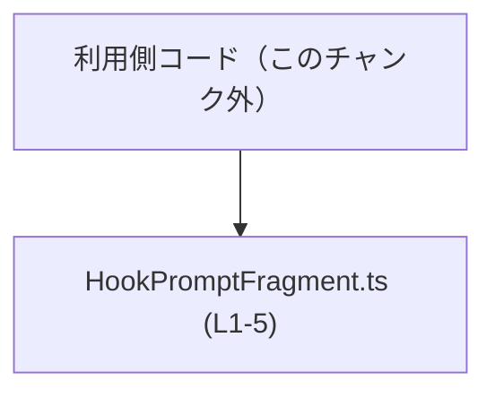
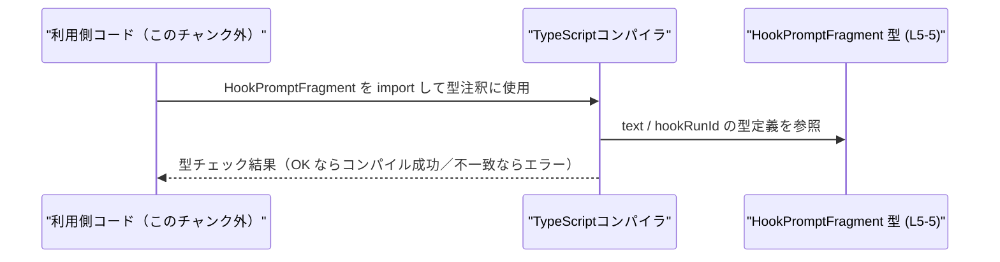

# app-server-protocol/schema/typescript/v2/HookPromptFragment.ts

## 0. ざっくり一言

`HookPromptFragment` という TypeScript の型エイリアスを 1 つだけ公開する、自動生成ファイルです。  
`text` と `hookRunId` の 2 つの `string` フィールドを持つオブジェクト構造を表現します（根拠: HookPromptFragment.ts:L5-5）。

---

## 1. このモジュールの役割

### 1.1 概要

- このモジュールは、`HookPromptFragment` と呼ばれるデータ構造を TypeScript 側で表現するために存在しています（HookPromptFragment.ts:L5-5）。
- ファイル全体は `ts-rs` によって生成されており、手動編集しないことが明示されています（HookPromptFragment.ts:L1-3）。
- ランタイム処理や関数は一切含まれず、静的型情報のみを提供します（HookPromptFragment.ts:全行）。

### 1.2 アーキテクチャ内での位置づけ

- このファイルは他のモジュールを `import` しておらず、依存先はありません（HookPromptFragment.ts:全行）。
- 逆に、他モジュールからは `HookPromptFragment` 型が `import` され、フロントエンドやクライアントコードで型注釈として利用されることが想定されますが、具体的な呼び出し元はこのチャンクには現れません。

代表的な依存関係イメージ（利用側は抽象的に表現）:



### 1.3 設計上のポイント

- **自動生成コード**  
  - 冒頭コメントで「GENERATED CODE」「Do not edit this file manually」と明示されています（HookPromptFragment.ts:L1-3）。
- **責務の限定**  
  - データ構造の宣言のみを行い、ビジネスロジックは持ちません（HookPromptFragment.ts:L5-5）。
- **状態・並行性**  
  - 型エイリアスのみのため、内部状態やミューテーションは存在しません。並行性（並行実行）に関する懸念もこの型自体にはありません。
- **エラーハンドリング**  
  - ランタイムコードがないため、エラー処理は型レベルのチェック（コンパイル時の型不一致エラー）のみが対象です。

---

## 2. 主要な機能一覧

このファイルが提供する機能は 1 点に集約されます。

- `HookPromptFragment` 型定義: `text` と `hookRunId` を持つオブジェクトの型を定義する（HookPromptFragment.ts:L5-5）。

---

## 3. 公開 API と詳細解説

### 3.1 型一覧（構造体・列挙体など）

| 名前                 | 種別        | フィールド                                       | 役割 / 用途                                                                 | 定義位置                         |
|----------------------|-------------|--------------------------------------------------|-------------------------------------------------------------------------------|----------------------------------|
| `HookPromptFragment` | 型エイリアス | `text: string`, `hookRunId: string`             | フック実行に関連するテキスト断片と、その実行 ID を表すオブジェクト構造を表現 | HookPromptFragment.ts:L5-5 |

補足（フィールド単位の意味はコードから読み取れる範囲での解釈です）:

- `text: string`  
  - 何らかのプロンプトやメッセージのテキスト本体を表す文字列と解釈できますが、用途の詳細はこのチャンクからは分かりません（HookPromptFragment.ts:L5-5）。
- `hookRunId: string`  
  - テキストが紐づく「フック実行（hook run）」の ID を表す識別子と考えられますが、具体的な形式や意味はコードからは分かりません（HookPromptFragment.ts:L5-5）。

### 3.2 関数詳細（最大 7 件）

このファイルには関数・メソッドは定義されていません（HookPromptFragment.ts:全行）。  
したがって、詳細解説対象となる関数はありません。

### 3.3 その他の関数

同様に、補助的な関数やラッパー関数も存在しません（HookPromptFragment.ts:全行）。

---

## 4. データフロー

このファイル自体には実行時コードがないため、データフローは「型情報が TypeScript コンパイラを通じて利用コードの型チェックに使われる」というコンパイル時の流れになります。

### 4.1 代表的なシナリオ（コンパイル時の型チェック）

1. 利用側コードが `HookPromptFragment` を `import` し、変数や関数パラメータの型として注釈する（利用側: このチャンク外）。
2. TypeScript コンパイラが `HookPromptFragment` 型定義（`text: string`, `hookRunId: string`）を参照する（HookPromptFragment.ts:L5-5）。
3. 利用側コードで渡されるオブジェクトが、この型に準拠しているかをチェックする。
4. プロパティ欠如や型不一致があればコンパイルエラーとなり、実行前に問題が検出される。

これを sequence diagram で表すと、次のようになります。



- 実行時には `HookPromptFragment` はコンパイル後の JavaScript に直接現れず、型情報としてのみ機能します（TypeScript の一般仕様による）。
- この図の「利用側コード」が何であるかは、このチャンクには現れません。

---

## 5. 使い方（How to Use）

### 5.1 基本的な使用方法

最も基本的な使い方は、`HookPromptFragment` を型注釈として利用し、オブジェクト構造を明示する方法です。

```typescript
// HookPromptFragment 型を型専用 import する                          // 型エイリアスを利用側ファイルに取り込む
import type { HookPromptFragment } from "./HookPromptFragment";       // 相対パスはプロジェクト構成に応じて調整する

// HookPromptFragment 型の値を作成する                                  // text と hookRunId を必須で指定する
const fragment: HookPromptFragment = {                                // fragment 変数の型は HookPromptFragment と明示される
    text: "User typed prompt",                                        // text フィールド: string 型
    hookRunId: "run-12345",                                           // hookRunId フィールド: string 型
};                                                                    // 型に合致しない場合、コンパイルエラーになる
```

この例では:

- `text` と `hookRunId` の両方が必須であり、欠けているとコンパイルエラーになります（HookPromptFragment.ts:L5-5）。
- どちらも `string` 以外の型（例: `number`）を指定した場合もコンパイルエラーになります。

### 5.2 よくある使用パターン

#### 5.2.1 配列として扱う

複数のフラグメントを扱う場合の典型例です。

```typescript
import type { HookPromptFragment } from "./HookPromptFragment";       // HookPromptFragment 型を import

// HookPromptFragment の配列を定義する                                   // 複数のフラグメントを順序付きで保持する
const fragments: HookPromptFragment[] = [                             // 配列要素は全て HookPromptFragment 型でなければならない
    { text: "First part", hookRunId: "run-1" },                       // 1つ目のフラグメント
    { text: "Second part", hookRunId: "run-1" },                      // 2つ目のフラグメント（同じ runId に紐づく例）
];                                                                    // 不完全な要素はコンパイル時に検出される
```

#### 5.2.2 関数の引数・戻り値に利用する

```typescript
import type { HookPromptFragment } from "./HookPromptFragment";       // 型エイリアスを import

// HookPromptFragment を受け取って処理する関数                           // 引数 fragment の構造が型で保証される
function processFragment(fragment: HookPromptFragment): void {        // 戻り値は void（何も返さない）
    console.log(fragment.text, fragment.hookRunId);                   // text, hookRunId が必ず存在する前提でアクセスできる
}
```

このように関数シグネチャに使用することで、「契約」としての構造が明示され、安全性と可読性が向上します。

### 5.3 よくある間違い

#### 間違い例 1: フィールドの不足

```typescript
import type { HookPromptFragment } from "./HookPromptFragment";

// 間違い例: hookRunId を指定していない                                  // HookPromptFragment では hookRunId が必須
const badFragment: HookPromptFragment = {                             // 型注釈によりコンパイラがチェックする
    text: "Missing hookRunId",                                        // text のみ指定している
    // hookRunId: "run-1",                                            // これがないとコンパイルエラーになる
};
```

- `hookRunId` はオプションではなく必須フィールドのため、省略すると型不一致になります（HookPromptFragment.ts:L5-5）。

#### 間違い例 2: 型の不一致

```typescript
import type { HookPromptFragment } from "./HookPromptFragment";

// 間違い例: hookRunId を number にしている                               // 定義では string 型
const badFragment2: HookPromptFragment = {                            // HookPromptFragment の定義と異なる型を指定
    text: "Wrong type",                                               // text は string で正しい
    hookRunId: 12345,                                                 // number 型なのでコンパイルエラー
};
```

- `hookRunId` は `string` と定義されているため、`number` を代入するとコンパイルエラーになります（HookPromptFragment.ts:L5-5）。

### 5.4 使用上の注意点（まとめ）

- **自動生成ファイルを直接編集しない**  
  - 冒頭コメントにある通り、手動で編集することは想定されていません（HookPromptFragment.ts:L1-3）。  
    型構造を変更したい場合は、生成元（通常は Rust 側の型や ts-rs の設定）を変更する必要があります。生成元の具体的な場所はこのチャンクからは分かりません。
- **バリデーションは行われない**  
  - `string` 型であることしか表現されておらず、「空文字でよいか」「特定フォーマットかどうか」などの制約は一切ありません（HookPromptFragment.ts:L5-5）。  
    内容の妥当性チェックやサニタイズ（XSS 対策など）は利用側の責務になります。
- **エッジケース（文字列の内容）**  
  - `text` / `hookRunId` が空文字 `""` や非常に長い文字列でも、型レベルでは許容されます。許容するかどうかはビジネスロジック側で決める必要があります。  
  - `null` や `undefined` は `string` ではないため、型注釈を付けた場合はコンパイルエラーとなります。
- **パフォーマンス・並行性**  
  - 型エイリアス自体はコンパイル時のみ利用され、ランタイムには存在しないため、パフォーマンスへの影響や並行実行に関する特別な懸念はありません。  
  - 実際のデータ量や使用頻度によるパフォーマンス問題は、オブジェクトの扱い方（配列のサイズなど）に依存します。

---

## 6. 変更の仕方（How to Modify）

### 6.1 新しい機能を追加する場合

このファイルは自動生成であり、直接編集しないことが前提です（HookPromptFragment.ts:L1-3）。  
新しい機能を追加したい場合の一般的な流れは次のようになります。

1. **生成元の型定義を探す**  
   - `ts-rs` は通常 Rust の構造体や列挙体から TypeScript 型を生成します。  
   - `HookPromptFragment` に対応する Rust 側の型定義や ts-rs のマクロ定義を特定する必要がありますが、その場所はこのチャンクからは分かりません。
2. **生成元にフィールドを追加・変更する**  
   - 例: Rust 側で `text` に対応するフィールドをオプショナルにする、別のフィールドを追加するなど。
3. **コード生成を再実行する**  
   - ビルドスクリプトや専用コマンドにより `ts-rs` を再実行し、`HookPromptFragment.ts` を再生成します。
4. **利用側コードの影響を確認する**  
   - 新しいフィールドが必須になった場合、TypeScript 側でのコンパイルエラーを手掛かりに修正箇所を特定できます。

### 6.2 既存の機能を変更する場合

既存フィールドを変更する場合の注意点です。

- **フィールド名や型の変更は破壊的変更になりやすい**  
  - `text` や `hookRunId` の名前や型を変更すると、利用側コードのほぼすべてでコンパイルエラーが発生します（HookPromptFragment.ts:L5-5）。
  - 変更前後で互換性を保つためには、生成元でフィールドを追加して移行期間を設けるなどの戦略が必要です。
- **契約の明確化**  
  - この型は「2つの必須 string フィールドを持つオブジェクトである」という契約を表します。  
  - その契約を変える場合（例: フィールドをオプションにする）は、利用側の前提条件が変わるため、外部 API の仕様変更に相当します。
- **テストと影響範囲**  
  - このファイル自体にはテストはありませんが、利用側のユニットテスト・型テスト（`tsd` など）でカバーされている可能性があります。  
  - 型変更後は、利用側のテストスイートを通してコンパイル・実行を確認することが重要です。

---

## 7. 関連ファイル

このチャンクには、具体的な関連ファイルのパスは現れていませんが、論理的に密接に関係すると考えられる要素をまとめます（場所は「不明」と明記します）。

| パス / 要素                         | 役割 / 関係                                                                                     |
|-------------------------------------|------------------------------------------------------------------------------------------------|
| （不明）Rust 側の元型定義           | `ts-rs` が TypeScript 型を生成する元となる Rust の構造体または型定義。場所はこのチャンクからは不明。 |
| （不明）ts-rs の生成スクリプト     | `HookPromptFragment.ts` を生成するビルドスクリプトやコマンド。プロジェクト設定に依存し、このチャンクには現れない。 |
| 他の schema TypeScript ファイル群（不明） | 同じディレクトリ配下の他の v2 スキーマ定義。`HookPromptFragment` と併用される可能性があるが、このチャンクには現れない。 |

---

### コンポーネントインベントリー（このチャンクのまとめ）

| 種別        | 名前                 | 説明                                                                 | 根拠行番号                     |
|-------------|----------------------|----------------------------------------------------------------------|--------------------------------|
| 型エイリアス | `HookPromptFragment` | `text: string` と `hookRunId: string` を持つオブジェクト型を定義    | HookPromptFragment.ts:L5-5     |
| コメント    | 自動生成・編集禁止   | ts-rs による生成コードであり手動編集禁止であることを示すコメント   | HookPromptFragment.ts:L1-3     |
| 関数        | （なし）             | このファイルには関数・メソッドは存在しない                          | HookPromptFragment.ts:全行     |

このファイルは非常に小さく、コアとなる公開 API は `HookPromptFragment` 型のみです。  
エラー処理・並行性・パフォーマンス・セキュリティに関する挙動は、この型を利用する周辺コード側で決まる構造になっています。
