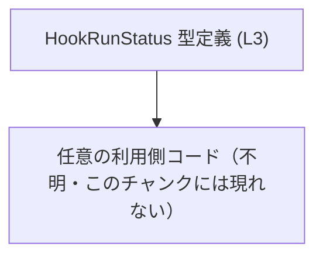
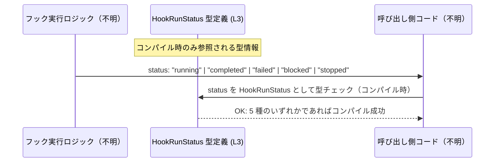

# app-server-protocol\schema\typescript\v2\HookRunStatus.ts

## 0. ざっくり一言

`HookRunStatus` は、フック（hook）の実行状態を **5 種類の文字列のいずれか** で表す、TypeScript の文字列リテラル・ユニオン型を定義する自動生成ファイルです（HookRunStatus.ts:1-3）。

---

## 1. このモジュールの役割

### 1.1 概要

- このモジュールは、フック実行の状態を表現するための **共通の型定義** を提供します。
- `"running" | "completed" | "failed" | "blocked" | "stopped"` のいずれかのみを取る `HookRunStatus` 型を公開し、状態文字列の誤りをコンパイル時に検出できるようにします（HookRunStatus.ts:3-3）。
- ファイル先頭のコメントにより、ts-rs による **自動生成コードであり手動編集禁止** であることが明示されています（HookRunStatus.ts:1-2）。

### 1.2 アーキテクチャ内での位置づけ

このファイルは、外部からインポートされるための **型定義モジュール** であり、自身から他のモジュールを参照していません（HookRunStatus.ts:3-3）。  
どのモジュールがこの型を利用しているかは、このチャンクには現れません。

代表的な位置づけイメージを、利用側を抽象化して図示します。



- ノード A: 本ファイルが定義する `HookRunStatus` 型（HookRunStatus.ts:3-3）。
- ノード B: この型をインポートして使う他モジュール。具体的なモジュール名・場所は本チャンクには現れません。

### 1.3 設計上のポイント

- **文字列リテラル・ユニオン型による列挙**  
  - `HookRunStatus` は `"running" | "completed" | "failed" | "blocked" | "stopped"` のユニオン型として定義されています（HookRunStatus.ts:3-3）。
  - TypeScript では列挙に相当する表現であり、コンパイル時に値の取りうる範囲を制限します。
- **自動生成コード**  
  - 先頭コメントにより「GENERATED CODE」「ts-rs による生成」であることが示されています（HookRunStatus.ts:1-2）。
  - 設計としては、Rust など別言語の定義から一貫した型を生成する前提と考えられますが、元定義自体はこのチャンクには現れません。
- **状態や副作用を持たない純粋な型定義**  
  - 関数・クラス・実行時ロジックは一切含まれず、型エイリアスのみをエクスポートしています（HookRunStatus.ts:3-3）。
  - そのため、実行時エラー処理や並行性制御はこのファイル内には存在しません。
- **安全性（TypeScript 言語固有の観点）**  
  - `HookRunStatus` が付与された変数・引数には 5 種の文字列以外を代入できず、型安全性が向上します（コンパイル時チェック）。

---

## 2. 主要な機能一覧

このファイルが提供する機能は 1 つに絞られています。

- `HookRunStatus` 型エイリアス:  
  フック実行状態を `"running" | "completed" | "failed" | "blocked" | "stopped"` のいずれかで表す公開型（HookRunStatus.ts:3-3）。

---

## 3. 公開 API と詳細解説

### 3.1 型一覧（コンポーネントインベントリー）

本チャンクに現れるコンポーネント（型）の一覧です。

| 名前             | 種別                                           | 役割 / 用途                                                                                         | 定義箇所                |
|------------------|------------------------------------------------|------------------------------------------------------------------------------------------------------|-------------------------|
| `HookRunStatus`  | 型エイリアス（文字列リテラル・ユニオン型）    | フックの実行状態を 5 種の文字列のいずれかとして表現する。状態文字列の誤記をコンパイル時に検出できる。 | HookRunStatus.ts:3-3    |

#### `HookRunStatus` の値のバリエーション

- `"running"`: 実行中であることを表す状態
- `"completed"`: 正常に完了した状態
- `"failed"`: 実行が失敗した状態
- `"blocked"`: 何らかの理由でブロックされている状態
- `"stopped"`: 明示的に停止された、あるいは中断された状態

これらの具体的な意味づけは、呼び出し側のドメインロジックに依存し、このチャンク単体からは詳細までは分かりません。

### 3.2 関数詳細

- このファイルには **関数・メソッド定義は存在しません**（HookRunStatus.ts:1-3）。
- そのため、関数用の詳細テンプレートに従った解説項目はありません。

### 3.3 その他の関数

| 関数名 | 役割（1 行） |
|--------|--------------|
| なし   | このファイルには関数は定義されていません（HookRunStatus.ts:1-3）。 |

---

## 4. データフロー

このファイル自体は実行時ロジックを含まないため、**ランタイムでのデータフローは定義していません**。  
ただし、`HookRunStatus` 型がどのように利用されるかの典型的な流れを、抽象的なイメージとして示します（実際の利用コードはこのチャンクには現れません）。



- `HookRunStatus` 型は **TypeScript コンパイラによる静的チェック** にのみ関与し、実行時には型情報は消えます。
- 実際にどのモジュールがフック状態を生成・消費しているかは、このチャンクには現れません。

---

## 5. 使い方（How to Use）

### 5.1 基本的な使用方法

最も基本的な使い方は、関数の引数・戻り値やオブジェクトのプロパティの型として `HookRunStatus` を指定することです。

```typescript
// HookRunStatus 型をインポートする
// 実際のパスは利用側のディレクトリ構成に依存する
import type { HookRunStatus } from "./HookRunStatus"; // HookRunStatus.ts:3-3 に対応

// フックの状態を受け取って処理する関数
function handleHookStatus(status: HookRunStatus): void {       // status は 5 種の文字列のいずれかに制約される
    if (status === "failed" || status === "blocked") {         // 失敗・ブロック状態の判定
        // エラー時の処理
    } else if (status === "completed") {                       // 完了状態の判定
        // 正常完了時の処理
    } else {                                                   // "running" または "stopped"
        // 実行中または停止中の処理
    }
}

// 変数宣言に利用する例
let currentStatus: HookRunStatus;                              // 状態を保持する変数
currentStatus = "running";                                     // OK
currentStatus = "completed";                                   // OK
// currentStatus = "unknown";                                  // コンパイルエラー: "unknown" は HookRunStatus ではない
```

このように、`HookRunStatus` を使うことで **誤った状態文字列の代入がコンパイル時に防止** されます。

### 5.2 よくある使用パターン

#### 5.2.1 戻り値の型として利用する

フックを実行し、その状態を返す関数の戻り値に `HookRunStatus` を指定するパターンです。

```typescript
import type { HookRunStatus } from "./HookRunStatus";

// フックを実行し、その状態を返す関数の例
function runHook(): HookRunStatus {        // 戻り値が 5 種の状態のいずれかに限定される
    // 実際のロジックはこのチャンクには現れない
    return "completed";                    // 例として completed を返す
}
```

#### 5.2.2 状態オブジェクトのプロパティとして利用する

状態管理用オブジェクトの一部として `HookRunStatus` を利用するパターンです。

```typescript
import type { HookRunStatus } from "./HookRunStatus";

interface HookState {                      // フックの状態を表すインターフェース例
    id: string;                            // フックの識別子
    status: HookRunStatus;                 // 実行状態
    updatedAt: Date;                       // 最終更新時刻
}

const state: HookState = {
    id: "hook-1",
    status: "running",                     // HookRunStatus の値
    updatedAt: new Date(),
};
```

### 5.3 よくある間違い

#### 間違い例 1: `string` 型で受けてしまう

```typescript
// 間違い例: 状態を単なる string として扱っている
function handleStatusBad(status: string) {
    if (status === "failed") {
        // ...
    }
    // 他の文字列も受け入れてしまうため、タイポに気づきにくい
}
```

```typescript
// 正しい例: HookRunStatus で型を限定する
import type { HookRunStatus } from "./HookRunStatus";

function handleStatusGood(status: HookRunStatus) {  // 5 種のいずれかのみ許可
    if (status === "failed") {
        // ...
    }
}
```

#### 間違い例 2: 外部入力をそのまま `HookRunStatus` として扱う

```typescript
declare function getStatusFromApi(): string; // 返り値は string だが中身は不明

// 間違い例: 外部入力をそのまま HookRunStatus だと仮定する
const status: HookRunStatus = getStatusFromApi() as HookRunStatus;
// 型アサーションによりコンパイルは通るが、実行時には不正な値を持つ可能性がある
```

```typescript
// より安全な例: 実行時に検証してから HookRunStatus として扱う
function toHookRunStatus(value: string): HookRunStatus | null {
    const allowed: HookRunStatus[] = ["running", "completed", "failed", "blocked", "stopped"];
    return (allowed as string[]).includes(value) ? (value as HookRunStatus) : null;
}
```

> このファイル自体にはバリデーション関数は含まれておらず、上記のようなコードは利用側で定義する必要があります（このチャンクには現れません）。

### 5.4 使用上の注意点（まとめ）

- **自動生成コードを直接編集しない**  
  - ファイル先頭に「GENERATED CODE! DO NOT MODIFY BY HAND!」と明記されています（HookRunStatus.ts:1-2）。
  - 変更が必要な場合は、元となる定義（おそらく Rust 側の型定義）を変更し、ts-rs による再生成を行う設計であると考えられます（HookRunStatus.ts:1-2 に ts-rs の記述あり）。
- **コンパイル時のみの安全性であること**  
  - TypeScript の型は実行時には消えるため、外部からの入力（API 応答など）を `HookRunStatus` として扱う場合は、**別途ランタイムの検証が必要** です。
- **並行性・パフォーマンスへの影響**  
  - 型定義のみであり、実行時の処理を追加しないため、並行性やパフォーマンスに関する直接の影響はありません。
- **バグ・セキュリティ観点**  
  - バグの主要なリスクは「元定義との不整合」にあります。例えば元のプロトコルで新しい状態が追加されたのに、このファイルが再生成されていない場合です。ただし、元定義はこのチャンクには現れません。
  - セキュリティについては、この型自体は **入力バリデーションやサニタイズ処理を行わない** ため、外部入力は別途適切に検証する必要があります。

---

## 6. 変更の仕方（How to Modify）

### 6.1 新しい機能を追加する場合

このファイルは ts-rs による自動生成であり、コメントで手動編集禁止とされています（HookRunStatus.ts:1-2）。  
そのため、**新しい状態値の追加などの変更は、このファイルではなく元定義側で行う前提** です。

一般的な手順（本チャンクには具体的な元ファイルは現れません）:

1. 元となる型定義（おそらく Rust 側の `HookRunStatus` など）を特定する。  
   - ts-rs の仕様から、Rust 型に `#[ts(export)]` 等の属性が付与されている可能性がありますが、具体的なコードはこのチャンクには現れません。
2. 元定義に新しい状態値（例: `"retrying"` など）を追加する。
3. ts-rs のコード生成を再実行し、`HookRunStatus.ts` を再生成する。
4. 生成された `HookRunStatus.ts` に新しい文字列リテラルが含まれていることを確認する（HookRunStatus.ts:3-3 相当の行を確認）。

### 6.2 既存の機能を変更する場合

- **状態値の名称変更・削除**  
  - 既存の `"running"`, `"completed"`, `"failed"`, `"blocked"`, `"stopped"` を変更・削除する場合も、元定義側で変更し、ts-rs で再生成するのが前提です（HookRunStatus.ts:1-2）。
- **影響範囲の確認**  
  - `HookRunStatus` を利用しているコード（関数の引数・戻り値・プロパティなど）すべてが影響を受けます。
  - 型が変わるとコンパイルエラーが発生しやすいため、逆に影響箇所を特定しやすい構造になっています。
- **契約（前提条件）**  
  - この型を利用する関数は、「状態が 5 種のいずれかである」という前提で実装されている可能性があります。
  - 状態の意味や数を変える際は、呼び出し側のロジックと整合しているかを確認する必要があります。

---

## 7. 関連ファイル

このチャンクには直接の関連ファイルは現れませんが、コメントとパス構造から推測できる範囲を整理します。

| パス / コンポーネント                       | 役割 / 関係                                                                                              |
|--------------------------------------------|-----------------------------------------------------------------------------------------------------------|
| Rust 側の `HookRunStatus` 型定義（パス不明） | コメントに ts-rs が明記されているため（HookRunStatus.ts:1-2）、この TypeScript 型の元となる定義と考えられます。 |
| `app-server-protocol\schema\typescript\v2\*.ts`（具体名不明） | 同じスキーマバージョン v2 に属する他の型定義ファイルが存在する可能性がありますが、このチャンクには現れません。 |

> 上記の関連ファイル・型の具体的な位置や内容は、このチャンクの情報だけからは特定できません。「ts-rs による自動生成」というコメントとディレクトリ構造にもとづく一般的な推測に留まります。
