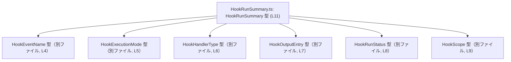
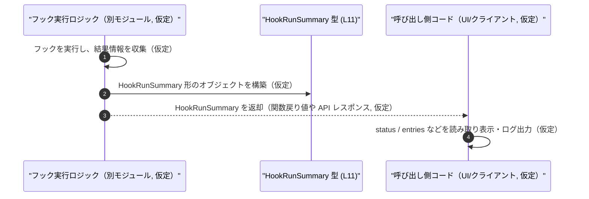

# app-server-protocol/schema/typescript/v2/HookRunSummary.ts

## 0. ざっくり一言

1 回の「フック実行」の概要情報と、その出力エントリ一覧を表す **型エイリアス `HookRunSummary`** を定義する、ts-rs 生成済み TypeScript スキーマファイルです（根拠: `HookRunSummary.ts:L1-3, L11`）。

---

## 1. このモジュールの役割

### 1.1 概要

- このモジュールは、Rust 側から ts-rs によって生成された **フック実行サマリのデータ構造** を TypeScript 側に提供します（根拠: `HookRunSummary.ts:L1-3, L11`）。
- フックのイベント種別・ハンドラ種別・実行モード・スコープ・実行時刻・結果ステータス・出力エントリなどを 1 つのオブジェクトにまとめて表現します（根拠: `HookRunSummary.ts:L4-11`）。

### 1.2 アーキテクチャ内での位置づけ

このファイルは **型定義のみ** を提供し、実行時ロジックは一切含みません（根拠: `HookRunSummary.ts:L4-11`）。

- 依存する型（定義は別ファイル・別モジュール）  
  - `HookEventName`（イベント名）  
  - `HookExecutionMode`（実行モード）  
  - `HookHandlerType`（ハンドラ種別）  
  - `HookOutputEntry`（出力エントリ）  
  - `HookRunStatus`（実行ステータス）  
  - `HookScope`（スコープ）  
  （いずれも `import type` で型のみ参照しています。根拠: `HookRunSummary.ts:L4-9`）

Mermaid で型依存関係を図示すると、次のようになります。



> この図は、本チャンクに含まれる依存関係（L4-9, L11）だけを表現しています。

### 1.3 設計上のポイント

- **コード生成ファイル**  
  - 冒頭コメントに「GENERATED CODE」「ts-rs で生成」と明示されています（根拠: `HookRunSummary.ts:L1-3`）。
  - 手動編集は前提とされていません。
- **型のみのモジュール**  
  - すべて `import type` であり、実行時には JavaScript コードを生成しない型専用モジュールです（根拠: `HookRunSummary.ts:L4-9`）。
- **オブジェクト型の type エイリアス**  
  - `export type HookRunSummary = { ... }` で 1 つのオブジェクト型をまとめて定義しています（根拠: `HookRunSummary.ts:L11`）。
- **`bigint` と `null` を多用した表現**  
  - 並び順や時刻・所要時間などを `bigint` 型で表し、一部は `null` 許容にすることで「未設定」や「未完了」を表現できるようになっています（根拠: `HookRunSummary.ts:L11`）。

---

## 2. 主要な機能一覧（コンポーネントインベントリー）

このファイルは関数を持たず、データ構造だけを提供します。その意味での「機能」は次の通りです。

- `HookRunSummary` 型:  
  フック実行 1 件分のメタ情報と、その実行から得られた出力エントリ一覧を 1 つのオブジェクトとして表す（根拠: `HookRunSummary.ts:L11`）。
- 型依存の集約:  
  フックに関連する複数のドメイン型（イベント名・ハンドラ種別・ステータスなど）を 1 つの構造に束ねることで、API 入出力の型安全性を高める（根拠: `HookRunSummary.ts:L4-11`）。

---

## 3. 公開 API と詳細解説

### 3.1 型一覧（構造体・列挙体など）

#### 型インベントリー

| 名前              | 種別                         | 役割 / 用途                                                     | 根拠 |
|-------------------|------------------------------|------------------------------------------------------------------|------|
| `HookRunSummary`  | 型エイリアス（オブジェクト型） | 1 回のフック実行の概要情報と出力エントリ一覧をまとめて保持する | `HookRunSummary.ts:L11` |

#### 依存する外部型

| 名前               | 種別       | 用途 / 備考                                             | 根拠 |
|--------------------|------------|---------------------------------------------------------|------|
| `HookEventName`    | 型（詳細不明） | `eventName` フィールドの型。フックのイベント種別を表すと推測されますが、定義は本チャンクにはありません。 | `HookRunSummary.ts:L4, L11` |
| `HookExecutionMode`| 型（詳細不明） | `executionMode` フィールドの型。同期 / 非同期などのモードを表す可能性がありますが、詳細は不明です。 | `HookRunSummary.ts:L5, L11` |
| `HookHandlerType`  | 型（詳細不明） | `handlerType` フィールドの型。どの種別のハンドラかを表すと推測されますが、詳細は不明です。 | `HookRunSummary.ts:L6, L11` |
| `HookOutputEntry`  | 型（詳細不明） | `entries` 配列要素の型。フック実行の出力 1 件分を表すと推測されますが、定義は本チャンクにはありません。 | `HookRunSummary.ts:L7, L11` |
| `HookRunStatus`    | 型（詳細不明） | `status` フィールドの型。成功・失敗などのステータスを表すと推測されますが、詳細は不明です。 | `HookRunSummary.ts:L8, L11` |
| `HookScope`        | 型（詳細不明） | `scope` フィールドの型。フックの適用範囲を表すと推測されますが、詳細は不明です。 | `HookRunSummary.ts:L9, L11` |

> 「〜と推測されます」は、型名からの一般的な解釈であり、実際の定義はこのチャンクには現れません。

#### `HookRunSummary` フィールド詳細

`HookRunSummary` は次のフィールドを持つオブジェクト型です（根拠: `HookRunSummary.ts:L11`）。

| フィールド名     | 型                          | `null` | 説明（このファイルから分かる範囲） |
|------------------|-----------------------------|--------|------------------------------------|
| `id`             | `string`                    | 不可   | フック実行を識別する ID 文字列であると考えられます。形式や一意性の保証はこのファイルからは不明です。 |
| `eventName`      | `HookEventName`             | 不可   | 対象となったフックイベント名。具体的な列挙値などは別ファイルです。 |
| `handlerType`    | `HookHandlerType`           | 不可   | 使用されたハンドラの種別。定義は別ファイルです。 |
| `executionMode`  | `HookExecutionMode`         | 不可   | 実行モード（例: 同期 / 非同期などと推測）。定義は別ファイルです。 |
| `scope`          | `HookScope`                 | 不可   | フックの適用スコープ。詳細は別ファイルです。 |
| `sourcePath`     | `string`                    | 不可   | フック定義のソースファイルパスと思われますが、形式や意味は不明です。 |
| `displayOrder`   | `bigint`                    | 不可   | 表示順を表す整数値と推測されますが、単位や範囲は不明です。 |
| `status`         | `HookRunStatus`             | 不可   | 実行結果のステータス。定義は別ファイルです。 |
| `statusMessage`  | `string \| null`            | 許可   | 実行結果に関する追加メッセージ。メッセージがない場合は `null`。`null` の意味の詳細（例: 成功でメッセージ無しなど）は不明です。 |
| `startedAt`      | `bigint`                    | 不可   | 実行開始時刻などの数値と推測されます（UNIX 時刻などかどうかは不明）。 |
| `completedAt`    | `bigint \| null`            | 許可   | 実行完了時刻などの数値と推測されます。未完了などの場合に `null` となる可能性がありますが、詳細は不明です。 |
| `durationMs`     | `bigint \| null`            | 許可   | 所要時間（ミリ秒）と思われますが、名称からの推測に留まります。計算方法や `null` の条件は不明です。 |
| `entries`        | `Array<HookOutputEntry>`    | 不可   | フック実行中に生成された出力エントリ一覧。要素の構造は `HookOutputEntry` に依存し、このチャンクには現れません。 |

**型安全性上のポイント（TypeScript 観点）**

- `bigint` は `number` と混在して算術演算できません。呼び出し側で `number` と組み合わせる場合は、どちらかに明示的変換する必要があります。
- `statusMessage` / `completedAt` / `durationMs` は `null` を取り得るため、利用側は **型ガード（`if (x != null)` など）** を入れる必要があります。

### 3.2 関数詳細（最大 7 件）

このファイルには **関数・メソッド定義が存在しません**（コメントと `export type` のみで構成、根拠: `HookRunSummary.ts:L1-11`）。  
したがって、このセクションで詳細解説すべき関数はありません。

### 3.3 その他の関数

- 補助的な関数やラッパー関数も定義されていません（根拠: `HookRunSummary.ts:L1-11`）。

---

## 4. データフロー

このファイル自体は型だけを定義し、処理ロジックは含みませんが、`HookRunSummary` がどのようにデータフローに現れるかの典型例として、次のような利用シナリオが考えられます。  
（※ 以下は一般的なパターンの一例であり、このチャンクには実際の処理コードは存在しません。）



> この図では、`HookRunSummary 型 (L11)` ノードのみが本チャンクに存在する実体であり、他の要素は「想定される利用側」を示すための補助的な仮定です。

---

## 5. 使い方（How to Use）

### 5.1 基本的な使用方法

ここでは、`HookRunSummary` を **型注釈** として利用する基本例を示します。  
依存型の具体的な定義は不明なため、例ではダミー値と型アサーションを利用しています。

```typescript
// 型のみをインポートする（実行時コードを増やさないために import type を推奨）
import type { HookRunSummary } from "./HookRunSummary";        // HookRunSummary.ts (本ファイル)
import type { HookEventName } from "./HookEventName";          // 別ファイル
import type { HookExecutionMode } from "./HookExecutionMode";  // 別ファイル
import type { HookHandlerType } from "./HookHandlerType";      // 別ファイル
import type { HookOutputEntry } from "./HookOutputEntry";      // 別ファイル
import type { HookRunStatus } from "./HookRunStatus";          // 別ファイル
import type { HookScope } from "./HookScope";                  // 別ファイル

// 依存型については具体的な定義が分からないため、ここではダミー変数に型アサーションしています。
declare const eventName: HookEventName;
declare const handlerType: HookHandlerType;
declare const executionMode: HookExecutionMode;
declare const scope: HookScope;
declare const status: HookRunStatus;
declare const entries: HookOutputEntry[];

// HookRunSummary オブジェクトを組み立てる例
const summary: HookRunSummary = {
    id: "hook-run-001",                            // 任意の識別子（文字列）
    eventName,                                     // HookEventName 型
    handlerType,                                   // HookHandlerType 型
    executionMode,                                 // HookExecutionMode 型
    scope,                                         // HookScope 型
    sourcePath: "/path/to/hook.ts",                // ソースパス（文字列）
    displayOrder: 1n,                              // bigint リテラル（末尾に n）
    status,                                        // HookRunStatus 型
    statusMessage: null,                           // メッセージ無しの場合は null
    startedAt: BigInt(Date.now()),                 // 実行開始時刻を bigint へ変換した例
    completedAt: null,                             // 未完了などの場合は null とする想定の例
    durationMs: null,                              // 所要時間不明の場合などの例
    entries,                                       // HookOutputEntry の配列
};

// 利用例: status と statusMessage を読む
if (summary.statusMessage != null) {               // null チェックが必要
    console.log(`[${summary.status}] ${summary.statusMessage}`);
}
```

### 5.2 よくある使用パターン（想定）

このファイルから直接は確認できませんが、`HookRunSummary` の構造から、次のような利用パターンが考えられます。

1. **API レスポンス / リクエストボディの型定義**  
   - サーバーがフック実行結果を返すときの JSON 形状を表す。
   - クライアント側では `HookRunSummary` を使ってレスポンスを型付けすることで、プロパティ名のタイプミスや `null` ハンドリングの漏れをコンパイル時に検出できます。

2. **ログや監視向けのイベントモデル**  
   - フック実行ログを集約してストレージに保存する際のレコード型として利用。
   - `displayOrder` や `startedAt` / `completedAt` / `durationMs` などを使って、UI で時系列表示やソートを行うケースが想定されます。

> これらは型名・フィールド名からの一般的な想定であり、実際の用途はこのチャンクからは断定できません。

### 5.3 よくある間違い（想定される注意点）

#### `bigint` と `number` を混在させる

```typescript
// 誤り例（イメージ）: bigint と number を直接加算しようとする
// TypeError: Cannot mix BigInt and other types の原因になる
const extraMs = 100;                       // number
const total = summary.durationMs + extraMs;
//                         ^^^^^^^^^^^^^
// durationMs は bigint | null 型のため、そのままでは number と加算できない
```

```typescript
// 正しい例: どちらかに変換する
if (summary.durationMs != null) {
    const extraMs = 100n;                  // bigint リテラルとして扱う
    const total = summary.durationMs + extraMs;
    console.log(`duration with extra: ${total} ms`);
}
```

#### `null` を考慮しないアクセス

```typescript
// 誤り例: null の可能性を無視してメソッドを呼ぶ
console.log(summary.statusMessage.toUpperCase());
//                                  ^^^^^^^^^^^
// statusMessage は string | null なので、null の場合に実行時エラーとなる可能性があります
```

```typescript
// 正しい例: null チェックを行う
if (summary.statusMessage) {
    console.log(summary.statusMessage.toUpperCase());
}
```

### 5.4 使用上の注意点（まとめ）

- **`bigint` の扱い**  
  - `displayOrder` / `startedAt` / `completedAt` / `durationMs` は `bigint` であり、`number` と混在した演算はできません。必要に応じて `Number()` などで変換するか、`bigint` 同士で演算します。
  - JSON 直列化（`JSON.stringify`）では `bigint` をそのまま扱えないため、文字列などに変換する必要があります。これは JavaScript の仕様に基づく一般的な注意点です。
- **`null` 許容フィールドの扱い**  
  - `statusMessage` / `completedAt` / `durationMs` は `null` を取り得るため、使用前に必ず `null` チェックを行う必要があります。
- **コード生成ファイルであること**  
  - コメントに「Do not edit this file manually」とある通り、直接編集は想定されていません（根拠: `HookRunSummary.ts:L1-3`）。  
    型の追加や変更は、ts-rs の元となる Rust 側定義を更新して再生成する必要があります。
- **セキュリティ / バグ観点**  
  - このファイルは型定義だけであり、直接的なロジックや外部 I/O を含まないため、単体では明確なセキュリティホールやバグ要因は見えません。
  - ただし、`sourcePath: string` や `statusMessage: string | null` などは、外部入力が入る可能性のあるフィールド名です。実際に利用するコード側で、パス検証やエスケープ処理などを行うかどうかは、このチャンクからは分かりません。

---

## 6. 変更の仕方（How to Modify）

### 6.1 新しい機能（フィールド）を追加する場合

このファイルは ts-rs による生成物であり、**直接編集は推奨されません**（根拠: `HookRunSummary.ts:L1-3`）。

新しい情報を `HookRunSummary` に追加したい場合の一般的な手順は次のとおりです（Rust 側や ts-rs 設定の詳細はこのチャンクにはありません）:

1. **Rust 側の元となる型（struct など）にフィールドを追加**（具体的な型名や場所はこのチャンクからは不明）。
2. **ts-rs の derive / マクロ設定を更新**（必要であれば）。
3. **コード生成を再実行**して本ファイルを再生成。
4. TypeScript プロジェクト内で `HookRunSummary` を利用している箇所のコンパイルエラーを確認し、必要に応じてコードを追随させる。

### 6.2 既存の機能（フィールド型・意味）を変更する場合

- **型を変更する**（例: `durationMs` を `bigint | null` から `number` に変える）場合:
  - Rust 側の型と ts-rs 設定を更新し、再生成します。
  - TypeScript 側では、`HookRunSummary` を利用している全箇所でコンパイルエラーが出る可能性があるため、それを手掛かりに修正箇所を洗い出すことができます。
- **`null` 許容性を変更する**場合:
  - 既存コードが `null` を前提にしているか、逆に非 `null` を前提にしているかを確認する必要があります。この契約はこのチャンクからは読み取れませんが、変更の影響は大きくなりがちです。
- **並行性 / パフォーマンス観点**:
  - この型自体は状態を持たない単なるデータ構造であり、スレッドセーフ性やロックの問題はこのレベルでは発生しません。
  - ただし、`entries: Array<HookOutputEntry>` が非常に大きくなりうる場合、これを頻繁にコピーしたりシリアライズしたりするコードのパフォーマンスに影響する可能性はあります（実際の要素数や利用パターンはこのチャンクには現れません）。

---

## 7. 関連ファイル

このモジュールと密接に関係するファイルは、`import type` されている次のモジュールです（拡張子はこのチャンクからは分かりません）。

| パス                 | 役割 / 関係（このチャンクから分かる範囲）                           | 根拠 |
|----------------------|------------------------------------------------------------------|------|
| `./HookEventName`    | `HookRunSummary.eventName` の型を提供するモジュール。定義内容は不明。 | `HookRunSummary.ts:L4, L11` |
| `./HookExecutionMode`| `HookRunSummary.executionMode` の型を提供するモジュール。定義内容は不明。 | `HookRunSummary.ts:L5, L11` |
| `./HookHandlerType`  | `HookRunSummary.handlerType` の型を提供するモジュール。定義内容は不明。 | `HookRunSummary.ts:L6, L11` |
| `./HookOutputEntry`  | `HookRunSummary.entries` 配列要素の型を提供するモジュール。定義内容は不明。 | `HookRunSummary.ts:L7, L11` |
| `./HookRunStatus`    | `HookRunSummary.status` の型を提供するモジュール。定義内容は不明。 | `HookRunSummary.ts:L8, L11` |
| `./HookScope`        | `HookRunSummary.scope` の型を提供するモジュール。定義内容は不明。 | `HookRunSummary.ts:L9, L11` |

> テストコードや補助ユーティリティに関する情報は、このチャンクには一切現れません。「どのテストがこの型をカバーしているか」なども不明です。
