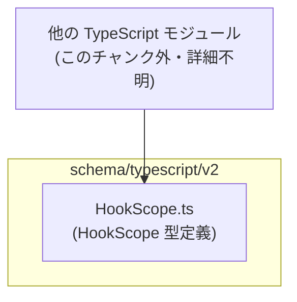
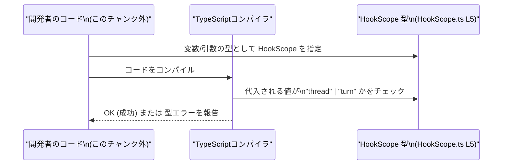

# app-server-protocol/schema/typescript/v2/HookScope.ts コード解説

## 0. ざっくり一言

- Hook のスコープを `"thread"` または `"turn"` の 2 値で表現するための、TypeScript の文字列リテラル型エイリアスです（HookScope.ts:L5）。

---

## 1. このモジュールの役割

### 1.1 概要

- このモジュールは、`HookScope` という型名で Hook のスコープ種別を表す型を提供します（HookScope.ts:L5）。
- 型は `"thread"` と `"turn"` の 2 つの文字列リテラルのユニオン型（和集合）として定義されており、それ以外の文字列をコンパイル時に排除する役割を持ちます（HookScope.ts:L5）。
- ファイル全体は `ts-rs` によって自動生成されることがコメントで明示されており、手動編集しない前提のスキーマ定義ファイルです（HookScope.ts:L1-3）。

### 1.2 アーキテクチャ内での位置づけ

- ディレクトリ `schema/typescript/v2` 配下にあることから、アプリケーションサーバのプロトコルスキーマの一部として、TypeScript 側に型情報を提供するファイルという位置づけと解釈できます（パスとコメントの組み合わせによる解釈。実際の利用箇所はこのチャンクには現れません）。
- このファイル自体は `HookScope` 型のみをエクスポートしており、他のモジュールからこの型が import されて使われる構造になっていると考えられますが、どのモジュールかはこのチャンクからは分かりません（HookScope.ts:L5）。

主要な依存関係（概念的な位置づけ）を Mermaid 図で表すと、次のようになります。



- 図の「他の TypeScript モジュール」は、`HookScope` 型を利用する側として概念的に置いたものであり、具体的なファイル名や場所はこのチャンクからは特定できません。

### 1.3 設計上のポイント

- **自動生成コード**  
  - 先頭コメントに「GENERATED CODE」「Do not edit this file manually」とあり（HookScope.ts:L1, L3）、`ts-rs` が Rust 側の型定義から TypeScript 型を生成していることが明示されています。
- **型のみを提供する純粋な定義モジュール**  
  - 実行時の関数やクラスは一切含まれず、`export type` による型エイリアスのみを提供します（HookScope.ts:L5）。  
  - ランタイムの副作用がないため、インポートしても実行時コストはほぼありません。
- **文字列リテラルユニオン型による厳密な表現**  
  - `"thread" | "turn"` という 2 つの文字列リテラルのユニオン型として定義されており（HookScope.ts:L5）、誤った文字列を静的型チェックで防ぐことができます。
- **双方向スキーマ同期の前提**  
  - `ts-rs` による生成であるため、Rust 側の元定義と TypeScript 側の `HookScope` は常に同期される前提の設計になっています（HookScope.ts:L1-3）。  
  - 値の追加・変更は Rust 側を更新し、再生成する運用が想定されます。

---

## 2. 主要な機能一覧

このファイルは関数を持たず、型定義のみです。そのため「機能」はすべて型レベルの役割になります。

- `HookScope` 型の提供: Hook スコープを `"thread"` または `"turn"` で表現するための型エイリアスを提供します（HookScope.ts:L5）。
- 値のバリデーション（コンパイル時）: `"thread"`/`"turn"` 以外の文字列が使われた場合に TypeScript の型チェックで検出させる役割を担います（HookScope.ts:L5）。
- Rust スキーマとの整合維持: `ts-rs` により Rust 側の定義から自動生成されることで、バックエンドとフロントエンドの型の不整合を減らすことに寄与します（HookScope.ts:L1-3）。

---

## 3. 公開 API と詳細解説

### 3.1 型一覧（構造体・列挙体など）

| 名前        | 種別                | 役割 / 用途                                                                 | 定義箇所                |
|-------------|---------------------|------------------------------------------------------------------------------|-------------------------|
| `HookScope` | 型エイリアス（文字列リテラルユニオン） | Hook のスコープ種別を `"thread"` または `"turn"` の 2 値で表すための型です。 | HookScope.ts:L5-5       |

#### `HookScope` の詳細

**概要**

- `HookScope` は、Hook のスコープを表現するための TypeScript の型エイリアスです（HookScope.ts:L5）。
- 型は `"thread" | "turn"` という 2 つの文字列リテラルから成るユニオン型であり、他の任意の文字列を受け付けません（HookScope.ts:L5）。

**定義**

```typescript
export type HookScope = "thread" | "turn"; // HookScope.ts:L5
```

**型の意味**

- `"thread"`  
  - 文字列リテラル `"thread"` のみを許容する型の片方です（HookScope.ts:L5）。
  - コード上では `"thread"` というリテラル、または `"thread"` に型が絞り込まれた変数だけが代入できます。
- `"turn"`  
  - 文字列リテラル `"turn"` のみを許容する型の片方です（HookScope.ts:L5）。

**TypeScript 的な挙動**

- 次のような代入はコンパイルが通ります。

```typescript
let a: HookScope = "thread"; // OK: ユニオンの一員 (HookScope.ts:L5 に対応)
let b: HookScope = "turn";   // OK: ユニオンの一員
```

- 次のような代入はコンパイルエラーになります（TypeScript の型システムの挙動）。

```typescript
let c: HookScope = "session"; 
// エラー: Type '"session"' is not assignable to type 'HookScope'.
// HookScope が "thread" | "turn" に限定されているため (HookScope.ts:L5)。
```

**使用例（基本）**

`HookScope` を受け取る関数を定義する例です。関数自体はこのファイルには含まれていない仮想的な例ですが、典型的な利用方法です。

```typescript
// HookScope 型をインポートする（相対パスは利用側の配置に依存）
import type { HookScope } from "./HookScope";

// HookScope を引数に取る関数の例
function registerHook(scope: HookScope) {
    // scope は "thread" か "turn" のどちらかであることが型で保証される
    if (scope === "thread") {
        // スレッド単位のフック登録処理 ...
    } else {
        // "turn" の場合のフック登録処理 ...
    }
}

// 利用例
registerHook("thread"); // OK
registerHook("turn");   // OK
// registerHook("session"); // コンパイルエラー
```

**エッジケース / 型まわりの注意点**

- **一般的な string 型との関係**

  ```typescript
  declare const s: string;

  const h1: HookScope = s;
  // エラー: Type 'string' is not assignable to type '"thread" | "turn"'。
  // 一般的な string 型は、"thread" と "turn" 以外も取りうるためです。 (HookScope.ts:L5)
  ```

  - 一般的な `string` 型からは、その値が `"thread"` または `"turn"` のみに絞り込まれていない限り、`HookScope` には代入できません。

- **条件分岐による絞り込み**

  ```typescript
  function toHookScope(s: string): HookScope | undefined {
      if (s === "thread" || s === "turn") {
          return s; // ここでは s は "thread" | "turn" に絞り込まれる
      }
      return undefined;
  }
  ```

  - `if` 文で文字列を比較すると、TypeScript の「型ガード」により `s` の型が `"thread" | "turn"` に絞り込まれ、`HookScope` として返せるようになります。

**使用上の注意点（型レベルの契約）**

- 値は必ず `"thread"` か `"turn"` のどちらかでなければなりません（HookScope.ts:L5）。
- 新しいスコープを追加したい場合、**このファイルを直接編集してはいけません**。コメントにある通り、`ts-rs` による自動生成ファイルのためです（HookScope.ts:L1-3）。  
  - Rust 側の元定義を変更し、コード生成プロセスを再実行する必要があります。
- バックエンドから文字列が渡ってくる場合、値が `"thread"`/`"turn"` のどちらかかをチェックし、それ以外はエラーとして扱うか、`HookScope | undefined` のような型にする設計が安全です。

### 3.2 関数詳細（最大 7 件）

- このファイルには関数・メソッドは 1 つも定義されていません（HookScope.ts:L1-5）。
- そのため、関数ごとの詳細テンプレートに従った解説は該当しません。

### 3.3 その他の関数

- 補助関数やラッパー関数も、このファイルには存在しません（HookScope.ts:L1-5）。

---

## 4. データフロー

このファイルには実行時の処理ロジックはありませんが、**型としてのデータフロー**（どのように値が型チェックされるか）を示すと次のようになります。

- 開発者は任意の変数や関数引数に `HookScope` 型を付ける（このチャンク外）。
- TypeScript コンパイラは、その変数に代入される文字列リテラルが `"thread"` または `"turn"` であるかをチェックします（HookScope.ts:L5）。
- 条件を満たさない文字列はコンパイルエラーとなり、実行前に誤りが発見されます。

これをシーケンス図で表すと次のようになります（利用側コードは概念的なものです）。



- 図中の HookScope 型は、このファイルの `export type HookScope = "thread" | "turn";` に対応します（HookScope.ts:L5）。
- 実行時には `HookScope` は消去され、型情報は残らないため、性能への影響はほぼありません。

---

## 5. 使い方（How to Use）

### 5.1 基本的な使用方法

`HookScope` 型を利用する、最も基本的なフローの例です。

```typescript
// HookScope 型をインポートする
import type { HookScope } from "./HookScope"; // 実際のパスはプロジェクト構成による

// HookScope を持つ設定オブジェクトの例
interface HookConfig {
    scope: HookScope; // "thread" か "turn" のどちらか
}

// HookConfig を受け取る関数
function setupHook(config: HookConfig) {
    if (config.scope === "thread") {
        // スレッド単位の処理 ...
    } else {
        // "turn" の場合の処理 ...
    }
}

// 利用側
const config1: HookConfig = { scope: "thread" }; // OK
const config2: HookConfig = { scope: "turn" };   // OK
// const config3: HookConfig = { scope: "session" }; // コンパイルエラー
```

- このように、`HookScope` をプロパティや引数に使うことで、扱える文字列が `"thread"` と `"turn"` に限定されます（HookScope.ts:L5）。

### 5.2 よくある使用パターン

1. **関数引数として利用するパターン**

    ```typescript
    import type { HookScope } from "./HookScope";

    function registerHook(name: string, scope: HookScope) {
        // scope の値は "thread" または "turn" に限定される
    }

    registerHook("my-hook", "thread"); // OK
    // registerHook("my-hook", "once"); // コンパイルエラー
    ```

2. **設定オブジェクトやメッセージ型の一部として利用するパターン**

    ```typescript
    import type { HookScope } from "./HookScope";

    type HookMessage = {
        type: "register" | "unregister";
        scope: HookScope; // 通信メッセージでスコープを表す
    };
    ```

### 5.3 よくある間違い

```typescript
import type { HookScope } from "./HookScope";

// 間違い例: 一般的な string をそのまま HookScope に代入してしまう
function fromEnv(envValue: string): HookScope {
    return envValue; // ❌ コンパイルエラー
}

// 正しい例: 値をチェックしてから HookScope に絞り込む
function fromEnvSafe(envValue: string): HookScope {
    if (envValue === "thread" || envValue === "turn") {
        return envValue; // ✅ 型が "thread" | "turn" に絞り込まれる
    }
    throw new Error(`Invalid HookScope: ${envValue}`);
}
```

- 一般的な `string` 型をそのまま `HookScope` に代入することはできません（HookScope.ts:L5）。
- 事前に値を比較して `"thread"`/`"turn"` のみに絞り込むか、パース用関数を用意する必要があります。

### 5.4 使用上の注意点（まとめ）

- `HookScope` が許容する値は `"thread"` と `"turn"` の 2 種類のみです（HookScope.ts:L5）。
- 自動生成ファイルのため、このファイルを直接編集して値を追加・変更することは避ける必要があります（HookScope.ts:L1-3）。
- 外部入力（環境変数、HTTP リクエストなど）から文字列を受け取って `HookScope` に変換する場合は、必ず値のチェックを行う必要があります。
- ランタイムには型情報が存在しないため、**実行時のバリデーションは別途実装**する必要があります（このファイルは静的型チェックのみを提供します）。

---

## 6. 変更の仕方（How to Modify）

### 6.1 新しい機能（スコープ種別）を追加する場合

- ファイル先頭に「GENERATED CODE」「Do not edit this file manually」とあるため（HookScope.ts:L1-3）、**この TypeScript ファイルを直接編集してはいけません**。
- 新しいスコープ（例: `"session"`）を追加したい場合の一般的な手順は次のようになります（具体的な Rust 側ファイル名やコマンドは、このチャンクからは分かりません）。

  1. Rust 側の `ts-rs` 対応型定義に、新しいバリアント（例: `Session`）を追加する。  
     - どのファイルにあるかはこのチャンクからは不明です。
  2. プロジェクトのビルドまたは `ts-rs` のコード生成ステップを実行し、TypeScript スキーマを再生成する。
  3. 生成されたこのファイルに、新しいリテラルが含まれていること（例: `export type HookScope = "thread" | "turn" | "session";`）を確認する。
  4. TypeScript 側のロジックで、新たな `"session"` を扱う分岐を追加する。

- これにより、Rust と TypeScript の定義の同期が保たれます。

### 6.2 既存の機能を変更する場合

- `"thread"`/`"turn"` の意味や取り扱いを変更したい場合は、以下の点に注意する必要があります。

  - **影響範囲の確認**
    - `HookScope` を使用しているすべての TypeScript コードが影響を受けます。  
      どのファイルが使用しているかは、このチャンクからは分かりませんが、プロジェクト全体で `HookScope` を参照している箇所を検索する必要があります。
  - **契約の変更**
    - 例えば `"thread"` を廃止する、`"turn"` の意味を変えるといった変更は、Rust 側の定義と TypeScript 側のコメントや処理の両方に反映する必要があります。
  - **テストの確認**
    - どのテストが存在するかこのチャンクからは分かりませんが、`HookScope` を前提にした振る舞いを確認するテストがあれば、更新が必要です。

---

## 7. 関連ファイル

このチャンクには `HookScope.ts` 以外のファイルは含まれていませんが、コメントやパスから推測できる範囲で関連ファイルを整理します（推測部分は明示します）。

| パス                         | 役割 / 関係 |
|------------------------------|-------------|
| `schema/typescript/v2/HookScope.ts`（本ファイル） | `HookScope` 型を `"thread" | "turn"` として定義する TypeScript スキーマです（HookScope.ts:L5）。 |
| （不明）Rust 側の `HookScope` 定義 | コメントに `ts-rs` による生成とあるため、Rust 側に対応する型定義が存在することは分かりますが、具体的なパスやモジュール名はこのチャンクからは分かりません（HookScope.ts:L1-3）。 |
| `schema/typescript/v2/` 配下の他の *.ts ファイル（存在は推定） | ディレクトリ名から、同じプロトコルスキーマ v2 に属する他の型定義がある可能性がありますが、このチャンクには現れていません。 |

---

### Bugs / Security / 性能等についての補足

- **バグの可能性**  
  - このファイルは単純な型エイリアス定義のみであり（HookScope.ts:L5）、内部ロジックがないため、ファイル単体としてのバグ要因はほぼありません。
  - 実際のバグは、Rust 側の定義との不整合や、利用側での間違った前提（例: `"session"` が来ると仮定する）から発生する可能性がありますが、それらはこのチャンクからは判断できません。
- **セキュリティ**  
  - 実行時コードやデシリアライズ処理が含まれていないため、このファイル自体に直接的なセキュリティリスクはありません（HookScope.ts:L1-5）。
  - ただし、外部入力を `HookScope` に変換する処理では、未知の文字列をどう扱うか（拒否・デフォルト値・ログ出力など）がセキュリティ設計上のポイントになります。
- **性能・スケーラビリティ**  
  - 型のみの定義であり、実行時には型情報は消去されるため、性能への影響は無視できるレベルです（TypeScript の性質）。  
  - 大規模なプロジェクトでも、`HookScope` 型自体がボトルネックになることは考えにくいです。
