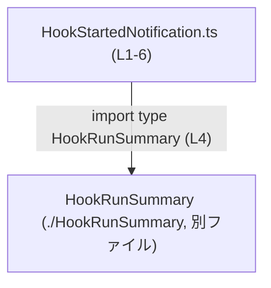
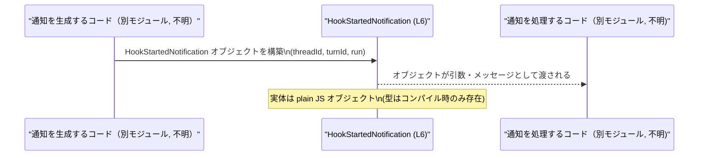

# app-server-protocol/schema/typescript/v2/HookStartedNotification.ts

## 0. ざっくり一言

`HookStartedNotification` という通知用のオブジェクト型を定義する、自動生成された TypeScript ファイルです。  
スレッド ID・ターン ID（null 許容）と、`HookRunSummary` 型の情報を 1 つの構造体としてまとめます。  
（用途自体は名前から推測されますが、このチャンクからだけでは具体的な利用箇所は分かりません。）

---

## 1. このモジュールの役割

### 1.1 概要

- このモジュールは、**ある種の「フック実行」に関する通知ペイロード**を表す型 `HookStartedNotification` を提供します。`HookStartedNotification.ts:L6-6`
- 型エイリアスでオブジェクト構造を定義し、プロパティの型（`string` / `string | null` / `HookRunSummary`）を静的に保証します。`HookStartedNotification.ts:L4-6`
- ファイル先頭コメントから、このコードは `ts-rs` により自動生成されており、手動編集は想定されていません。`HookStartedNotification.ts:L1-3`

### 1.2 アーキテクチャ内での位置づけ

このファイルから読み取れる依存関係は 1 つだけです。

- 依存先: `./HookRunSummary` から `HookRunSummary` 型を `import type` しています。`HookStartedNotification.ts:L4-4`
- 依存元（この型を使う側）は、このチャンクには現れません（どこから参照されているかは不明です）。



この図は、本チャンクに現れる依存関係のみを示しています。

### 1.3 設計上のポイント

コードから読み取れる特徴を列挙します。

- **自動生成コード**  
  - 冒頭コメントにより、`ts-rs` による生成物であり手動編集しない方針であることが分かります。`HookStartedNotification.ts:L1-3`
- **型だけを提供するモジュール**  
  - 実行時ロジック（関数・クラス）は一切なく、`type` エイリアスのみをエクスポートしています。`HookStartedNotification.ts:L6-6`
- **外部型への依存**  
  - `run` プロパティの型として、別ファイル `./HookRunSummary` で定義されている `HookRunSummary` を参照しています。`HookStartedNotification.ts:L4,L6`
- **null 許容プロパティ**  
  - `turnId` が `string | null` として定義されており、利用側は `null` を考慮する必要があります。`HookStartedNotification.ts:L6`

---

## 2. 主要な機能一覧

このファイルには関数はなく、提供される「機能」は型定義のみです。

- `HookStartedNotification` 型の定義:  
  スレッド ID（`threadId`）、ターン ID（`turnId`、null 許容）、フック実行情報（`run: HookRunSummary`）からなるオブジェクト型を定義します。`HookStartedNotification.ts:L4-6`

---

## 3. 公開 API と詳細解説

### 3.1 型一覧（構造体・列挙体など）

| 名前                     | 種別         | 役割 / 用途                                                                                  | 根拠 |
|--------------------------|--------------|-----------------------------------------------------------------------------------------------|------|
| `HookStartedNotification` | 型エイリアス | フック開始の通知ペイロードを表すオブジェクト型。`threadId`, `turnId`, `run` を持つ。         | `HookStartedNotification.ts:L6` |
| `HookRunSummary`         | 型（外部）   | `run` プロパティで参照されるサマリ情報を表す型。詳細はこのファイルには含まれません。        | `HookStartedNotification.ts:L4,L6` |

#### `HookStartedNotification` のフィールド構造

`HookStartedNotification` は次の 3 つのプロパティを持つオブジェクト型です。`HookStartedNotification.ts:L6`

| フィールド名 | 型                    | 説明（コードから分かる範囲）                                                                 | 根拠 |
|--------------|-----------------------|----------------------------------------------------------------------------------------------|------|
| `threadId`   | `string`              | 何らかのスレッドを識別する文字列 ID。用途は名前から推測されますが、コードからは詳細不明です。 | `HookStartedNotification.ts:L6` |
| `turnId`     | `string \| null`      | 何らかの「ターン」ID を表す文字列か、存在しない場合には `null`。                             | `HookStartedNotification.ts:L6` |
| `run`        | `HookRunSummary`      | フック実行に関する情報をまとめた外部型。詳細は `./HookRunSummary` 側にあります。              | `HookStartedNotification.ts:L4,L6` |

### 3.2 関数詳細（最大 7 件）

このファイルには **関数・メソッドは定義されていません**。`HookStartedNotification.ts:L1-6`

そのため、関数詳細テンプレートに基づく説明対象はありません。

### 3.3 その他の関数

- 補助関数やラッパー関数も定義されていません。`HookStartedNotification.ts:L1-6`

---

## 4. データフロー

このファイルには実行時ロジックがないため、**具体的な処理シーケンスや呼び出し元／呼び出し先のコード**は現れません。

ここでは、あくまで「`HookStartedNotification` 型がどのようにデータとして流れるか」の一般的なイメージを示します。  
（実際のコードはこのチャンクには存在せず、以下の図は典型的な使用例のイメージであることに注意してください。）

### 4.1 概念的なデータフロー



ポイント（このファイルから分かる範囲）:

- `HookStartedNotification` は単なるオブジェクト構造であり、**コンパイル後の JavaScript ではただのプレーンオブジェクト**として扱われます。（TypeScript 型は実行時には消える、という TypeScript の一般仕様）
- `run` フィールドの型 `HookRunSummary` だけが外部依存であり、その中身がどの程度大きいか・どのような情報を含むかは、このチャンクからは分かりません。`HookStartedNotification.ts:L4,L6`

---

## 5. 使い方（How to Use）

### 5.1 基本的な使用方法

`HookStartedNotification` はオブジェクト型のエイリアスなので、**値の型注釈**や**関数の引数・戻り値の型**として利用できます。

以下は、`HookStartedNotification` 型の値を作成し、処理関数に渡す例です。

```typescript
import type { HookRunSummary } from "./HookRunSummary";                // HookRunSummary 型をインポートする（L4 と同じ）
import type { HookStartedNotification } from "./HookStartedNotification"; // このファイルで定義される型を利用

// HookRunSummary 型の値（実際のフィールド構造は別ファイル参照）
const runSummary: HookRunSummary = /* ... HookRunSummary 型の値 ... */;

// HookStartedNotification 型の値を作成する
const notification: HookStartedNotification = {                        // notification の型注釈
    threadId: "thread-123",                                            // string 型（L6）
    turnId: null,                                                      // string | null 型（L6）なので null も許可される
    run: runSummary,                                                   // HookRunSummary 型の値をそのまま格納（L4, L6）
};

// 例: 通知を処理する関数の引数として使う
function handleHookStarted(n: HookStartedNotification) {               // 引数の型として利用
    console.log(n.threadId, n.turnId, n.run);
}

handleHookStarted(notification);
```

このように、`HookStartedNotification` は通知に関連する情報を 1 つの値としてまとめるための型として利用できます。

### 5.2 よくある使用パターン

コードから想定できる代表的な使い方を挙げます（あくまで型の使い方であり、ビジネスロジックは不明です）。

1. **イベントハンドラのペイロード型**

```typescript
type HookStartedHandler = (payload: HookStartedNotification) => void;  // イベントペイロードの型として利用

function onHookStarted(handler: HookStartedHandler) {
    // 実装はこのチャンクには現れない（例示のみ）
}
```

1. **メッセージングや RPC のリクエスト／レスポンス型**

```typescript
interface HookStartedMessage {
    type: "hook_started";
    data: HookStartedNotification;                                     // data 部分の型として利用
}
```

### 5.3 よくある間違い

この型に関して起こりうる誤用と、その修正例を示します。

#### 1. `turnId` の null を考慮しない

```typescript
// 誤りの例: turnId を常に string と仮定している
function logTurnId(payload: HookStartedNotification) {
    // console.log(payload.turnId.toUpperCase()); // コンパイルエラー: 'string | null' には 'toUpperCase' がない可能性
}

// 正しい扱いの例: null チェックを挟む
function logTurnIdSafe(payload: HookStartedNotification) {
    if (payload.turnId !== null) {
        console.log(payload.turnId.toUpperCase());                     // ここでは payload.turnId は string 型
    } else {
        console.log("turnId is null");
    }
}
```

TypeScript レベルでは `turnId` が `string | null` であるため、null を考慮した分岐が必要です。`HookStartedNotification.ts:L6`

#### 2. 自動生成ファイルを直接編集してしまう

```typescript
// 誤りの例: HookStartedNotification.ts を手で変更する
// 例: プロパティを追加・削除する  → 次回の自動生成で上書きされる

// 正しい対応例:
// - このファイル先頭のコメントにあるように、このファイルは ts-rs による自動生成物である（L1-3）。
// - 型構造を変更したい場合は、生成元（おそらく Rust 側の構造体定義）を変更し、ts-rs による再生成を行う。
```

### 5.4 使用上の注意点（まとめ）

- **手動で編集しない**  
  - 先頭コメントに「GENERATED CODE! DO NOT MODIFY BY HAND!」とあり、手動変更は想定されていません。`HookStartedNotification.ts:L1-3`  
  - 型を変えたい場合は、生成元（ts-rs が参照する Rust 定義など）を変更する必要があります。このチャンクからは生成元の場所は特定できません。
- **`turnId` の null を常に意識する**  
  - `turnId` は `string | null` であり、null チェックを行わないと TypeScript コンパイラからエラーになります。`HookStartedNotification.ts:L6`
- **ランタイムでは型が存在しない**  
  - TypeScript の型はコンパイル後に消えるため、実行時に型安全性を保証するのはあくまでコンパイル時のみです。  
    受信した外部データをこの型として扱う場合は、別途ランタイムバリデーションが必要になります（このファイルにはその処理は含まれません）。

---

## 6. 変更の仕方（How to Modify）

### 6.1 新しい機能を追加する場合

このファイルは自動生成であり、通常は **直接編集しない** 前提になっています。`HookStartedNotification.ts:L1-3`

新しいフィールドを追加するなどの変更が必要な場合の一般的な手順は次のようになります（コメントからの推測を含みますが、その旨を明記します）。

1. **生成元の定義を探す**  
   - コメントに `ts-rs` の URL が記載されているため、Rust コード側に同名または対応する構造体が存在する可能性が高いです。`HookStartedNotification.ts:L2-3`  
   - ただし、このチャンクにはそのファイルパスや型名は現れないため、具体的な場所は不明です。
2. **生成元の構造体・型を変更する**  
   - Rust 側の定義にフィールドを追加・削除・変更すると、それに応じて `ts-rs` が TypeScript 側の型を再生成するのが一般的な運用です。
3. **`ts-rs` を再実行して TypeScript を生成する**  
   - ビルド手順やスクリプトはこのチャンクには含まれないため、プロジェクトのドキュメントや設定を参照する必要があります。

### 6.2 既存の機能を変更する場合

`HookStartedNotification` の構造を変更する際に注意すべき点です。

- **影響範囲の確認**  
  - `HookStartedNotification` を参照している他の TypeScript ファイル（関数の引数・戻り値・変数など）に影響が出ます。  
  - どのファイルが参照しているかは、このチャンクからは分かりません。
- **契約（Contract）の保持**  
  - `threadId` や `turnId` の意味・必須性がクライアント／サーバ双方のプロトコル契約になっている可能性がありますが、このファイル単体からは判定できません。  
  - プロトコル仕様書やサーバ側の定義を合わせて確認する必要があります。
- **テストの確認**  
  - プロトコル変更がある場合、対応するエンドツーエンドテストやクライアントテストも更新する必要がありますが、このチャンクにテストコードは含まれていません。

---

## 7. 関連ファイル

このモジュールと直接関係が確認できるファイルは次のとおりです。

| パス                 | 役割 / 関係                                                                                       | 根拠 |
|----------------------|--------------------------------------------------------------------------------------------------|------|
| `./HookRunSummary`   | `HookStartedNotification.run` プロパティの型として利用される外部型を定義するモジュール。詳細不明。 | `HookStartedNotification.ts:L4,L6` |

その他、この型を使用しているファイルや生成元の Rust コードは、このチャンクには現れないため不明です。

---

## Bugs / Security / Contracts / Edge Cases / Tests（このファイルから分かる範囲）

最後に、トークン優先度で指定されていた観点について、このファイル単体から分かる範囲を簡潔に整理します。

- **Bugs**  
  - このファイルは型定義のみであり、実行時の処理がないため、ロジック上のバグはここからは発生しません。
- **Security**  
  - セキュリティ上の処理（認証・認可・入力検証など）は一切含まれていません。  
    外部から受け取ったデータにこの型を適用する場合、別途ランタイムでの検証が必要になります。
- **Contracts**  
  - プロトコル契約として読み取れるのは、`threadId: string`, `turnId: string | null`, `run: HookRunSummary` という構造だけです。`HookStartedNotification.ts:L6`  
  - 各フィールドの意味や必須性のビジネス要件は、このチャンクからは分かりません。
- **Edge Cases**  
  - `turnId` が `null` のケースを利用側が必ず扱う必要があります。`HookStartedNotification.ts:L6`  
  - 他のフィールドには特別な境界条件は定義されていません（型レベルでは単純な `string` と外部型です）。
- **Tests**  
  - このファイル内にはテストコードは含まれていません。  
    `HookStartedNotification` を利用するコードのテストは別ファイルに存在すると考えられますが、このチャンクには現れません。

以上が、このチャンク（`HookStartedNotification.ts:L1-6`）から客観的に読み取れる内容です。
