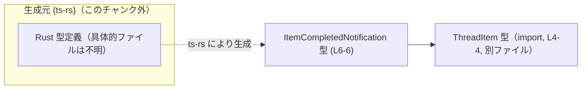
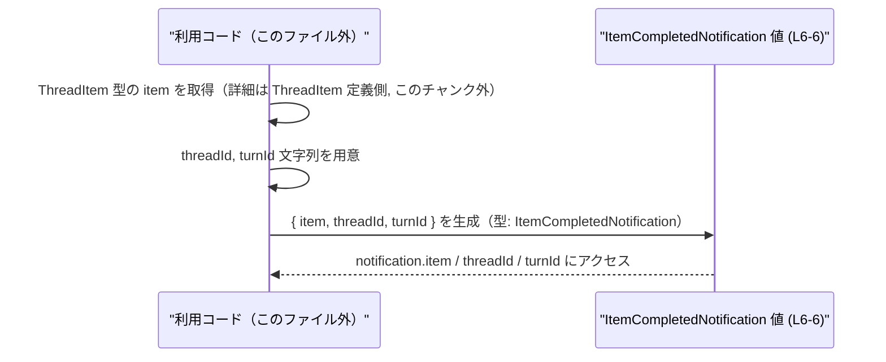

# app-server-protocol\schema\typescript\v2\ItemCompletedNotification.ts

## 0. ざっくり一言

`ItemCompletedNotification` という型エイリアスを定義し、`ThreadItem` と `threadId` / `turnId` の 3 つの情報を 1 つのオブジェクトとして扱うためのスキーマを提供するファイルです（自動生成コード）。  
（app-server-protocol\schema\typescript\v2\ItemCompletedNotification.ts:L1-1, L3-3, L6-6）

---

## 1. このモジュールの役割

### 1.1 概要

- このモジュールは、`ts-rs` によって自動生成された TypeScript の型定義ファイルです（コメントより判明）。  
  （L1-1, L3-3）
- アプリケーション内で「アイテムが完了した」という通知データを表現するための `ItemCompletedNotification` 型エイリアスを提供します。  
  （L6-6）
- 通知には、対象アイテム (`item`)、スレッド識別子 (`threadId`)、ターン識別子 (`turnId`) が含まれます。  
  （L6-6）

### 1.2 アーキテクチャ内での位置づけ

このファイルは、型定義レイヤに属し、実行ロジックは持ちません。`ThreadItem` 型（別ファイル）に依存しており、Rust 側の型定義から `ts-rs` によって生成される TypeScript スキーマ群の一部であることがコメントから分かります。  
（L3-3, L4-4, L6-6）



※ Rust 側の具体的な型・ファイル構成はこのチャンクには現れず、詳細は不明です。

### 1.3 設計上のポイント

- **自動生成コードであることが明示**  
  手動編集を禁止するコメントがあり、生成元の定義（Rust 側）を変更して再生成する設計になっています。  
  （L1-1, L3-3）
- **状態を持たない純粋な型定義**  
  関数やクラスはなく、単一の型エイリアスのみをエクスポートするため、このモジュール自体は実行時の状態や副作用を持ちません。  
  （L4-4, L6-6）
- **強制されるフィールド構造**  
  `ItemCompletedNotification` は 3 つの必須プロパティを持つオブジェクト型として定義されており、すべてのフィールドが必須です（`?` などは付いていません）。  
  （L6-6）
- **エラーハンドリング・並行性の責務なし**  
  このファイルは型定義のみのため、エラー制御や並行実行に関するロジックは含まれていません。TypeScript のコンパイル時型チェックのみが関与します。  
  （L6-6）

---

## 2. 主要な機能一覧

このモジュールが提供する主要な「機能」は、1 つの型定義のみです。

- `ItemCompletedNotification`: `item: ThreadItem`, `threadId: string`, `turnId: string` を持つ完了通知オブジェクトの型エイリアス。  
  （L4-4, L6-6）

---

## 3. 公開 API と詳細解説

### 3.1 型一覧（構造体・列挙体など）

このファイルで「公開」されている主な型は次の 1 つです。

| 名前                         | 種別           | 役割 / 用途                                                                 | フィールド概要                                                                 | 根拠 |
|------------------------------|----------------|-------------------------------------------------------------------------------|-------------------------------------------------------------------------------|------|
| `ItemCompletedNotification`  | 型エイリアス   | アイテム完了通知データを表すオブジェクトの型。通知のペイロード構造を固定する。 | `item: ThreadItem`, `threadId: string`, `turnId: string` の 3 フィールドを持つ | L6-6 |

補助的に、このファイルが依存する外部型も挙げます（このファイル内では定義されません）。

| 名前         | 種別       | 役割 / 用途                                 | 根拠 |
|--------------|------------|----------------------------------------------|------|
| `ThreadItem` | 型（不明） | `ItemCompletedNotification.item` の型として利用される | L4-4, L6-6 |

※ `ThreadItem` の具体的な構造や意味は、このチャンクには現れません。

### 3.2 関数詳細（最大 7 件）

このファイルには関数・メソッドが定義されていません。  
エクスポートされるのは `ItemCompletedNotification` 型エイリアスのみです。  
（L4-4, L6-6）

### 3.3 その他の関数

- なし（関数定義が存在しません）。  
  （L1-6）

---

## 4. データフロー

このモジュールには実行ロジックがないため、ここでは **「`ItemCompletedNotification` 型の値がどのように構成されるか」** という型レベルのデータフローを示します。

1. 別モジュールで `ThreadItem` 型の値が用意される（このチャンク外）。  
   （推論元: `item: ThreadItem` フィールド, L6-6）
2. 同じく `threadId` と `turnId` の文字列が用意される（このチャンク外）。  
   （L6-6）
3. それら 3 つの値をまとめて、`ItemCompletedNotification` 型として扱われるオブジェクトが構築される。  
   （L6-6）



※ ここでの「利用コード」は、このファイル外の任意のコンポーネントを抽象的に表しています。  
実際にどのモジュールが生成・受信するかは、このチャンクには現れません。

---

## 5. 使い方（How to Use）

### 5.1 基本的な使用方法

`ItemCompletedNotification` は、コンパイル時に型安全を確保するための **構造** を提供します。  
典型的には、通知を受け取る関数の引数やイベントペイロードの型として利用されます。

```typescript
// 同一ディレクトリからの相対パスで import する想定の例です
// 実際のパスはプロジェクトの構成に依存します。
import type { ItemCompletedNotification } from "./ItemCompletedNotification";  // このファイル
import type { ThreadItem } from "./ThreadItem";                               // L4-4

// アイテム完了通知を処理する関数の例
function handleItemCompleted(notification: ItemCompletedNotification) {
    // notification は必ず item, threadId, turnId を持つ
    const item: ThreadItem = notification.item;        // ThreadItem 型
    const threadId: string = notification.threadId;    // スレッド ID
    const turnId: string = notification.turnId;        // ターン ID

    // ここでアイテム完了時の処理を行う（例: ログ出力、状態更新など）
}
```

この例では、`notification` に必要な 3 フィールドがすべて存在することがコンパイル時に保証されます。  
（型構造の根拠: L6-6）

### 5.2 よくある使用パターン

1. **通知を受け取る側の引数として使う**

```typescript
function onNotificationReceived(n: ItemCompletedNotification) {
    // 型が保証されているので、そのまま分割代入して使える
    const { item, threadId, turnId } = n;
    // ...
}
```

1. **通知オブジェクトを構築する**

```typescript
function createNotification(item: ThreadItem, threadId: string, turnId: string): ItemCompletedNotification {
    // プロパティ名と型を合わせてオブジェクトを構築する
    return { item, threadId, turnId };  // 3 フィールドすべてが必須（L6-6）
}
```

### 5.3 よくある間違い

#### 1. 必須フィールドの欠落

```typescript
import type { ItemCompletedNotification } from "./ItemCompletedNotification";
import type { ThreadItem } from "./ThreadItem";

declare const item: ThreadItem;
declare const threadId: string;

// 間違い例: 必須フィールド turnId を指定していない
const wrongNotification: ItemCompletedNotification = {
    item,
    threadId,
    // turnId がないためコンパイルエラー
};

// 正しい例
const correctNotification: ItemCompletedNotification = {
    item,
    threadId,
    turnId: "some-turn-id",
};
```

#### 2. 型のミスマッチ

```typescript
// 間違い例: threadId に number を渡している
const invalidNotification: ItemCompletedNotification = {
    item,
    // @ts-expect-error - number は string に代入できない
    threadId: 123,
    turnId: "t-1",
};
```

どちらの誤りも、TypeScript の型チェックによってコンパイル時に検出されます。  
（フィールドの型情報の根拠: L6-6）

### 5.4 使用上の注意点（まとめ）

- **フィールドはすべて必須**  
  `item`, `threadId`, `turnId` には `?` や `| undefined` が付いていないため、すべて必須プロパティです。  
  （L6-6）
- **実行時のバリデーションは行われない**  
  この型はあくまでコンパイル時の型情報であり、実行時に自動で検証されるわけではありません。`any` からの代入や JSON パース結果を扱う場合は、別途バリデーションが必要です（このファイルには含まれません）。
- **並行性・スレッド安全性に関する責務なし**  
  TypeScript の型定義であり、JavaScript のランタイムレベルでのロックや同期などは一切行いません。並行アクセス時の整合性は、利用側のロジックで管理する必要があります（このチャンク外）。
- **セキュリティ上の注意**  
  `threadId` や `turnId` が識別情報である場合、その値の扱い（ログ出力、外部送信など）は利用側の責務です。この型自体は値のフォーマットや許容範囲を制限していません。  
  （L6-6）

---

## 6. 変更の仕方（How to Modify）

### 6.1 新しい機能を追加する場合

このファイルは自動生成コードであり、コメントで「手で編集しない」ことが明示されています。  
（L1-1, L3-3）

そのため、通常は **このファイルを直接変更すべきではありません**。  
`ItemCompletedNotification` にフィールドを追加する、型を変えるなどの変更を行う場合は、次の方針になります。

1. **生成元（Rust 側）の定義を変更する**  
   - `ts-rs` が参照している Rust の構造体 / 型定義を更新します（具体的なファイルパスはこのチャンクには現れません）。
2. **`ts-rs` を再実行してコードを再生成する**  
   - これにより、このファイルの `export type ItemCompletedNotification = ...` が自動的に更新されます。  
3. **利用箇所のコンパイルエラーを確認する**  
   - 追加・変更したフィールドを使っているコードで型エラーが発生していないか確認します。

### 6.2 既存の機能を変更する場合

`ItemCompletedNotification` の型を変更する場合の注意点:

- **影響範囲**  
  - この型を import しているすべてのモジュールに影響します。IDE で「参照の検索」を行い、利用箇所を洗い出す必要があります。
- **契約の確認（Contracts）**  
  - 現状の契約: `item` は `ThreadItem`、`threadId` と `turnId` は `string`、かつすべて必須という前提です。  
    （L4-4, L6-6）
  - これらの型や必須性を変更する場合、受信側ロジックの前提が崩れるため、型変更に合わせて仕様の見直しが必要です。
- **テストの更新**  
  - このファイル自体にはテストコードはありませんが、通知処理を行うモジュールのテストケースで `ItemCompletedNotification` の構造を前提としているものがあれば、併せて更新する必要があります（このチャンクには現れません）。

---

## 7. 関連ファイル

このモジュールと密接に関係するファイル・コンポーネントは、コードから次のように読み取れます。

| パス / コンポーネント | 種別 / 位置づけ                  | 役割 / 関係                                                                 | 根拠 |
|------------------------|----------------------------------|------------------------------------------------------------------------------|------|
| `./ThreadItem`         | TypeScript 型定義（別ファイル） | `ItemCompletedNotification.item` の型として import される。                 | L4-4, L6-6 |
| Rust 側 ts-rs 対象型   | Rust 型定義（このチャンク外）    | コメントより、この TypeScript 型の生成元であると考えられるが、具体的ファイルは不明。 | L3-3 |

※ このチャンクには `ThreadItem` の実体や Rust 側コードは含まれていないため、その詳細な構造・挙動は不明です。
