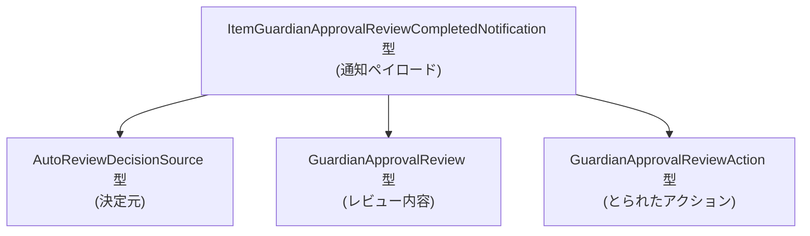
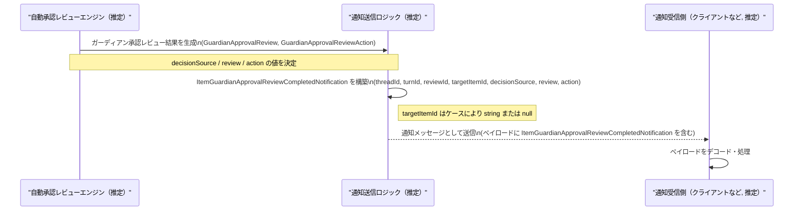

このドキュメントでは、`app-server-protocol/schema/typescript/v2/ItemGuardianApprovalReviewCompletedNotification.ts` を解説します。

# app-server-protocol/schema/typescript/v2/ItemGuardianApprovalReviewCompletedNotification.ts コード解説

## 0. ざっくり一言

ガーディアン自動承認レビュー完了時の「通知ペイロード」を表現する TypeScript の型定義です（自動生成コードであり、今後形が変わる可能性が明示されています）。  
外部の 3 つの型に依存しつつ、1 つの通知オブジェクトのフィールド構造を定義しています。

---

## 1. このモジュールの役割

### 1.1 概要

- このモジュールは **ガーディアンの自動承認レビューが完了したことを通知するペイロードの型** を提供します。
- 実装はなく、純粋に **データ構造（オブジェクトの形）を表現するための TypeScript 型エイリアス** だけが定義されています (ItemGuardianApprovalReviewCompletedNotification.ts:L12-30)。
- ファイル先頭に「自動生成コードであり手動で編集しないこと」「ts-rs によって Rust 側から生成されていること」がコメントで明示されています (L1-3)。

### 1.2 アーキテクチャ内での位置づけ

このファイルは `app-server-protocol/schema/typescript/v2` 配下にあり、「サーバープロトコルの v2 スキーマ」の一部と位置づけられます。  
この型は通知のペイロードであり、プロトコルメッセージの一部として送受信されることがコメントから読み取れます (L8-10)。

依存関係は次のとおりです:

- 依存している型（このファイルで定義されていない）:
  - `AutoReviewDecisionSource` (L4)
  - `GuardianApprovalReview` (L5)
  - `GuardianApprovalReviewAction` (L6)
- 提供している型:
  - `ItemGuardianApprovalReviewCompletedNotification`（本ファイル唯一の公開型）(L12-30)

これを Mermaid の依存関係図にすると次のようになります。



※ 依存先 3 型の定義はこのチャンクには現れないため、詳細は不明です。

### 1.3 設計上のポイント

コードから読み取れる設計上の特徴は次のとおりです。

- **自動生成コードであること**  
  - 先頭コメントに「GENERATED CODE」「ts-rs によって生成」「手動編集禁止」と記載されています (L1-3)。
  - Rust 側の型定義がソース・オブ・トゥルースになっていると解釈できます（コメントに ts-rs の URL があることが根拠です (L3)）。
- **単一の通知型に集約されたフィールド構造**  
  - `export type ... = { ... }` で 1 つのオブジェクト型をエクスポートしています (L12-30)。
  - フィールドはすべて必須（`targetItemId` のみ `null` を許容）として定義されています。
- **ドメイン型への参照による強い型付け**  
  - レビュー結果やアクションは、`GuardianApprovalReview`・`GuardianApprovalReviewAction` という専用型で表現されます (L5-6, L30)。
  - レビューデシジョンの由来を `AutoReviewDecisionSource` 型で表現します (L4, L30)。
- **`targetItemId` の null 許容とドメインルールのコメント**  
  - `targetItemId` の型は `string | null` です (L30)。
  - コメントで「network policy reviews の場合は `target_item_id` を None（TS 側では null）にする」ルールが明示されています (L18-28)。

---

## 2. 主要な機能一覧

このモジュールは実行時のロジックを持たないため、「機能」はすべて型レベルのものです。

- `ItemGuardianApprovalReviewCompletedNotification`:  
  ガーディアン自動承認レビュー完了通知のペイロード型（スレッド・ターン・レビュー ID、対象アイテム ID、決定元、レビュー内容、アクションを含む）。

---

## 3. 公開 API と詳細解説

### 3.1 型一覧（構造体・列挙体など）

このチャンクに現れる型・依存型のインベントリーです。

| 名前 | 種別 | 定義/参照範囲 | 役割 / 用途 |
|------|------|---------------|-------------|
| `ItemGuardianApprovalReviewCompletedNotification` | 型エイリアス（オブジェクト型） | ItemGuardianApprovalReviewCompletedNotification.ts:L12-30 | ガーディアン自動承認レビュー完了通知のペイロードを構造化して表す。 |
| `AutoReviewDecisionSource` | 型（外部定義） | インポートのみ: ItemGuardianApprovalReviewCompletedNotification.ts:L4, L30 | 自動レビューの「決定ソース」を表す型。詳細は別ファイルにあり、このチャンクには現れません。 |
| `GuardianApprovalReview` | 型（外部定義） | インポートのみ: ItemGuardianApprovalReviewCompletedNotification.ts:L5, L30 | ガーディアン承認レビューの内容を表す型と推測されますが、定義はこのチャンクには現れません。 |
| `GuardianApprovalReviewAction` | 型（外部定義） | インポートのみ: ItemGuardianApprovalReviewCompletedNotification.ts:L6, L30 | レビュー後にとられたアクションを表す型と推測されますが、定義はこのチャンクには現れません。 |

> 補足: 外部型については名前から用途を推測できますが、実際のフィールドやバリアントはこのチャンクからは分かりません。

### 3.2 主要な型の詳細: `ItemGuardianApprovalReviewCompletedNotification`

このファイルには関数定義が存在しないため (ItemGuardianApprovalReviewCompletedNotification.ts:L1-30)、ここでは関数テンプレートの代わりに「主要な型」の詳細をフィールドごとに解説します。

#### `ItemGuardianApprovalReviewCompletedNotification`

**概要**

- ガーディアンの「自動承認レビュー」が完了したことを通知するためのペイロード型です (L8-10)。
- コメントには `[UNSTABLE]` とあり、「一時的な通知ペイロードであり、近く形が変わる予定」であることが明示されています (L8-10)。

**フィールド一覧**

| フィールド名 | 型 | 定義行 | 説明 |
|--------------|----|--------|------|
| `threadId` | `string` | ItemGuardianApprovalReviewCompletedNotification.ts:L12 | 関連するスレッドを識別する ID。スレッド単位のコンテキストを特定するために使われます（コメントはありませんが、フィールド名からの解釈です）。 |
| `turnId` | `string` | ItemGuardianApprovalReviewCompletedNotification.ts:L12 | スレッド内のターン（会話または処理ステップ）を識別する ID と解釈できます。コメントはありません。 |
| `reviewId` | `string` | ItemGuardianApprovalReviewCompletedNotification.ts:L16 | 「このレビューの安定した識別子」であることがコメントで示されています (L13-16)。通知を一意に追跡するための ID です。 |
| `targetItemId` | `string \| null` | ItemGuardianApprovalReviewCompletedNotification.ts:L30 | レビュー対象のアイテムまたはツールコールの ID。network policy review など一部のケースでは存在しないため、`null` が許容されます (L18-28)。 |
| `decisionSource` | `AutoReviewDecisionSource` | ItemGuardianApprovalReviewCompletedNotification.ts:L30 | 自動レビューの判断がどこから来たか（例: ルールベース、モデルなど）を表す型と解釈できます。詳細は別ファイルです。 |
| `review` | `GuardianApprovalReview` | ItemGuardianApprovalReviewCompletedNotification.ts:L30 | 実際のレビュー内容（何を評価し、どのような所見があったか等）を表す型。詳細は別ファイルです。 |
| `action` | `GuardianApprovalReviewAction` | ItemGuardianApprovalReviewCompletedNotification.ts:L30 | レビュー結果に基づき、システムが取ったアクション（許可・拒否など）を表す型と解釈できます。詳細は別ファイルです。 |

**内部処理の流れ（アルゴリズム）**

- この型は純粋なデータコンテナであり、内部処理やアルゴリズムは存在しません。
- エンコード／デコードや検証ロジックは、このチャンクには現れていません。

**Examples（使用例）**

TypeScript 側で通知ペイロードを生成・利用する例です。  
ここでは典型的な「ターゲットアイテムが存在するケース」と「network policy review でターゲットがないケース」を示します。

```typescript
import type {
    ItemGuardianApprovalReviewCompletedNotification,
} from "./ItemGuardianApprovalReviewCompletedNotification";  // このファイルの型をインポートする

// ターゲットアイテムが存在するレビュー完了通知の例
const notificationWithTarget: ItemGuardianApprovalReviewCompletedNotification = {
    threadId: "thread_123",                        // スレッド ID
    turnId: "turn_5",                              // ターン ID
    reviewId: "review_abc",                        // 安定したレビュー ID
    targetItemId: "item_789",                      // 対象アイテムの ID（存在するケース）
    decisionSource: /* AutoReviewDecisionSource 値 */, // 実際の値は別型の定義に従う
    review:       /* GuardianApprovalReview 値 */,      // レビュー内容
    action:       /* GuardianApprovalReviewAction 値 */, // 実行されたアクション
};

// network policy review など、対象アイテムが存在しない場合の例
const notificationWithoutTarget: ItemGuardianApprovalReviewCompletedNotification = {
    threadId: "thread_456",
    turnId: "turn_2",
    reviewId: "review_def",
    targetItemId: null,                            // コメント (L18-28) のルールに従い null を設定
    decisionSource: /* AutoReviewDecisionSource 値 */,
    review:       /* GuardianApprovalReview 値 */,
    action:       /* GuardianApprovalReviewAction 値 */,
};
```

> `decisionSource` / `review` / `action` に具体的にどのような値を入れるかは、各型の定義がこのチャンクにはないため記述できません。

**Errors / Panics**

- この型そのものは実行時ロジックを持たないため、直接エラーや例外を発生させることはありません。
- 型安全性に関して:
  - TypeScript コンパイル時に、フィールドの欠落や型不一致（例: `targetItemId` に `undefined` を入れるなど）はエラーとして検出されます。
  - ランタイムでのシリアライズ／デシリアライズ時のエラー（JSON パース失敗など）は、このチャンクには現れていません。

**Edge cases（エッジケース）**

特に `targetItemId` まわりにドメイン上のエッジケースがコメントされています (L18-28)。

- **targetItemId が null のケース** (network policy reviews):
  - network policy のレビューでは、レビュー対象が「ネットワークコール」であり、CommandExecution アイテムとは区別されます (L20-27)。
  - `target_item_id` を CommandExecution アイテムにしてしまうと「コマンド実行そのもののレビュー」と誤解されるため、意図的に `None`（TS では `null`）とする、とコメントされています (L25-28)。
- **execve reviews の複数ターゲット**:
  - コメントによれば、execve レビューでは単一のコマンド内に複数の execve 呼び出しが含まれる場合があり、その場合 1 レビューに対して複数ターゲットが存在しうると記述されています (L21-22)。
  - ただし型としては `targetItemId: string | null` の単一値しか持たないため、実際に「複数ターゲット」をどう表現するか、あるいはどの ID を入れるかはこのチャンクからは分かりません。

**使用上の注意点**

- **`targetItemId` は `undefined` ではなく `null` を使う**  
  - 型定義は `string | null` であり、`undefined` は含まれていません (L30)。  
  - TypeScript で `targetItemId: undefined` を代入するとコンパイルエラーになります。
- **ドメインルールに従った `targetItemId` の設定**  
  - network policy reviews では `targetItemId` を `null` にするべきとコメントされています (L18-28)。  
  - 逆に対象アイテムが存在するケースでは、適切な ID を `string` として設定する必要があります。
- **[UNSTABLE] であることへの注意**  
  - コメントで「一時的」「形が変わる予定」と明示されているため (L8-10)、長期にわたる安定 API として前提するのは避けるべきです。
- **自動生成ファイルを直接編集しない**  
  - 先頭コメントに「DO NOT MODIFY BY HAND」と明確に書かれており (L1-3)、直接の修正は想定されていません。  
  - 変更が必要な場合は、元となる Rust 側の型定義を変更し、ts-rs 再生成を行う必要があります。

### 3.3 その他の関数

- このファイルには関数・メソッドは定義されていません (ItemGuardianApprovalReviewCompletedNotification.ts:L1-30)。  
  したがって、補助関数やラッパー関数の一覧も存在しません。

---

## 4. データフロー

このチャンクには関数や送受信処理が現れていませんが、コメントから「notification payload」であることが分かるため (L8-10)、典型的なデータフローのイメージを示します。  
下記はコメントから推測される概念的な流れであり、実際のコンポーネント名や実装はこのチャンクには現れません。



> 重要: 上図はコメントからの推測であり、このチャンク内に具体的な `Notifier` や `ReviewEngine` の実装は存在しません。  
> 実際のデータフローは、プロトコル実装側のコードを参照する必要があります。

---

## 5. 使い方（How to Use）

### 5.1 基本的な使用方法

このモジュールは「型」だけを提供するため、典型的な使用方法は以下のように「関数の引数・戻り値として利用する」「オブジェクトを構築する」形になります。

```typescript
// ItemGuardianApprovalReviewCompletedNotification.ts から型をインポート
import type {
    ItemGuardianApprovalReviewCompletedNotification,
} from "./ItemGuardianApprovalReviewCompletedNotification";

// 通知を処理する関数の例（この関数自体はこのチャンクには存在しない仮想コードです）
function handleGuardianReviewCompleted(
    notification: ItemGuardianApprovalReviewCompletedNotification,  // 型を引数に使用
): void {
    // スレッドとターンの識別情報にアクセス
    console.log(notification.threadId, notification.turnId);

    // レビュー ID をログに残す
    console.log("Review ID:", notification.reviewId);

    // targetItemId が null かどうかで処理を分岐
    if (notification.targetItemId === null) {
        // network policy review など、対象アイテムが存在しないケース
        console.log("No target item for this review.");
    } else {
        console.log("Target item:", notification.targetItemId);
    }

    // decisionSource / review / action の扱いはそれぞれの型の定義に従う
}
```

このように、TypeScript の型チェックにより通知ペイロードの構造が保証されます。

### 5.2 よくある使用パターン

1. **通知受信側でのバリデーションとパターン分岐**

```typescript
function onNotificationReceived(
    raw: unknown,  // 例えば JSON からパースされた値
): ItemGuardianApprovalReviewCompletedNotification | null {
    // 実際には zod や io-ts などのスキーマバリデーションライブラリを使うことが多い
    // ここでは簡略化したチェックのイメージだけを示す
    if (typeof raw !== "object" || raw === null) return null;

    const obj = raw as Partial<ItemGuardianApprovalReviewCompletedNotification>;

    if (typeof obj.threadId !== "string" || typeof obj.turnId !== "string") {
        return null;
    }

    // 他フィールドの検証は省略（このチャンクにはバリデーションロジックは存在しません）

    return obj as ItemGuardianApprovalReviewCompletedNotification;
}
```

1. **送信側でのペイロード構築**

```typescript
function buildNotification(
    base: { threadId: string; turnId: string; reviewId: string; targetItemId: string | null },
    decisionSource: AutoReviewDecisionSource,
    review: GuardianApprovalReview,
    action: GuardianApprovalReviewAction,
): ItemGuardianApprovalReviewCompletedNotification {
    return {
        ...base,
        decisionSource,
        review,
        action,
    };
}
```

※ 上記関数はこのチャンクには存在せず、利用例としての仮想コードです。

### 5.3 よくある間違い

型定義から推測できる誤用パターンと修正版です。

```typescript
import type {
    ItemGuardianApprovalReviewCompletedNotification,
} from "./ItemGuardianApprovalReviewCompletedNotification";

// 間違い例: targetItemId に undefined を入れている
const badNotification: ItemGuardianApprovalReviewCompletedNotification = {
    threadId: "t1",
    turnId: "u1",
    reviewId: "r1",
    // targetItemId: undefined,  // 型が string | null なのでコンパイルエラー
    targetItemId: null,           // 正しくは null または string を指定する
    decisionSource: /* ... */ null as any,
    review: /* ... */ null as any,
    action: /* ... */ null as any,
};

// 間違い例: decisionSource を任意の文字列にしてしまう
const badNotification2: ItemGuardianApprovalReviewCompletedNotification = {
    threadId: "t1",
    turnId: "u1",
    reviewId: "r1",
    targetItemId: "item_1",
    // decisionSource: "model",             // AutoReviewDecisionSource の実体が string とは限らないためエラーになる可能性が高い
    decisionSource: /* AutoReviewDecisionSource 値 */, // 正しくは定義済みの型に従う
    review:       /* GuardianApprovalReview 値 */,
    action:       /* GuardianApprovalReviewAction 値 */,
};
```

### 5.4 使用上の注意点（まとめ）

- このファイルは **自動生成** であり、手動編集は避ける必要があります (L1-3)。
- コメントに `[UNSTABLE]` とある通り、**型の形状が変わる可能性が高い** ため、外部公開 API として長期固定前提での利用は注意が必要です (L8-10)。
- `targetItemId` の `null` 取り扱いはドメインルールに結びついているため、コメントの趣旨（network policy review 時は `null`）を守る必要があります (L18-28)。
- TypeScript の型としては同期／非同期・並行性に関する性質は持たず、純粋なデータ構造です。

---

## 6. 変更の仕方（How to Modify）

### 6.1 新しい機能を追加する場合

このファイルは自動生成であり、コメントに「手動編集しない」とあるため (L1-3)、直接この TypeScript ファイルを修正するのは前提とされていません。変更が必要な場合の一般的な流れは次のようになります（ts-rs ベースのコード生成というコメント (L3) に基づく推定です）。

1. **Rust 側の型定義を変更する**  
   - ts-rs によってこの型が生成されているため、元となる Rust の構造体または型エイリアスを修正する必要があります。
   - 例: 新しいフィールドを追加したい場合、Rust 側にそのフィールドを追加する。

2. **ts-rs によるコード生成を再実行する**  
   - プロジェクトのビルドスクリプトや専用コマンドを実行し、TypeScript のスキーマを再生成します。
   - その結果として、本ファイルの内容も更新されます。

3. **TypeScript 側の利用箇所を更新する**  
   - 追加されたフィールドを使用するコードを修正・追加する。
   - 古いフィールドが削除された場合は、利用箇所を削除または代替フィールドに置き換える。

### 6.2 既存の機能を変更する場合

この型のフィールドや意味を変更する際には、次の点に注意する必要があります。

- **影響範囲の確認**  
  - `ItemGuardianApprovalReviewCompletedNotification` を利用している全ての TypeScript コード（引数・戻り値・オブジェクトリテラルの構築など）に影響します。
  - サーバー側（Rust）とクライアント側（TypeScript）の両方で同じ変更が反映されていることが重要です。

- **契約（前提条件・返り値の意味）**  
  - 例えば `targetItemId` の `null` 許容をやめる／別の表現に変える場合、network policy review の扱いが変わるため、コメント (L18-28) で表現されているドメインルールが変化します。
  - `reviewId` が「安定した識別子」であることが前提になっているコードがある可能性があるため (L13-16)、意味を変更する場合は特に注意が必要です。

- **テスト・検証**  
  - このチャンクにはテストコードは含まれていませんが、実際のプロジェクトではプロトコル互換性テスト（送受信の JSON 互換性など）を更新する必要があります。

---

## 7. 関連ファイル

このモジュールと密接に関連するファイルは、インポートされている型から次のように推定できます。

| パス | 役割 / 関係 |
|------|------------|
| `./AutoReviewDecisionSource` | `decisionSource` フィールドの型を定義するファイル。自動レビューの決定元を表現する。定義はこのチャンクには現れません (インポート: L4)。 |
| `./GuardianApprovalReview` | `review` フィールドの型を定義するファイル。実際のガーディアン承認レビュー内容を表現する (インポート: L5)。 |
| `./GuardianApprovalReviewAction` | `action` フィールドの型を定義するファイル。レビュー結果に基づくアクションを表現する (インポート: L6)。 |

これらのファイルを併せて読むことで、`ItemGuardianApprovalReviewCompletedNotification` が表現するペイロード全体の意味がより明確になります。
