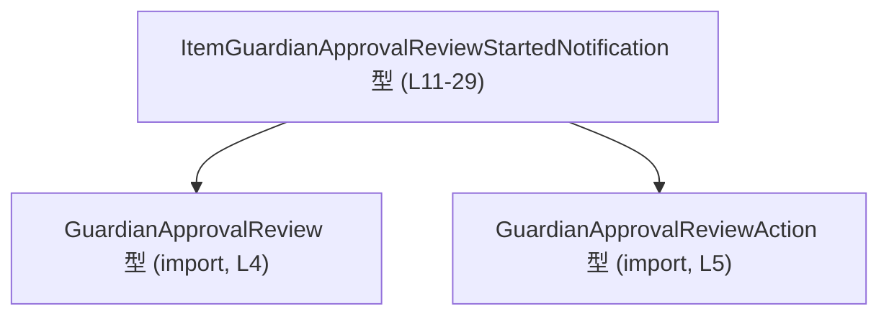
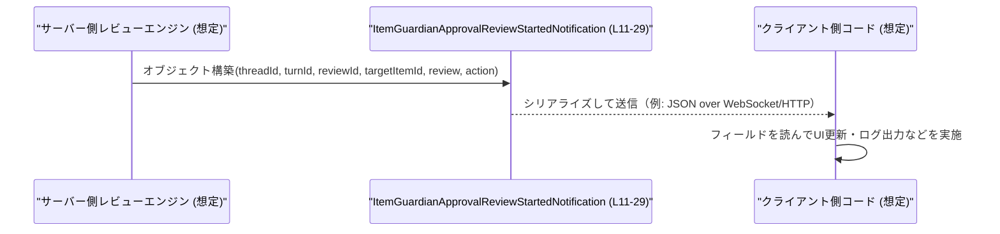

# app-server-protocol\schema\typescript\v2\ItemGuardianApprovalReviewStartedNotification.ts

## 0. ざっくり一言

ガーディアンの自動承認レビューが「開始された」ことを通知するための、一時的な（UNSTABLE）通知ペイロード型を定義する TypeScript ファイルです。  
（根拠: 自動生成コメントと型コメントから `UNSTABLE` / notification payload と明記されています  
app-server-protocol\schema\typescript\v2\ItemGuardianApprovalReviewStartedNotification.ts:L1-3,7-10,11）

---

## 1. このモジュールの役割

### 1.1 概要

- このモジュールは「ガーディアン自動承認レビュー開始」の通知ペイロードを表現するための **型定義** を提供します。  
  （根拠: `[UNSTABLE] Temporary notification payload for guardian automatic approval review` というコメント  
  app-server-protocol\schema\typescript\v2\ItemGuardianApprovalReviewStartedNotification.ts:L7-9）
- 通知に必要な識別子（threadId / turnId / reviewId / targetItemId）と、レビュー内容・アクション（GuardianApprovalReview / GuardianApprovalReviewAction）を 1 つのオブジェクト型にまとめています。  
  （根拠: 型定義のプロパティ一覧  
  app-server-protocol\schema\typescript\v2\ItemGuardianApprovalReviewStartedNotification.ts:L11,15,17-27,29）

### 1.2 アーキテクチャ内での位置づけ

- このファイルは「プロトコル / スキーマ層」の一部であり、通信に使う JSON などの形を TypeScript 側で表現していると解釈できます（ts-rs 生成コードであるため）。  
  （根拠: `This file was generated by [ts-rs]` コメント  
  app-server-protocol\schema\typescript\v2\ItemGuardianApprovalReviewStartedNotification.ts:L3）
- この型は、他のモジュールからインポートされて **通知メッセージの型注釈** に使われることが想定されますが、このチャンクには実際の利用コードは現れていません。
- 依存関係として、レビュー内容とアクションを表す 2 つの型をインポートしています。  
  （根拠: import 文  
  app-server-protocol\schema\typescript\v2\ItemGuardianApprovalReviewStartedNotification.ts:L4-5）



> 図は、このファイルにおける型の依存関係のみを示しています。  
> `GuardianApprovalReview` / `GuardianApprovalReviewAction` の定義自体は、このチャンクには現れません。

### 1.3 設計上のポイント

- **自動生成コード**  
  - ts-rs により生成されることが明示され、「手で編集しない」ことが強調されています。  
    （根拠: `GENERATED CODE! DO NOT MODIFY BY HAND!` コメント  
    app-server-protocol\schema\typescript\v2\ItemGuardianApprovalReviewStartedNotification.ts:L1-3）
- **純粋なデータ型**  
  - 関数やクラスはなく、1 つの `export type` のみです。副作用やロジックは持ちません。  
    （根拠: ファイル全体に関数定義が存在しない  
    app-server-protocol\schema\typescript\v2\ItemGuardianApprovalReviewStartedNotification.ts:L1-29）
- **型専用 import**  
  - `import type` により、依存する型はコンパイル時にのみ利用され、バンドル結果には影響しません。  
    （根拠: `import type { ... }`  
    app-server-protocol\schema\typescript\v2\ItemGuardianApprovalReviewStartedNotification.ts:L4-5）
- **null 許容フィールド**  
  - `targetItemId` は `string | null` で、コメントにネットワークポリシーレビューなどの特殊ケースが解説されています。  
    （根拠: フィールド型と詳細コメント  
    app-server-protocol\schema\typescript\v2\ItemGuardianApprovalReviewStartedNotification.ts:L17-27,29）
- **UNSTABLE な契約**  
  - コメントで「shape is expected to change soon」とあり、スキーマが安定していないことが明示されています。  
    （根拠: コメント  
    app-server-protocol\schema\typescript\v2\ItemGuardianApprovalReviewStartedNotification.ts:L7-10）

---

## 2. 主要な機能一覧（コンポーネントインベントリ）

このファイルは機能（関数）ではなく **型** を 1 つ公開します。

- `ItemGuardianApprovalReviewStartedNotification`:  
  ガーディアン自動承認レビュー開始通知のペイロード型。スレッド ID、ターン ID、レビュー ID、対象アイテム ID（null 許容）、レビュー内容、アクションを保持します。  
  （根拠: 型定義  
  app-server-protocol\schema\typescript\v2\ItemGuardianApprovalReviewStartedNotification.ts:L11,15,17-27,29）

依存する型（このファイルでは公開されませんが、構造上重要なコンポーネント）:

- `GuardianApprovalReview`: レビューの詳細な内容を表す型。  
  （根拠: import 文  
  app-server-protocol\schema\typescript\v2\ItemGuardianApprovalReviewStartedNotification.ts:L4）
- `GuardianApprovalReviewAction`: レビュー結果として取るアクション（例: 自動承認・ブロックなど）を表す型と推測できますが、このチャンクには詳細はありません。  
  （根拠: import 文のみ  
  app-server-protocol\schema\typescript\v2\ItemGuardianApprovalReviewStartedNotification.ts:L5）

---

## 3. 公開 API と詳細解説

### 3.1 型一覧（構造体・列挙体など）

| 名前 | 種別 | 役割 / 用途 | 定義 / 参照行 |
|------|------|-------------|----------------|
| `ItemGuardianApprovalReviewStartedNotification` | 型エイリアス（オブジェクト型） | 自動承認レビュー開始通知のペイロード全体を表す | app-server-protocol\schema\typescript\v2\ItemGuardianApprovalReviewStartedNotification.ts:L11-29 |
| `GuardianApprovalReview` | 型（外部） | 通知内で参照されるレビュー内容の型 | app-server-protocol\schema\typescript\v2\ItemGuardianApprovalReviewStartedNotification.ts:L4 |
| `GuardianApprovalReviewAction` | 型（外部） | 通知内で参照されるアクション指定の型 | app-server-protocol\schema\typescript\v2\ItemGuardianApprovalReviewStartedNotification.ts:L5 |

### 3.2 関数詳細（最大 7 件）

このファイルには関数・メソッドは定義されていません。  
（根拠: ファイル全体がコメント・import と 1 つの `export type` のみで構成  
app-server-protocol\schema\typescript\v2\ItemGuardianApprovalReviewStartedNotification.ts:L1-29）

### 3.3 その他の関数

- このファイルには補助関数やラッパー関数も存在しません。

### 3.4 `ItemGuardianApprovalReviewStartedNotification` 型の詳細

#### 概要

`ItemGuardianApprovalReviewStartedNotification` は次のフィールドを持つオブジェクト型です。  
（根拠: 型定義行  
app-server-protocol\schema\typescript\v2\ItemGuardianApprovalReviewStartedNotification.ts:L11,15,17-27,29）

#### フィールド一覧

| フィールド名 | 型 | 説明 | 根拠行 |
|-------------|----|------|--------|
| `threadId` | `string` | 対象となるスレッドの識別子 | app-server-protocol\schema\typescript\v2\ItemGuardianApprovalReviewStartedNotification.ts:L11 |
| `turnId` | `string` | スレッド内のターン（会話ステップなど）の識別子 | 同上（カンマ区切り）L11 |
| `reviewId` | `string` | このレビューの安定した識別子。再参照やログ結合に用いられます | app-server-protocol\schema\typescript\v2\ItemGuardianApprovalReviewStartedNotification.ts:L12-15 |
| `targetItemId` | `string \| null` | レビュー対象アイテムまたはツール呼び出しの ID。ネットワークポリシーレビューなど一部ケースでは null（存在しない）になります | app-server-protocol\schema\typescript\v2\ItemGuardianApprovalReviewStartedNotification.ts:L17-27,29 |
| `review` | `GuardianApprovalReview` | レビューの詳細な内容（レビュー対象・理由・ポリシーなどを含むことが想定されますが、このチャンクからは詳細不明） | app-server-protocol\schema\typescript\v2\ItemGuardianApprovalReviewStartedNotification.ts:L29 |
| `action` | `GuardianApprovalReviewAction` | レビューに対して取るアクションの指定（例: 許可・拒否などが想定されますが、このチャンクからは詳細不明） | app-server-protocol\schema\typescript\v2\ItemGuardianApprovalReviewStartedNotification.ts:L29 |

#### TypeScript 的な安全性のポイント

- `targetItemId` は `string | null`  
  - 呼び出し側は **null チェックが必須** であり、単純に文字列として扱うとコンパイルエラーになります。  
    これは TypeScript の **ユニオン型** による型安全性です。  
  - コメントで、特に「ネットワークポリシーレビューでは target_item_id は None（= null）になる」と明記されています。  
    （根拠: コメント  
    app-server-protocol\schema\typescript\v2\ItemGuardianApprovalReviewStartedNotification.ts:L17-27）
- すべてのフィールドが必須（`?` の付いたオプショナルは存在しない）ため、通知オブジェクトを構築する際はこれらすべてのキーを持たなければコンパイルエラーになります。  
  （根拠: 型定義にオプショナル修飾子がない  
  app-server-protocol\schema\typescript\v2\ItemGuardianApprovalReviewStartedNotification.ts:L11,15,29）

#### 契約・エッジケース（型レベルで読める範囲）

- `targetItemId === null` のケース  
  - コメントにある通り、ネットワークポリシーレビューでは「レビュー対象アイテムが存在しない」ため null になります。  
    （根拠: 「network policy reviews, where there is no target item」「target_item_id is set to None for network policy reviews」  
    app-server-protocol\schema\typescript\v2\ItemGuardianApprovalReviewStartedNotification.ts:L22-27）
  - クライアント側で「すべてのレビューは 1 つのアイテムに対応する」と仮定すると誤動作の原因になります。
- execve レビューのケース  
  - コメントには「1 つのコマンドに複数の execve 呼び出しが含まれる場合」があると書かれていますが、`targetItemId` 自体は単一の `string | null` なので、詳細なマッピング方法はこの型からは分かりません。  
    （根拠: コメント中の `execve reviews` 説明  
    app-server-protocol\schema\typescript\v2\ItemGuardianApprovalReviewStartedNotification.ts:L19-21）
- `reviewId` は「Stable identifier」と書かれていますが、型的には単なる `string` なので、安定性・一意性の保証はアプリケーションロジック側の責務です。  
  （根拠: コメント  
  app-server-protocol\schema\typescript\v2\ItemGuardianApprovalReviewStartedNotification.ts:L12-15）

---

## 4. データフロー

このファイルには処理ロジックは存在しませんが、型名とコメントから想定できる **典型的なデータフローの例** を示します。実際にどのコンポーネントがこの型を使うかは、このチャンクからは分かりません。

### 想定シナリオ: レビュー開始通知の送受信

1. サーバー側のレビューエンジンが、あるスレッド・ターンに対してガーディアン自動承認レビューを開始する。
2. サーバー側コードが `ItemGuardianApprovalReviewStartedNotification` 型のオブジェクトを構築する。
3. それを JSON などにシリアライズしてクライアントへ送信する。
4. クライアントは受信したオブジェクトをこの型として扱い、UI の更新やログ記録を行う。



> 上記の送受信処理はこのファイルには含まれておらず、実際の関数名・モジュール構造は **このチャンクからは不明** です。

---

## 5. 使い方（How to Use）

### 5.1 基本的な使用方法

この型を利用する典型例として、「通知オブジェクトを受け取り、その内容を安全に扱う」コード例を示します。

```typescript
// ItemGuardianApprovalReviewStartedNotification 型と依存型を import する
import type {
    ItemGuardianApprovalReviewStartedNotification,
} from "./ItemGuardianApprovalReviewStartedNotification"; // 本ファイル
import type { GuardianApprovalReview } from "./GuardianApprovalReview";           // このチャンクには定義なし
import type { GuardianApprovalReviewAction } from "./GuardianApprovalReviewAction"; // 同上

// どこかから通知ペイロードを受け取ったと仮定する
declare const notification: ItemGuardianApprovalReviewStartedNotification; // 型注釈により安全にアクセス

// 型安全にフィールドへアクセスする例
const threadId: string = notification.threadId;      // string として保証される
const turnId: string = notification.turnId;          // string
const reviewId: string = notification.reviewId;      // string

// targetItemId は string | null なので null チェックが必要
if (notification.targetItemId !== null) {
    // ここでは string として扱える
    const itemId: string = notification.targetItemId;
    console.log("レビュー対象アイテム:", itemId);
} else {
    console.log("このレビューには対象アイテムがありません（例: ネットワークポリシー）");
}

// review / action も、それぞれの型に従って扱う
const review: GuardianApprovalReview = notification.review;
const action: GuardianApprovalReviewAction = notification.action;
```

この例から分かるとおり、TypeScript の型注釈とユニオン型により、`targetItemId` の null ケースをコンパイル段階で強制的に扱うことができます。

### 5.2 よくある使用パターン

1. **通知ハンドラ内での分岐**

```typescript
function handleNotification(
    notification: ItemGuardianApprovalReviewStartedNotification,
): void {
    // ネットワークポリシーレビュー（targetItemId が null）の場合の処理と、
    // 通常レビューの場合の処理を分けるパターン
    if (notification.targetItemId === null) {
        // 対象アイテムを持たないレビュー
        // 例: ネットワークポリシーに関するメッセージ表示など
    } else {
        // 対象アイテム ID を持つレビュー
        // 例: 対象アイテムの詳細画面へリンクを張るなど
    }

    // action に応じた追加処理（具体的な variant はこのチャンクからは不明）
    switch (notification.action as unknown) {
        // GuardianApprovalReviewAction の実際の定義に応じてパターン分岐する
        default:
            break;
    }
}
```

1. **ロギング用のシリアライズ**

```typescript
function logNotification(
    notification: ItemGuardianApprovalReviewStartedNotification,
): void {
    // 必要に応じて一部フィールドのみログ出力
    console.log(
        "[GuardianReviewStarted]",
        notification.reviewId,
        notification.threadId,
        notification.turnId,
        notification.targetItemId,
    );
}
```

### 5.3 よくある間違い（想定される誤用）

#### 1. `targetItemId` を常に string と仮定してしまう

```typescript
// 誤りの例（TypeScript の型チェックを無視したケース）
function wrongHandler(notification: any) {
    // any を使うとコンパイルが通ってしまうが、runtime で null の可能性がある
    console.log(notification.targetItemId.toUpperCase()); // targetItemId が null だと実行時エラー
}

// 正しい例（型を使い、null を考慮する）
function correctHandler(notification: ItemGuardianApprovalReviewStartedNotification) {
    if (notification.targetItemId) {
        console.log(notification.targetItemId.toUpperCase());
    } else {
        console.log("対象アイテムなしのレビューです");
    }
}
```

#### 2. 自動生成ファイルを手で編集してしまう

```typescript
// 誤りの例：このファイルに直接フィールドを追加する
// → ts-rs による再生成で上書きされ、変更が失われる
// また Rust 側との不整合も生じる可能性がある
```

このファイルの先頭には「DO NOT MODIFY BY HAND!」とあるため、変更は元となる Rust 側の定義で行う必要があります。  
（根拠: コメント  
app-server-protocol\schema\typescript\v2\ItemGuardianApprovalReviewStartedNotification.ts:L1-3）

### 5.4 使用上の注意点（まとめ）

- **スキーマの不安定性**  
  - `[UNSTABLE]` と「shape is expected to change soon」というコメントがあるため、長期的な互換性を前提とした実装（例: 永続フォーマットとして保存するなど）は注意が必要です。  
    （根拠: コメント  
    app-server-protocol\schema\typescript\v2\ItemGuardianApprovalReviewStartedNotification.ts:L7-10）
- **null の扱い**  
  - `targetItemId` は `string | null` であるため、UI やビジネスロジックで null ケースを必ず考慮する必要があります。
- **型レベルの安全性と実行時エラー**  
  - この型はコンパイル時のチェックのみを提供し、実行時のバリデーションは行いません。  
    ネットワーク越しに受け取る JSON データに対しては、別途ランタイムバリデーションを行わない限り、型との不整合が起こり得ます。
- **並行性・スレッドセーフ性**  
  - このファイルは純粋な型定義であり、状態やミューテーションを伴わないため、TypeScript レベルでは並行性に関する直接の問題はありません。  
    実際の並行処理（例えば複数通知の同時処理）は、別の実装コード側の責務です。

---

## 6. 変更の仕方（How to Modify）

### 6.1 新しい機能を追加する場合

このファイルは ts-rs により自動生成されるため、**直接編集するのではなく、生成元の Rust 側定義を変更する** 必要があります。  
（根拠: `GENERATED CODE! DO NOT MODIFY BY HAND!` と ts-rs に関するコメント  
app-server-protocol\schema\typescript\v2\ItemGuardianApprovalReviewStartedNotification.ts:L1-3）

一般的な手順（このチャンクからは具体的なファイル名は分かりません）:

1. Rust 側で、この通知に対応する構造体（例: `ItemGuardianApprovalReviewStartedNotification` に対応する struct）を特定する。  
   - この情報は本チャンクには現れないため、Rust プロジェクト側のコードを参照する必要があります。
2. その struct にフィールドを追加・変更し、ts-rs のアトリビュートに従って TypeScript 型を生成するようにする。
3. Rust プロジェクトをビルドまたは ts-rs の生成コマンドを実行して、TypeScript 側のこのファイルを再生成する。
4. TypeScript 側の利用箇所（通知ハンドラなど）で、新しいフィールドを使うように修正する。

### 6.2 既存の機能を変更する場合

- **フィールド名・型の変更**  
  - Rust 側のフィールド名や型を変更すると、この TypeScript 型も変わります。  
  - 変更により `ItemGuardianApprovalReviewStartedNotification` 型のプロパティが変わるため、コンパイラエラーを手掛かりに、すべての利用箇所を修正する必要があります。
- **契約維持の重要性**  
  - `reviewId` が「安定した識別子」として扱われているように、コメントに書かれた意味論的な契約を破る変更（例: 一時的 ID に変更するなど）は、下流の分析・ロギングなどに影響を与えます。
- **互換性の確認**  
  - プロトコルを利用するクライアントが複数存在する場合、型の変更が互換性を壊さないか（例: フィールド削除・型縮小など）を確認する必要があります。
- **テスト**  
  - このファイル自体にはテストコードはありませんが、実際のアプリケーションでは「Rust 側で生成された JSON」と「TypeScript 側で期待する型」が一致しているかを確認する統合テストが有用です。  
    （このチャンクにはテストの有無に関する情報は現れません）

---

## 7. 関連ファイル

このモジュールと直接関係するファイルは、import 文から次のように読み取れます。

| パス | 役割 / 関係 | 根拠 |
|------|-------------|------|
| `./GuardianApprovalReview` | `GuardianApprovalReview` 型を定義するファイル。レビュー内容の詳細構造を提供する | app-server-protocol\schema\typescript\v2\ItemGuardianApprovalReviewStartedNotification.ts:L4 |
| `./GuardianApprovalReviewAction` | `GuardianApprovalReviewAction` 型を定義するファイル。レビュー結果としてのアクションの型を提供する | app-server-protocol\schema\typescript\v2\ItemGuardianApprovalReviewStartedNotification.ts:L5 |
| （Rust 側 ts-rs 元定義; パス不明） | この TypeScript 型の生成元となる Rust の構造体定義。コメントから ts-rs により生成されていることのみ分かりますが、具体的な場所はこのチャンクには現れません | app-server-protocol\schema\typescript\v2\ItemGuardianApprovalReviewStartedNotification.ts:L1-3 |

このファイルは純粋な型定義であり、ビジネスロジックや I/O、並行処理、ログ出力などはすべて別ファイルに委ねられていると解釈できます。ただし、それらの具体的な構造やファイルパスは、このチャンクからは分かりません。
