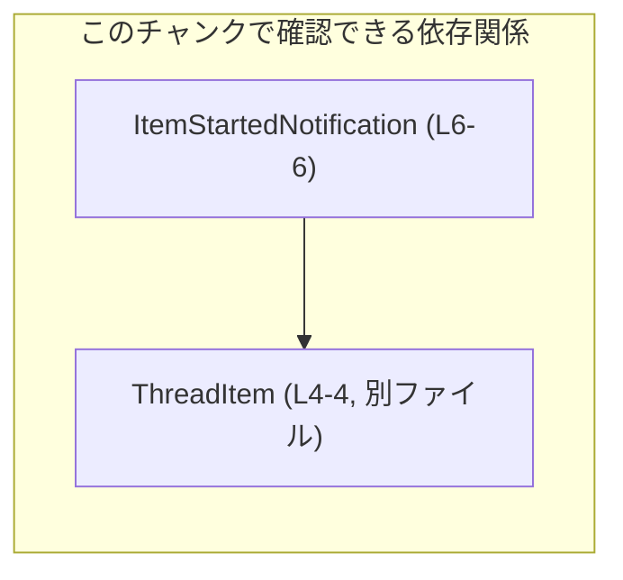
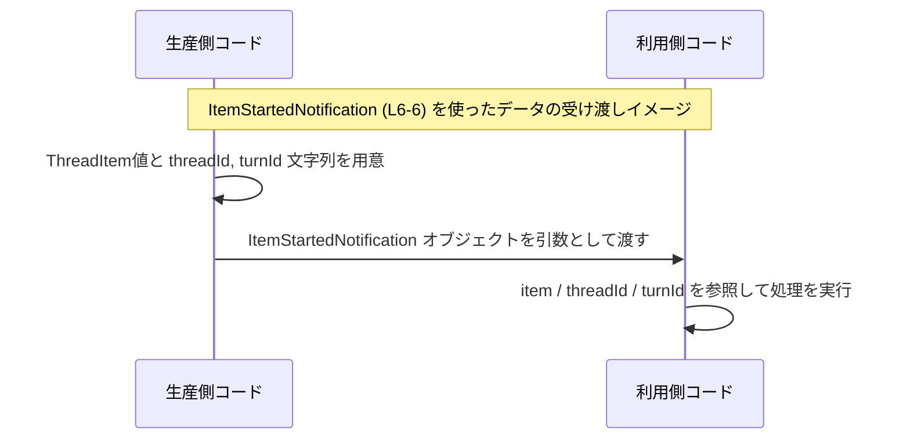

# app-server-protocol/schema/typescript/v2/ItemStartedNotification.ts

## 0. ざっくり一言

- `ItemStartedNotification` という 1 つの TypeScript 型エイリアスを公開する、自動生成ファイルです（根拠: `ItemStartedNotification.ts:L1-3, L6-6`）。
- この型は、`ThreadItem` と `threadId`, `turnId` という 3 つのプロパティを持つオブジェクト構造を表現します（根拠: `ItemStartedNotification.ts:L4-4, L6-6`）。

---

## 1. このモジュールの役割

### 1.1 概要

- このモジュールは、自動生成された通知オブジェクトの型 `ItemStartedNotification` を提供します（根拠: `ItemStartedNotification.ts:L1-3, L6-6`）。
- 型は `export type` で公開されており、他の TypeScript ファイルからインポートして利用されることを意図しています（根拠: `ItemStartedNotification.ts:L6-6`）。
- オブジェクトの構造は `{ item: ThreadItem, threadId: string, turnId: string }` です（根拠: `ItemStartedNotification.ts:L4-4, L6-6`）。

### 1.2 アーキテクチャ内での位置づけ

このファイルは、別モジュール `./ThreadItem` から `ThreadItem` 型をインポートし、それを含む新しい型を定義しています（根拠: `ItemStartedNotification.ts:L4-4, L6-6`）。  
このファイル自身は純粋な型定義であり、ロジックや関数は持ちません。



- `ItemStartedNotification` は `ThreadItem` に依存します（プロパティ `item` の型として利用）（根拠: `ItemStartedNotification.ts:L4-4, L6-6`）。
- `ThreadItem` の中身や役割は、このチャンクには現れず不明です（根拠: `ItemStartedNotification.ts:L4-4`）。

### 1.3 設計上のポイント

- **自動生成であること**  
  - ファイル先頭に「GENERATED CODE! DO NOT MODIFY BY HAND!」と明記されています（根拠: `ItemStartedNotification.ts:L1-3`）。
  - `ts-rs` というツールによって生成されたことがコメントに書かれています（根拠: `ItemStartedNotification.ts:L3-3`）。
- **責務の限定**  
  - 型エイリアスの定義のみで、関数やクラスなどのロジックは一切持ちません（根拠: ロジック行が存在せず、唯一の実コード行が型定義であること: `ItemStartedNotification.ts:L4-4, L6-6`）。
- **状態管理なし**  
  - 変数定義や実行時の状態を持たず、コンパイル時の型情報のみを提供します。
- **エラーハンドリングや並行性の対象外**  
  - 実行コードがないため、このファイル単体ではエラーハンドリングや並行処理に関する挙動は発生しません。

---

## 2. 主要な機能一覧

このファイルが提供する機能は次の 1 点です。

- `ItemStartedNotification` 型: `item`, `threadId`, `turnId` を持つオブジェクト構造を表現する型エイリアス（根拠: `ItemStartedNotification.ts:L4-4, L6-6`）。

---

## 3. 公開 API と詳細解説

### 3.1 型一覧（構造体・列挙体など）

このチャンクに登場する型およびシンボルのインベントリーです。

| 名前                      | 種別         | 定義/参照 | 行範囲                                   | 説明 |
|---------------------------|--------------|-----------|------------------------------------------|------|
| `ItemStartedNotification` | 型エイリアス | 定義      | `ItemStartedNotification.ts:L6-6`        | `item: ThreadItem`, `threadId: string`, `turnId: string` を持つオブジェクト型の別名。`export` されているため外部から利用可能。 |
| `ThreadItem`              | 型           | 参照      | `ItemStartedNotification.ts:L4-4`        | 別モジュール `./ThreadItem` から型としてインポートされる。内容はこのチャンクには現れない。 |

#### `ItemStartedNotification` 型

```typescript
// このファイルの実際の定義                           // 自動生成された型エイリアス
export type ItemStartedNotification = {                 // 外部公開される型エイリアス
    item: ThreadItem,                                   // ThreadItem 型の値（詳細は ./ThreadItem 参照）
    threadId: string,                                   // スレッドを識別する文字列（フォーマットはこのチャンクからは不明）
    turnId: string,                                     // 「ターン」を識別する文字列（フォーマットはこのチャンクからは不明）
};
```

**概要**

- `ItemStartedNotification` は、`item`, `threadId`, `turnId` の 3 つのプロパティを持つオブジェクト型の別名です（根拠: `ItemStartedNotification.ts:L6-6`）。
- これにより、関連する 3 つの値を一つの型としてまとめて扱うことができます。

**フィールド**

| プロパティ名 | 型          | 説明 |
|--------------|-------------|------|
| `item`       | `ThreadItem`| 別モジュール `./ThreadItem` で定義されている型。具体的な構造はこのチャンクでは不明（根拠: `ItemStartedNotification.ts:L4-4, L6-6`）。 |
| `threadId`   | `string`    | スレッドを識別する文字列。どのような形式の文字列かは、このチャンクからは分かりません（根拠: `ItemStartedNotification.ts:L6-6`）。 |
| `turnId`     | `string`    | 「ターン」を識別する文字列。形式や意味は、このチャンクからは分かりません（根拠: `ItemStartedNotification.ts:L6-6`）。 |

**型システム上の性質**

- 3 つのプロパティはすべて必須です。`?` が付いていないため省略できません（根拠: `ItemStartedNotification.ts:L6-6`）。
- `threadId` と `turnId` はともに `string` であり、より細かい制約（UUID 形式など）は型レベルでは表現されていません（根拠: `ItemStartedNotification.ts:L6-6`）。
- `ThreadItem` の構造は不明ですが、TypeScript の構造的型付けにより、`ThreadItem` と互換なオブジェクトであれば代入可能です。

**エラーハンドリング / 安全性**

- このファイルは純粋な型定義のみを含み、実行時コードを持たないため、ここで直接エラーや例外が発生することはありません。
- 一方で、`ItemStartedNotification` 型を利用する関数では、プロパティの存在や型がコンパイル時にチェックされるため、「`threadId` を書き忘れる」「`threadId` に数値を入れる」といった型の不整合はコンパイルエラーになります。

**Edge cases（エッジケース）**

- **プロパティの欠落**: `item`, `threadId`, `turnId` のいずれかを欠いたオブジェクトは、この型としては不正であり、コンパイルエラーになります。
- **型の不一致**: `threadId` や `turnId` に `number` など `string` 以外を指定した場合もコンパイルエラーになります。
- **値の中身の妥当性**: 文字列が空であることや、`threadId` / `turnId` のフォーマットが正しいかどうかは、この型定義だけでは保証されません。これは利用側のロジックで検証する必要がありますが、そのロジックはこのチャンクには現れません。

**使用上の注意点**

- `GENERATED CODE! DO NOT MODIFY BY HAND!` と明記されているため、この型定義を直接編集することは想定されていません（根拠: `ItemStartedNotification.ts:L1-3`）。
- `ThreadItem` が別モジュールに依存しているため、その型構造が変更されると `ItemStartedNotification` の意味も変わる可能性があります（間接的依存、根拠: `ItemStartedNotification.ts:L4-4, L6-6`）。
- 並行処理やスレッド安全性について、この型自体はただのデータ構造であり、特別な配慮は不要です。ただし、この型を共有して扱うコード側での配慮は別途必要になります。

### 3.2 関数詳細（最大 7 件）

- このファイルには、関数やメソッドの定義が存在しません。
- したがって、詳細解説対象となる公開関数はありません（根拠: 実行可能な `function` 定義やメソッド定義がファイル内に存在しないこと）。

### 3.3 その他の関数

- 補助的な関数やラッパー関数も、このチャンクには現れません。

---

## 4. データフロー

このファイルは型定義のみのため、実際の処理フローは記述されていません。  
ここでは、`ItemStartedNotification` 型を利用する**典型的な利用イメージ**を、例として示します（この図に登場する関数・モジュール名はすべて仮のものであり、このチャンクのコードには存在しません）。



要点:

- `ItemStartedNotification` は 3 つのプロパティを 1 つのオブジェクトとしてまとめることで、関数間・モジュール間での受け渡しを簡潔にする役割を果たします。
- 実際にどのモジュールが「生産側」「利用側」になるかは、このチャンクからは分かりませんが、TypeScript の型システムによりプロパティの存在と型がコンパイル時に保証されます。

---

## 5. 使い方（How to Use）

### 5.1 基本的な使用方法

`ItemStartedNotification` 型の値を作成し、他の関数に渡す例です。  
関数 `handleItemStarted` は例示のためのもので、このファイルには定義されていません。

```typescript
import type { ThreadItem } from "./ThreadItem";                     // ThreadItem 型をインポート（実コードと同じ: L4）
import type { ItemStartedNotification } from "./ItemStartedNotification"; 
// ↑ 実際の利用側コードでは、このように型をインポートして使うことが想定される

// ItemStartedNotification を受け取る関数の例（このファイルには存在しない）
function handleItemStarted(notification: ItemStartedNotification) { // notification の型が保証される
    // ThreadItem 型として item を利用できる
    const item: ThreadItem = notification.item;                     // item プロパティは必須なので安全にアクセスできる

    const threadId: string = notification.threadId;                 // string 型として扱える
    const turnId: string = notification.turnId;                     // string 型として扱える

    // ここで何らかの処理を行う（ロジックはこのチャンクには存在しない）
    console.log(threadId, turnId, item);
}

// ItemStartedNotification 型の値を作る例
const threadItem: ThreadItem = /* ThreadItem の値を作る（詳細は ./ThreadItem 次第） */ {} as ThreadItem;

const notification: ItemStartedNotification = {                     // 3 プロパティをすべて指定する必要がある
    item: threadItem,                                              // ThreadItem 型
    threadId: "thread-123",                                        // string 型
    turnId: "turn-1",                                              // string 型
};

handleItemStarted(notification);                                   // 型が合っていればコンパイルが通る
```

この例では:

- `notification` に 3 つのプロパティをすべて与える必要があります。
- 型が一致しない、またはプロパティ不足があるとコンパイルエラーになります。

### 5.2 よくある使用パターン

1. **関数の引数として受け取る**

```typescript
function logNotification(n: ItemStartedNotification) {      // ItemStartedNotification 型を引数とする
    console.log(
        `thread=${n.threadId}, turn=${n.turnId}, item=`,    // string 型なので文字列結合が安全
        n.item,
    );
}
```

1. **配列としてまとめて扱う**

```typescript
const notifications: ItemStartedNotification[] = [];        // 通知の配列

// 通知を追加する
notifications.push({
    item: {} as ThreadItem,                                 // ThreadItem のダミー値（実際は適切な値を使用）
    threadId: "thread-1",
    turnId: "turn-1",
});

// すべて処理する
for (const n of notifications) {
    console.log(n.threadId, n.turnId);
}
```

### 5.3 よくある間違い

**1. 必須プロパティを省略してしまう**

```typescript
// 間違い例: turnId を指定し忘れている
const badNotification: ItemStartedNotification = {
    item: {} as ThreadItem,
    threadId: "thread-1",
    // turnId: "turn-1", // ← 省略しているためコンパイルエラーになる
};

// 正しい例: 3 プロパティすべてを指定する
const goodNotification: ItemStartedNotification = {
    item: {} as ThreadItem,
    threadId: "thread-1",
    turnId: "turn-1",
};
```

**2. 型の不一致**

```typescript
// 間違い例: threadId に number を渡している
const badNotification2: ItemStartedNotification = {
    item: {} as ThreadItem,
    // threadId: 123,   // ← number は string に代入できないのでコンパイルエラー
    threadId: "123",    // 正しくは string を渡す
    turnId: "turn-1",
};
```

### 5.4 使用上の注意点（まとめ）

- このファイルは自動生成されるため、**直接編集しないこと** が前提条件です（根拠: `ItemStartedNotification.ts:L1-3`）。
- 型としては `string` としか指定されていないため、`threadId` / `turnId` のフォーマットチェックや意味づけは、利用側のロジックで行う必要があります。
- このファイルには実行コードがないため、スレッドセーフティやパフォーマンス上の懸念は直接的には存在しませんが、この型を多量のデータで使う場合など、メモリ・処理コストは利用側コードの実装に依存します。

---

## 6. 変更の仕方（How to Modify）

### 6.1 新しい機能を追加する場合

- ファイル先頭のコメントに「GENERATED CODE! DO NOT MODIFY BY HAND!」とあり、さらに `ts-rs` によって生成されたことが記されています（根拠: `ItemStartedNotification.ts:L1-3`）。
- そのため、このファイルに新しいプロパティや型を**直接追加することは想定されていません**。
- 変更が必要な場合は:
  - `ItemStartedNotification` の生成元となる定義（おそらく `ts-rs` に入力される側の定義）を変更する必要がありますが、その場所や形式はこのチャンクからは分かりません。
  - 生成手順（ビルドスクリプトやコマンド）を再実行して、このファイルを再生成する必要があります。

### 6.2 既存の機能を変更する場合

- `ItemStartedNotification` に含まれるプロパティ（`item`, `threadId`, `turnId`）を変更する場合も同様で、このファイルを直接編集するのではなく、生成元の定義を変更する必要があります。
- 変更時に注意すべき点:
  - `ItemStartedNotification` を利用しているすべてのコードが影響を受ける可能性があります（型の契約が変わるため）。
  - 特に `threadId` / `turnId` の型を `string` から別の型に変えると、多数のコンパイルエラーが発生しうるため、呼び出し側の修正範囲を事前に把握する必要があります。
  - `ThreadItem` 型に変更が入ると、この型の意味も変わる可能性がありますが、その影響範囲は `./ThreadItem` の利用箇所全体に及びます。

---

## 7. 関連ファイル

このモジュールと密接に関係するファイル・モジュールは、コードから次のように読み取れます。

| パス / モジュール名 | 役割 / 関係 |
|---------------------|------------|
| `./ThreadItem`      | `ThreadItem` 型を提供するモジュール。`ItemStartedNotification` の `item` プロパティの型として利用される（根拠: `ItemStartedNotification.ts:L4-4, L6-6`）。 |
| `ts-rs`（ツール名） | コメントによると、このファイルを自動生成したツール / ライブラリ（根拠: `ItemStartedNotification.ts:L3-3`）。生成元の定義はこのチャンクには現れない。 |

このチャンクにはテストコードや補助ユーティリティは含まれておらず、`ItemStartedNotification` 自身もテストに関する情報を持っていません。
