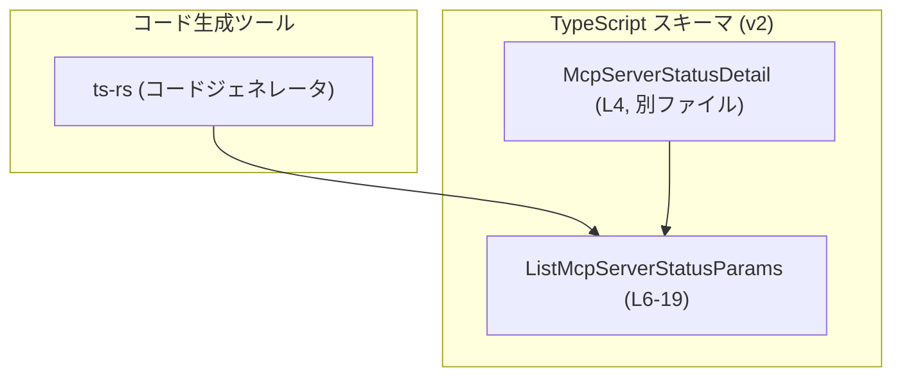
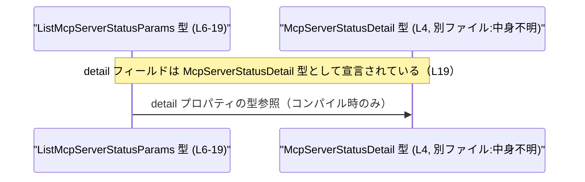

# app-server-protocol/schema/typescript/v2/ListMcpServerStatusParams.ts

## 0. ざっくり一言

MCP サーバのステータス一覧取得処理に使われると考えられる、**ページネーションと詳細レベル指定用のリクエストパラメータ型**を定義する TypeScript ファイルです（`ListMcpServerStatusParams.ts:L6-L19`）。  
コードは `ts-rs` により自動生成されており、手動編集は禁止されています（`ListMcpServerStatusParams.ts:L1-L3`）。

---

## 1. このモジュールの役割

### 1.1 概要

- このモジュールは、`ListMcpServerStatusParams` という **型エイリアス**を 1 つ公開しています（`ListMcpServerStatusParams.ts:L6`）。
- 型は 3 つのオプションフィールド `cursor`, `limit`, `detail` を持つオブジェクト形状を定義します（`ListMcpServerStatusParams.ts:L10,L14,L19`）。
- これらのフィールドは、コメントから以下のような意味を持つことが読み取れます。
  - `cursor`: 前回の呼び出しから返されたページネーション用カーソル（`ListMcpServerStatusParams.ts:L7-L10`）。
  - `limit`: 1 ページあたりの件数。省略時はサーバ側のデフォルト値が使われる（`ListMcpServerStatusParams.ts:L11-L14`）。
  - `detail`: MCP インベントリ情報の詳細レベルを指定。省略時は `Full` として扱われる（`ListMcpServerStatusParams.ts:L15-L19`）。

### 1.2 アーキテクチャ内での位置づけ

- このファイルは **スキーマ定義層**に属しており、実行ロジックではなく「型情報のみ」を提供します（`ListMcpServerStatusParams.ts:L1-L3,L6`）。
- `McpServerStatusDetail` という別ファイル定義の型に依存しています（`ListMcpServerStatusParams.ts:L4,L19`）。
- コメントから、この型が Rust 側の型から `ts-rs` によって生成されていることが分かります（`ListMcpServerStatusParams.ts:L1-L3`）。



### 1.3 設計上のポイント

- **自動生成コードであることの明示**  
  - ファイル先頭で「GENERATED CODE」「Do not edit this file manually」と明示されています（`ListMcpServerStatusParams.ts:L1-L3`）。  
  - 変更は元となる Rust 型（`ts-rs` の入力側）で行う前提の設計です。
- **型のみの import (`import type`)**  
  - `import type` を使って `McpServerStatusDetail` を読み込んでおり、このファイルは実行時依存を持たない純粋な型定義になっています（`ListMcpServerStatusParams.ts:L4`）。
- **オプショナル + null の併用**  
  - 各フィールドは「プロパティ自体の有無（`?`）」と「値としての `null`」の両方を許容しています（`cursor?: string | null` など, `ListMcpServerStatusParams.ts:L10,L14,L19`）。
  - 呼び出し側は「未指定」と「明示的に `null`」を **別の状態として表現できる**ようになっています。
- **ビジネスロジック非搭載**  
  - 関数・メソッド・クラスなどは定義されておらず、ビジネスロジックやバリデーションは別の層で行う設計であると読み取れます（`ListMcpServerStatusParams.ts:L1-L19`）。

---

## 2. 主要な機能一覧（コンポーネントインベントリー）

このファイルが提供・利用している主なコンポーネントは次のとおりです。

- `ListMcpServerStatusParams`: MCP サーバステータス一覧取得パラメータを表すオブジェクト型エイリアス（`ListMcpServerStatusParams.ts:L6-L19`）。
- `McpServerStatusDetail`: 詳細レベルを示す型。別ファイルから型としてのみ参照されており、内容はこのチャンクには現れません（`ListMcpServerStatusParams.ts:L4,L19`）。

---

## 3. 公開 API と詳細解説

### 3.1 型一覧（構造体・列挙体など）

このファイルに現れる型の一覧です。

| 名前                         | 種別              | 役割 / 用途                                                                                             | 定義箇所 |
|------------------------------|-------------------|----------------------------------------------------------------------------------------------------------|----------|
| `ListMcpServerStatusParams`  | 型エイリアス（オブジェクト型） | MCP サーバステータス一覧取得時のページネーション・詳細レベル指定用パラメータをまとめたオブジェクト型 | `L6-L19` |
| `McpServerStatusDetail`      | 型（詳細不明）    | `detail` フィールドの型として参照される、MCP インベントリ情報の詳細レベルを表すと考えられる型         | `L4,L19` |

※ `McpServerStatusDetail` の具体的な構造や列挙値は、このチャンクには現れません。

### 3.2 `ListMcpServerStatusParams` 詳細

#### 概要

`ListMcpServerStatusParams` は、MCP サーバステータス一覧取得処理のリクエストに添付されるパラメータを表すオブジェクト型エイリアスです（`ListMcpServerStatusParams.ts:L6-L19`）。  
3 つのオプショナルプロパティを持ちます。

#### フィールド

| フィールド名 | 型                              | 説明 | 根拠 |
|--------------|---------------------------------|------|------|
| `cursor`     | `string \| null`（オプショナル） | 先行する呼び出しから返された **不透明なページネーションクリソル** を格納します。未指定または `null` の場合の扱いは、このチャンクからは不明です（`ListMcpServerStatusParams.ts:L7-L10`）。 | `L7-L10` |
| `limit`      | `number \| null`（オプショナル） | 1 ページあたりの件数をサーバに伝えるためのオプションのページサイズです。省略時はサーバ定義のデフォルト値が用いられるとコメントされています（`ListMcpServerStatusParams.ts:L11-L14`）。 | `L11-L14` |
| `detail`     | `McpServerStatusDetail \| null`（オプショナル） | MCP インベントリデータをどの程度の詳細で取得するかを指定します。コメントによると、省略時には `Full` がデフォルト値として使われます（`ListMcpServerStatusParams.ts:L15-L19`）。実際の `McpServerStatusDetail` のバリエーションはこのチャンクからは不明です。 | `L15-L19` |

#### 内部処理の流れ（アルゴリズム）

- この型は純粋な **型定義のみ** であり、関数やメソッドを内包していません（`ListMcpServerStatusParams.ts:L6-L19`）。
- したがって、このファイル単体では実行時のアルゴリズムやバリデーションロジックは定義されていません。
- 実際の処理フロー（この型がどのようにシリアライズされてリクエストに載るか等）は、このチャンクには現れません。

#### Examples（使用例）

以下は「型として有効な値の作り方」を示す例です。  
**どの関数・APIに渡すかはこのチャンクからは分からない** 点に注意してください。

```typescript
// 1. 最初のページを取得するための最小限のパラメータ例
const paramsFirstPage: ListMcpServerStatusParams = {
    // cursor は省略: 最初のページを想定（この振る舞いはコメントから読み取れるが、
    // 実際の API 仕様はこのチャンクには現れません）
    limit: 50,                 // 1ページあたり50件を要求（L11-L14）
    // detail も省略: コメントによれば default は `Full`（L15-L19）
};

// 2. 続きのページを取得する例
const paramsNextPage: ListMcpServerStatusParams = {
    cursor: "opaque-cursor-token",  // 前回レスポンスから得たカーソル（L7-L10）
    // limit を省略すると、サーバ定義のデフォルトページサイズが使われる（L11-L14）
    detail: null,                   // detail を明示的に null として指定
};

// 3. 全フィールドを未指定にした例（すべてオプションであるため許容される）
const paramsDefault: ListMcpServerStatusParams = {};
```

#### Errors / Panics

- この型は単なる **コンパイル時の型宣言** であり、型自体がエラーや例外を発生させることはありません。
- 実際のエラー（例: 不正な `cursor` を送った場合のサーバエラー）は、  
  このファイル外の実装に依存しており、このチャンクからは分かりません。

#### Edge cases（エッジケース）

型定義とコメントから読み取れる範囲でのエッジケースです。

- `cursor` が省略された場合  
  - 最初のページ取得に相当する使い方が想定されますが、厳密な仕様はこのチャンクには現れません（`ListMcpServerStatusParams.ts:L7-L10`）。
- `cursor` が `null` の場合  
  - 「プロパティ未定義」と「`null` 指定」がサーバ側で同じ扱いかどうかは不明です。
- `limit` が省略された場合  
  - コメント上は「サーバ定義のデフォルト値」が使われるとされています（`ListMcpServerStatusParams.ts:L11-L14`）。
- `limit` に 0 または負の値を指定した場合  
  - 型上は `number` で制限されていないため表現は可能ですが、その扱い（エラーになるか、無視されるかなど）はこのチャンクからは分かりません。
- `detail` が省略された場合  
  - コメントにより、`Full` がデフォルトで利用されることが分かります（`ListMcpServerStatusParams.ts:L15-L19`）。
- `detail` に `null` を明示指定した場合  
  - 「未指定」との違いがサーバ側で区別されるかどうか、このチャンクからは判断できません。

#### 使用上の注意点

- **オプショナル vs `null` の区別**  
  - `cursor?: string | null` のように、プロパティの有無と `null` を両方許容しています（`ListMcpServerStatusParams.ts:L10`）。  
    呼び出し側は、「指定しない」と「null を明示する」の違いが API レベルでどう扱われるかを仕様書で確認する必要があります。
- **自動生成ファイルは編集しない**  
  - ファイル先頭のコメントに従い、手動編集すると次回生成時に上書きされるか、生成元との不整合が生じます（`ListMcpServerStatusParams.ts:L1-L3`）。
- **型安全性について**  
  - TypeScript の型チェックにより、`cursor` に数値を渡すなどの明らかな型ミスはコンパイル時に検出されます（`ListMcpServerStatusParams.ts:L10,L14,L19`）。
  - 一方で「値の範囲」（`limit` が負数不可など）はこの型では表現されていないため、別途ランタイムバリデーションが必要です。
- **並行性・非同期性**  
  - この型自体はデータ構造のみであり、スレッド安全性や非同期処理には直接関与しません。  
    並行リクエスト時には、同一オブジェクトを共有して書き換えるような使い方を避けるなど、通常の JavaScript/TypeScript のベストプラクティスに従う必要があります。

### 3.3 その他の関数

- このファイルには **関数定義は存在しません**（`ListMcpServerStatusParams.ts:L1-L19`）。

---

## 4. データフロー

このファイル単体には実行時処理はありませんが、**型間の依存関係レベルのデータフロー**をシーケンス図として示します。



説明:

- `ListMcpServerStatusParams` の `detail` プロパティは `McpServerStatusDetail` 型を参照しており（`ListMcpServerStatusParams.ts:L4,L19`）、  
  コンパイル時に TypeScript がこの依存関係を用いて型チェックを行います。
- 実行時にどのようなオブジェクトが生成され、どの API に送られるかといったフローは、このチャンクには現れません。

---

## 5. 使い方（How to Use）

### 5.1 基本的な使用方法

型定義から読み取れる範囲での、**オブジェクト生成の基本例**です。

```typescript
// 設定や依存オブジェクトを用意する（この部分はこのチャンクには現れません）
const pageSize = 20;                              // ページサイズとして使いたい値
const cursorFromPreviousCall = "opaque-token";    // 前回呼び出し時に取得したカーソル値と想定

// ListMcpServerStatusParams 型の値を組み立てる
const params: ListMcpServerStatusParams = {
    cursor: cursorFromPreviousCall,  // 前回レスポンスに含まれていたカーソル（L7-L10）
    limit: pageSize,                 // ページサイズを明示指定（L11-L14）
    // detail を省略すると default `Full` が使われるとコメントにある（L15-L19）
};

// params をどの関数／API に渡すかは、このチャンクからは分かりません
```

### 5.2 よくある使用パターン（型レベルで推測できる範囲）

コードから読み取れるコメントに基づき、**型レベルで表現可能なパターン**を挙げます。

1. **最初のページを取得するパターン**

```typescript
const firstPageParams: ListMcpServerStatusParams = {
    // cursor を指定しない → 最初のページを取得するパターンが想定される（L7-L10）
    limit: 100,  // 大きめのページサイズを希望（L11-L14）
};
```

1. **詳細レベルを明示するパターン**

`McpServerStatusDetail` の具体的な列挙値はこのチャンクに無いため、ここでは型名だけを使った例にとどめます。

```typescript
declare const summaryDetail: McpServerStatusDetail;  // 具体値は別ファイル定義（L4）

const paramsWithDetail: ListMcpServerStatusParams = {
    detail: summaryDetail,   // どの程度の MCP インベントリ情報を取得するか指定（L15-L19）
};
```

### 5.3 よくある間違い（起きうる誤用例）

この型から推測できる、**起こりうる誤用の例**と注意点です。

```typescript
// 誤りの可能性がある例: limit に文字列を渡してしまう
const badParams1: ListMcpServerStatusParams = {
    // @ts-expect-error: Type 'string' is not assignable to type 'number | null | undefined'
    limit: "100",  // 型定義では number | null なのでコンパイルエラーになる（L14）
};

// 誤りの可能性がある例: cursor と limit を null にしてしまう（意味が分かりにくい）
const badParams2: ListMcpServerStatusParams = {
    cursor: null,  // 「最初のページ」と同じ扱いかどうかは API 仕様次第で、このチャンクには現れません
    limit: null,
};
```

正しい（少なくとも型に合致する）例:

```typescript
// 型的に正しい例: 先頭ページ＋サーバデフォルトページサイズを利用
const okParams1: ListMcpServerStatusParams = {
    // cursor, limit を省略 → サーバ側デフォルトの挙動に任せる（L7-L14）
};

// 型的に正しい例: 明示的にページサイズのみ指定
const okParams2: ListMcpServerStatusParams = {
    limit: 50,
};
```

### 5.4 使用上の注意点（まとめ）

- `cursor`, `limit`, `detail` はすべてオプションであり、**空オブジェクト `{}` も型としては有効**である点に注意します（`ListMcpServerStatusParams.ts:L10,L14,L19`）。  
  どのフィールドが実務上必須かは API 仕様に依存し、このチャンクからは分かりません。
- `null` と未指定の違いが API 上どのように扱われるかは、このファイルでは分からないため、可能であれば **仕様に従って「未指定」を優先**し、`null` は特別な意味が必要な場合にのみ使うのが安全です。
- 大きな `limit` や詳細度の高い `detail` を設定すると、コメントの意味から **返却データ量が増える可能性**があります（`ListMcpServerStatusParams.ts:L11-L14,L15-L19`）。  
  実際の上限値やパフォーマンス特性は別途 API ドキュメントを確認する必要があります。
- 並行処理で同じ `ListMcpServerStatusParams` オブジェクトを再利用する場合は、オブジェクトを変更せずにコピーして使うなど、一般的な不変データの扱いを行うと安全です（このチャンクには並行性に関する特別な制約はありません）。

---

## 6. 変更の仕方（How to Modify）

### 6.1 新しい機能を追加する場合

- このファイルは `ts-rs` による自動生成であり、「手で編集するな」と明記されています（`ListMcpServerStatusParams.ts:L1-L3`）。
- そのため、**直接この TypeScript ファイルにフィールドを追加することは推奨されません。**
- 型を拡張したい場合の一般的な手順（このチャンクから分かる範囲）は次のとおりです。
  1. 元となる Rust 側の型（`ts-rs` の入力定義）を探す。  
     - ファイル名や型名は類似していることが多いですが、このリポジトリ内の実際の場所はこのチャンクからは分かりません。
  2. Rust 側にフィールドを追加し、`ts-rs` の生成処理を再実行する。
  3. 生成された TypeScript スキーマ（本ファイルを含む）をコミットする。

### 6.2 既存の機能を変更する場合

- 例えば `limit` フィールドの意味（デフォルト値や上限）を変えたい場合も、**生成元の Rust 型や `ts-rs` の設定を変更すべき**です（`ListMcpServerStatusParams.ts:L1-L3,L11-L14`）。
- 変更時の注意点:
  - この型を参照している他の TypeScript ファイル（リクエスト送信処理など）への影響が想定されますが、その一覧はこのチャンクからは分かりません。
  - `McpServerStatusDetail` の値の追加・変更がある場合は、`detail` を使っている呼び出しコードへの影響も確認する必要があります（`ListMcpServerStatusParams.ts:L4,L19`）。
- テストについて:
  - このファイル自体にはテストコードは含まれていません（`ListMcpServerStatusParams.ts:L1-L19`）。
  - 実際の動作確認は、リクエスト/レスポンスを扱う層のテスト（API 統合テストなど）で行われると考えられますが、具体的なテスト構成はこのチャンクからは分かりません。

---

## 7. 関連ファイル

このモジュールと直接的に関係することが分かるファイルは次のとおりです。

| パス                                                          | 役割 / 関係 |
|---------------------------------------------------------------|-------------|
| `app-server-protocol/schema/typescript/v2/McpServerStatusDetail.ts` | `import type { McpServerStatusDetail } from "./McpServerStatusDetail";` で参照される型定義ファイルと推定されます（`ListMcpServerStatusParams.ts:L4,L19`）。中身はこのチャンクには現れません。 |

※ `ts-rs` の生成元となる Rust 側のファイルや、`ListMcpServerStatusParams` を実際に利用しているクライアントコード・サーバコードは、このチャンクには現れないため不明です。
