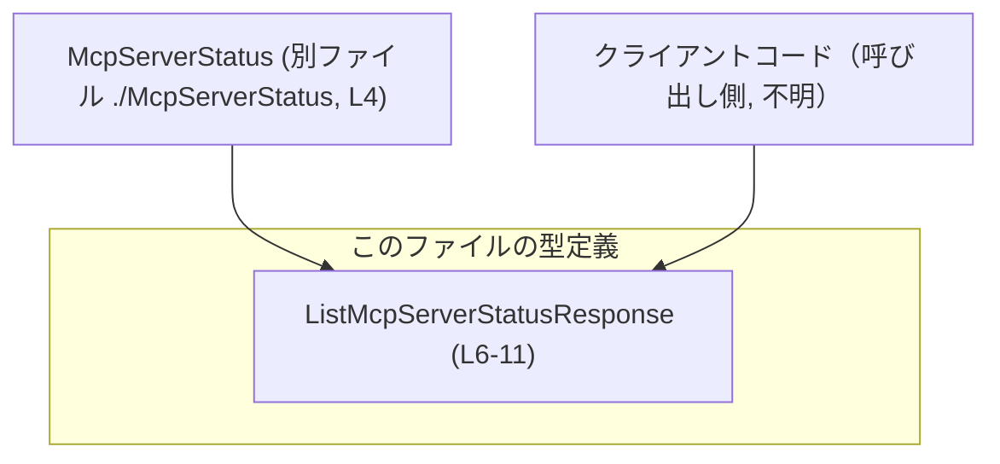
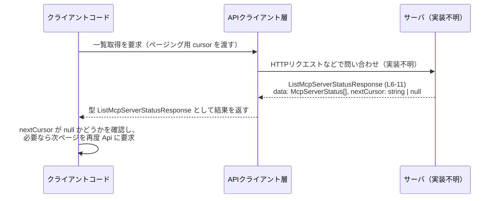

# app-server-protocol\schema\typescript\v2\ListMcpServerStatusResponse.ts

## 0. ざっくり一言

`ListMcpServerStatusResponse` は、`McpServerStatus` の一覧とページング用カーソルをまとめたレスポンス用の TypeScript 型エイリアスです（ListMcpServerStatusResponse.ts:L4-6, L11）。

---

## 1. このモジュールの役割

### 1.1 概要

- このモジュールは、`McpServerStatus` の一覧取得結果を表現するための **レスポンス型** を定義しています（ListMcpServerStatusResponse.ts:L4-6）。
- 要素本体は `data: Array<McpServerStatus>` に、次ページ取得用の位置情報は `nextCursor: string | null` に格納されます（ListMcpServerStatusResponse.ts:L6, L11）。
- ファイル先頭のコメントから、この型は `ts-rs` により自動生成されており、手動で編集しないことが前提です（ListMcpServerStatusResponse.ts:L1-3）。

### 1.2 アーキテクチャ内での位置づけ

このファイルから読み取れる依存関係は以下です。

- `McpServerStatus` 型に依存しています（ListMcpServerStatusResponse.ts:L4）。
- 外部のクライアントコード（APIクライアントやサービス層など）が、この型を利用して一覧レスポンスを受け取ることが想定されますが、具体的な呼び出し元はこのチャンクには現れません。

依存関係を簡略図で表すと次のようになります。



### 1.3 設計上のポイント

- **自動生成コード**  
  - ファイル先頭に「GENERATED CODE! DO NOT MODIFY BY HAND!」と明記されており（ListMcpServerStatusResponse.ts:L1-3）、スキーマ変更は元の定義（おそらく Rust 側やスキーマ定義）で行う前提です。
- **純粋なデータコンテナ**  
  - 関数やクラスは存在せず、**型エイリアスのみ** を提供する純粋なデータ定義です（ListMcpServerStatusResponse.ts:L6-11）。
- **ページング情報の明示**  
  - コメントにより `nextCursor` が「次呼び出しに渡す不透明カーソル」であり、`None`（TS側では `null`）なら「これ以上要素がない」ことを示すと説明されています（ListMcpServerStatusResponse.ts:L7-10, L11）。
- **型安全性**  
  - `nextCursor` を `string | null` として定義することで、「カーソルあり」と「カーソルなし（終端）」を型レベルで区別しています（ListMcpServerStatusResponse.ts:L11）。

---

## 2. 主要な機能一覧

このファイルは関数を持たず、**型定義のみ** です。そのため「機能」は型が表現する役割として整理します。

- `ListMcpServerStatusResponse`:  
  `McpServerStatus` の配列と、次ページ取得用のカーソル値をひとまとめにしたレスポンス型（ListMcpServerStatusResponse.ts:L6-11）。

---

## 3. 公開 API と詳細解説

### 3.1 型一覧（構造体・列挙体など）

このチャンクに現れる型・コンポーネントのインベントリーです。

| 名前                          | 種別             | 役割 / 用途                                                                                 | 定義位置 |
|-------------------------------|------------------|----------------------------------------------------------------------------------------------|----------|
| `McpServerStatus`             | 型（import）     | 個々の MCP サーバのステータスを表す型。詳細は別ファイル `./McpServerStatus` にあり、このチャンクには現れません。 | ListMcpServerStatusResponse.ts:L4 |
| `ListMcpServerStatusResponse` | 型エイリアス     | `data` と `nextCursor` を持つレスポンスオブジェクトの型。ページングされた MCP サーバステータス一覧を表現します。 | ListMcpServerStatusResponse.ts:L6-11 |
| `data`                        | プロパティ       | `McpServerStatus` の配列。レスポンスに含まれるステータスのリストです。                       | ListMcpServerStatusResponse.ts:L6 |
| `nextCursor`                  | プロパティ       | 次のページ取得時に渡すカーソル。`null` の場合は「続きなし」を意味します。                    | ListMcpServerStatusResponse.ts:L7-11 |

> `McpServerStatus` の構造やフィールド内容は、このチャンクには定義がないため不明です。

### 3.2 関数詳細（最大 7 件）

このファイルには **関数・メソッドは定義されていません**（ListMcpServerStatusResponse.ts 全体）。  
そのため、このセクションで詳細に説明する対象関数はありません。

### 3.3 その他の関数

同様に、ヘルパー関数やラッパー関数も存在しません。

| 関数名 | 役割（1 行） |
|--------|--------------|
| なし   | このファイルには関数定義が存在しません。 |

---

## 4. データフロー

このファイルは型定義のみを提供しており、実際の処理フローは含まれていませんが、型から自然に想定される「MCP サーバステータス一覧取得」の代表的なデータフローを示します。  
※以下は **想定される利用シナリオの例** であり、他ファイルの実コードはこのチャンクには現れません。



このフローで重要となるのは以下です。

- **`data`**: クライアント側は `data: McpServerStatus[]` を反復処理して、サーバのステータス情報を処理します（ListMcpServerStatusResponse.ts:L6）。
- **`nextCursor`**:  
  - `string` の場合: クライアントはその値を次回のリクエストに渡すことで続き（次ページ）を取得できます（ListMcpServerStatusResponse.ts:L7-11）。
  - `null` の場合: コメントの通り「これ以上返す要素がない」と解釈できます（ListMcpServerStatusResponse.ts:L7-10, L11）。

---

## 5. 使い方（How to Use）

### 5.1 基本的な使用方法

この型を使って一覧レスポンスを処理する、典型的な TypeScript コード例です。  
（API クライアント部分は、このファイルには存在しないため疑似コードです。）

```typescript
// ListMcpServerStatusResponse 型をインポートする（パスはこのファイルの位置に依存）
import type { ListMcpServerStatusResponse } from "./v2/ListMcpServerStatusResponse";  // 実際の相対パスはプロジェクト構成によります

// 何らかの方法でレスポンスを取得する関数（実装は別ファイル想定）
async function fetchMcpServerStatuses(cursor: string | null): Promise<ListMcpServerStatusResponse> {
    // ここで HTTP リクエストなどを行い、サーバから JSON を受け取る想定です
    // 実装詳細はこのチャンクには現れません。
    const response = await fetch("/api/mcp/statuses?cursor=" + (cursor ?? ""));
    const json = await response.json();
    return json as ListMcpServerStatusResponse; // 取得した JSON を型アサーションで扱う
}

// 一覧をすべて取得する簡単なループ例
async function loadAllStatuses() {
    let cursor: string | null = null;               // 最初はカーソルなし
    const allStatuses: McpServerStatus[] = [];      // すべてのステータスを溜める配列

    while (true) {
        const res = await fetchMcpServerStatuses(cursor);  // ListMcpServerStatusResponse を取得
        allStatuses.push(...res.data);                     // data 配列を結合

        if (res.nextCursor === null) {                     // nextCursor が null なら終端
            break;
        }
        cursor = res.nextCursor;                           // 次ページ用カーソルを更新
    }

    return allStatuses;
}
```

この例では、`ListMcpServerStatusResponse` が「ページングされた一覧と次のカーソル」をセットで返す型として機能しています（ListMcpServerStatusResponse.ts:L6-11）。

### 5.2 よくある使用パターン

1. **単一ページだけを処理する**

```typescript
async function loadFirstPage() {
    const res: ListMcpServerStatusResponse = await fetchMcpServerStatuses(null);  // 最初のページ

    for (const status of res.data) {      // data 配列をループ
        console.log(status);              // status は McpServerStatus 型
    }

    if (res.nextCursor !== null) {
        console.log("次のページがあります:", res.nextCursor);
    } else {
        console.log("これ以上ページはありません");
    }
}
```

1. **カーソルを UI に保存する**

```typescript
function updatePaginationUi(response: ListMcpServerStatusResponse) {
    // 次へボタンを有効化/無効化する例
    const nextButton = document.getElementById("next") as HTMLButtonElement;

    if (response.nextCursor === null) {
        nextButton.disabled = true;   // 続きが無いので無効
    } else {
        nextButton.disabled = false;  // 続きがあるので有効
        nextButton.dataset.cursor = response.nextCursor; // dataset にカーソルを保存
    }
}
```

### 5.3 よくある間違い

この型から推測できる、起こりやすそうな誤用例とその修正例です。

```typescript
// 間違い例: nextCursor を文字列前提で扱い、null の可能性を無視する
function goToNextPageWrong(response: ListMcpServerStatusResponse) {
    // response.nextCursor が null の場合、文字列メソッド呼び出しで実行時エラーになる可能性
    const url = "/api/mcp/statuses?cursor=" + response.nextCursor.toUpperCase(); // NG
}

// 正しい例: null チェックを行ってから使用する
function goToNextPageCorrect(response: ListMcpServerStatusResponse) {
    if (response.nextCursor === null) {
        console.log("これ以上ページはありません");
        return;
    }

    const url = "/api/mcp/statuses?cursor=" + response.nextCursor.toUpperCase(); // OK: string が保証される
    // ここで実際にリクエストを行うなどの処理を実装
}
```

このように、`nextCursor` が `string | null` であること（ListMcpServerStatusResponse.ts:L11）を意識して、**null を扱う分岐** を必ず入れる必要があります。

### 5.4 使用上の注意点（まとめ）

- **`nextCursor` は null を取り得る**  
  - 型が `string | null` であるため（ListMcpServerStatusResponse.ts:L11）、文字列メソッド呼び出しや連結の前に null チェックが必要です。
- **コメント中の「None」表現**  
  - コメントには "If None, there are no more items to return." と記載されていますが（ListMcpServerStatusResponse.ts:L7-10）、TypeScript 側では `null` が使われています。実装側では「`null` → これ以上要素無し」と解釈する必要があります。
- **自動生成ファイルであること**  
  - ファイル冒頭に「DO NOT MODIFY BY HAND!」とある通り（ListMcpServerStatusResponse.ts:L1-3）、このファイルを直接編集すると自動生成で上書きされる可能性があります。スキーマ変更は元の定義側で行う必要があります。
- **並行性・スレッド安全性**  
  - このファイルは型定義のみで、状態やロジックを持たないため、並行性やスレッド安全性について特別な注意点はこのチャンクからは読み取れません。実際の並行実行や非同期処理の安全性は、この型を利用する側のコードに依存します。

---

## 6. 変更の仕方（How to Modify）

### 6.1 新しい機能を追加する場合

このファイルは `ts-rs` による自動生成コードであり（ListMcpServerStatusResponse.ts:L1-3）、**直接編集は推奨されません**。新しいフィールドを追加するなどの変更を行いたい場合の一般的な手順は次の通りです。

1. **元スキーマの確認**  
   - コメントにある `ts-rs` から、この TypeScript 型は別言語（典型的には Rust）の型定義から生成されていると分かります（ListMcpServerStatusResponse.ts:L2-3）。  
   - その元定義（例: Rust の構造体）を探します。このチャンクではパスは不明です。

2. **元定義にフィールドを追加・変更**  
   - 例として、Rust 側の構造体に `totalCount: number` のようなフィールドを追加します（あくまで仮例であり、このチャンクには現れません）。

3. **`ts-rs` のコード生成を再実行**  
   - ビルドスクリプトや生成コマンドを実行し、この TypeScript ファイルを再生成します。
   - これにより、`ListMcpServerStatusResponse` にも対応するプロパティが追加されます。

4. **利用側コードの更新**  
   - 新しいフィールドを利用するようにクライアントコードを修正します。

### 6.2 既存の機能を変更する場合

`data` や `nextCursor` の意味や型を変更したい場合も同様に、元スキーマ側で変更する必要があります。

変更時に注意すべき点:

- **前提条件・契約の維持**  
  - 現状のコメントから、「`nextCursor` が `null` → これ以上返す要素なし」という契約が読み取れます（ListMcpServerStatusResponse.ts:L7-11）。
  - この契約を変える場合は、利用している全てのクライアントコードに影響が出るため、検索や型チェックを通じて利用箇所を洗い出す必要があります。
- **`McpServerStatus` への影響**  
  - `data: Array<McpServerStatus>`（ListMcpServerStatusResponse.ts:L6）の部分を別の型に変更すると、`McpServerStatus` を前提に書かれたコードが壊れます。  
  - 変更前に `./McpServerStatus` の定義と利用箇所を確認する必要があります。
- **テストの更新**  
  - このチャンクにはテストコードは現れませんが、プロジェクト全体としては、`ListMcpServerStatusResponse` を使用しているテスト（API レスポンスのシリアライズ／デシリアライズなど）を更新・追加する必要があります。

---

## 7. 関連ファイル

このチャンクから確実に分かる関連ファイルは以下の通りです。

| パス                               | 役割 / 関係 |
|------------------------------------|------------|
| `app-server-protocol/schema/typescript/v2/McpServerStatus.ts`（推定: `./McpServerStatus`） | `McpServerStatus` 型の定義を提供するファイルです。このファイルの `data` プロパティの要素型として利用されています（ListMcpServerStatusResponse.ts:L4, L6）。 |

> 上記以外のテストファイルやスキーマ元ファイル（Rust 側など）の具体的な場所は、このチャンクには現れないため不明です。
