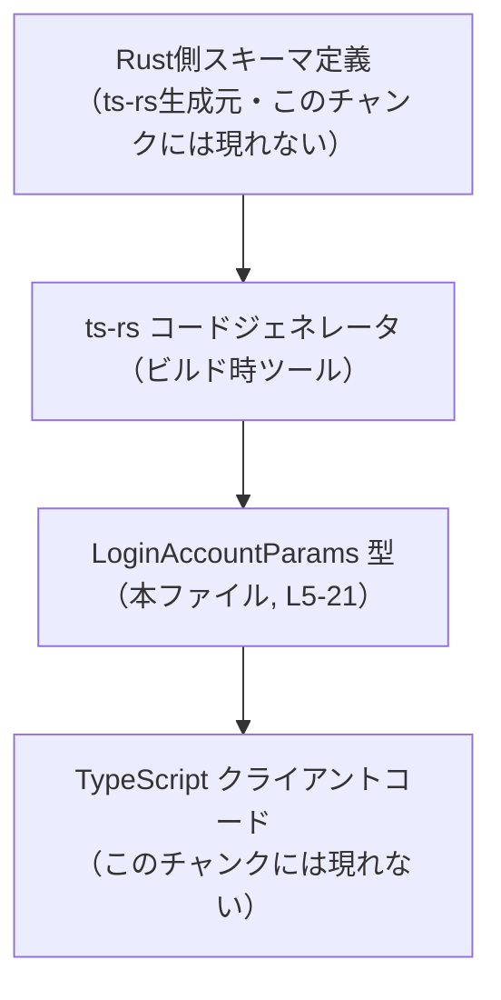
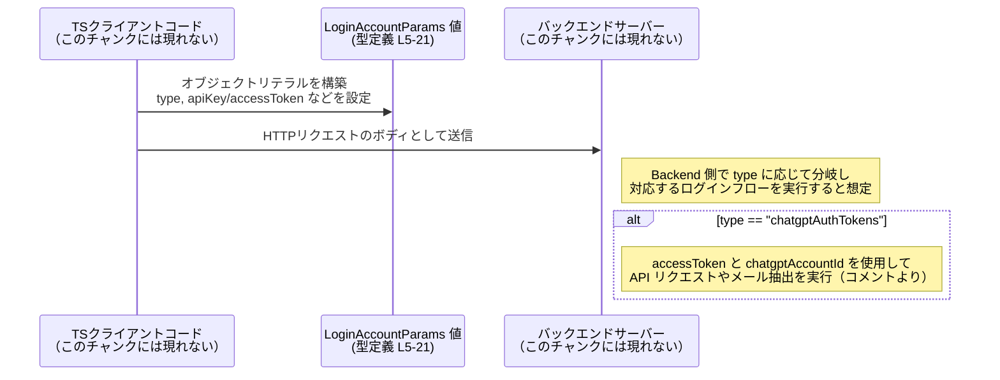

# app-server-protocol/schema/typescript/v2/LoginAccountParams.ts コード解説

## 0. ざっくり一言

- アカウントへのログイン方法を表す **判別可能ユニオン型（discriminated union）** `LoginAccountParams` を定義する自動生成 TypeScript ファイルです（LoginAccountParams.ts:L1-5）。
- `type` フィールドの値に応じて、`apiKey` / `chatgpt` / `chatgptDeviceCode` / `chatgptAuthTokens` の 4 種類のログインパラメータ形状を表現します（LoginAccountParams.ts:L5-5, L10-21）。

---

## 1. このモジュールの役割

### 1.1 概要

- このモジュールは、クライアントがサーバーに送信する「ログイン要求パラメータ」の型情報を TypeScript で表現するために存在します（LoginAccountParams.ts:L5-5）。
- 4 種類のログイン手段を 1 つのユニオン型で表現し、コンパイル時に安全に分岐・取り扱いできるようにしています（LoginAccountParams.ts:L5-5, L10-21）。
- ファイル先頭コメントから、この型定義は Rust から `ts-rs` によって自動生成されていることが分かります（LoginAccountParams.ts:L1-3）。

### 1.2 アーキテクチャ内での位置づけ

コードから直接分かる事実と、コメントに基づく推測レベルを分けて記述します。

**コードから分かること**

- ランタイム依存関係（`import`など）はなく、このファイルは `LoginAccountParams` 型を **エクスポートするだけ** です（LoginAccountParams.ts:L5-21）。
- 自動生成であるため、実際のスキーマの「元定義」は別の言語（Rust）側にあります（LoginAccountParams.ts:L1-3）。

**コメントに基づく推測（ビルド時・利用時の全体像の一例）**

以下はコメント `generated by ts-rs` に基づく典型的な構図であり、具体的なファイル名・モジュール名はこのチャンクからは特定できません。



- Rust 側のスキーマ定義から `ts-rs` が本ファイルを生成し（LoginAccountParams.ts:L1-3）、TypeScript クライアント側が `LoginAccountParams` を利用する構図が想定されます。

### 1.3 設計上のポイント

- **判別可能ユニオン型**  
  - すべてのバリアントが `"type"` プロパティを持ち、その値が `"apiKey" | "chatgpt" | "chatgptDeviceCode" | "chatgptAuthTokens"` のいずれかに固定されています（LoginAccountParams.ts:L5-5, L10-21）。
  - これにより、`switch (params.type)` のような分岐で TypeScript のナローイングが効き、バリアントごとのプロパティを安全に扱える設計です。
- **自動生成コード**  
  - 冒頭コメントに「GENERATED CODE! DO NOT MODIFY BY HAND!」とあり、直接編集してはいけないことが明示されています（LoginAccountParams.ts:L1-3）。
- **ドキュメントコメントによる契約の明示**  
  - `accessToken` / `chatgptAccountId` / `chatgptPlanType` について、用途や意味が JSDoc コメントで説明されています（LoginAccountParams.ts:L6-9, L11-14, L15-20）。
- **オプショナルかつ `null` 許容なフィールド**  
  - `chatgptPlanType?: string | null` となっており、「プロパティ自体が存在しない」ケースと「値として `null` が入る」ケースの両方が許容されています（LoginAccountParams.ts:L15-20）。
- **エラー・並行性**  
  - このファイルは型定義のみであり、実行時ロジックや非同期処理・並行処理（`Promise` や `async` 関数など）は含みません（LoginAccountParams.ts:L1-21）。
  - 型チェックの失敗はコンパイル時エラーとして現れますが、ランタイムの例外処理やスレッド安全性は、この型を利用する側のコードに依存します。

---

## 2. 主要な機能一覧

ここでは「機能」を、この型が表現する **ログイン手段のバリアント** として整理します（すべて LoginAccountParams.ts:L5-21 に定義）。

- `type: "apiKey"`: `apiKey` 文字列によるログインパラメータを表す。
- `type: "chatgpt"`: 追加フィールドを持たない `"chatgpt"` タイプのログインパラメータを表す。
- `type: "chatgptDeviceCode"`: 追加フィールドを持たない `"chatgptDeviceCode"` タイプのログインパラメータを表す。
- `type: "chatgptAuthTokens"`:
  - `accessToken`（JWT）と `chatgptAccountId` を含むログインパラメータを表す。
  - 任意で `chatgptPlanType`（`string | null`）を含め、`null` の場合はサーバー側でトークンから推測する、という契約がコメントで説明されています（LoginAccountParams.ts:L6-9, L11-14, L15-20）。

---

## 3. 公開 API と詳細解説

### 3.1 型一覧（構造体・列挙体など）

このファイルに定義されている公開型は 1 つです（Meta 情報: exports=1, functions=0）。

| 名前                  | 種別        | 役割 / 用途                                                                                                     | 根拠 |
|-----------------------|-------------|------------------------------------------------------------------------------------------------------------------|------|
| `LoginAccountParams`  | 型エイリアス / 判別可能ユニオン | 4 種類のログインパラメータ（`apiKey` / `chatgpt` / `chatgptDeviceCode` / `chatgptAuthTokens`）を表すユニオン型です。 | LoginAccountParams.ts:L5-21 |

#### バリアントごとの形状（概略）

| バリアント `type` 値           | 追加プロパティ                                  | 説明 | 根拠 |
|--------------------------------|-----------------------------------------------|------|------|
| `"apiKey"`                     | `apiKey: string`                             | APIキー文字列でのログインを表します。 | LoginAccountParams.ts:L5-5 |
| `"chatgpt"`                    | （なし）                                      | タイプのみで区別されるログインモードを表します。 | LoginAccountParams.ts:L5-5 |
| `"chatgptDeviceCode"`         | （なし）                                      | デバイスコードベースのログインモードを表します。 | LoginAccountParams.ts:L5-5 |
| `"chatgptAuthTokens"`         | `accessToken: string`, `chatgptAccountId: string`, `chatgptPlanType?: string \| null` | JWT などの認可トークンとアカウント情報によるログインを表します。 | LoginAccountParams.ts:L6-20 |

### 3.2 関数詳細（最大 7 件）

このファイルには **関数は定義されていません**（Meta: functions=0, LoginAccountParams.ts:L1-21）。

代わりに、この型の中で最もフィールド数が多い `type: "chatgptAuthTokens"` バリアントについて、関数テンプレートに準じた形で詳細を整理します。

#### `LoginAccountParams`（`"chatgptAuthTokens"` バリアント）

**概要**

- `"type": "chatgptAuthTokens"` の場合、クライアントから提供されるアクセス・トークンとアカウント情報をまとめたオブジェクトを表します（LoginAccountParams.ts:L5-5, L6-14）。
- `chatgptPlanType` によって、プラン種別を明示するか、`null` を指定してサーバー側の推測に委ねるかを表現します（LoginAccountParams.ts:L15-20）。

**プロパティ**

| プロパティ名        | 型                     | 説明 | 根拠 |
|---------------------|------------------------|------|------|
| `"type"`            | `"chatgptAuthTokens"`  | 判別用の固定文字列です。 | LoginAccountParams.ts:L5-5 |
| `accessToken`       | `string`               | クライアントから提供されるアクセス・トークン（JWT）。バックエンド API 呼び出しとメール抽出に使用されるとコメントされています。 | LoginAccountParams.ts:L6-10 |
| `chatgptAccountId`  | `string`               | クライアントから提供されるワークスペース／アカウント ID。 | LoginAccountParams.ts:L11-14 |
| `chatgptPlanType`   | `string \| null`（オプショナル） | オプションのプラン種別。`null` の場合はサーバー側でトークンのクレームから推測し、取得できない場合は `unknown` にフォールバックするとコメントされています。プロパティ自体は省略可能（`?`）です。 | LoginAccountParams.ts:L15-20 |

**戻り値 / 内部処理**

- これは型の定義であり、関数のような「戻り値」や「内部処理」はありません。
- 型としては、上記プロパティをすべて満たすオブジェクトだけが `LoginAccountParams` の `"chatgptAuthTokens"` バリアントとして受理されます（LoginAccountParams.ts:L5-21）。

**Examples（使用例）**

以下は、このバリアントの値を生成し、`LoginAccountParams` 型として扱う例です。

```typescript
// LoginAccountParams 型をインポートする（実際のパスはプロジェクト構成に依存する）
import type { LoginAccountParams } from "./LoginAccountParams"; // 型のみインポート

// chatgptAuthTokens バリアントの値を作る例
const params: LoginAccountParams = {                // params は LoginAccountParams 型
    type: "chatgptAuthTokens",                      // 判別用の type。綴りが厳密に一致する必要がある
    accessToken: "eyJhbGciOiJIUzI1NiIsInR5cCI6IkpXVCJ9...", // JWT 文字列（例）
    chatgptAccountId: "workspace_12345",            // アカウント ID
    chatgptPlanType: null,                          // null の場合、コメントの通りサーバー側で推測させる意図を表現
};
```

- `type` の文字列リテラルを間違えると TypeScript の型チェックでエラーになります。
- `chatgptPlanType` を省略することも許可されていますが、その場合のサーバー側の解釈はこのチャンクからは分かりません（LoginAccountParams.ts:L15-20）。

**Errors / 型安全性**

- ランタイムエラーは定義されていませんが、次のような場合に **コンパイル時の型エラー** が発生します。
  - `type` に `"chatgptAuthTokens"` 以外の文字列を指定した場合（LoginAccountParams.ts:L5-5）。
  - `accessToken` や `chatgptAccountId` を省略したり、`number` など `string` 以外の型を指定した場合（LoginAccountParams.ts:L6-14）。
  - `chatgptPlanType` に `null` 以外の `string` 以外の型（例: `number`）を指定した場合（LoginAccountParams.ts:L15-20）。
- TypeScript の型チェックにより、誤った形状のオブジェクトを送信することをコンパイル時に防ぐことが期待されます。

**Edge cases（エッジケース）**

- `chatgptPlanType` が **省略されている** 場合  
  - 型的には許容されます（`?` が付いているため）が、コメントでは `null` の挙動のみが説明されており、省略との違いはこのチャンクからは読み取れません（LoginAccountParams.ts:L15-20）。
- `chatgptPlanType` に空文字 `""` を指定した場合  
  - 型的には `string` なので許容されますが、意味的に正しいかどうかはサーバー側実装に依存し、このチャンクでは不明です。
- `accessToken` に非常に長い文字列や不正な JWT を渡した場合  
  - 型的にはすべて `string` として許容されます。トークンの妥当性チェックはサーバー側のロジックに依存し、このファイルからは分かりません（LoginAccountParams.ts:L6-9）。

**使用上の注意点**

- `type` プロパティは **判別用のキー** であり、誤った文字列を指定すると TypeScript の型推論が効かなくなります。
- `chatgptPlanType` については、コメントが `null` を特別扱いしている一方で、プロパティ自体は省略可能です。  
  - 省略と `null` の扱いの違いは、このチャンクからは読み取れないため、サーバー側の API 契約（別ドキュメント）を確認する必要があります（LoginAccountParams.ts:L15-20）。
- セキュリティ上の一般的な注意として、`accessToken` は機密情報であり、ログ出力やエラー画面等にそのまま出力しない運用が推奨されます（コメントから JWT であることは分かりますが、具体的な取り扱いポリシーはこのチャンクには現れません: LoginAccountParams.ts:L6-9）。

### 3.3 その他の関数

- このファイルには補助関数やラッパー関数は存在しません（LoginAccountParams.ts:L1-21）。

---

## 4. データフロー

ここでは、`LoginAccountParams` 型の値がクライアントからサーバーに渡される **想定される典型的なシナリオ** を示します。  
（注: 具体的な関数名・エンドポイント名などはこのチャンクには存在しないため、概念レベルの図示です。）



- `accessToken` が「バックエンド API リクエストとメール抽出」に使用されることはコメントから読み取れますが（LoginAccountParams.ts:L6-9）、どのような API にどう渡されるかはこのチャンクには現れません。
- データフローの並行性や再試行戦略などは、この型定義からは分かりません。

---

## 5. 使い方（How to Use）

### 5.1 基本的な使用方法

以下は、`LoginAccountParams` を受け取り、`type` に応じて処理を分岐する基本的なコード例です。

```typescript
// LoginAccountParams 型のインポート（パスはプロジェクト構成による）
import type { LoginAccountParams } from "./LoginAccountParams"; // 型エイリアスのみを読み込む

// ログインパラメータを処理する関数の例
function handleLogin(params: LoginAccountParams): void {       // params は 4 種類のバリアントを取りうる
    switch (params.type) {                                     // 判別用の type で分岐
        case "apiKey":                                         // apiKey バリアント
            // params.apiKey はここでは string として扱える
            console.log("API key login:", params.apiKey);      // 実際にはログにキーを出さないのが望ましい
            break;
        case "chatgpt":                                        // chatgpt バリアント
            console.log("ChatGPT login");                      // 追加プロパティはない
            break;
        case "chatgptDeviceCode":                              // chatgptDeviceCode バリアント
            console.log("ChatGPT device code login");          // デバイスコードフロー用の処理
            break;
        case "chatgptAuthTokens":                              // chatgptAuthTokens バリアント
            // ここでは accessToken, chatgptAccountId, chatgptPlanType が利用可能
            console.log("ChatGPT auth token login for account:", params.chatgptAccountId);
            break;
        default:
            // TypeScript 的には到達不能（ユニオンが網羅されているため）
            // 追加のバリアントが増えた場合の安全装置として用意しておくこともある
            const _exhaustiveCheck: never = params;            // 将来のバリアント追加漏れ検知用のテクニック
            throw new Error("Unknown login type");
    }
}
```

- `switch (params.type)` により、各ケース内でユニオンのバリアントが自動的に絞り込まれ、対応するプロパティが型安全に利用できます（LoginAccountParams.ts:L5-21）。
- `default` で `never` を使ったパターンは「将来、新しい `type` が追加されたときにコンパイルエラーで気づく」ための一般的な TypeScript テクニックです。

### 5.2 よくある使用パターン

1. **APIキーでのログインパラメータを構築する**

```typescript
import type { LoginAccountParams } from "./LoginAccountParams"; // 型のインポート

const paramsApiKey: LoginAccountParams = {         // apiKey バリアントのオブジェクト
    type: "apiKey",                                // 判別用に "apiKey" を指定
    apiKey: "my-secret-api-key",                   // 実際には安全な保管・送信が前提
};
```

1. **`chatgptAuthTokens` でトークンを渡す（`chatgptPlanType` を明示する場合）**

```typescript
import type { LoginAccountParams } from "./LoginAccountParams";

const paramsTokens: LoginAccountParams = {         // chatgptAuthTokens バリアント
    type: "chatgptAuthTokens",                     // 判別用の文字列
    accessToken: "<JWT string>",                   // コメントにある通り JWT を想定（L6-9）
    chatgptAccountId: "account-abc",              // アカウント ID（L11-14）
    chatgptPlanType: "plus",                      // null ではなくプラン名を明示的に指定する例（L15-20）
};
```

1. **`chatgptAuthTokens` で `chatgptPlanType` を省略し、サーバー側の推測に委ねる**

```typescript
import type { LoginAccountParams } from "./LoginAccountParams";

const paramsTokensNoPlan: LoginAccountParams = {   // chatgptAuthTokens バリアント
    type: "chatgptAuthTokens",                     // 判別用
    accessToken: "<JWT string>",                   // JWT 文字列
    chatgptAccountId: "account-xyz",              // アカウント ID
    // chatgptPlanType は省略（undefined として扱われる）
};
```

- コメントには `null` の場合の挙動のみ記載されており、省略時の扱いはこのチャンクからは分かりません（LoginAccountParams.ts:L15-20）。

### 5.3 よくある間違い

型定義から推測される、起こりやすそうな誤用を挙げます。

```typescript
import type { LoginAccountParams } from "./LoginAccountParams";

// 間違い例: type の綴りを誤っている
const badParams1: LoginAccountParams = {
    // type: "chatgptAuthToken", // コンパイルエラー: 許可されていない文字列
    type: "chatgptAuthTokens",   // 正しい: "chatgptAuthTokens"
    accessToken: "<JWT>",
    chatgptAccountId: "account-1",
};

// 間違い例: 必須フィールドの欠落
const badParams2: LoginAccountParams = {
    type: "chatgptAuthTokens",
    // accessToken: "<JWT>",     // コンパイルエラー: 必須フィールドがない（L6-10）
    chatgptAccountId: "account-1",
};
```

- `type` の文字列はユニオンで固定されているため、少しでも綴りが違うとコンパイルエラーになります（LoginAccountParams.ts:L5-5）。
- `"chatgptAuthTokens"` バリアントでは `accessToken` と `chatgptAccountId` が必須のため、欠落させるとエラーになります（LoginAccountParams.ts:L6-14）。

### 5.4 使用上の注意点（まとめ）

- **自動生成ファイルであること**  
  - 先頭コメントにある通り、このファイルは手動で編集してはいけません。変更が必要な場合は、Rust 側の `ts-rs` 対象定義や設定を変更し、再生成する必要があります（LoginAccountParams.ts:L1-3）。
- **型の契約とサーバー側との整合**  
  - `chatgptPlanType` の `null` や省略時の意味は、サーバー側の実装ドキュメントと合わせて確認する必要があります（LoginAccountParams.ts:L15-20）。
- **エラーとバリデーション**  
  - TypeScript 型はコンパイル時のチェックのみを提供します。実行時には、サーバー側が値の妥当性（例: JWT の有効性、アカウント ID の存在確認など）を必ず検証する必要があります。
- **並行性**  
  - このファイル自体はデータ型のみを定義し、非同期処理や並行実行に関するロジックは含みません。複数リクエストの同時処理などは、別の層の責務です。

---

## 6. 変更の仕方（How to Modify）

このファイルはコメントで明示されている通り **自動生成** であり、直接編集してはいけません（LoginAccountParams.ts:L1-3）。  
そのため、以下は **一般的な方針レベル** の説明に留めます。

### 6.1 新しい機能を追加する場合（例: 新しいログイン方法）

- 直接この TypeScript ファイルに `| { "type": "newMethod", ... }` のようなバリアントを追加するのは、再生成時に上書きされるため適切ではありません（LoginAccountParams.ts:L1-3）。
- 新しいバリアントを追加したい場合は、**生成元の Rust 側スキーマ**（ts-rs が参照する型定義）に変更を加え、その変更に基づいて `ts-rs` を再実行してこのファイルを生成する必要があります。
- Rust 側の具体的なファイル名や型名は、このチャンクには現れないため不明です。

### 6.2 既存の機能を変更する場合（例: フィールド追加・型変更）

- 同様に、`accessToken` や `chatgptPlanType` の型定義を変えたい場合も、直接このファイルを編集するのではなく **元の Rust 定義を更新** すべきです（LoginAccountParams.ts:L1-3）。
- 変更の影響範囲としては、`LoginAccountParams` 型を利用している TypeScript コード全体にコンパイル時エラーが発生しうるため、IDE の「型定義参照」機能などで使用箇所を洗い出すことが重要です。
- このチャンクにはテストコードは含まれていないため、型変更に合わせて別途用意されているテスト（もし存在すれば）も更新・実行する必要があります。

---

## 7. 関連ファイル

このチャンクから直接参照できる関連ファイルはありませんが、コメントなどから推測される関係を整理します。

| パス / 名称（推定）                 | 役割 / 関係 | 根拠 |
|------------------------------------|------------|------|
| Rust 側のスキーマ定義（不明）      | `ts-rs` によって本ファイルを生成する元の型定義。型の実態はそちらで管理される。 | LoginAccountParams.ts:L1-3 |
| `ts-rs` ビルドスクリプト / 設定（不明） | Rust から TypeScript を生成するためのツール設定。 | LoginAccountParams.ts:L1-3 |
| `LoginAccountParams` を利用する TypeScript コード（不明） | 実際にこの型をインポートし、ログイン API のリクエストボディなどに使用する側の実装。 | LoginAccountParams.ts:L5-21 |

- 具体的なパスやファイル名は、このチャンクには現れません。そのため、正確な場所を特定するにはリポジトリ全体を検索する必要があります。
- テストコードやログ出力などの観測可能性（observability）に関する実装も、このファイルからは読み取れません。
