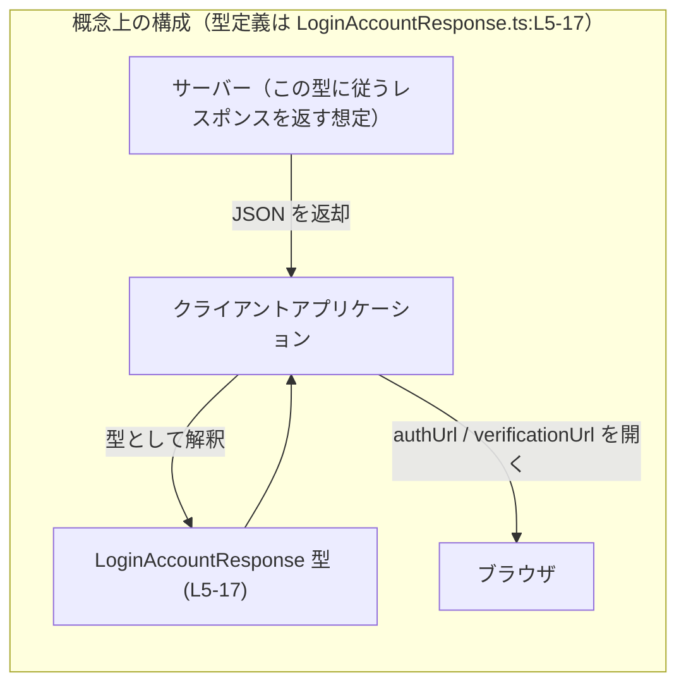
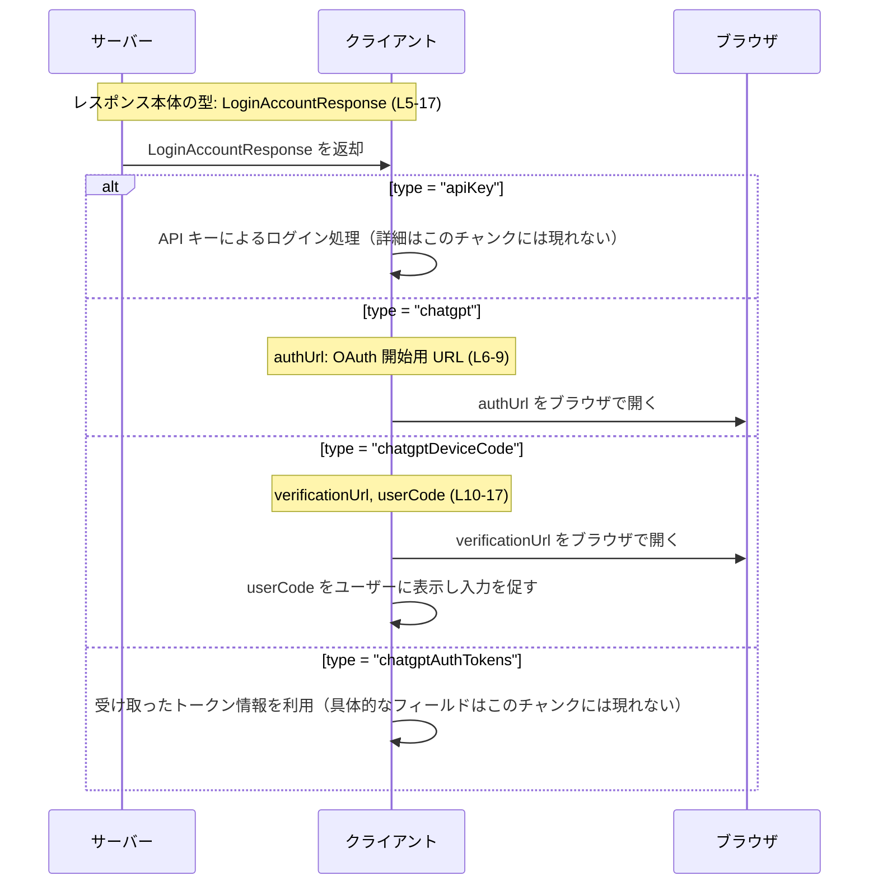

# app-server-protocol/schema/typescript/v2/LoginAccountResponse.ts

## 0. ざっくり一言

`LoginAccountResponse` は、ログイン処理に関するレスポンスを **4 種類のケース（API キー / ChatGPT OAuth / ChatGPT デバイスコード / ChatGPT 認証トークン）** のいずれかとして表現する **判別可能ユニオン型** を定義する、自動生成された TypeScript スキーマです（`LoginAccountResponse.ts:L1-3,5-17`）。

---

## 1. このモジュールの役割

### 1.1 概要

- このモジュールは、アプリケーションサーバーのプロトコルにおける **「ログイン用レスポンス」** のデータ構造を TypeScript 上で表現するために存在しています（`LoginAccountResponse.ts:L5-17`）。
- `LoginAccountResponse` 型は、`type` プロパティを判別キーとする 4 種類のオブジェクト型のユニオンで、クライアントがログインフローの種類に応じた処理を分岐できるように設計されています（`LoginAccountResponse.ts:L5-17`）。
- ファイル先頭のコメントから、このファイルは `ts-rs` により自動生成されており、**手動で編集すべきではない** ことが明示されています（`LoginAccountResponse.ts:L1-3`）。

### 1.2 アーキテクチャ内での位置づけ

このファイル自体は他の TypeScript モジュールを import しておらず（`LoginAccountResponse.ts:L1-17`）、**純粋な型定義**のみを提供します。  
コメントから読み取れる範囲では、サーバーがこの型に従った JSON 等を返し、クライアントがその内容に基づいてブラウザを開くなどのログインフローを進める構成が想定されます（`LoginAccountResponse.ts:L6-8,10-12,14-16`）。



※ サーバー / クライアント / ブラウザは概念上のコンポーネントであり、このチャンク内にコードとしては登場しません。

### 1.3 設計上のポイント

- **自動生成コード**  
  - 冒頭コメントに「GENERATED CODE! DO NOT MODIFY BY HAND!」「Do not edit this file manually.」とあり、`ts-rs` による自動生成ファイルであることが明示されています（`LoginAccountResponse.ts:L1-3`）。
- **判別可能ユニオン（Discriminated Union）**  
  - すべてのバリアントが `"type"` プロパティを持ち、その値（`"apiKey" | "chatgpt" | "chatgptDeviceCode" | "chatgptAuthTokens"`）によって具体的な形を判別できるようになっています（`LoginAccountResponse.ts:L5-17`）。
- **状態を持たない純粋な型**  
  - 実行時のロジック（関数・クラス）は一切含まず、**ランタイムの副作用や状態管理は行いません**（`LoginAccountResponse.ts:L1-17`）。
- **ドキュメンテーションコメント**  
  - `authUrl`, `verificationUrl`, `userCode` には JSDoc コメントが付与されており、それぞれの役割（OAuth フローの開始 / デバイスコード認可の完了 / ユーザーが入力するワンタイムコード）が説明されています（`LoginAccountResponse.ts:L6-8,10-12,14-16`）。
- **TypeScript 特有の安全性**  
  - ユニオンの各ケースは `type` プロパティで判別できるため、`switch` や `if` による分岐で **型が自動的に絞り込まれ**、誤用をコンパイル時に検出しやすくなっています（`LoginAccountResponse.ts:L5-17`）。

---

## 2. 主要な機能一覧（コンポーネントインベントリー）

このモジュールが提供する「機能」は全て **型レベル** です。

- `LoginAccountResponse` 型: ログインに関するレスポンスを、4 種類のバリアント（`apiKey` / `chatgpt` / `chatgptDeviceCode` / `chatgptAuthTokens`）のいずれかとして表現する判別可能ユニオン（`LoginAccountResponse.ts:L5-17`）。
- `apiKey` バリアント: API キーによるログイン用レスポンス（追加プロパティなし、`type: "apiKey"` のみ）（`LoginAccountResponse.ts:L5`）。
- `chatgpt` バリアント: ChatGPT OAuth フローを開始するための `loginId` と `authUrl` を含むレスポンス（`LoginAccountResponse.ts:L5-9`）。
- `chatgptDeviceCode` バリアント: デバイスコード認可フロー完了用の `verificationUrl` と `userCode` を含むレスポンス（`LoginAccountResponse.ts:L9-17`）。
- `chatgptAuthTokens` バリアント: `type: "chatgptAuthTokens"` のみを持つレスポンス（追加フィールドはなし）（`LoginAccountResponse.ts:L17`）。

---

## 3. 公開 API と詳細解説

### 3.1 型一覧（構造体・列挙体など）

#### 型エイリアスの一覧

| 名前 | 種別 | 役割 / 用途 | 根拠 |
|------|------|-------------|------|
| `LoginAccountResponse` | 型エイリアス（判別可能ユニオン） | ログインに関するレスポンスを 4 種類のオブジェクト型のいずれかとして表現する | `LoginAccountResponse.ts:L5-17` |

#### バリアントごとの構造

| `type` 値 | 追加プロパティ | 説明 | 根拠 |
|-----------|----------------|------|------|
| `"apiKey"` | なし | API キーによるログインを示すレスポンス。`type` 以外の情報はこの型定義には含まれません。 | `LoginAccountResponse.ts:L5` |
| `"chatgpt"` | `loginId: string`, `authUrl: string` | ChatGPT OAuth フローを開始するためのレスポンス。`authUrl` は「クライアントがブラウザで開き OAuth フローを開始するための URL」と説明されています。 | 型定義: `LoginAccountResponse.ts:L5,9` / コメント: `LoginAccountResponse.ts:L6-8` |
| `"chatgptDeviceCode"` | `loginId: string`, `verificationUrl: string`, `userCode: string` | ChatGPT のデバイスコード認可フロー用レスポンス。`verificationUrl` は「ブラウザで開きデバイスコード認可を完了する URL」、`userCode` は「サインイン後にユーザーが入力すべきワンタイムコード」と説明されています。 | 型定義: `LoginAccountResponse.ts:L9,13,17` / コメント: `LoginAccountResponse.ts:L10-12,14-16` |
| `"chatgptAuthTokens"` | なし | ChatGPT 認証トークンに関連するレスポンスを表すことが名前から推測されますが、この型内には追加プロパティが定義されていません。 | `LoginAccountResponse.ts:L17` |

> 「ChatGPT 認証トークン」の具体的なフィールド構造や用途は、このチャンクには登場しません。名前から推測できますが、コードからは断定できません。

### 3.2 関数詳細

**このファイルには関数・メソッドは一切定義されていません**（`LoginAccountResponse.ts:L1-17`）。  
したがって、「関数詳細テンプレート」を適用できる公開関数はありません。

ログインフローのロジック（HTTP リクエストの送信、ブラウザの起動など）は、別のモジュールで実装されていると考えられますが、そのコードはこのチャンクには含まれていません。

### 3.3 その他の関数

- 該当なし（このファイルは純粋な型定義のみで構成されています：`LoginAccountResponse.ts:L1-17`）。

---

## 4. データフロー

このセクションでは、`LoginAccountResponse` がどのように利用されることを想定しているかを、コメントと型定義から読み取れる範囲で整理します。

### 4.1 概念的なシーケンス（ログインレスポンスの利用）



- `authUrl` に関するコメントから、「クライアントがブラウザで開くべき URL」であると読み取れます（`LoginAccountResponse.ts:L6-8`）。
- 同様に `verificationUrl` と `userCode` のコメントから、デバイスコード認可フローの完了に必要な URL およびワンタイムコードであることが分かります（`LoginAccountResponse.ts:L10-12,14-16`）。

---

## 5. 使い方（How to Use）

このファイルは型定義のみのため、以下は **利用例（サンプルコード）** であり、実際の実装は別ファイルに存在する想定です。

### 5.1 基本的な使用方法（判別可能ユニオンとして扱う）

判別キー `type` を用いて安全に分岐する例です。

```typescript
// LoginAccountResponse 型をインポートする                         // 型定義ファイルから型だけをインポートする
import type { LoginAccountResponse } from "./LoginAccountResponse"; // 実際のパスはプロジェクト構成に依存する

// サーバーから受け取ったレスポンスを処理する関数の例              // LoginAccountResponse を使って分岐処理を書く例
function handleLoginResponse(resp: LoginAccountResponse): void {    // 判別可能ユニオン型を引数に取る
    switch (resp.type) {                                            // type プロパティの値で分岐する
        case "apiKey":                                              // API キーによるログインケース
            // 追加フィールドは定義されていない                      // このバリアントには type 以外のプロパティはない
            break;                                                  // 必要に応じて API キー入力 UI などに遷移する

        case "chatgpt":                                             // ChatGPT OAuth フロー開始ケース
            console.log(resp.loginId);                              // loginId は string 型として利用できる
            console.log(resp.authUrl);                              // authUrl も string 型として利用できる
            // ここでブラウザを開いて resp.authUrl に遷移するなどの処理を書く
            break;

        case "chatgptDeviceCode":                                   // デバイスコードフローのケース
            console.log(resp.loginId);                              // loginId をログなどに利用できる
            console.log(resp.verificationUrl);                      // verificationUrl はブラウザで開く URL
            console.log(resp.userCode);                             // userCode はユーザーに提示すべきワンタイムコード
            // verificationUrl をブラウザで開き、userCode を画面に表示するなどの処理を書く
            break;

        case "chatgptAuthTokens":                                   // ChatGPT 認証トークン関連のケース
            // このバリアントには追加フィールドが定義されていない    // 実際のトークン情報は別のレスポンス等かもしれない
            break;

        default:
            // 型システム上は到達しないはずの分岐                   // すべてのバリアントを列挙していれば default は never になる
            const _exhaustiveCheck: never = resp;                    // 新しいバリアント追加時にコンパイルエラーで気付ける
            return _exhaustiveCheck;                                 // 実際の実行時にはここへ来ない
    }
}
```

**TypeScript 特有の安全性**

- `resp.type` で分岐すると、各 `case` の中では対応するバリアントに応じてプロパティの型が自動的に絞り込まれます。
- 例えば `case "chatgpt":` の中では `resp` の型が  
  `{ type: "chatgpt"; loginId: string; authUrl: string; }`  
  と推論されるため、`loginId` や `authUrl` へのアクセスが型安全に行えます（`LoginAccountResponse.ts:L5-9`）。
- 新たなバリアントが追加された場合でも、`never` を使った `_exhaustiveCheck` パターンにより **コンパイル時に未対応ケースを検出** できます。

### 5.2 よくある使用パターン

#### 5.2.1 サーバーからの JSON を検証してから型付けする

TypeScript の型はコンパイル時のみ有効であり、実行時に JSON が必ずしも `LoginAccountResponse` の形をしているとは限りません。  
簡易な型ガード関数を定義して、安全に絞り込む例です。

```typescript
import type { LoginAccountResponse } from "./LoginAccountResponse";  // 型定義のインポート

// 受け取った値が LoginAccountResponse かどうかをざっくり判定する型ガード
function isLoginAccountResponse(value: unknown): value is LoginAccountResponse {
    if (typeof value !== "object" || value === null) {               // オブジェクトでなければ不一致
        return false;
    }

    const v = value as { type?: unknown };                            // type プロパティにアクセスするために一時的にキャスト

    if (v.type === "apiKey" || v.type === "chatgptAuthTokens") {     // 追加フィールドがない 2 ケース
        return true;                                                  // type が一致すれば最低限の条件を満たす
    }

    if (v.type === "chatgpt") {                                       // chatgpt ケース
        const vv = value as any;                                      // プロパティ存在チェックのために any として扱う
        return typeof vv.loginId === "string"                         // loginId が string か
            && typeof vv.authUrl === "string";                        // authUrl が string か
    }

    if (v.type === "chatgptDeviceCode") {                             // chatgptDeviceCode ケース
        const vv = value as any;
        return typeof vv.loginId === "string"                         // loginId
            && typeof vv.verificationUrl === "string"                 // verificationUrl
            && typeof vv.userCode === "string";                       // userCode
    }

    return false;                                                     // どれにも当てはまらなければ false
}
```

この型ガードは `LoginAccountResponse` の構造 (`LoginAccountResponse.ts:L5-17`) のみを根拠にした簡易版であり、URL 形式の検証などは行っていません。

#### 5.2.2 非同期 API ラッパー関数での利用

```typescript
import type { LoginAccountResponse } from "./LoginAccountResponse";  // 型定義のインポート

// サーバーから LoginAccountResponse を取得する非同期関数の例
async function fetchLoginAccountResponse(): Promise<LoginAccountResponse> {
    const res = await fetch("/api/login/account");                   // 実際のパスはプロジェクト依存
    const json = await res.json();                                   // JSON を取得
    // 実際には isLoginAccountResponse などで検証するのが望ましい   // サンプルのため直接 as を使っている
    return json as LoginAccountResponse;                             // 型アサーションで LoginAccountResponse として扱う
}
```

※ 上記のような `as LoginAccountResponse` は型安全性を下げるため、実務では型ガードによる検証と組み合わせるのが一般的です。

### 5.3 よくある間違い

#### 5.3.1 判別キーを確認せずにプロパティへアクセスする

```typescript
import type { LoginAccountResponse } from "./LoginAccountResponse";

// 誤り例: type を確認せずに loginId を使おうとする
function bad(resp: LoginAccountResponse) {
    // console.log(resp.loginId);                                     // コンパイルエラー: プロパティ 'loginId' は型によっては存在しない
}
```

- `loginId` は `"chatgpt"` と `"chatgptDeviceCode"` のケースでのみ存在するため（`LoginAccountResponse.ts:L5,9,17`）、`resp.type` で判別した上でアクセスする必要があります。
- TypeScript の型システムにより、こうした誤用はコンパイル時に検出されます。

#### 5.3.2 生の JSON に対して直接 `as LoginAccountResponse` を適用する

```typescript
// 誤りになりやすい例
async function badFetch(): Promise<LoginAccountResponse> {
    const res = await fetch("/api/login/account");
    const json = await res.json();
    return json as LoginAccountResponse;                             // 実行時に形が違ってもコンパイルは通ってしまう
}
```

- `as LoginAccountResponse` はコンパイル時にのみ型を合わせるもので、実行時に構造が保証されるわけではありません。
- セキュリティ・堅牢性の観点からは、前述のような型ガードによる検証が重要になります。

### 5.4 使用上の注意点（まとめ）

- **自動生成ファイルのため直接編集しないこと**  
  - 冒頭コメントにある通り、このファイルは `ts-rs` によって生成されており、直接変更すると元のスキーマと不整合が生じます（`LoginAccountResponse.ts:L1-3`）。
- **実行時バリデーションは行われない**  
  - このファイルは型定義のみで、実行時に `authUrl` 等の値の形式（URL として妥当かどうか）を検証する処理は含まれていません（`LoginAccountResponse.ts:L5-17`）。
- **文字列型の限界**  
  - `authUrl`, `verificationUrl`, `userCode`, `loginId` はいずれも単なる `string` 型であり、値のパターン（URL フォーマットやコード長など）は型システムでは表現されていません（`LoginAccountResponse.ts:L5,9,13,17`）。
- **共有・並行利用時の注意**  
  - `LoginAccountResponse` は通常のオブジェクト型であり、`Readonly` ではありません。非同期処理間で同じオブジェクトインスタンスを共有する場合は、意図しない書き換えが起こらないよう設計上配慮が必要です（TypeScript の一般的な性質に基づく説明）。
- **将来の拡張への備え**  
  - 新しい `type` バリアントが追加される可能性があります。その場合、`switch` 文などで全ケースを列挙し、`never` を使った包括チェックを行うと未対応ケースをコンパイル時に検出しやすくなります（`LoginAccountResponse.ts:L5-17`）。

---

## 6. 変更の仕方（How to Modify）

### 6.1 新しい機能（バリアント）を追加する場合

- このファイル自体は「GENERATED CODE」であり、直接の編集は推奨されません（`LoginAccountResponse.ts:L1-3`）。
- 新しいログインフロー（例: 他の認証プロバイダ）を追加したい場合は、**元となるスキーマ定義（おそらく Rust 側の ts-rs 対象型）** を変更し、`ts-rs` による再生成を行う必要があります。
  - 元定義の場所や具体的な型名は、このチャンクには現れません。
- 追加する際は、少なくとも次の点を考慮する必要があります。
  - 新しい `type` 値（例: `"newProvider"`）を定義する。
  - 必要なプロパティ（URL、ID、コードなど）を Rust/ts-rs 側で追加し、TypeScript 側に反映させる。
  - 既存のクライアントコードで `switch(resp.type)` を行っている場合、**新バリアントに対応する分岐を追加** する。

### 6.2 既存の機能（バリアント・プロパティ）を変更する場合

- **プロパティ名の変更**  
  - 例: `authUrl` → `authorizationUrl` に変更すると、すべてのクライアントコードで参照箇所を更新する必要があります（`LoginAccountResponse.ts:L9`）。
- **型の変更（例: `string` → `URL` ラッパー型など）**  
  - TypeScript 側の型定義が変わるだけでなく、サーバー側の JSON 形式も変更される可能性が高いため、プロトコル互換性に注意が必要です（`LoginAccountResponse.ts:L5-17`）。
- **フィールドの追加・削除**  
  - 削除する場合は、既存クライアントでそのフィールドに依存していないか確認が必要です。
  - 追加する場合は、既存クライアントに影響しないよう **オプショナルプロパティ** とするか、バージョニング戦略を検討する必要があります。
- **テスト・検証**  
  - このファイルにはテストコードは含まれていません（`LoginAccountResponse.ts:L1-17`）。  
    実際にプロトコルを変更した場合は、別途 API レスポンスの構造とクライアント側処理のテストを追加する必要があります。

---

## 7. 関連ファイル

このチャンクから直接分かる関連情報は限定的です。

| パス | 役割 / 関係 |
|------|-------------|
| `app-server-protocol/schema/typescript/v2` | 質問に含まれるファイルパスから、このディレクトリに本ファイルが配置されていることが分かります。その他のスキーマ型が存在する可能性はありますが、このチャンクには具体的なファイル名や内容は現れません。 |
| （不明） | `LoginAccountResponse` を生成した元スキーマ（おそらく Rust + ts-rs の定義）が存在するはずですが、その場所や名前はこのチャンクだけからは特定できません。 |

---

### バグ / セキュリティ / エッジケースの観点（補足）

- **バグの可能性**  
  - このファイル自体は型定義のみであり、ランタイムのバグは含みません（`LoginAccountResponse.ts:L1-17`）。  
    ただし、クライアント側が `type` を正しく判別しない・未対応のバリアントを放置する、といった利用上のバグは起こりうります。
- **セキュリティ**  
  - `authUrl` や `verificationUrl` は外部リソースへの URL を含む可能性があり（`LoginAccountResponse.ts:L6-8,10-12`）、**信頼できない入力として扱う** べきです。実行時には、ホワイトリストやドメインチェックなどによる検証が必要になる場合があります（これは一般的なセキュリティ原則に基づく説明です）。
- **Contracts / Edge Cases（契約と端数ケース）**  
  - 型レベルでは、`LoginAccountResponse` の `type` は 4 種類の文字列リテラルのいずれかであり、それ以外は許容されません（`LoginAccountResponse.ts:L5-17`）。  
    実行時には、JSON がこの制約を満たしていない場合があるため、型ガードなどでの検証が前提条件になります。
  - 文字列プロパティは空文字列 `""` も許容するため、「空でないこと」「特定の形式であること」は型だけでは保証されません。

このように、`LoginAccountResponse` は **プロトコルの契約（schema）を TypeScript 上で表現するための核となるコンポーネント** であり、実際のエラー処理・セキュリティ対策・並行実行制御は、これを利用する周辺コードで行われる前提になっています。
