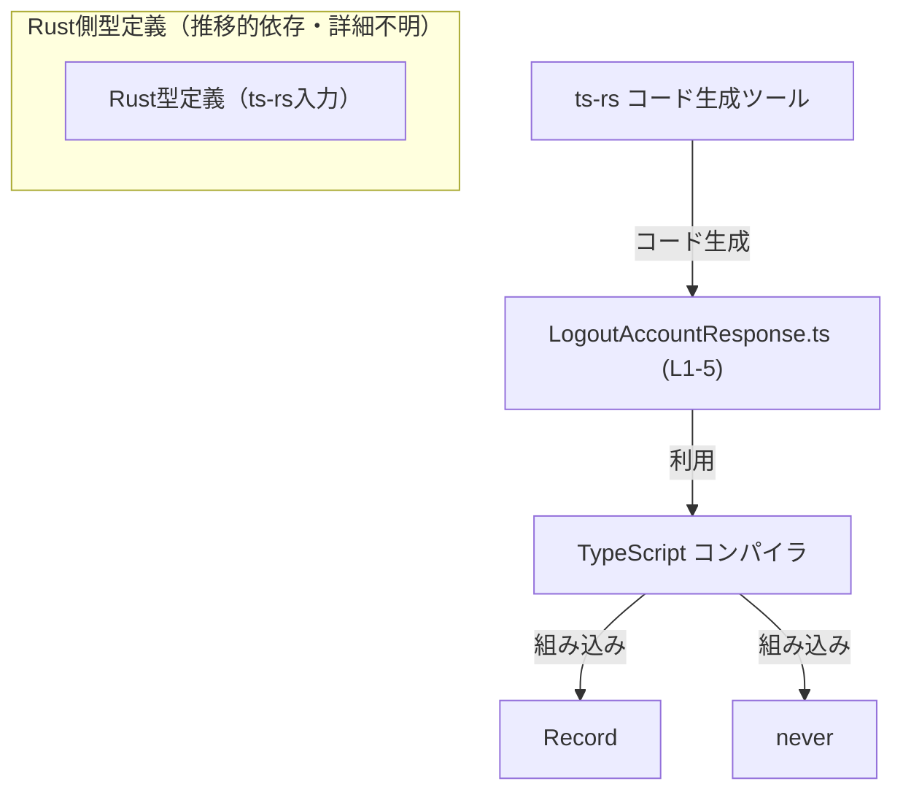
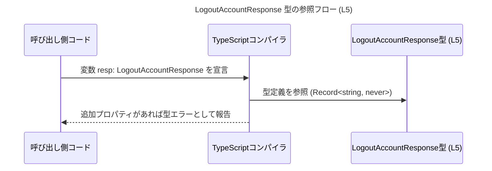

# app-server-protocol/schema/typescript/v2/LogoutAccountResponse.ts

## 0. ざっくり一言

- `LogoutAccountResponse` という **空オブジェクト型** の TypeScript 型エイリアスを 1 つだけ公開している、自動生成ファイルです（`ts-rs` により生成）【LogoutAccountResponse.ts:L1-3,L5】。

---

## 1. このモジュールの役割

### 1.1 概要

- このモジュールは、`LogoutAccountResponse` という名前の **応答用データ構造を表す型** を定義します【LogoutAccountResponse.ts:L5】。
- 型は `Record<string, never>` で表現されており、「**プロパティを持たないオブジェクト型**」として機能します【LogoutAccountResponse.ts:L5】。
- ファイル全体は `ts-rs` による **自動生成コードであり、手動編集しないこと** がコメントで明示されています【LogoutAccountResponse.ts:L1-3】。

### 1.2 アーキテクチャ内での位置づけ

- パスから、このファイルは `app-server-protocol/schema/typescript/v2` ディレクトリ配下の **TypeScript スキーマ定義の 1 つ** であると分かります（パス情報より）。
- このファイル内には **他モジュールの import は存在せず**、TypeScript の組み込み型 `Record` および `never` のみを使用しています【LogoutAccountResponse.ts:L5】。
- コメントから、この型は Rust コードから `ts-rs` によって生成されていることが分かります【LogoutAccountResponse.ts:L3】。

代表的な依存関係を図示します（このチャンクの情報だけに基づきます）。



- Rust 側の型定義の内容やファイル名は、このチャンクには現れないため不明です。

### 1.3 設計上のポイント

- **自動生成コード**  
  - ファイル先頭コメントで、「手で修正してはならない」ことが明示されています【LogoutAccountResponse.ts:L1-3】。
- **状態を持たない型定義のみ**  
  - 実行時に動作する関数やクラスは存在せず、**コンパイル時の型チェック専用**の型エイリアスのみが定義されています【LogoutAccountResponse.ts:L5】。
- **空オブジェクトの厳密表現**  
  - `Record<string, never>` により、「任意の文字列キーを取りうるが、その値が `never` のため事実上どのキーも持てない」型になっています【LogoutAccountResponse.ts:L5】。
  - これにより「追加プロパティを持たないこと」を型レベルで強く制約できます。
- **エラーハンドリング・並行性**  
  - 実行時ロジックが存在しないため、このモジュール自身にはエラーハンドリングや並行性に関する実装はありません。

---

## 2. 主要な機能一覧（コンポーネントインベントリー）

このファイルに登場する型・エクスポートの一覧です。

### 2.1 型・エクスポート一覧

| 名前                     | 種別         | 公開範囲 | 役割 / 用途（コードから分かる範囲）                       | 根拠 |
|--------------------------|--------------|----------|------------------------------------------------------------|------|
| `LogoutAccountResponse`  | 型エイリアス | `export` | プロパティを持たないオブジェクト型を表現するエイリアス   | LogoutAccountResponse.ts:L5 |

- 他に関数・クラス・列挙体などは存在しません【LogoutAccountResponse.ts:L1-5】。

### 2.2 機能としての要約

- `LogoutAccountResponse`:  
  - 空オブジェクトを表す型として定義されており、**「何もフィールドを持たないレスポンス」** を型で表現する用途に適した構造になっています【LogoutAccountResponse.ts:L5】。

---

## 3. 公開 API と詳細解説

### 3.1 型一覧（構造体・列挙体など）

| 名前                    | 種別         | 役割 / 用途                                      | 主な構成要素                     | 根拠 |
|-------------------------|--------------|--------------------------------------------------|----------------------------------|------|
| `LogoutAccountResponse` | 型エイリアス | 空オブジェクト型を表すプロトコル用の型エイリアス | `Record<string, never>` への別名 | LogoutAccountResponse.ts:L5 |

#### `LogoutAccountResponse` の詳細

**定義**

```typescript
export type LogoutAccountResponse = Record<string, never>;
```

【LogoutAccountResponse.ts:L5】

**意味（TypeScript 型システムの観点）**

- `Record<string, never>` は「任意の文字列キーを持つオブジェクト」だが、その値の型が `never` であるため、**実際にはキーを一切持てないことを要求する型**になります。
  - `never` は「到達不能な値」を表す型であり、通常、任意の値を `never` 型として扱うことはできません。
- したがって、`LogoutAccountResponse` 型の値としては、**プロパティを持たない空オブジェクト**だけが許容されます（型チェック時）。

**型安全性**

- この型を使うことで、
  - 「レスポンスにフィールドを追加してしまう」ような**仕様逸脱**を TypeScript コンパイラが検出できるようになります。
- ただし、これは **コンパイル時のチェックのみ** であり、ランタイムでの検証は自動では行われません。

**エラー / パニック**

- 実行時の関数ではないため、ランタイムエラーやパニックは関係しません。
- コンパイル時には、例えば以下のような場合に型エラーになります（後述のコード例参照）:
  - プロパティを 1 つ以上持つオブジェクトを `LogoutAccountResponse` 型の変数に代入した場合。

**並行性**

- 型定義のみであり、ランタイムのスレッドや非同期処理とは直接関係しません。
- どのスレッド・どの非同期コンテキストでも同じ型チェックが行われるだけです。

### 3.2 関数詳細

- このファイルには **関数定義は存在しません**【LogoutAccountResponse.ts:L1-5】。
- そのため、関数用テンプレートに基づく詳細解説対象はありません。

### 3.3 その他の関数

- 補助関数やラッパー関数も定義されていません【LogoutAccountResponse.ts:L1-5】。

---

## 4. データフロー

このファイル自体には処理フローを持つコードはありませんが、**型としてどのように関与しうるか**を、コンパイル時の視点で整理します。  
以下は「`LogoutAccountResponse` 型を利用する別コードが存在する」という、一般的な TypeScript の利用モデルに基づく説明であり、このリポジトリ内の実コードの有無はこのチャンクからは分かりません。

### 4.1 コンパイル時データフロー（型解決）

TypeScript コンパイラが `LogoutAccountResponse` 型をどのように解決して利用するかの概念図です。



- `LogoutAccountResponse` 型はあくまで **型チェック時に参照されるだけ** であり、JavaScript 出力には通常は現れません（型情報は削除されるため）。

---

## 5. 使い方（How to Use）

このセクションのコード例は、**このファイルには含まれていない仮想的な使用例**です。  
TypeScript で `LogoutAccountResponse` 型をどのように扱えるかを理解するための参考として示します。

### 5.1 基本的な使用方法

#### 空オブジェクトだけを許可する例

```typescript
// LogoutAccountResponse 型をインポートする（相対パスはプロジェクト構成に依存する）
// 実際のパスはこのチャンクからは不明です。
import type { LogoutAccountResponse } from "./LogoutAccountResponse";

// 正しい例: プロパティを一切持たない空オブジェクト
const ok: LogoutAccountResponse = {};           // OK（型チェックを通る）

// 間違い例: 余分なプロパティを持っている
const ng: LogoutAccountResponse = {
    // TypeScript の型チェックではエラーになる想定
    message: "logged out",
    //          ~~~~~~~~~~~  value は never 型に代入できないためエラー
};
```

- `LogoutAccountResponse` 型を付けることで、「一切のプロパティを持たない」という前提をコンパイル時に保証できます。

### 5.2 よくある使用パターン

1. **関数の戻り値型として利用**

   ```typescript
   import type { LogoutAccountResponse } from "./LogoutAccountResponse";

   // ログアウト処理の完了を示す戻り値として、空オブジェクトを返す関数の型例
   function handleLogout(): LogoutAccountResponse {
       return {}; // 空オブジェクトのみが許容される
   }
   ```

   - 戻り値に余計なデータを持たせないことを、型レベルで明確化できます。

2. **非同期関数の戻り値として利用**

   ```typescript
   import type { LogoutAccountResponse } from "./LogoutAccountResponse";

   async function logout(): Promise<LogoutAccountResponse> {
       // ここで何らかのログアウト処理を行うと仮定
       return {}; // Promise が解決する値も空オブジェクト
   }
   ```

   - 非同期処理の完了を「空の成功レスポンス」として表したい場合に、型として適しています。

### 5.3 よくある間違い

#### 1. 何かしらのメッセージを追加してしまう

```typescript
import type { LogoutAccountResponse } from "./LogoutAccountResponse";

// 間違い例: フィールドを追加している
const respWrong: LogoutAccountResponse = {
    success: true,   // ← success プロパティは Record<string, never> に適合しない
};

// 正しい例: 何も持たないオブジェクト
const respCorrect: LogoutAccountResponse = {};
```

- 誤用では、`success` の値の型は `boolean` であり、`never` ではないためコンパイル時にエラーになります。

#### 2. `any` を経由して型安全性を失う

```typescript
import type { LogoutAccountResponse } from "./LogoutAccountResponse";

const raw: any = { success: true };

// 間違い例: any を経由するとコンパイラがチェックできない
const respLoosen: LogoutAccountResponse = raw; // 型エラーが起きない可能性がある
```

- `any` 型を経由すると、`LogoutAccountResponse` が期待する「空オブジェクト」という制約をコンパイラが検証できない場合があるため、**`any` の多用は避ける方が安全**です。

### 5.4 使用上の注意点（まとめ）

- **前提条件**
  - `LogoutAccountResponse` 型の値は、**プロパティを一切持たないこと**が前提です【LogoutAccountResponse.ts:L5】。
- **禁止事項 / 注意点**
  - ファイル先頭で「自動生成コードにつき手動変更禁止」と明示されているため【LogoutAccountResponse.ts:L1-3】、**この型の定義を直接編集しない**ことが推奨されます。
  - ランタイムの値チェックは行われないため、「サーバから実際に返ってきた値が本当に空かどうか」を確認したい場合は、別途バリデーション処理が必要です。
- **型安全性**
  - `any` を経由した代入や、型アサーション（`as LogoutAccountResponse`）の乱用は、この型が提供する安全性を弱めるため、慎重に使用する必要があります。
- **並行性**
  - 並行・非同期環境でも型定義は共有されるだけであり、特別なロックやスレッド安全性の考慮は不要です。

---

## 6. 変更の仕方（How to Modify）

### 6.1 新しい機能を追加する場合

- ファイル先頭のコメントで、**このファイルは `ts-rs` により生成されており、手動で編集してはならない**ことが明記されています【LogoutAccountResponse.ts:L1-3】。
- そのため、新しいフィールドや別のレスポンス型を追加したい場合は、**TypeScript 側ではなく、元になっている Rust 側の型定義**を変更する必要があります。
  - 具体的な Rust 側ファイルパスや型名は、このチャンクからは分かりません。
- 一般的な手順（概念レベル）:
  1. Rust 側で対応するレスポンス型（構造体や型エイリアス）にフィールドを追加・変更する。
  2. `ts-rs` によるコード生成プロセスを実行し、TypeScript 側の定義を再生成する。
  3. 再生成された `LogoutAccountResponse.ts`（および関連ファイル）を利用するコードを更新し、型エラーがないことを確認する。

### 6.2 既存の機能を変更する場合

- **定義の変更**  
  - 直接 `LogoutAccountResponse.ts` を編集すると、次回のコード生成時に上書きされるため、変更が失われます【LogoutAccountResponse.ts:L1-3】。
  - 型にフィールドを追加・削除したい場合は、Rust 側の元定義を変更し、再生成する必要があります。
- **影響範囲の確認**
  - `LogoutAccountResponse` 型を使用している TypeScript コード（インポート箇所・変数宣言・関数の戻り値型など）に対して、型の変更がどう影響するかを確認する必要があります。
  - このチャンクには使用箇所が現れないため、具体的な影響範囲は不明です。
- **契約（前提条件・返り値の意味）**
  - 現状の定義は「空オブジェクト」であるという契約を意味します【LogoutAccountResponse.ts:L5】。
  - フィールドを追加するなど契約を変える場合、これを前提にしている呼び出し側のコード・外部仕様への影響を確認することが重要です。

---

## 7. 関連ファイル

このチャンクから直接参照できる関連ファイル情報は限定的です。

| パス / コンポーネント | 役割 / 関係 | 根拠 |
|------------------------|-------------|------|
| （Rust 側の型定義ファイル） | `ts-rs` によるコード生成の元となる Rust 型定義。具体的なパスや名前は不明。 | 「This file was generated by [ts-rs]」というコメントから、Rust 側の型が存在することだけが分かる【LogoutAccountResponse.ts:L3】。 |
| `app-server-protocol/schema/typescript/v2/` ディレクトリ内の他ファイル | 同じプロトコルバージョン `v2` 用の TypeScript スキーマ群である可能性があるが、実際の中身はこのチャンクからは分からない。 | ファイルパス構造からの推測であり、具体的なファイル名や内容はこのチャンクには現れない。 |

- テストコードや、この型を実際に利用するアプリケーションコードは、このチャンクには現れません。

---

### Bugs / Security / Contracts / Edge Cases（まとめ）

- **Bugs**
  - 実行時ロジックがなく、ただ 1 行の型定義のみであるため、このファイル単体に起因するランタイムバグはありません【LogoutAccountResponse.ts:L5】。
- **Security**
  - 型レベルの定義のみであり、直接的なセキュリティホール（入力検証・認可処理の欠如など）は存在しません。
  - ただし、実際のレスポンス内容の検証は行わないため、**「型上は空だが、実際の通信内容は異なる」**といった不整合が起きないよう、バックエンドとの契約管理が重要です（これはこのファイル外の話です）。
- **Contracts**
  - 契約: 「`LogoutAccountResponse` はプロパティを持たないオブジェクトである」【LogoutAccountResponse.ts:L5】。
- **Edge Cases**
  - `{} as LogoutAccountResponse` のような型アサーションを多用すると、本来エラーにすべきケースを見逃す可能性があります。
  - `any` 経由の代入でコンパイラが適切にエラーを出せないケースがありうるため、`any` の使用は最小限が望ましいです。

このファイルについて、コードから読み取れる事実は以上です。
