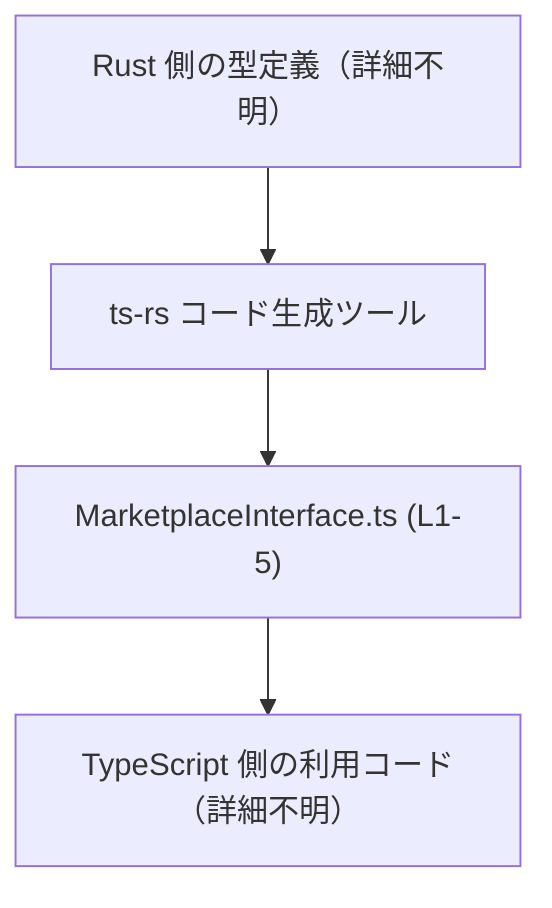
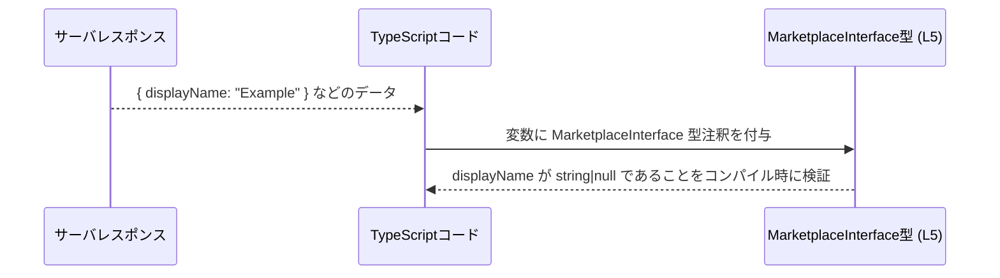

# app-server-protocol/schema/typescript/v2/MarketplaceInterface.ts コード解説

## 0. ざっくり一言

- Rust から `ts-rs` によって自動生成された、**マーケットプレースのインターフェース情報**を表す TypeScript 型エイリアスです（`MarketplaceInterface.ts:L1-5`）。
- プロパティは `displayName: string | null` の 1 つだけを持ち、表示名が存在しない状態を `null` で表現できるようになっています（`MarketplaceInterface.ts:L5-5`）。

---

## 1. このモジュールの役割

### 1.1 概要

- このモジュールは、アプリケーションサーバプロトコルの TypeScript スキーマの一部として、`MarketplaceInterface` 型を提供します（パス名より）。
- `MarketplaceInterface` は `displayName` という 1 つのプロパティを持ち、その型は `string | null` です（`MarketplaceInterface.ts:L5-5`）。
- コメントから、このファイルは Rust 側の型から `ts-rs` により自動生成されたものであり、**手動編集は禁止**されています（`MarketplaceInterface.ts:L1-3`）。

### 1.2 アーキテクチャ内での位置づけ

- 上部コメントに「This file was generated by [ts-rs]」とあり、`ts-rs` による**自動生成された TypeScript 型定義**であることが示されています（`MarketplaceInterface.ts:L3-3`）。
- パス `schema/typescript/v2` から、**プロトコルスキーマの TypeScript 側表現（第 2 世代）**の 1 要素であると解釈できます（パス情報に基づく解釈。実際の呼び出し元コードはこのチャンクには現れません）。
- 実行時のロジックや関数呼び出しは存在せず、**コンパイル時の型安全性提供のみ**を担います。

この位置づけを、生成パイプラインの観点で図示します。



- Rust 側の具体的な型名や、TypeScript 側でどこから import されているかは**このチャンクには現れません**。

### 1.3 設計上のポイント

- 自動生成コード  
  - 冒頭コメントで「GENERATED CODE! DO NOT MODIFY BY HAND!」と明示されており、手動編集を禁止する方針になっています（`MarketplaceInterface.ts:L1-3`）。
- 純粋な型定義モジュール  
  - 実装ロジック・関数・クラスは一切なく、**型エイリアスだけ**をエクスポートします（`MarketplaceInterface.ts:L5-5`）。
- Null 許容の明示  
  - `displayName` は `string` だけでなく `null` も許容する **ユニオン型**（union type）で定義されています（`MarketplaceInterface.ts:L5-5`）。
  - プロパティ自体は必須（省略不可）であり、値がない状態は `null` で表現する設計です（オプショナル `?` ではないことから）。
- エラーや並行性  
  - 実行時コードが存在しないため、このモジュール単体からは**エラー処理や並行性に関する挙動は発生しません**。

---

## 2. 主要な機能一覧

このファイルは 1 つの型定義のみを提供します。

- `MarketplaceInterface` 型定義:  
  マーケットプレースのインターフェース情報を表し、`displayName: string | null` プロパティを持つ型エイリアス（`MarketplaceInterface.ts:L5-5`）。

---

## 3. 公開 API と詳細解説

### 3.1 型一覧（構造体・列挙体など）

| 名前                  | 種別        | フィールド                                  | 役割 / 用途                                                                                             | 定義位置                          |
|-----------------------|-------------|---------------------------------------------|----------------------------------------------------------------------------------------------------------|-----------------------------------|
| `MarketplaceInterface` | 型エイリアス | `displayName: string \| null`               | マーケットプレース用インターフェースの表示名を表す型。表示名が未設定の場合を `null` で表現できる（用途は名前からの推測）。 | `MarketplaceInterface.ts:L5-5` |

> 備考: 「表示名」という用途はプロパティ名から推測されますが、**このチャンクのコードだけでは厳密な意味は断定できません**。

#### 型の意味（TypeScript 特有の観点）

- **型エイリアス（type alias）**  
  - `export type MarketplaceInterface = { ... };` は、オブジェクト型 `{ ... }` に `MarketplaceInterface` という別名を付けています。
  - インターフェース (`interface`) と似ていますが、ユニオン型などより柔軟な構造にも別名を付けられる点が特徴です。
- **ユニオン型 `string | null`**  
  - `displayName` には **文字列** か **`null`** のどちらかが入ることをコンパイル時に保証します。
  - JavaScript では何でも代入できてしまいますが、TypeScript ではこの制約により IDE 補完や型チェックの恩恵を受けられます。
- **必須プロパティ + Null 許容**  
  - `displayName?: string` ではなく `displayName: string | null` であるため、プロパティそのものは必須です。
  - 「キーは必ず存在するが、値は未設定（null）の可能性がある」という契約になっています。

### 3.2 関数詳細（最大 7 件）

- このファイルには**関数・メソッド・クラスは一切定義されていません**（`MarketplaceInterface.ts:L1-5`）。
- したがって、公開 API のうち**実行時に呼び出されるものはありません**。
- エラー・パニック・並行性・パフォーマンスは、この型定義だけを見ても特有の挙動は存在しません。

### 3.3 その他の関数

- 補助的な関数やラッパー関数も**存在しません**（`MarketplaceInterface.ts:L1-5`）。

---

## 4. データフロー

このモジュール自体は型定義のみですが、**型がどのようにデータフローに関与するか**の一例を示します。

- サーバから `{ displayName: "Example" }` のようなオブジェクトを受け取ったとき、クライアント側の TypeScript コードは `MarketplaceInterface` 型を使って型安全に扱えます。
- TypeScript の型は**コンパイル時のみ存在**し、実行時には消えるため、ここでいう「フロー」はコンパイル時の型チェックの流れです。



- 実際にどの API 呼び出しや HTTP クライアントで利用されているかは、**このチャンクには現れません**。

---

## 5. 使い方（How to Use）

### 5.1 基本的な使用方法

`MarketplaceInterface` 型を利用して、マーケットプレースのインターフェース情報を型安全に表現する使用例です。  
パスは同一ディレクトリからの相対パスと仮定しています（実際のパスはプロジェクト構成に依存します）。

```typescript
// 同一ディレクトリにある MarketplaceInterface.ts から型をインポートする例
import type { MarketplaceInterface } from "./MarketplaceInterface"; // パスは実際の配置に応じて変更する

// 正常な例: displayName に文字列を設定する
const marketplaceWithName: MarketplaceInterface = {        // MarketplaceInterface 型のオブジェクトを宣言
    displayName: "Main Marketplace",                       // displayName は string として設定
};

// displayName が null の場合の例
const marketplaceWithoutName: MarketplaceInterface = {     // 同じく MarketplaceInterface 型
    displayName: null,                                     // 未設定・不明などを null で表現
};

// 利用例: displayName にアクセスするときは string|null である点に注意する
if (marketplaceWithName.displayName !== null) {            // null チェックを行う
    console.log(marketplaceWithName.displayName.toUpperCase()); // string として安全に扱える
}
```

- `displayName` にアクセスするときは、**`null` の可能性に必ず対処**する必要があります（`string | null` のため）。

### 5.2 よくある使用パターン

1. **表示名がある場合の利用**

```typescript
import type { MarketplaceInterface } from "./MarketplaceInterface"; // 型のインポート

const m: MarketplaceInterface = {                         // MarketplaceInterface 型を付与
    displayName: "Asia Market",                           // 有効な表示名
};

console.log(`Marketplace: ${m.displayName}`);             // ここでは null でない前提なら事前チェックが必要
```

1. **表示名がまだ設定されていない状態の表現**

```typescript
import type { MarketplaceInterface } from "./MarketplaceInterface";

const draftMarketplace: MarketplaceInterface = {          // 下書き状態などを表現
    displayName: null,                                    // まだ表示名が決まっていない
};
```

### 5.3 よくある間違い

`string | null` の型に対する典型的な誤り例と修正例です。

```typescript
import type { MarketplaceInterface } from "./MarketplaceInterface";

// 間違い例 1: 必須プロパティ displayName を欠いている
// const invalid1: MarketplaceInterface = {};              // エラー: displayName プロパティが必須

// 正しい例
const valid1: MarketplaceInterface = {                    // MarketplaceInterface 型
    displayName: null,                                    // プロパティを定義し、null を設定
};

// 間違い例 2: undefined を使う（strictNullChecks 想定）
/*
const invalid2: MarketplaceInterface = {                  // 多くの設定ではコンパイルエラー
    displayName: undefined,                               // 型は string|null であり、undefined は含まれない
};
*/

// 正しい例: null を使う
const valid2: MarketplaceInterface = {                    // 正しい代入
    displayName: null,                                    // 未設定を null で表現
};

// 間違い例 3: null の可能性を無視してメソッド呼び出し
/*
const invalid3: MarketplaceInterface = { displayName: null };
console.log(invalid3.displayName.toUpperCase());          // 実行時エラーの可能性（null に対するメソッド呼び出し）
*/

// 正しい例: null チェックを行う
const safe: MarketplaceInterface = {                      // null を含みうる
    displayName: "Safe Name",
};
if (safe.displayName !== null) {                          // null でないことを確認
    console.log(safe.displayName.toUpperCase());          // string として安全に使用
}
```

- `displayName` プロパティの**有無**ではなく、**値の型（string または null）**が重要です。
- `undefined` を使いたい場合は、型を `string | null | undefined` に変更する必要がありますが、このファイルは自動生成のため**直接変更すべきではありません**（`MarketplaceInterface.ts:L1-3`）。

### 5.4 使用上の注意点（まとめ）

- **自動生成コードの直接編集禁止**  
  - コメントに明示されている通り、このファイルは `ts-rs` による生成物であり、手動編集は行うべきではありません（`MarketplaceInterface.ts:L1-3`）。
- **実行時検証は行われない**  
  - TypeScript の型はコンパイル時のみ有効で、実行時には削除されます。  
    不正なデータがサーバから来うる場合は、別途ランタイムのバリデーションが必要です。
- **null の扱い**  
  - `displayName` は `null` を許容するため、利用側で必ず null チェックを行うか、オプショナルチェーン等を利用する必要があります。
- **並行性・スレッド安全性**  
  - 型定義だけのため、このモジュール自体には並行性やスレッド安全性に関する特別な考慮事項はありません。
- **セキュリティ**  
  - この型定義自体はセキュリティ上のリスクを直接生みませんが、実行時の入力検証を行わない限り、信頼できない入力が `displayName` に入る可能性はあります（XSS 対策などは別途必要）。

---

## 6. 変更の仕方（How to Modify）

### 6.1 新しい機能を追加する場合

このファイル冒頭には次のコメントがあります（`MarketplaceInterface.ts:L1-3`）。

```typescript
// GENERATED CODE! DO NOT MODIFY BY HAND!

// This file was generated by [ts-rs](https://github.com/Aleph-Alpha/ts-rs). Do not edit this file manually.
```

- これにより、**このファイルへの直接的な変更は意図されていない**ことが分かります。
- `MarketplaceInterface` に新たなプロパティを追加したい場合は、一般的には以下の手順になります（`ts-rs` の利用パターンに基づく一般論）:
  1. Rust 側の元となる型定義（構造体など）にプロパティを追加・変更する。  
     - 具体的な Rust ファイル名や型名は、このチャンクには現れないため**不明**です。
  2. `ts-rs` のコード生成ステップを実行し直し、TypeScript 側のファイルを再生成する。
  3. 生成された `MarketplaceInterface.ts` を利用するコード側で、追加されたプロパティを扱うように修正する。

### 6.2 既存の機能を変更する場合

`displayName` の型や名前を変更したい場合も、同様に**生成元を変更する**必要があります。

- 変更時に注意すべき点:
  - `displayName` を `string` のみに変更する場合、既存コードで `null` を代入している箇所があれば、すべて修正する必要があります。
  - プロパティ名そのものを変更すると、全呼び出し箇所が壊れるため、**影響範囲の洗い出し**が重要です。
  - この TypeScript ファイル内では、他の型や関数に依存していないため、依存関係は比較的単純ですが、実際の利用箇所は別ファイルに存在します（このチャンクには現れません）。

---

## 7. 関連ファイル

このチャンクには他ファイルへの import や参照は存在しないため、**直接の関連ファイルは特定できません**（`MarketplaceInterface.ts:L1-5`）。  
パス構造から推測できる範囲を整理します。

| パス                                               | 役割 / 関係                                                                                 |
|----------------------------------------------------|--------------------------------------------------------------------------------------------|
| `app-server-protocol/schema/typescript/v2/*`       | 同一バージョン (`v2`) の他の TypeScript スキーマ定義が存在するディレクトリと思われる（内容は不明）。 |
| Rust 側の対応する型定義（具体的パス不明）          | `ts-rs` により本ファイルの生成元となる型。Rust ソースのどこにあるかはこのチャンクには現れない。     |

- テストコードや補助ユーティリティとの関係も、このファイル単体からは**不明**です。
- 観測可能性（ロギングやメトリクス）に関するコードも存在しません。型定義のみであるためです。

---

### 参考: このチャンクに基づくコンポーネントインベントリー（まとめ）

| コンポーネント名          | 種別        | 説明                                                       | 定義位置                          |
|---------------------------|-------------|------------------------------------------------------------|-----------------------------------|
| `MarketplaceInterface`    | 型エイリアス | `displayName: string \| null` を持つマーケットプレースインターフェース型 | `MarketplaceInterface.ts:L5-5` |

- 上記以外のコンポーネント（関数・クラス・列挙型）は、このチャンクには**存在しません**。
