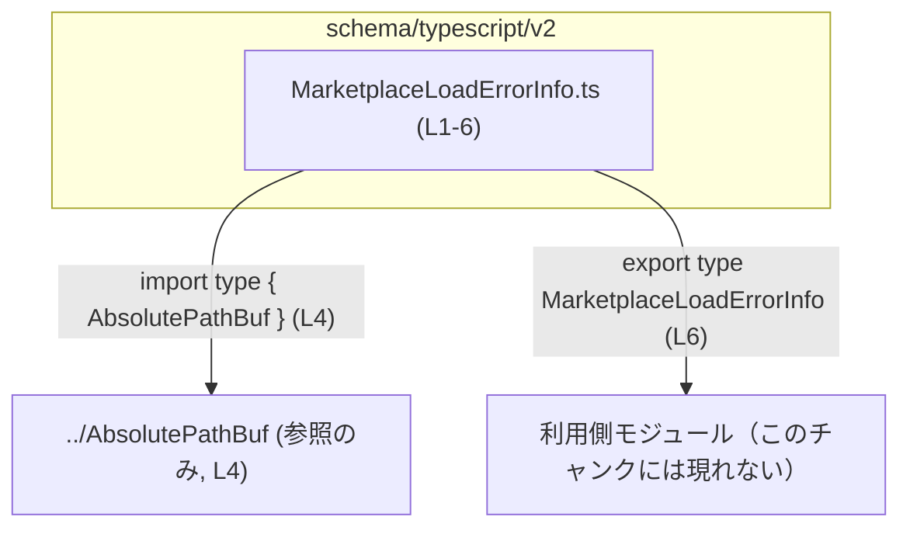
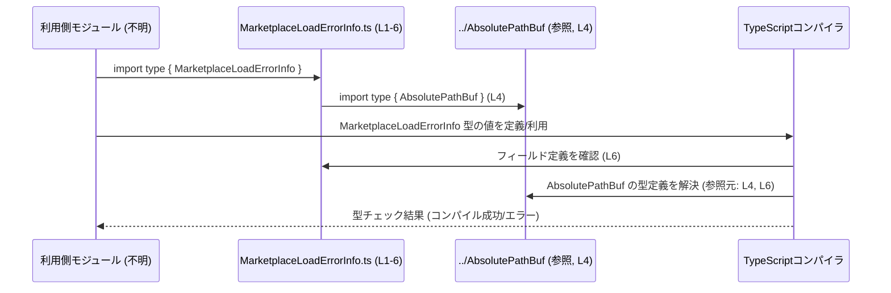

# app-server-protocol\schema\typescript\v2\MarketplaceLoadErrorInfo.ts

## 0. ざっくり一言

`MarketplaceLoadErrorInfo` という **マーケットプレース関連のエラー情報を表現する TypeScript 型** を 1 つだけ定義・公開するファイルです（MarketplaceLoadErrorInfo.ts:L4-6）。

---

## 1. このモジュールの役割

### 1.1 概要

- このモジュールは、`marketplacePath` と `message` から成るエラー情報オブジェクトを表す `MarketplaceLoadErrorInfo` 型を提供します（MarketplaceLoadErrorInfo.ts:L6）。
- 生成コードであり、手動編集は禁止されています（MarketplaceLoadErrorInfo.ts:L1-3）。

> 型名から「マーケットプレースのロード失敗時の情報」を表す用途が想定されますが、**実際の利用箇所や挙動はこのチャンクには現れません**。

### 1.2 アーキテクチャ内での位置づけ

- 依存関係として、このモジュールは `AbsolutePathBuf` 型を `import type` で参照します（MarketplaceLoadErrorInfo.ts:L4）。
- `MarketplaceLoadErrorInfo` 自体は `export type` されており、他のモジュールから型として利用されることが想定されます（MarketplaceLoadErrorInfo.ts:L6）。

主要な依存関係を Mermaid のグラフで示すと次のようになります。



- `U` ノード（利用側モジュール）は、この型がエクスポートされている事実から存在が推測されますが、**具体的なモジュール名や役割はこのチャンクには現れません**。

### 1.3 設計上のポイント

- **生成コードであることを明示**  
  - 冒頭コメントで「GENERATED CODE」「Do not edit this file manually」と明記されています（MarketplaceLoadErrorInfo.ts:L1-3）。
  - 型定義を変更する場合は、生成元（Rust 側や ts-rs 設定）を変更する必要があることが示唆されます（生成コードであるというコメントに基づく一般的な運用慣行。具体的な生成元コードはこのチャンクには現れません）。

- **型レベルのみの依存**  
  - `import type` を用いており、JavaScript にコンパイルされた後のランタイムコードには影響しない純粋な型依存になっています（MarketplaceLoadErrorInfo.ts:L4）。
  - これにより、循環参照などの実行時依存を増やさずに型情報だけを共有できます（TypeScript の `import type` 構文の言語仕様に基づく説明）。

- **シンプルなオブジェクト型エイリアス**  
  - `MarketplaceLoadErrorInfo` はオブジェクト型の type エイリアスであり、フィールドは `marketplacePath` と `message` の 2 つのみ、いずれも必須プロパティです（MarketplaceLoadErrorInfo.ts:L6）。

---

## 2. 主要な機能一覧

このファイルは関数やクラスではなく「型情報のみ」を提供します。

- `MarketplaceLoadErrorInfo` 型定義:  
  - `marketplacePath: AbsolutePathBuf` と `message: string` を持つエラー情報オブジェクトの構造を表す型エイリアスです（MarketplaceLoadErrorInfo.ts:L4,L6）。

---

## 3. 公開 API と詳細解説

### 3.1 型一覧（構造体・列挙体など）

このチャンクに現れる主要な型コンポーネントの一覧です。

| 名前 | 種別 | 定義 / 参照位置 | 役割 / 用途 |
|------|------|-----------------|-------------|
| `MarketplaceLoadErrorInfo` | 型エイリアス（オブジェクト型） | MarketplaceLoadErrorInfo.ts:L6 | `marketplacePath` と `message` を持つエラー情報オブジェクトの形を表す公開型。 |
| `AbsolutePathBuf` | 型（詳細はこのファイル外） | 参照: MarketplaceLoadErrorInfo.ts:L4, フィールド型として: L6 | `marketplacePath` フィールドの型として利用されるパス表現。実体定義は `../AbsolutePathBuf` モジュールにありますが、このチャンクには現れません。 |

`MarketplaceLoadErrorInfo` のフィールド構造:

- `marketplacePath: AbsolutePathBuf`（MarketplaceLoadErrorInfo.ts:L6）  
  - マーケットプレースに関連するパスを表す型であり、`AbsolutePathBuf` 型であることのみが分かります。
- `message: string`（MarketplaceLoadErrorInfo.ts:L6）  
  - エラー内容や説明メッセージを格納する文字列です。

いずれのフィールドにも `?` は付いておらず、**オプショナルではなく必須プロパティ** です（MarketplaceLoadErrorInfo.ts:L6 のオブジェクト型構文から読み取れます）。

### 3.2 関数詳細（最大 7 件）

このファイルには **関数定義が 1 つも存在しません**（MarketplaceLoadErrorInfo.ts:L1-6 全体を確認しても `function` やメソッド構文が存在しないため）。

そのため、このセクションの「関数詳細テンプレート」に該当する API はありません。

### 3.3 その他の関数

- なし（このチャンクには関数・メソッド・アロー関数などの定義が現れません：MarketplaceLoadErrorInfo.ts:L1-6）。

---

## 4. データフロー

このモジュール自体には実行時ロジックはなく、**型情報のやり取り（コンパイル時のデータフロー）** が中心です。

### 4.1 型レベルのデータフロー（依存関係）

- 他モジュールが `MarketplaceLoadErrorInfo` を import して利用する際、TypeScript の型チェッカは内部的に `AbsolutePathBuf` の型定義も辿ります（型依存: MarketplaceLoadErrorInfo.ts:L4, L6）。
- これにより、「`marketplacePath` は `AbsolutePathBuf` 型でなければならない」「`message` は `string` でなければならない」という静的保証が行われます（TypeScript の型システム仕様に基づく説明）。

一般的な利用イメージを sequence diagram で表すと次のようになります（呼び出し側モジュール名などはこのチャンクから特定できないため抽象名で表記します）。



> この図は「この型がどのように利用されうるか」の **一般的な型チェックの流れ** を説明するためのものであり、具体的な利用モジュールやランタイム処理はこのチャンクには現れません。

---

## 5. 使い方（How to Use）

### 5.1 基本的な使用方法

`MarketplaceLoadErrorInfo` 型を利用してエラー情報オブジェクトを扱う、最小限の例です。

```typescript
// 利用側ファイルの想定例

import type { MarketplaceLoadErrorInfo } from "./v2/MarketplaceLoadErrorInfo"; // エラー情報型のインポート
import type { AbsolutePathBuf } from "./AbsolutePathBuf";                     // パス型のインポート（実際のパスはプロジェクト構成に依存）

// 何らかの方法で AbsolutePathBuf 型の値を得ていると仮定する
const marketplacePath: AbsolutePathBuf = /* AbsolutePathBuf 型の値を取得する */ null as any;

// MarketplaceLoadErrorInfo 型の値を作成する
const errorInfo: MarketplaceLoadErrorInfo = {
    marketplacePath,                              // AbsolutePathBuf 型でなければコンパイルエラー
    message: "Failed to load marketplace data.",  // string 型
};

// errorInfo をログ出力や UI 表示などに渡す
console.log(errorInfo.message, errorInfo.marketplacePath);
```

- `marketplacePath` には `AbsolutePathBuf` 型の値が必須です（MarketplaceLoadErrorInfo.ts:L6）。
- `message` にはエラー内容などを表す任意の文字列を設定できます（MarketplaceLoadErrorInfo.ts:L6）。

### 5.2 よくある使用パターン

このチャンクから用途を断定することはできませんが、型名とフィールド名から、以下のようなパターンで使われる可能性があります（あくまで一般的な TypeScript コードでの利用イメージです）。

1. **エラー情報をまとめて返す / 投げる**

```typescript
function createMarketplaceError(
    path: AbsolutePathBuf,
    reason: string,
): MarketplaceLoadErrorInfo {
    return {
        marketplacePath: path,  // AbsolutePathBuf 型
        message: reason,        // string 型
    };
}
```

1. **ログやテレメトリへの送信**

```typescript
function logMarketplaceLoadError(errorInfo: MarketplaceLoadErrorInfo): void {
    // ログ出力などを行う処理の例（実装内容は用途に依存）
    console.error(
        "Error loading marketplace:",
        errorInfo.marketplacePath,
        "-", 
        errorInfo.message,
    );
}
```

> 上記の関数はこのチャンクには現れませんが、`MarketplaceLoadErrorInfo` 型の使い方として自然なパターンの例です。

### 5.3 よくある間違い

`MarketplaceLoadErrorInfo` を使う際に起こりうる典型的な誤用と、その修正例です。

```typescript
import type { MarketplaceLoadErrorInfo } from "./v2/MarketplaceLoadErrorInfo";

// 間違い例 1: フィールド名の誤り
const bad1: MarketplaceLoadErrorInfo = {
    // 'marketplacePath' という名前が必須だが 'path' にしてしまっている
    // path: "/some/path",          // コンパイルエラー: 余計なプロパティ or 必須プロパティ不足
    marketplacePath: "/some/path" as any, // 型も不正（AbsolutePathBuf ではない）
    message: "error",
};

// 正しい例
const ok1: MarketplaceLoadErrorInfo = {
    marketplacePath: "/some/path" as any, // 実際には AbsolutePathBuf 型の値を渡す必要あり
    message: "error",
};

// 間違い例 2: message を省略してしまう
const bad2: MarketplaceLoadErrorInfo = {
    marketplacePath: "/some/path" as any,
    // message が必須なので省略するとコンパイルエラー
    // message: "..." が必要
};
```

- **フィールド名のスペル** は `marketplacePath` / `message` 固定です（MarketplaceLoadErrorInfo.ts:L6）。
- 両方とも **必須プロパティ** であるため、省略するとコンパイラがエラーを報告します（TypeScript の必須プロパティの仕様と MarketplaceLoadErrorInfo.ts:L6 の定義に基づく）。

### 5.4 使用上の注意点（まとめ）

- **生成コードを直接編集しない**  
  - ファイル冒頭に「GENERATED CODE! DO NOT MODIFY BY HAND!」「Do not edit this file manually」と明記されているため（MarketplaceLoadErrorInfo.ts:L1-3）、型を変更したい場合は生成元（Rust 側や ts-rs 設定など、このチャンクには現れない部分）を変更する必要があります。

- **AbsolutePathBuf 型の扱い**  
  - `marketplacePath` は `AbsolutePathBuf` 型として定義されています（MarketplaceLoadErrorInfo.ts:L4,L6）。  
  - その構造や生成方法は `../AbsolutePathBuf` モジュールに依存し、このチャンクからは分かりません。

- **並行性・エラー・安全性**  
  - この型は純粋な TypeScript の型エイリアスであり、実行時ロジックや副作用を含みません（MarketplaceLoadErrorInfo.ts:L1-6 のどこにも関数・実行コードがないため）。
  - そのため、このファイル自体に起因するランタイムエラーや並行性問題はありません。  
  - 安全性は主に「コンパイル時に誤ったフィールドや型を防ぐ」という型システムによる保証です（TypeScript の静的型付けに基づく一般的説明）。

---

## 6. 変更の仕方（How to Modify）

### 6.1 新しい機能を追加する場合

このファイルは生成コードであり、**直接の編集は推奨されません**（MarketplaceLoadErrorInfo.ts:L1-3）。

それでも「MarketplaceLoadErrorInfo にフィールドを追加したい」などの要件がある場合、一般的には次のような手順になります。

1. **生成元を特定する**  
   - コメントに `ts-rs` が記載されているため（MarketplaceLoadErrorInfo.ts:L3）、Rust 側の構造体や型定義からこの TypeScript 型が生成されている可能性があります。
   - 具体的な生成元のファイルパスや構造体名は、このチャンクには現れません。

2. **生成元の型定義を修正する**（例: Rust の構造体にフィールド追加）  
   - Rust など、ts-rs が参照する側の定義に新しいフィールドを追加します。
   - 追加フィールドの型に対応する TypeScript 型がどのように生成されるかは ts-rs の設定と言語仕様に依存し、このチャンクには現れません。

3. **コード生成を再実行する**  
   - プロジェクトのビルドやスクリプトを通じて ts-rs によるコード生成を再実行し、`MarketplaceLoadErrorInfo.ts` を再生成します。

4. **利用箇所の更新**  
   - 追加したフィールドに対応するよう、`MarketplaceLoadErrorInfo` を利用している箇所のコードを更新します（利用コードはこのチャンクには現れません）。

### 6.2 既存の機能を変更する場合

例: `message` の型を `string` から別の型に変更したい、`marketplacePath` を任意にしたい、など。

- **影響範囲の確認方法**
  - `MarketplaceLoadErrorInfo` を import しているファイルすべてが影響を受けます。  
  - 具体的な import 先リストはこのチャンクには現れないため、IDE の「参照元の検索」などで確認する必要があります。

- **注意すべき契約**
  - `marketplacePath: AbsolutePathBuf` と `message: string` というフィールド契約（名前と型、必須であること）は、多くの利用コードで前提になっている可能性があります（MarketplaceLoadErrorInfo.ts:L6）。
  - これを変更すると、コンパイルエラーやランタイムでの前提崩れが発生しうるため、利用側のコードもあわせて修正する必要があります。

- **テスト・検証**
  - このチャンクにテストコードは存在しません（MarketplaceLoadErrorInfo.ts:L1-6）。
  - プロジェクト全体で、`MarketplaceLoadErrorInfo` を使うロジック（エラーハンドリングやログ出力など）に対するテストがある場合は、それらを更新・再実行する必要があります（テストコードの有無はこのチャンクには現れません）。

---

## 7. 関連ファイル

このファイルと直接の関係がある（コード中に現れる）モジュールは次のとおりです。

| パス / モジュール | 役割 / 関係 |
|-------------------|------------|
| `../AbsolutePathBuf` | `AbsolutePathBuf` 型を提供するモジュールとして参照されています（MarketplaceLoadErrorInfo.ts:L4）。`MarketplaceLoadErrorInfo` の `marketplacePath` フィールドの型として利用されます（MarketplaceLoadErrorInfo.ts:L6）。 |
| `ts-rs` により生成される元ファイル（具体的ファイルパス不明） | コメントに「This file was generated by ts-rs」とあり（MarketplaceLoadErrorInfo.ts:L3）、Rust 側などに存在する生成元定義と対応していると考えられますが、具体的なファイル名・パスはこのチャンクには現れません。 |

> このチャンク (1/1) には、テストコードや他の関連型 (`MarketplaceLoadErrorError` など) は現れません。存在する場合でも、別ファイルとして管理されていると考えられますが、詳細は不明です。
