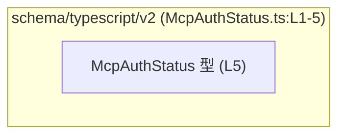
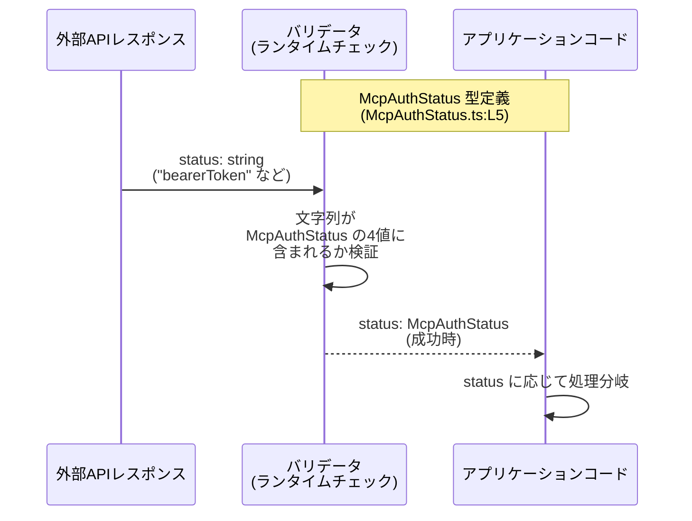

# `app-server-protocol\schema\typescript\v2\McpAuthStatus.ts` コード解説

## 0. ざっくり一言

TypeScript 向けに自動生成された、「`McpAuthStatus`」という認証関連と思われる状態を表す文字列リテラル型（ユニオン型）を定義するファイルです（`McpAuthStatus.ts:L1-5`）。

---

## 1. このモジュールの役割

### 1.1 概要

- このファイルは、`McpAuthStatus` という型エイリアスを定義し、4 種類の文字列リテラルのいずれかのみを許容する **制約付きの文字列型** を提供します（`McpAuthStatus.ts:L5-5`）。
- ファイル先頭コメントから、この型定義は Rust 向けライブラリ **ts-rs** によって自動生成されており、手動編集しないことが明示されています（`McpAuthStatus.ts:L1-3`）。
- 型名からは、何らかの「認証状態」を表現するためのスキーマの一部であることが想定されますが、このファイル単体から用途の詳細までは分かりません（根拠: 型名とリテラル名 `McpAuthStatus.ts:L5-5`）。

### 1.2 アーキテクチャ内での位置づけ

このファイルに **import / export** 以外の依存関係は記述されておらず（`McpAuthStatus.ts:L1-5`）、他モジュールとの関係はコードからは分かりません。  
推測を交えず、分かる範囲だけを図示すると次のようになります。



- この図は、「`schema/typescript/v2` に属する TypeScript スキーマ群の中の 1 つの型定義」であることだけを表します。
- 他の具体的な型・モジュールや、実際にどこから利用されているかは、このチャンクには現れません。

### 1.3 設計上のポイント

コードから読み取れる設計上の特徴は次のとおりです。

- **自動生成コードであることが明示されている**  
  - 「GENERATED CODE! DO NOT MODIFY BY HAND!」とコメントされています（`McpAuthStatus.ts:L1-1`）。
  - ts-rs によって生成されていることがコメントされています（`McpAuthStatus.ts:L3-3`）。
- **文字列リテラル・ユニオン型による型安全性**  
  - `McpAuthStatus` は `"unsupported" | "notLoggedIn" | "bearerToken" | "oAuth"` のユニオン型として定義されています（`McpAuthStatus.ts:L5-5`）。
  - これにより、TypeScript レベルでは **それ以外の文字列をコンパイル時に拒否** できる設計になっています。
- **状態やロジックを持たない純粋な型定義**  
  - 関数・クラスなどは定義されておらず、**ランタイムの処理やバリデーションは含まれません**（`McpAuthStatus.ts:L1-5` 全体）。
- **エラーハンドリングや並行性の責務は持たない**  
  - 型エイリアスのみであり、例外・エラー・非同期処理は一切定義されていません（`McpAuthStatus.ts:L1-5`）。

---

## 2. 主要な機能一覧

このファイルが提供する「機能」は、1 つの公開型に集約されています。

- `McpAuthStatus` 型: 4 種類の状態値 `"unsupported"`, `"notLoggedIn"`, `"bearerToken"`, `"oAuth"` のいずれかであることを表す TypeScript の文字列リテラル・ユニオン型（`McpAuthStatus.ts:L5-5`）。

---

## 3. 公開 API と詳細解説

### 3.1 型一覧（構造体・列挙体など）

| 名前             | 種別                    | 役割 / 用途（コードから分かる範囲）                                                | 定義位置                     |
|------------------|-------------------------|------------------------------------------------------------------------------------|------------------------------|
| `McpAuthStatus`  | 型エイリアス（ユニオン） | 4 種類の文字列リテラルのいずれかだけを許容する制約付き文字列型                     | `McpAuthStatus.ts:L5-5`      |

#### 3.1.1 `McpAuthStatus` 型エイリアス

```ts
export type McpAuthStatus = "unsupported" | "notLoggedIn" | "bearerToken" | "oAuth";
```

（`McpAuthStatus.ts:L5-5`）

**概要**

- `McpAuthStatus` は、4 つの文字列のいずれかだけが代入可能な TypeScript の文字列リテラル・ユニオン型です（`McpAuthStatus.ts:L5-5`）。
- 型名から、「MCP における認証状態」を表す用途が想定されますが、このファイル単体からはビジネス上の意味までは確定できません（`McpAuthStatus.ts:L5-5`）。

**取り得る値**

コードに明示されている値は次の 4 つです（`McpAuthStatus.ts:L5-5`）。

- `"unsupported"`  
  - 英語ラベルからは「その環境では認証がサポートされていない状態」を指すと解釈できますが、これは名前からの推測であり、コードから厳密な仕様は分かりません。
- `"notLoggedIn"`  
  - 「未ログイン状態」を指すと考えられますが、用途の詳細はコードからは不明です。
- `"bearerToken"`  
  - 「Bearer トークンによる認証が成立している状態」と解釈できますが、トークンの形式や格納場所などの仕様は本ファイルには記述されていません。
- `"oAuth"`  
  - OAuth に関連する状態を表すラベル名ですが、OAuth 2.0 など具体的なプロトコルやフローは本ファイルからは分かりません。

（上記の日本語説明はラベル名に基づく補助的な解釈であり、正確な仕様は別ドキュメントや生成元コードを参照する必要があります。）

**TypeScript における安全性のポイント**

- `McpAuthStatus` 型の変数には、上記 4 つ以外の文字列リテラルを代入すると **コンパイルエラー** になります（型システム上の安全性）。
- `switch` 文などで `McpAuthStatus` を分岐に使うとき、**網羅性チェック**（exhaustiveness check）を利用することで「新しい状態が追加されたのに分岐を追加し忘れた」ような不整合をコンパイル時に検出できます。

**Examples（使用例）**

以下は、この型を利用して処理を分岐する例です。  
（※これは利用例であり、実際のリポジトリ内コードではありません。）

```typescript
// McpAuthStatus をインポートする例                              
// 実際のパスはプロジェクト構成に依存するため一例です            
import type { McpAuthStatus } from "./McpAuthStatus";   // McpAuthStatus.ts から型をインポート

// 認証状態に応じてメッセージを生成する関数の例                    
function getAuthMessage(status: McpAuthStatus): string {  // status 引数は 4 つのどれかに制限される
    switch (status) {                                     // status の値に応じて分岐
        case "unsupported":                              // "unsupported" の場合
            return "認証はサポートされていません。";      
        case "notLoggedIn":                              // "notLoggedIn" の場合
            return "ログインが必要です。";              
        case "bearerToken":                              // "bearerToken" の場合
            return "Bearer トークンで認証済みです。";    
        case "oAuth":                                    // "oAuth" の場合
            return "OAuth で認証済みです。";             
        default:                                         // 型的には到達しない分岐
            // status の型が McpAuthStatus であれば、
            // ここはコンパイル時に never とみなせます
            const _exhaustiveCheck: never = status;      
            return _exhaustiveCheck;                     
    }
}
```

この例では、`status` の型を `McpAuthStatus` にすることで、誤った文字列やタイポがコンパイル時に検出されます。

**Errors / Panics（TypeScript 観点のエラー）**

- この型そのものはランタイムコードを含まないため、**実行時エラーや例外は直接発生しません**（`McpAuthStatus.ts:L1-5`）。
- 非対応の文字列を代入しようとすると、TypeScript コンパイラによって **コンパイルエラー** になります。例:

```typescript
let status: McpAuthStatus;           // McpAuthStatus 型の変数
status = "bearerToken";              // OK: 定義済みリテラル
status = "basicAuth";                // エラー: 型 '"basicAuth"' を 'McpAuthStatus' に割り当てられない
```

ただし、`any` や強制的な型アサーション（`as McpAuthStatus`）を使うと、この安全性を簡単に迂回できる点に注意が必要です。

**Edge cases（エッジケース）**

この型は純粋な型エイリアスであるため、エッジケースは主に **型システムとの関わり** に起因します。

- **外部入力からの文字列**  
  - JSON や HTTP レスポンスなど、ランタイムに取得した文字列は、TypeScript の型だけでは制約されません。
  - このファイルには入力値を検証する関数やランタイムチェックは存在しません（`McpAuthStatus.ts:L1-5`）。
- **`any` や `unknown` との相互運用**  
  - `any` 型から `McpAuthStatus` への代入はコンパイル時には許可されますが、実行時に不正な文字列が渡る可能性があります。
  - `unknown` から代入する場合は、利用側で型ガードやチェックが必要です。
- **将来的な状態追加**  
  - 生成元の定義に新しい状態が追加されると、`McpAuthStatus` にもリテラルが追加されると考えられますが、このファイルからはその予定・方針は分かりません。

**使用上の注意点**

- **自動生成ファイルを直接編集しないこと**  
  - 冒頭コメントで「手で編集しない」ことが明確に指示されています（`McpAuthStatus.ts:L1-3`）。
  - 新しい状態を追加する場合は、ts-rs の生成元（Rust 側の型定義など）を変更して再生成する必要があります。
- **ランタイムバリデーションは別レイヤーで行う必要がある**  
  - このファイルにはランタイムのチェックやパース処理は含まれていません。
  - 外部から文字列を受け取って `McpAuthStatus` として扱う場合は、別のコードで `"unsupported" | "notLoggedIn" | "bearerToken" | "oAuth"` かどうかを検証する必要があります。
- **型アサーションの乱用は避ける**  
  - `someString as McpAuthStatus` のような書き方は、その場ではコンパイルを通しますが、実行時に不正値を招く可能性があります。

---

### 3.2 関数詳細（このファイルには関数は存在しません）

- このファイルには `function` 宣言や矢印関数（`() => {}`）、クラスメソッドなどの **関数定義は一切含まれていません**（`McpAuthStatus.ts:L1-5` 全体）。
- したがって、このセクションで詳細説明すべき公開関数は存在しません。

---

### 3.3 その他の関数

- 補助的・内部的な関数も含め、関数は定義されていないため一覧は空です（`McpAuthStatus.ts:L1-5`）。

| 関数名 | 役割 |
|--------|------|
| （なし） | このファイルには関数定義がありません |

---

## 4. データフロー

このファイルには処理ロジックが存在しないため、**実装されたデータフローは読み取れません**（`McpAuthStatus.ts:L1-5`）。  
ここでは、`McpAuthStatus` 型がどのように利用されるかの **典型的な利用イメージ** を図示します。  
※ 以下の図はあくまで一般的な利用パターンの例であり、このリポジトリ内に同名のコンポーネントが存在することを意味するものではありません。



このイメージから分かるポイント:

- **McpAuthStatus はあくまで「型情報」** であり、実際に外部文字列を検証して変換する処理は、別のコンポーネント（ここでは「バリデータ」）が担います。
- バリデータが正しく機能していれば、アプリケーションコード側では `status: McpAuthStatus` によって **安全に列挙型のように扱える** ことが期待されます。

---

## 5. 使い方（How to Use）

### 5.1 基本的な使用方法

`McpAuthStatus` 型を変数や関数引数に使うことで、認証状態に関する文字列の取り扱いを型安全にできます。

```typescript
// McpAuthStatus 型をインポートする例                                   
import type { McpAuthStatus } from "./McpAuthStatus";   // 実際の相対パスはプロジェクト構成に依存する

// 変数として使う例                                                         
let status: McpAuthStatus = "notLoggedIn";              // OK: 定義済みリテラルの一つ

// 別の許可された値に変更                                                  
status = "bearerToken";                                 // OK: これも許可されたリテラル

// 許可されていない値                                                      
// status = "basicAuth";                                 // コンパイルエラー: McpAuthStatus に含まれない
```

このように、TypeScript の型チェックにより、不正な状態文字列の利用をコンパイル時に抑止できます。

### 5.2 よくある使用パターン

1. **関数引数として利用して分岐する**

```typescript
import type { McpAuthStatus } from "./McpAuthStatus";   // 型のインポート

// 認証状態に応じた処理を行う関数例                                        
function handleAuthStatus(status: McpAuthStatus): void {  // 引数に制約付きの型を指定
    if (status === "unsupported") {                     // 4 つの値の一つに対して条件分岐
        console.log("認証機能が利用できません。");      
    } else if (status === "notLoggedIn") {             
        console.log("ログインしてください。");          
    } else {                                            // "bearerToken" または "oAuth"
        console.log("認証済みです。");                  
    }
}
```

1. **UI 表示用の文言マップとして利用**

```typescript
import type { McpAuthStatus } from "./McpAuthStatus";   // 型のインポート

// 状態ごとのメッセージをまとめたマップ                                      
const AUTH_MESSAGES: Record<McpAuthStatus, string> = {  // キーに McpAuthStatus を指定
    unsupported: "このクライアントでは認証を利用できません。", // "unsupported" のメッセージ
    notLoggedIn: "ログインが必要です。",                     // "notLoggedIn" のメッセージ
    bearerToken: "Bearer トークン認証でログインしています。", // "bearerToken" のメッセージ
    oAuth: "OAuth でログインしています。",                   // "oAuth" のメッセージ
};
```

`Record<McpAuthStatus, string>` とすることで、新しい状態が `McpAuthStatus` に追加されたとき、マップを更新し忘れるとコンパイルエラーになる、という恩恵があります。

### 5.3 よくある間違い

1. **`string` 型で受け取ってしまう**

```typescript
// 誤りやすい例: string 型を使ってしまう                                
function handleAuthStatus(status: string) {             // status が任意の文字列になってしまう
    if (status === "bearerToken") {                    
        // ...                                         
    }
    // 他の状態は見落としやすく、タイポも検出されない                  
}
```

正しい例（型を活用）:

```typescript
import type { McpAuthStatus } from "./McpAuthStatus";   // 型のインポート

// 推奨される例: McpAuthStatus 型を利用                                   
function handleAuthStatus(status: McpAuthStatus) {      // 4 つの値に限定される
    // ...                                             // タイポはコンパイル時に検出される
}
```

1. **無差別な型アサーションの乱用**

```typescript
declare const rawStatus: string;                        // 外部から来た生の文字列

// 誤った例: ランタイム検証なしに強制キャスト                           
const status = rawStatus as McpAuthStatus;              // コンパイラには通るが、実行時には不正値の可能性

// 正しい方向性: 値を確認してから代入する                                
function parseStatus(raw: string): McpAuthStatus | null {
    // ここで raw が 4 つのいずれかかどうかチェックする想定（コードはこのファイルには存在しない）
    // 検証ロジックは別途実装する必要がある                                
    return null;                                       // 例のための仮実装
}
```

### 5.4 使用上の注意点（まとめ）

- **自動生成ファイルは編集しない**  
  - 変更は ts-rs の生成元定義側で行い、再生成する必要があります（`McpAuthStatus.ts:L1-3`）。
- **型はコンパイル時のみ有効**  
  - TypeScript の型はトランスパイル後の JavaScript には残らないため、ランタイムバリデーションは別途必要です。
- **`any` の利用を避ける**  
  - `any` を経由すると `McpAuthStatus` の制約が効かなくなり、誤った値が流れ込む可能性があります。
- **並行性・非同期処理には直接関与しない**  
  - この型は純粋な型情報であり、イベントループや非同期処理、スレッドセーフティには影響しません。

---

## 6. 変更の仕方（How to Modify）

### 6.1 新しい機能（状態）を追加する場合

このファイルは ts-rs による自動生成コードのため、**直接編集してはいけない**ことがコメントで明示されています（`McpAuthStatus.ts:L1-3`）。

新しい状態（例: `"apiKey"` など）を追加する必要がある場合の一般的な手順は次のようになります。

1. **生成元（Rust 側など）の型定義を変更する**  
   - ts-rs が参照している Rust の構造体・列挙体などで、認証状態を表す型に新しいバリアントを追加します。  
   - 生成元の具体的なファイルパスや型名は、このチャンクからは分かりません。
2. **ts-rs を再実行して TypeScript コードを再生成する**  
   - これにより、新しいリテラル値を含む `McpAuthStatus` が再生成されることが期待されます。
3. **TypeScript 側の利用箇所でコンパイルエラーを確認し、対応を追加する**  
   - `switch` 文や `Record<McpAuthStatus, ...>` などで、新しい状態に対応した分岐・値を追加します。

### 6.2 既存の機能（状態）を変更・削除する場合

- 既存のリテラル名を変更・削除する場合も、**必ず生成元の定義を変更し、再生成**する必要があります（`McpAuthStatus.ts:L1-3`）。
- 変更に伴う影響範囲の確認ポイント:

  - `McpAuthStatus` を型として利用している全ての箇所（関数引数、プロパティ型、マップのキーなど）。
  - `switch` / `if` 文で文字列リテラルに基づいて処理を分岐している箇所。
  - API とのシリアライズ／デシリアライズ（外部仕様として値が固定されている場合、プロトコル変更にもなり得ます）。

- TypeScript コンパイラが多くの問題箇所を教えてくれるため、**コンパイルエラーを起点に修正箇所を洗い出す**のが一般的です。

---

## 7. 関連ファイル

このチャンクには、他ファイルへの import / export やコメントによる参照がないため、**具体的な関連ファイルは特定できません**（`McpAuthStatus.ts:L1-5`）。

分かる範囲だけを整理すると次のようになります。

| パス                                                     | 役割 / 関係 |
|----------------------------------------------------------|------------|
| `app-server-protocol\schema\typescript\v2\McpAuthStatus.ts` | TypeScript 用の `McpAuthStatus` 型エイリアス定義（本ドキュメントの対象） |
| （不明）                                                 | ts-rs による生成元となる Rust 側の型定義ファイル。パスや型名はこのチャンクからは分かりません。 |

---

### Bugs / Security / Contracts（補足）

- **Bugs（バグ要因）**  
  - このファイル単体にはロジックがないため、直接のバグは確認できません（`McpAuthStatus.ts:L1-5`）。  
  - 関連バグは主に「生成元との不整合」や「ランタイム検証不足」から発生する可能性がありますが、それはこのファイルの外側の責務です。
- **Security（セキュリティ）**  
  - 型定義そのものはセキュリティ脆弱性を含みませんが、外部からのデータを適切に検証せずに `McpAuthStatus` として扱うと、ロジック上の想定と異なる状態が入り込む可能性があります。
- **Contracts / Edge Cases（契約・境界条件）**  
  - `McpAuthStatus` の契約は「4 つの文字列のどれかでなければならない」という点に尽きます（`McpAuthStatus.ts:L5-5`）。
  - ランタイムにこの契約を守らせるには、別レイヤーでの検証が必須です。

以上が、このチャンクから読み取れる範囲での `McpAuthStatus` 型の解説です。
