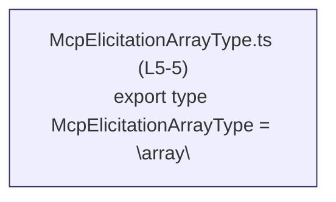
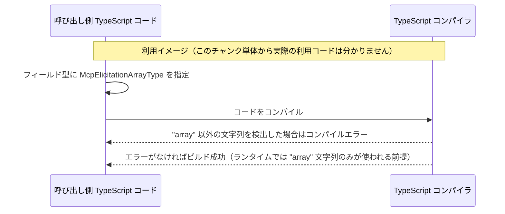

# app-server-protocol/schema/typescript/v2/McpElicitationArrayType.ts

## 0. ざっくり一言

`"array"` という文字列リテラルのみを許可する TypeScript の型エイリアスを定義する、自動生成ファイルです（`McpElicitationArrayType`）。

---

## 1. このモジュールの役割

### 1.1 概要

- このモジュールは、プロトコル定義の中で「型が配列である」ことを表すための **タグ的な文字列型** を提供します。
- TypeScript の **文字列リテラル型** を用いて、値が `"array"` 以外にならないようにコンパイル時に制約します。

**根拠**

- 型エイリアス定義: `export type McpElicitationArrayType = "array";`  
  `McpElicitationArrayType.ts:L5-5`

### 1.2 アーキテクチャ内での位置づけ

- このファイルは TypeScript 用スキーマ (`schema/typescript/v2`) の一部として、**他モジュールから import されて利用される前提の「型定義モジュール」** になっています。
- このチャンク内には他モジュールの `import` / `export`（再エクスポート）は存在せず、**依存先はなく、依存元のみが存在する片方向の関係** です。  
  依存元（どのモジュールがこれを使うか）は、このチャンクからは分かりません。



### 1.3 設計上のポイント

- **自動生成コード**  
  - ファイル先頭コメントにより、`ts-rs` による自動生成であることが示されています。  
    `McpElicitationArrayType.ts:L1-3`
  - そのため、**手動での編集は禁止されており、変更は生成元（Rust 側など）で行う設計** になっています。
- **状態を持たない純粋な型定義**  
  - ランタイムの値やロジックは一切持たず、**静的型チェック専用** の定義です。  
    `McpElicitationArrayType.ts:L5-5`
- **エラーハンドリング／並行性**  
  - 実行時の処理がないため、**エラー処理・並行性に関するロジックは存在しません**（TypeScript コンパイル時の型チェックのみが関係します）。

---

## 2. 主要な機能一覧

このモジュールが提供する機能は、次の 1 つに集約されます。

- `McpElicitationArrayType` 型: 文字列 `"array"` のみを許可する文字列リテラル型エイリアス

---

## 3. 公開 API と詳細解説

### 3.1 型一覧（構造体・列挙体など）／コンポーネントインベントリー

| 名前                        | 種別                 | 役割 / 用途                                                  | 定義位置 |
|-----------------------------|----------------------|--------------------------------------------------------------|----------|
| `McpElicitationArrayType`   | 型エイリアス（文字列リテラル型） | 値が `"array"` であることをコンパイル時に保証するタグ型 | `McpElicitationArrayType.ts:L5-5` |

#### `type McpElicitationArrayType = "array"`

**概要**

- 文字列 `"array"` だけを受け付ける **文字列リテラル型** のエイリアスです。
- プロトコルやスキーマの中で、「このフィールドの種別が配列である」ということを、型レベルで明示する用途に使われると考えられます（ただし、実際の利用箇所はこのチャンクには現れません）。

**型の意味**

- `McpElicitationArrayType` に代入できるのは `"array"` という文字列リテラルのみです。
- `"Array"` や `"tuple"` など、他の文字列はコンパイルエラーになります。

**内部処理**

- この型は **型情報だけ** を提供し、ランタイムの処理は一切行いません。
- TypeScript コンパイラが、この型を利用しているコードをチェックし、`"array"` 以外の文字列が使われた場合にコンパイルエラーとします。

**Examples（使用例）**

代表的な TypeScript コード上の使用例です。

```typescript
// McpElicitationArrayType をインポートして利用する例
import type { McpElicitationArrayType } from "./McpElicitationArrayType";  // 型のみの import

// プロトコルのフィールド定義例: type が "array" であることを表す
type ElicitationField = {
    name: string;                        // フィールド名
    type: McpElicitationArrayType;      // 常に "array" でなければならない
};

// 正しい例: "array" は許可される
const ok: McpElicitationArrayType = "array";

// 間違い例: "tuple" はコンパイルエラーになる
// const ng: McpElicitationArrayType = "tuple";  // エラー: 型 '"tuple"' を型 '"array"' に割り当てられません
```

このように、型を付けることで、コード上で `"array"` 以外が紛れ込むことをコンパイル時に防げます。

**Errors / Panics（エラー挙動）**

- この型は **コンパイル時の型チェック専用** であり、ランタイムエラーや panic は発生しません。
- `"array"` 以外の文字列を代入しようとすると、**TypeScript コンパイラがコンパイルエラーを報告します**。
- `any` 型や型アサーション（`as any` / `as McpElicitationArrayType`）を濫用すると、このチェックをすり抜けてしまうため、その場合の安全性は保証されません。

**Edge cases（エッジケース）**

- `"array"` 以外の文字列リテラル:  
  - 例: `"Array"`, `"ARRAY"`, `"arr"`, `""` などはコンパイルエラーです。
- 変数経由の代入:

  ```typescript
  const value = "array";
  const v: McpElicitationArrayType = value;  // OK: value の型が "array" と推論される場合
  ```

  - ただし、`value: string` と宣言すると、`string` から `"array"` への代入は安全とみなされないため、エラーになります。
- `any` や `unknown`:
  - `any` からの代入はコンパイル時に許可されるため、意図しない値が入る可能性があります。
  - `unknown` はそのままでは代入できず、型の絞り込みやアサーションが必要です。

**使用上の注意点**

- **コンパイル時のみ有効**  
  - ランタイムではただの文字列 `"array"` として扱われるため、実行時に値を検証したい場合は別途バリデーション処理が必要です。
- **型アサーションの乱用に注意**  
  - `value as McpElicitationArrayType` のようなアサーションを多用すると、型安全性が低下し、本来検出できるはずの誤りが見逃されます。
- **自動生成ファイルの直接編集禁止**  
  - ファイル先頭コメントにあるとおり、このファイルは `ts-rs` による自動生成のため、手動で編集すると次回生成時に上書きされます。  
    変更が必要な場合は、**生成元（Rust 側の型定義や ts-rs の設定）を変更する必要があります。**  
    `McpElicitationArrayType.ts:L1-3`

### 3.2 関数詳細

- このファイルには **関数・メソッド定義は存在しません**。  
  `McpElicitationArrayType.ts:L1-5` に `function` / `=>` / `class` などは見当たりません。

### 3.3 その他の関数

- 補助関数やラッパー関数も定義されていません（このチャンクには現れません）。

---

## 4. データフロー

### 4.1 代表的な利用シナリオ（概念図）

この型はコンパイル時専用なので、**実行時の「データフロー」というより「型チェックのフロー」** を考えるのが適切です。  
以下は、この型が使われる典型的なイメージを表した概念的なシーケンス図です（**実際の呼び出し元コードはこのチャンクからは分からない**ことに注意してください）。



要点:

- **入力**: 開発者が記述した TypeScript コード（`McpElicitationArrayType` を使った型定義や値）。
- **処理**: TypeScript コンパイラによる静的型チェック。
- **出力**: 型エラー（`"array"` 以外が使われた場合）または成功した JavaScript コード。

実際のプロトコル通信やサーバー処理などのデータフローは、このチャンクからは読み取れません。

---

## 5. 使い方（How to Use）

### 5.1 基本的な使用方法

プロトコル定義やスキーマの型として、この型をフィールドに組み込みます。

```typescript
// McpElicitationArrayType をインポート
import type { McpElicitationArrayType } from "./McpElicitationArrayType";

// 例: 「質問の回答形式が配列である」ことを表現する設定型
type QuestionElicitationConfig = {
    id: string;                             // 質問ID
    elicitationType: McpElicitationArrayType;  // 常に "array" を要求
};

// 利用例
const config: QuestionElicitationConfig = {
    id: "q1",
    elicitationType: "array",              // OK: 型に一致
};
```

このように、`elicitationType` に `"array"` 以外を指定した場合、コンパイルエラーになります。

### 5.2 よくある使用パターン

1. **タグ型としての利用**

   条件分岐などで「配列型」を識別するためのタグとして利用できます。

   ```typescript
   import type { McpElicitationArrayType } from "./McpElicitationArrayType";

   type ElicitationKind = McpElicitationArrayType;  // 将来他のバリアント型とユニオンされる可能性もある

   function handleElicitation(kind: ElicitationKind) {
       if (kind === "array") {
           // 配列形式の場合の処理を書く
       }
   }
   ```

2. **ユニオン型の一部としての利用（イメージ）**

   実際のユニオン定義はこのファイルにはありませんが、他の `"text"` や `"number"` などと組み合わせる拡張が考えやすい構造です。  
   その場合にも、このファイルの定義はそのまま再利用できます。

### 5.3 よくある間違い

```typescript
import type { McpElicitationArrayType } from "./McpElicitationArrayType";

// 間違い例: 一般的な string を代入しようとする
const s: string = "array";
// const v: McpElicitationArrayType = s;  // エラー: string から "array" への代入は安全でない

// 正しい例: 文字列リテラルとして宣言する
const v2: McpElicitationArrayType = "array";  // OK

// 間違い例: 型アサーションで無理やり代入する
const maybeArray: string = getValue();
// const v3: McpElicitationArrayType = maybeArray as McpElicitationArrayType;  // コンパイルは通るが安全でない

// 正しい例: 値をチェックしてから代入する
function toArrayType(value: string): McpElicitationArrayType | undefined {
    if (value === "array") {
        return "array";  // 型が "array" と絞り込まれる
    }
    return undefined;   // 不正な値は弾く
}
```

### 5.4 使用上の注意点（まとめ）

- **静的型チェックに依存している**ため、`any` や無理な型アサーションを多用すると安全性が低下します。
- ランタイムで不正な文字列が入る可能性がある場合は、**実行時バリデーション** を別途実装する必要があります。
- このファイルは自動生成のため、**直接編集しないこと** が前提です。変更は生成元で行う必要があります。

---

## 6. 変更の仕方（How to Modify）

### 6.1 新しい機能を追加する場合

このファイル自体は手動編集禁止（自動生成）なので、「新しい機能」というより「新しい型バリアント」を追加したいケースを想定します。

- `"array"` 以外のバリアント（例: `"object"` など）を追加したい場合:
  1. **ts-rs の生成元となる Rust 側の型定義**を変更して、対応するバリアントを追加する。  
     （生成元のパスや型名はこのチャンクからは分かりません。）
  2. `ts-rs` によるコード生成を再実行する。
  3. 生成された TypeScript 側のユニオン型などを確認する。

このファイル単体では、変更の入口は存在しません。

### 6.2 既存の機能を変更する場合

`"array"` というリテラル値を変更・削除する場合も、同様に生成元の変更が必要です。

- 影響範囲の確認ポイント:
  - `McpElicitationArrayType` を `import` している全ての TypeScript ファイル。
  - 特に **文字列リテラル `"array"` を前提とした比較や分岐** を持つ箇所。
- 契約上の注意:
  - この型は「`"array"` であること」を契約としているため、値を `"sequence"` など別の文字列に変えると、既存コードの意味が変わります。
  - 変更時は、プロトコル仕様そのものを更新する必要がある可能性があります。

---

## 7. 関連ファイル

このチャンクから明確に分かる関連は限定的です。

| パス                                            | 役割 / 関係 |
|-------------------------------------------------|------------|
| `app-server-protocol/schema/typescript/v2/McpElicitationArrayType.ts` | 本ファイル。`"array"` の文字列リテラル型エイリアス定義。 |
| （不明: Rust 側 ts-rs 対応型定義）             | ファイル先頭コメントから、この TypeScript 型の生成元となる Rust の型定義が存在すると推測されますが、パスや型名はこのチャンクには現れません。 |

テストコードや他の TypeScript スキーマファイルとの関係は、このチャンク単体からは特定できません（`import` / `export` などが存在しないため）。
