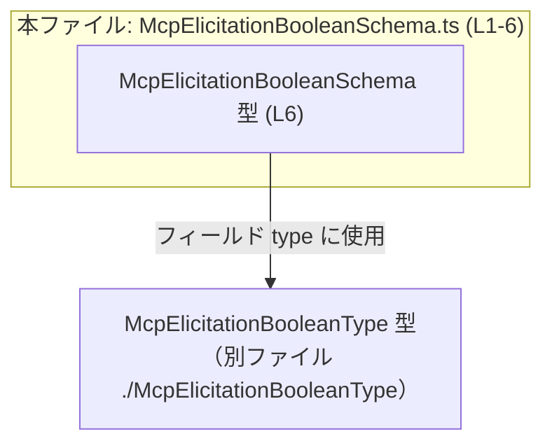
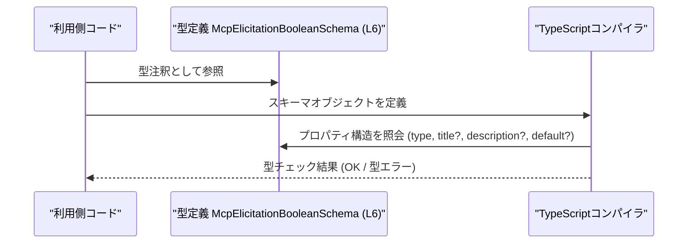

# app-server-protocol/schema/typescript/v2/McpElicitationBooleanSchema.ts

## 0. ざっくり一言

`McpElicitationBooleanSchema` という名前の **ブール値に関するスキーマ構造** を、TypeScript の型として自動生成しているファイルです（型定義のみで、実行ロジックは含まれません / `McpElicitationBooleanSchema.ts:L1-6`）。

---

## 1. このモジュールの役割

### 1.1 概要

- このモジュールは、`McpElicitationBooleanSchema` という型エイリアス（type alias）を通じて、**特定の「boolean エリシテーション（問い合わせ）」スキーマの形**を表現します（`McpElicitationBooleanSchema.ts:L6`）。
- この型は、少なくとも以下のプロパティ構造を持つオブジェクトを表します（`McpElicitationBooleanSchema.ts:L6`）:
  - 必須: `type: McpElicitationBooleanType`
  - 任意: `title?: string`
  - 任意: `description?: string`
  - 任意: `default?: boolean`

用途についてはコード上で明示されていませんが、型名やフィールド名から「ブール値入力用のスキーマ定義」を表す型として利用されると解釈できます。この用途は命名に基づく推測であり、ファイル単体からは断定できません。

### 1.2 アーキテクチャ内での位置づけ

このファイルは **自動生成された型定義** であり、他のコードから参照されることを前提とした、「下位レイヤの型モジュール」として位置づけられます。

依存関係は次の通りです。

- 依存対象:
  - `./McpElicitationBooleanType` から `McpElicitationBooleanType` 型を `import type` して利用しています（`McpElicitationBooleanSchema.ts:L4,6`）。
- 公開 API:
  - `export type McpElicitationBooleanSchema = ...` により、外部モジュールからこの型が利用可能です（`McpElicitationBooleanSchema.ts:L6`）。

この関係を簡易な依存関係図で表します。



- `McpElicitationBooleanType` の中身はこのチャンクには現れないため、どのような型かは不明です。

### 1.3 設計上のポイント

コードから読み取れる設計上の特徴は次の通りです。

- **自動生成ファイルであることが明記**  
  - 「GENERATED CODE」「Do not edit this file manually」などのコメントにより、人手での編集を禁じています（`McpElicitationBooleanSchema.ts:L1,3`）。
- **型定義のみでロジック無し**  
  - import と type alias 以外の記述が存在せず、実行時に動作する関数・クラスはありません（`McpElicitationBooleanSchema.ts:L4,6`）。
- **`import type` による型専用依存**  
  - `import type` を用いており、ビルド後の JavaScript にこの import が残らない構造になっています（`McpElicitationBooleanSchema.ts:L4`）。
- **必須プロパティと任意プロパティが明確**  
  - `type` は必須、`title`, `description`, `default` は `?` が付いて任意プロパティです（`McpElicitationBooleanSchema.ts:L6`）。
- **エラー・並行性に関するロジックは無し**  
  - 実行時コードが無いため、このファイル自身はエラーハンドリングや並行性制御には関与しません（`McpElicitationBooleanSchema.ts:L1-6`）。

---

## 2. 主要な機能一覧

このファイルが提供する主要な要素は 1 つです。

- `McpElicitationBooleanSchema` 型:  
  ブール値エリシテーションスキーマの構造（`type`, `title?`, `description?`, `default?`）を表現する型エイリアスです（`McpElicitationBooleanSchema.ts:L6`）。

---

## 3. 公開 API と詳細解説

### 3.1 型一覧（構造体・列挙体など）

| 名前                         | 種別           | 役割 / 用途                                                                                         | 定義位置 / 根拠                         |
|------------------------------|----------------|------------------------------------------------------------------------------------------------------|-----------------------------------------|
| `McpElicitationBooleanSchema` | 型エイリアス   | `type`, `title?`, `description?`, `default?` を持つオブジェクトの構造を表現する型。スキーマ定義に利用。 | `export type ... = { ... };`（`McpElicitationBooleanSchema.ts:L6`） |
| `McpElicitationBooleanType`  | 型（別ファイル） | `type` プロパティに使用される型。具体的な定義内容はこのチャンクには現れません。                         | `import type { McpElicitationBooleanType }`（`McpElicitationBooleanSchema.ts:L4`） |

**構造の詳細 (`McpElicitationBooleanSchema`)**（`McpElicitationBooleanSchema.ts:L6`）

```typescript
export type McpElicitationBooleanSchema = {
    type: McpElicitationBooleanType,   // 必須プロパティ: 型は McpElicitationBooleanType
    title?: string,                    // 任意プロパティ: string
    description?: string,              // 任意プロパティ: string
    default?: boolean,                 // 任意プロパティ: boolean
};
```

### 3.2 関数詳細（最大 7 件）

このファイルには **関数・メソッドの定義は一切存在しません**（`McpElicitationBooleanSchema.ts:L1-6`）。  
したがって、詳細テンプレートに沿って説明すべき関数はありません。

- エラーハンドリング・並行性・内部アルゴリズムに関するロジックもありません（`McpElicitationBooleanSchema.ts:L1-6`）。

### 3.3 その他の関数

- 補助関数やラッパー関数も存在しません（`McpElicitationBooleanSchema.ts:L1-6`）。

---

## 4. データフロー

このファイルは **型定義のみ** を提供し、実行時の処理フローは持ちません。  
データは次のような形で、この型定義に「適合するかどうか」がコンパイル時にチェックされる想定です。

- 開発者がオブジェクトリテラルや関数引数に `McpElicitationBooleanSchema` を型注釈として指定する。
- TypeScript コンパイラが、  
  - `type` プロパティが存在し、その型が `McpElicitationBooleanType` であるか、
  - `title`, `description`, `default` が存在する場合にそれぞれ `string`, `string`, `boolean` 型であるか  
  をチェックします（`McpElicitationBooleanSchema.ts:L4,6`）。

これを概念的なシーケンス図で表します。



- この図は **コンパイル時の型チェックの流れ** を示しており、実行時のデータ処理フローは、このファイルからは読み取れません（`McpElicitationBooleanSchema.ts:L1-6`）。

---

## 5. 使い方（How to Use）

### 5.1 基本的な使用方法

`McpElicitationBooleanSchema` 型を利用側コードから参照し、スキーマオブジェクトの形を型安全に表現する使い方が想定されます。

```typescript
// 型定義をインポートする                                     // McpElicitationBooleanSchema 型を利用する
import type {
    McpElicitationBooleanSchema,                           // このファイルで定義された型
} from "./McpElicitationBooleanSchema";                    // 実際のパスはプロジェクト構成に依存

// 何らかの方法で McpElicitationBooleanType 型の値を得る    // McpElicitationBooleanType の具体的な定義は別ファイル
import type { McpElicitationBooleanType } from "./McpElicitationBooleanType";

// 例: スキーマを受け取る関数のシグネチャで使用する
function registerBooleanSchema(                            // ブールスキーマを登録する関数
    schema: McpElicitationBooleanSchema,                   // この引数に型定義を適用
) {
    // 実装は利用側コードで定義される                        // このファイルには実装は存在しない
    console.log(schema);                                   // schema.type などが型安全に扱える
}

// （利用側）McpElicitationBooleanType 型の値を用意する
declare const booleanType: McpElicitationBooleanType;      // 実際にはどこかで定義・取得される値

// 型に従ったスキーマオブジェクトを作成する
const schema: McpElicitationBooleanSchema = {              // schema は McpElicitationBooleanSchema 型
    type: booleanType,                                     // 必須プロパティ: McpElicitationBooleanType 型
    title: "Enable feature X",                             // 任意のタイトル: string
    description: "Whether feature X should be enabled.",   // 任意の説明: string
    default: false,                                        // 任意のデフォルト値: boolean
};

// 作成したスキーマを関数に渡す
registerBooleanSchema(schema);                             // 型が一致しているためコンパイルは成功する
```

この例では、`McpElicitationBooleanSchema` を関数引数の型や変数の型として使用し、  
**誤ったプロパティ名や型のミス** をコンパイル時に検出できる形になっています（`McpElicitationBooleanSchema.ts:L6`）。

### 5.2 よくある使用パターン

このファイル単体から利用パターンは明示されていませんが、型構造から次のようなパターンが考えられます。

1. **スキーマ定義のコレクションの一部として使用**

```typescript
import type { McpElicitationBooleanSchema } from "./McpElicitationBooleanSchema";

type AnySchema = McpElicitationBooleanSchema /* | 他のスキーマ型 */;  // 将来的な拡張を想定したユニオン型

const schemas: AnySchema[] = [];                      // スキーマの配列を定義
```

1. **設定値やフォーム項目のメタデータとして使用**

```typescript
import type { McpElicitationBooleanSchema } from "./McpElicitationBooleanSchema";

const darkModeSchema: McpElicitationBooleanSchema = { // 設定「ダークモード」のスキーマ
    type: someBooleanType,                            // McpElicitationBooleanType 型の値（利用側で定義）
    title: "Dark Mode",
    description: "Enable dark theme for the UI",
    default: true,
};
```

上記の `someBooleanType` の具体的な値や意味は、このチャンクには現れないため不明です（`McpElicitationBooleanSchema.ts:L4`）。

### 5.3 よくある間違い

型定義から推測できる誤用例と、その修正版を示します（いずれもコンパイル時の型エラーに関するものです）。

```typescript
import type { McpElicitationBooleanSchema } from "./McpElicitationBooleanSchema";

// 間違い例: 必須プロパティ type を指定していない
const invalidSchema1: McpElicitationBooleanSchema = {
    // type: ... がないためエラー                          // コンパイルエラー: プロパティ 'type' が不足
    default: true,
};

// 正しい例: type を必ず指定する
declare const booleanType: McpElicitationBooleanType;
const validSchema1: McpElicitationBooleanSchema = {
    type: booleanType,                                  // 必須の type を指定しているため OK
    default: true,
};

// 間違い例: default の型が誤っている
const invalidSchema2: McpElicitationBooleanSchema = {
    type: booleanType,
    default: "true",                                   // エラー: string は boolean に代入できない
};

// 正しい例: default は boolean で指定する
const validSchema2: McpElicitationBooleanSchema = {
    type: booleanType,
    default: true,                                     // OK: boolean 型
};
```

これらの誤りは、`McpElicitationBooleanSchema` のプロパティ型定義（`McpElicitationBooleanSchema.ts:L6`）によって検出されます。

### 5.4 使用上の注意点（まとめ）

- **このファイルは自動生成のため、直接編集しないこと**（`McpElicitationBooleanSchema.ts:L1,3`）。
- `type` プロパティは必須であり、省略するとコンパイルエラーになります（`McpElicitationBooleanSchema.ts:L6`）。
- `title`, `description`, `default` は任意プロパティですが、指定する場合はそれぞれ `string`, `string`, `boolean` 型でなければなりません（`McpElicitationBooleanSchema.ts:L6`）。
- この型は **コンパイル時の型安全性のみを提供** し、実行時のバリデーションは含まれていません。このファイルからは、実行時に値が検証されるかどうかは分かりません（`McpElicitationBooleanSchema.ts:L1-6`）。

---

## 6. 変更の仕方（How to Modify）

### 6.1 新しい機能を追加する場合

ファイル先頭コメントにより、このファイルは **自動生成されており、手動での変更は推奨されない / 禁止** と明示されています（`McpElicitationBooleanSchema.ts:L1,3`）。

そのため、`McpElicitationBooleanSchema` に新しいプロパティを追加したい場合は、一般的には次の方針になります。

1. **生成元の定義を変更する**  
   - コメントによると、このファイルは `ts-rs` によって生成されています（`McpElicitationBooleanSchema.ts:L3`）。
   - `ts-rs` の典型的な利用形態から、この型の元定義は別の言語（多くの場合 Rust）側に存在すると考えられますが、生成元の具体的な場所はこのチャンクからは分かりません。
   - 追加したいプロパティは、その元定義側に追加し、`ts-rs` の生成処理を再実行する必要があります。

2. **このファイルを直接編集しない理由**  
   - 生成処理を再実行すると上書きされるため、手動編集は失われる可能性があります。
   - コメントで「DO NOT MODIFY BY HAND」と明示されているため、プロジェクト規約上も直接編集は避けるのが前提と考えられます（`McpElicitationBooleanSchema.ts:L1,3`）。

### 6.2 既存の機能を変更する場合

既存プロパティの意味や型を変えたい場合も、基本的には同様に **生成元を変更する** 必要があります。

変更時の注意点（このファイルから読み取れる範囲）:

- **互換性への影響**  
  - `type` プロパティの型や必須性を変更すると、この型を利用している全てのコードに影響が出ます。
- **契約（前提条件）の維持**  
  - `default` の型を `boolean` 以外に変更した場合、これを前提としている利用側コードがコンパイルエラーとなります（`McpElicitationBooleanSchema.ts:L6`）。
- **関連ファイルの確認**  
  - `McpElicitationBooleanType` の定義（`./McpElicitationBooleanType`）との整合性が必要です（`McpElicitationBooleanSchema.ts:L4,6`）。
  - このチャンクには `McpElicitationBooleanType` の内容が無いため、実際の影響範囲は当該ファイルを確認する必要があります。

---

## 7. 関連ファイル

このモジュールと密接に関係するファイルは、インポートから次の 1 つが読み取れます。

| パス                                | 役割 / 関係                                                                                      |
|-------------------------------------|--------------------------------------------------------------------------------------------------|
| `./McpElicitationBooleanType`       | `McpElicitationBooleanType` 型を提供するファイル。`McpElicitationBooleanSchema` の `type` プロパティに利用される（`McpElicitationBooleanSchema.ts:L4,6`）。 |

- それ以外の関連ファイル（スキーマを利用するサービス、テストコード、生成スクリプトなど）は、このチャンクには現れないため不明です。

---

## 付記: 言語固有の安全性・エラー・並行性

- **型安全性**  
  - `McpElicitationBooleanSchema` は、オブジェクトが `type`, `title?`, `description?`, `default?` というプロパティ構造を持つことを **静的型チェック** で保証します（`McpElicitationBooleanSchema.ts:L6`）。
- **エラー**  
  - このファイルには実行時コードが無く、エラーハンドリング処理も存在しません（`McpElicitationBooleanSchema.ts:L1-6`）。
  - 型不一致や必須プロパティの欠如は、TypeScript コンパイラによるコンパイル時エラーとして表面化します。
- **並行性**  
  - 並行処理（Promise, async/await, マルチスレッドなど）に関するコードは一切含まれていません（`McpElicitationBooleanSchema.ts:L1-6`）。
  - このファイル自体は並行性に関する制約や影響を持ちません。

このように、このファイルは **純粋な型定義モジュール** として、型安全性の向上に寄与しつつ、実行時の挙動は他のモジュールに委ねる構造になっています。
