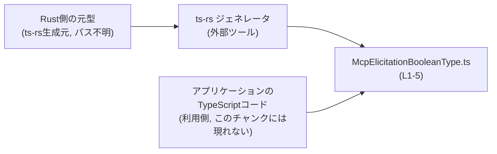
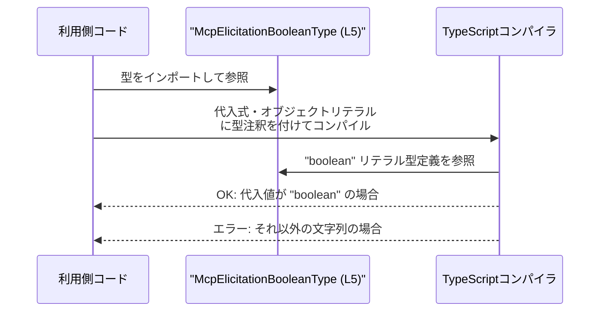

# app-server-protocol/schema/typescript/v2/McpElicitationBooleanType.ts

## 0. ざっくり一言

`"boolean"` という **特定の文字列のみを許容する型エイリアス** `McpElicitationBooleanType` を公開する、ts-rs により自動生成された TypeScript スキーマファイルです（McpElicitationBooleanType.ts:L1-5）。

---

## 1. このモジュールの役割

### 1.1 概要

- このファイルは、外部から利用される **文字列リテラル型** `McpElicitationBooleanType` を 1 つだけ定義・エクスポートします（McpElicitationBooleanType.ts:L5-5）。
- 型は `"boolean"` という 1 つの文字列リテラルだけを取るため、**プロトコルスキーマ上の種別名** を静的に表現する用途が想定されますが、意味まではコードからは確定できません。

### 1.2 アーキテクチャ内での位置づけ

このファイルは自分自身では他モジュールを import しておらず、**純粋に公開型だけを提供する下位レイヤのスキーマモジュール**として振る舞います（McpElicitationBooleanType.ts:L5-5）。  
コメントより、この型は Rust 側の型から **ts-rs** により自動生成されていることが分かります（McpElicitationBooleanType.ts:L1-3）。



※ Rust 側の型やアプリケーションコードの具体的なファイルパスは、このチャンクには現れないため不明です。

### 1.3 設計上のポイント

- **自動生成コード**  
  - ファイル先頭のコメントで「GENERATED CODE」「Do not edit this file manually」と明示されています（McpElicitationBooleanType.ts:L1-3）。
- **副作用のない型定義のみ**  
  - 実行時コード（関数・クラス・変数）は存在せず、型エイリアス 1 つのみです（McpElicitationBooleanType.ts:L5-5）。
- **文字列リテラル型の利用**  
  - `boolean` プリミティブではなく、`"boolean"` という **文字列リテラル型**で表現しています（McpElicitationBooleanType.ts:L5-5）。
- **エラー処理・並行性の要素はなし**  
  - 実行時処理を持たないため、例外・エラー・並行性に関するロジックはこのファイルには存在しません。

---

## 2. 主要な機能一覧（コンポーネントインベントリー）

このファイル内のコンポーネントを一覧にします。

| 名称                         | 種別           | 役割 / 機能概要                                                                 | 行番号                                      |
|------------------------------|----------------|-------------------------------------------------------------------------------|---------------------------------------------|
| `McpElicitationBooleanType` | 型エイリアス   | `"boolean"` という文字列リテラルのみを許容する型。スキーマ上の種別名を表すと解釈できる | McpElicitationBooleanType.ts:L5-5          |

**機能の要約**

- `McpElicitationBooleanType`: `"boolean"` という文字列だけを持つことが許可された文字列リテラル型を提供します（McpElicitationBooleanType.ts:L5-5）。

---

## 3. 公開 API と詳細解説

### 3.1 型一覧（構造体・列挙体など）

| 名前                         | 種別       | 役割 / 用途                                                                                  | 定義箇所                                   |
|------------------------------|------------|-----------------------------------------------------------------------------------------------|--------------------------------------------|
| `McpElicitationBooleanType` | 型エイリアス | `"boolean"` という特定の文字列リテラルだけを表す型。プロトコルスキーマの一部として利用される想定 | McpElicitationBooleanType.ts:L5-5         |

#### `type McpElicitationBooleanType = "boolean"`

**概要**

- この型エイリアスは、**値が `"boolean"` の文字列に限定される型**を定義します（McpElicitationBooleanType.ts:L5-5）。
- TypeScript の `boolean` 型（`true` / `false`）とは異なり、「`boolean` という文字列」を表します。

**内部処理の流れ**

- 型エイリアスであるため、実行時の処理は存在しません。
- TypeScript コンパイラがコンパイル時に、「この型を持つ値は `"boolean"` という文字列リテラルでなければならない」という制約をチェックします。

**使用例（正常系）**

```typescript
// McpElicitationBooleanType をインポートする
import type { McpElicitationBooleanType } from "./McpElicitationBooleanType";

// このプロパティは "boolean" という文字列だけを許容する
interface ExampleSchema {
    type: McpElicitationBooleanType;      // "boolean" リテラル型として扱われる
}

// OK: "boolean" は許可されたリテラル
const okValue: ExampleSchema = {
    type: "boolean",                      // コンパイル成功
};

// NG例（コメントアウトしてあるが、コンパイルエラーになるコード）
// const ngValue: ExampleSchema = {
//     type: "string",                    // 型 '"string"' を型 '"boolean"' に割り当てられない
// };
```

**Errors / Panics**

- この型自体は実行時コードを持たないため、**実行時エラーや例外、panic は発生しません**。
- コンパイル時には、`"boolean"` 以外の文字列値を代入しようとすると **型チェックエラー** になります。

**Edge cases（エッジケース）**

- `"boolean"` 以外の文字列リテラル  
  - 例: `"Boolean"`, `"bool"`, `"true"` などは、この型には代入できません。コンパイルエラーとなります。
- 型が `string` の変数の代入  
  - 一般的な `string` 型の変数をそのまま `McpElicitationBooleanType` に代入することはできません。  
    必要であれば、絞り込み（型ガード）や型アサーションが必要になります。
- 実行時の値  
  - TypeScript の型は **コンパイル時のみ有効**なため、ランタイムでは `"boolean"` 以外の文字列が入っていても、型システムからは検出できません。  
  - 実際のバリデーションは、別の実行時ロジックに依存します。このチャンクにはそのロジックは現れません。

**使用上の注意点**

- `boolean` 型との混同  
  - この型は `boolean`（真偽値）ではなく `"boolean"`（文字列）を表します。  
  - 真偽値を表したい場合は、`boolean` 型や `true | false` を使用する必要があります。
- ランタイム検証は別途必要  
  - 実行時に外部データを受け取る場合、この型だけでは値を検証できません。  
  - JSON スキーマバリデータや手書きの検証関数などで `"boolean"` であることを確認する必要があります。
- 自動生成コードであること  
  - コメントで「手動編集禁止」と明記されているため（McpElicitationBooleanType.ts:L1-3）、変更は元のスキーマ定義や ts-rs の設定を通じて行う必要があります。

### 3.2 関数詳細（最大 7 件）

- **本ファイルには関数定義が存在しません**（McpElicitationBooleanType.ts:L1-5）。
- そのため、詳細に解説すべき公開関数・コアロジックはありません。

### 3.3 その他の関数

- 補助関数やラッパー関数も一切定義されていません（McpElicitationBooleanType.ts:L1-5）。

---

## 4. データフロー

このファイルには実行時処理はありませんが、**型として利用される際のコンパイル時フロー**を概念的に示します。

### 4.1 型利用時のフロー概要

1. 利用側の TypeScript コードが `McpElicitationBooleanType` をインポートする（利用側コードはこのチャンクには現れません）。
2. 利用側の変数やプロパティに `McpElicitationBooleanType` を型として付与する。
3. TypeScript コンパイラが、代入されている値が `"boolean"` であるかをコンパイル時にチェックする。
4. 不一致があればコンパイルエラーとなり、実行バイナリ（JavaScript）は生成されません。



※ このシーケンス図は **コンパイル時の概念的な流れ**を表しており、実行時の制御フローではありません。

---

## 5. 使い方（How to Use）

### 5.1 基本的な使用方法

`McpElicitationBooleanType` をプロトコルスキーマの一部として利用する簡単な例です。

```typescript
// スキーマ型をインポートする
import type { McpElicitationBooleanType } from "./McpElicitationBooleanType";

// "type" プロパティが "boolean" という文字列だけを受け付けるスキーマ
interface McpBooleanFieldSchema {
    type: McpElicitationBooleanType;     // "boolean" リテラル型
    // 他のプロパティは任意に定義可能（このファイルからは不明）
}

// OK: "boolean" は許容される
const schemaOk: McpBooleanFieldSchema = {
    type: "boolean",
};

// NG例（コメントアウトしているが、コンパイルするとエラー）
// const schemaNg: McpBooleanFieldSchema = {
//     type: "bool",                      // 型 '"bool"' を型 '"boolean"' に割り当てられない
// };
```

このように、**特定の文字列だけを許可する discriminant（判別用プロパティ）**として使うことができます。

### 5.2 よくある使用パターン

#### 5.2.1 ユニオン型の一部として使う

複数の型バリアントのうち、「boolean 型を表すバリアント」を識別する discriminant として使うパターンが考えられます。

```typescript
import type { McpElicitationBooleanType } from "./McpElicitationBooleanType";

// boolean 用のバリアント
interface BooleanVariant {
    type: McpElicitationBooleanType;     // "boolean"
    // value?: boolean; など、他のプロパティは利用側で定義
}

// 他のバリアントは利用側コードで自由に定義可能
type AnyVariant = BooleanVariant /* | OtherVariant1 | OtherVariant2 ... */;

// 判別的ユニオンの例（利用側で実装される想定。ここでは構造だけ示す）
function handleVariant(variant: AnyVariant) {
    if (variant.type === "boolean") {    // コンパイル時に "boolean" と確定
        // boolean 用の処理
    }
}
```

※ 他バリアントの存在や構造はこのチャンクには現れないため、「利用側で定義される」として抽象的に記述しています。

### 5.3 よくある間違い

```typescript
import type { McpElicitationBooleanType } from "./McpElicitationBooleanType";

// 誤り例: boolean 型と勘違いしている
// const wrong: McpElicitationBooleanType = true;   // コンパイルエラー: 型 'true' を '"boolean"' に割り当てられない

// 正しい例: "boolean" という文字列を代入する
const correct: McpElicitationBooleanType = "boolean";

// 誤り例: 一般的な string 型をそのまま代入
function setType(type: string) {
    // const t: McpElicitationBooleanType = type; // コンパイルエラー
}

// 正しい例: 値をチェックしたうえで代入
function setBooleanType(type: string) {
    if (type === "boolean") {
        const t: McpElicitationBooleanType = type; // この分岐内では OK
        // t を使った処理...
    }
}
```

**間違いになりやすいポイント**

- `McpElicitationBooleanType` は **真偽値の `boolean` 型ではない** こと。
- 一般的な `string` 型からの代入には、値チェックや型ガードが必要になること。

### 5.4 使用上の注意点（まとめ）

- このファイルは **自動生成コード** であり、コメントにある通り手動編集すべきではありません（McpElicitationBooleanType.ts:L1-3）。
- 型は `"boolean"` という文字列のみを許容し、**他の文字列はコンパイル時に拒否**されます（McpElicitationBooleanType.ts:L5-5）。
- ランタイムにおける入力値の検証は、別のレイヤ（実行時バリデーション）に任されており、この型だけでは保証されません。
- 実行時コードを含まないため、スレッド安全性やパフォーマンス、セキュリティに関する懸念はほぼありません。

---

## 6. 変更の仕方（How to Modify）

### 6.1 新しい機能を追加する場合

このファイルは ts-rs によって自動生成されているため、**直接 TypeScript を書き換えるのではなく、元の定義を変更する必要があります**。

- ファイル先頭でその旨が明示されています（McpElicitationBooleanType.ts:L1-3）。
- 元の定義は Rust コード（もしくはそれに準じたスキーマ）であると考えられますが、このチャンクからはその位置や内容は分かりません。
- `"boolean"` 以外の値を許可したい場合（例: `"string"` や `"number"` などの種別を追加）は、元の Rust 型やスキーマ定義を変更し、ts-rs を再実行することで、新しい TypeScript 型が生成される設計と解釈できます。

### 6.2 既存の機能を変更する場合

`McpElicitationBooleanType` の定義を変更すると、**この型を利用しているすべての TypeScript コードに影響**します。

変更時に注意すべき点:

- **互換性**  
  - 例えば `"boolean"` 以外の値も許可するユニオン型（`"boolean" | "string"` など）に変更すると、既存コードはたいていコンパイルは通りますが、意味上の制約が緩くなります。
- **元定義との整合性**  
  - Rust 側の型やプロトコル仕様と食い違わないようにする必要があります。  
    ただし、その詳細はこのチャンクには現れないため、別途仕様を確認する必要があります。
- **テスト**  
  - このファイル自体にはテストは含まれていません（McpElicitationBooleanType.ts:L1-5）。  
  - 変更後は、型を利用している上位レイヤのテスト（API テスト、シリアライズ/デシリアライズのテストなど）を再実行する必要があります。

---

## 7. 関連ファイル

このチャンクから確実に分かる関連は「ts-rs による生成元が存在する」という点のみです。

| パス / 名称                       | 役割 / 関係                                                                                         |
|----------------------------------|------------------------------------------------------------------------------------------------------|
| Rust 側の元型定義（パス不明）    | コメントより、このファイルは ts-rs により生成されているため、その入力となる Rust 型定義が存在します（McpElicitationBooleanType.ts:L1-3）。ただし具体的な場所や内容はこのチャンクには現れません。 |
| ts-rs ツール本体                 | [ts-rs](https://github.com/Aleph-Alpha/ts-rs) へのリンクがコメントにあり、このツールが本ファイルを生成します（McpElicitationBooleanType.ts:L3-3）。 |

---

### Bugs / Security / パフォーマンスなどの観点のまとめ

- **バグの可能性**  
  - ファイル自体に実行ロジックがないため、ここ単体に起因するランタイムバグはありません。  
  - 一方で、`"boolean"` 文字列と `boolean` 真偽値の混同は、利用側でのバグ要因になりえます。
- **セキュリティ**  
  - 実行時にデータを処理しないため、このファイル単体でのセキュリティリスクはありません。
- **並行性**  
  - 型定義のみであり、共有状態やスレッドは関与しません。
- **パフォーマンス・スケーラビリティ**  
  - コンパイル時の型情報のみであり、ランタイムのパフォーマンスへの影響はありません。
- **観測性（ログなど）**  
  - ログ出力などの仕組みは一切含まれていません。観測は、これを利用する上位レイヤの責務になります。
