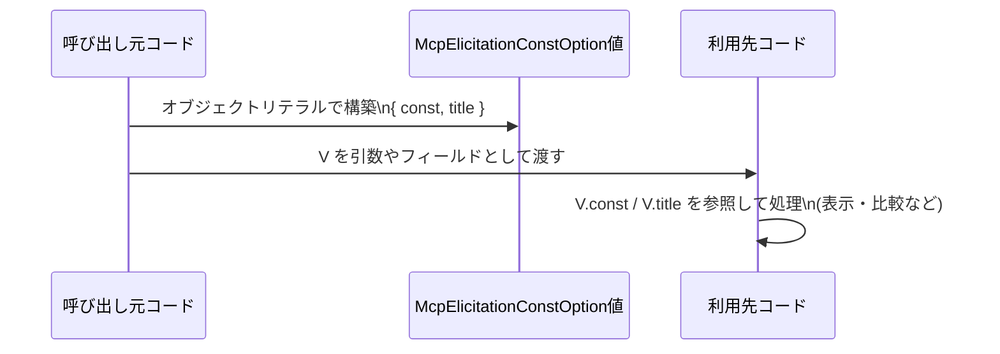

# app-server-protocol/schema/typescript/v2/McpElicitationConstOption.ts コード解説

## 0. ざっくり一言

`McpElicitationConstOption` は、`const` と `title` という 2 つの文字列プロパティを持つオブジェクトを表す **TypeScript の型エイリアス**です（`McpElicitationConstOption.ts:L5`）。  
ファイル全体は `ts-rs` によって自動生成されており、手動編集しない前提になっています（`McpElicitationConstOption.ts:L1-3`）。

---

## 1. このモジュールの役割

### 1.1 概要

- このモジュールは、TypeScript 側で利用するための **単一の型定義** `McpElicitationConstOption` を提供します（`McpElicitationConstOption.ts:L5`）。
- 型は `{ const: string, title: string }` というオブジェクト構造を持ちます（`McpElicitationConstOption.ts:L5`）。
- ファイル先頭のコメントから、Rust 向けライブラリ `ts-rs` によって自動生成されたコードであり、手動で編集すべきでないことが明示されています（`McpElicitationConstOption.ts:L1-3`）。

### 1.2 アーキテクチャ内での位置づけ

コメントにより、このファイルは `ts-rs` による自動生成物であることが分かります（`McpElicitationConstOption.ts:L1-3`）。`ts-rs` は Rust の型定義から TypeScript の型を生成するツールです。

コードから確実に分かる関係は以下です。

- `ts-rs`（コード生成ツール） → この TypeScript ファイル  
  （元となる Rust 側の型定義や、この型を実際に利用する他の TypeScript ファイルは、このチャンクには現れません）

これを簡単な依存関係図として表すと、次のようになります。


- Rust 側の型定義 (`R`) は、`ts-rs` 一般の仕様から **推定される存在** であり、本ファイルには現れません。
- `ts-rs` → `McpElicitationConstOption.ts` の関係は、ファイル先頭コメントから読み取れます（`McpElicitationConstOption.ts:L1-3`）。

### 1.3 設計上のポイント

コードから読み取れる設計上の特徴は次のとおりです。

- **自動生成コードであることが明示**  
  - `// GENERATED CODE! DO NOT MODIFY BY HAND!`（`McpElicitationConstOption.ts:L1`）  
  - `// This file was generated by [ts-rs] ...`（`McpElicitationConstOption.ts:L3`）  
  → 変更はこのファイルではなく、生成元（Rust 側の型定義）で行う設計です。
- **状態やロジックを持たない純粋な型定義**  
  - 実行時コード（関数・クラス）は一切なく、`export type ...` のみです（`McpElicitationConstOption.ts:L5`）。  
  → ランタイムの副作用やエラーハンドリング、並行性の問題は発生しません。
- **厳密なオブジェクト構造**  
  - `const: string` と `title: string` が **両方必須プロパティ** です（`McpElicitationConstOption.ts:L5`）。  
  - TypeScript の静的型チェックにより、他の型や不足プロパティがある場合はコンパイル時に検出されます。
- **プロパティ名 `const` の使用**  
  - `const` は言語キーワードですが、オブジェクトのプロパティ名としては有効です（`McpElicitationConstOption.ts:L5`）。  
  - このため、`option.const` や `option["const"]` といったアクセスが可能です。

---

## 2. 主要な機能一覧（コンポーネントインベントリー）

このファイルに含まれる公開コンポーネントは 1 つだけです。

| 名前                         | 種別                       | 役割 / 用途                                                                 | 定義箇所                              |
|------------------------------|----------------------------|------------------------------------------------------------------------------|----------------------------------------|
| `McpElicitationConstOption` | 型エイリアス（オブジェクト型） | `const` と `title` の 2 つの文字列プロパティを持つオブジェクト構造を表す。プロトコル上の「定数値＋表示名」のペアを型安全に扱うために用いられると考えられますが、具体的な用途はこのチャンクには現れません。 | `McpElicitationConstOption.ts:L5` |

- このファイルには **関数・クラス・enum など他のコンポーネントは存在しません**（`McpElicitationConstOption.ts` 全体）。

---

## 3. 公開 API と詳細解説

### 3.1 型一覧（構造体・列挙体など）

| 名前                         | 種別                       | フィールド | 役割 / 用途 | 定義箇所 |
|------------------------------|----------------------------|-----------|-------------|----------|
| `McpElicitationConstOption` | 型エイリアス（オブジェクト型） | `const: string`, `title: string` | 2 つの必須文字列プロパティを持つオブジェクト型。 | `McpElicitationConstOption.ts:L5` |

#### `McpElicitationConstOption` の構造

```typescript
// This file was generated by [ts-rs] ...
export type McpElicitationConstOption = { const: string, title: string, };
```

- `const: string`  
  - 任意の文字列。名前からは「固定値」「内部的な識別子」のような意味合いが推測されますが、コードからは用途は分かりません。
- `title: string`  
  - 任意の文字列。名前からは「表示名」「ラベル」のような用途が想定されますが、コードからは断定できません。

両プロパティとも **必須** であり、`undefined` や `null` は許容されません（TypeScript の型として）。

### 3.2 関数詳細（最大 7 件）

このファイルには **関数・メソッドは定義されていません**。  
したがって、呼び出し可能な API やエラーハンドリング・並行性に関するロジックは存在しません（`McpElicitationConstOption.ts` 全体）。

### 3.3 その他の関数

- 該当なし（このチャンクには関数が一切定義されていません）。

---

## 4. データフロー

このファイル自体には処理フローや関数呼び出しは存在せず、**データ構造のみ** が定義されています（`McpElicitationConstOption.ts:L5`）。  
ここでは、「`McpElicitationConstOption` 型の値がどのように生成され、利用されるか」という **想定される典型的な利用フローの例** を示します。これは本ファイル外のコードを含むため、あくまで一般的な利用シナリオであり、このリポジトリに実在するかどうかは本チャンクからは分かりません。



このシナリオから分かる要点（あくまで型の使い方としての一般論です）:

- `McpElicitationConstOption` は **値オブジェクト**として生成され、関数やコンポーネント間で受け渡しされることが想定されます。
- TypeScript 型により、`const` と `title` の両方が文字列で提供されていることが **コンパイル時に保証**されます。

---

## 5. 使い方（How to Use）

### 5.1 基本的な使用方法

`McpElicitationConstOption` をインポートし、型安全にオブジェクトを生成する基本例です。

```typescript
// McpElicitationConstOption 型をインポートする
import type { McpElicitationConstOption } from "./McpElicitationConstOption";

// 型注釈付きでオプションを 1 件定義する
const option: McpElicitationConstOption = {
    const: "internal_value",  // const プロパティ: 任意の文字列
    title: "表示用ラベル",    // title プロパティ: 任意の文字列
};

// プロパティにアクセスする（どちらも string として扱える）
console.log(option.const);   // "internal_value"
console.log(option.title);   // "表示用ラベル"
```

- `import type` を使うことで、ビルド後の JavaScript からはこの型情報が取り除かれ、実行時には影響しません。
- TypeScript の型チェックにより、`const` と `title` の両方が **string 型かつ必須** であることが保証されます。

### 5.2 よくある使用パターン

#### パターン 1: 複数オプションの配列として扱う

複数の選択肢を表現する場合の例です。

```typescript
// 複数の McpElicitationConstOption を配列で保持する
const options: McpElicitationConstOption[] = [
    { const: "low",    title: "低" },
    { const: "medium", title: "中" },
    { const: "high",   title: "高" },
];

// UI コンポーネントなどで利用する例（擬似コード）
for (const opt of options) {
    // opt.const と opt.title はどちらも string として安全に利用できる
    console.log(`value=${opt.const}, label=${opt.title}`);
}
```

- 配列の各要素が `McpElicitationConstOption` であることが保証されるため、`const` や `title` の取り忘れ・型間違いを防げます。

#### パターン 2: 文字列キーから `McpElicitationConstOption` を引くマップ

```typescript
// const をキーにしてオプションを引けるようにマップを構築する
const optionMap: Record<string, McpElicitationConstOption> = {
    low:    { const: "low",    title: "低" },
    medium: { const: "medium", title: "中" },
    high:   { const: "high",   title: "高" },
};

// キーからオプションを取り出して使う
const selected = optionMap["medium"];
console.log(selected.title);  // "中"
```

- `Record<string, McpElicitationConstOption>` と組み合わせることで、`McpElicitationConstOption` 型の値をマップとして整理できます。

### 5.3 よくある間違い

この型を利用する際に起こりがちな誤用例と、その修正例です。

```typescript
import type { McpElicitationConstOption } from "./McpElicitationConstOption";

// 間違い例 1: プロパティ名のタイプミス
const badOption1: McpElicitationConstOption = {
    // value: "foo",                // エラー: 'value' プロパティは型に存在しない
    // title: "ラベル",
    const: "foo",                   // 正: プロパティ名は const
    title: "ラベル",               // 正: プロパティ名は title
};

// 間違い例 2: プロパティの不足
const badOption2: McpElicitationConstOption = {
    const: "foo",
    // title: "ラベル",             // エラー: プロパティ 'title' が不足している
};

// 間違い例 3: 型の不一致
const badOption3: McpElicitationConstOption = {
    const: 123 as any,              // エラー: number は string に代入できない
    title: "ラベル",
};
```

- TypeScript の型チェックによって、これらの誤用は **コンパイル時にエラー** になります。
- 実行時エラーではなくコンパイル時に検出される点が、TypeScript による **型安全性** のメリットです。

### 5.4 使用上の注意点（まとめ）

- **自動生成ファイルは直接編集しない**  
  - 冒頭コメントにある通り、手動での変更は想定されていません（`McpElicitationConstOption.ts:L1-3`）。  
  - 仕様変更（プロパティ追加・型変更など）が必要な場合は、**生成元の Rust 側定義や `ts-rs` の設定を変更**して再生成する必要があります。
- **プロパティは両方必須**  
  - `const` と `title` はいずれも `string` 型かつ必須です（`McpElicitationConstOption.ts:L5`）。  
  - `Partial<McpElicitationConstOption>` などでオプショナルにしたい場合は、利用側の型でラップします。
- **プロパティ名 `const` の扱い**  
  - `const` はキーワードですが、**プロパティ名としては有効**であり、`option.const` としてアクセスできます。  
  - 変数名に `const` を使うことはできないため、`const const = ...` などは文法エラーになりますが、本型の利用とは別の問題です。
- **セキュリティ・並行性**  
  - このファイルは型定義のみであり、実行時処理や I/O を伴わないため、直接的なセキュリティホールや並行性の問題はありません。  
  - 実際のバリデーションやアクセス制御は、この型を利用する周辺コード側で実装する必要があります。

---

## 6. 変更の仕方（How to Modify）

### 6.1 新しい機能を追加する場合

このファイルは `ts-rs` による自動生成コードであるため（`McpElicitationConstOption.ts:L1-3`）、**直接編集するべきではありません**。

`McpElicitationConstOption` に新しいプロパティを追加したい場合の一般的な手順は次のとおりです（本チャンクから具体的な生成元ファイルは分からないため、抽象的な説明に留まります）。

1. **Rust 側の対応する型定義を特定する**  
   - `ts-rs` の仕様から、Rust の構造体または型定義が存在すると推定されますが、実際のパスはこのチャンクには現れません。
2. **Rust 側の型にフィールドを追加・変更する**  
   - 例: `struct McpElicitationConstOption { const: String, title: String, /* 新フィールド */ }` のような形（推定）。
3. **`ts-rs` によるコード生成を再実行する**  
   - ビルドスクリプトや生成用コマンドを走らせ、TypeScript の型定義を再生成します。
4. **生成された TypeScript 型の変更を確認する**  
   - このファイルに新しいプロパティが反映されていることを確認します。

### 6.2 既存の機能を変更する場合

`const` や `title` の型・名前・意味を変えたい場合も、同様に **生成元の Rust 側定義を変更して再生成**する必要があります。

変更時の注意点:

- **型契約の確認**  
  - この型を利用している TypeScript コード全体に影響が及ぶため、`McpElicitationConstOption` を参照している箇所を検索し、期待するプロパティが変わらないか確認する必要があります。
- **後方互換性**  
  - 既存クライアントが `const` / `title` を前提にしている場合、プロパティ名の変更・削除は破壊的変更になります。  
  - 新フィールド追加は比較的安全ですが、必須にするかオプショナルにするかはクライアント側の対応状況を考慮する必要があります。
- **テスト**  
  - このチャンクにはテストコードは現れませんが、実際のプロジェクトでは、この型を利用するロジックのテスト（例: シリアライズ／デシリアライズ、UI 表示など）を更新・確認する必要があります。

---

## 7. 関連ファイル

このチャンクから直接分かる関連要素は限定的です。ファイル先頭のコメントから推定できる範囲のみを記載します。

| パス / 名称                                   | 役割 / 関係 |
|----------------------------------------------|------------|
| `Rust側の対応する型定義 (具体的なパスは不明)` | `ts-rs` によって本ファイルへ変換される元の型定義であると推定されます（コメントより）。この定義を変更することで、`McpElicitationConstOption` の構造が変わります。 |
| `ts-rs` ライブラリ                            | Rust の型から TypeScript の型定義を生成するツール。本ファイルは `ts-rs` によって生成されたと明示されています（`McpElicitationConstOption.ts:L1-3`）。 |

- 同じディレクトリ（`app-server-protocol/schema/typescript/v2/`）に他の型定義ファイルが存在する可能性はありますが、このチャンクには現れません。

---

### まとめ

- `McpElicitationConstOption` は、`const: string` と `title: string` を持つ **単純なオブジェクト型**であり、TypeScript での型安全なデータ受け渡しに利用されます（`McpElicitationConstOption.ts:L5`）。
- ファイルは `ts-rs` による **自動生成コード**であり、直接編集は行わず、元となる Rust 側の定義を更新して再生成する設計になっています（`McpElicitationConstOption.ts:L1-3`）。
- 実行時ロジックは存在しないため、エラー処理・並行性・パフォーマンス上の懸念はなく、TypeScript の型チェックによる静的な安全性が主な役割となります。
