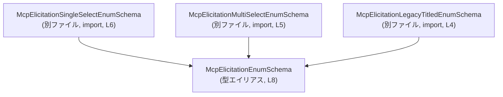
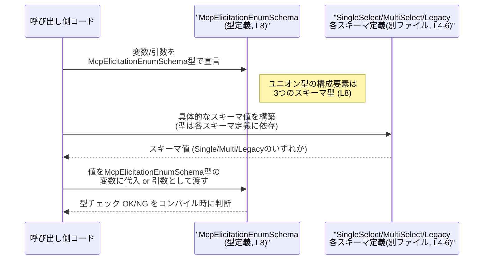

# app-server-protocol/schema/typescript/v2/McpElicitationEnumSchema.ts コード解説

## 0. ざっくり一言

`McpElicitationEnumSchema` という「列挙的な入力スキーマ」を表す TypeScript の**ユニオン型**エイリアスを定義するファイルです（McpElicitationEnumSchema.ts:L4-8）。  
単一選択・複数選択・レガシー形式の 3 種類の列挙スキーマを 1 つの型にまとめています（McpElicitationEnumSchema.ts:L4-6, L8）。

---

## 1. このモジュールの役割

### 1.1 概要

- このモジュールは、MCP（と推測される）における「列挙的なエリシテーション（質問項目）」のスキーマ型を 1 つにまとめるために存在します（McpElicitationEnumSchema.ts:L4-8）。
- 単一選択・複数選択・レガシーなタイトル付き列挙スキーマのいずれかを受け取れる共通の型 `McpElicitationEnumSchema` を提供します（McpElicitationEnumSchema.ts:L8）。
- Rust 側から `ts-rs` によって自動生成されたファイルであり、手動編集しないことが明示されています（McpElicitationEnumSchema.ts:L1-3）。

### 1.2 アーキテクチャ内での位置づけ

このファイルは、3 つのより具体的なスキーマ型を**統合する型レベルのファサード**として機能します（McpElicitationEnumSchema.ts:L4-8）。

依存関係を簡略化した Mermaid 図です（本チャンクのみ、L4-8）:



- 当モジュールは他の 3 つのスキーマ型に依存しますが、逆方向の依存（他の型がこのファイルを import しているか）はこのチャンクからは不明です（このチャンクには現れない）。

### 1.3 設計上のポイント

- **自動生成コード**  
  - ファイル先頭に「GENERATED CODE! DO NOT MODIFY BY HAND!」とコメントがあり、自動生成であることが明示されています（McpElicitationEnumSchema.ts:L1-3）。
- **型のみインポート (`import type`)**  
  - 3 つの依存スキーマは `import type` として読み込まれており、JavaScript の出力に影響しない**型専用依存**になっています（McpElicitationEnumSchema.ts:L4-6）。
- **ユニオン型による共通インターフェース**  
  - `McpElicitationEnumSchema` は 3 つの具体型のユニオン型として定義され、呼び出し側は「列挙スキーマ」であることだけを意識して扱えます（McpElicitationEnumSchema.ts:L8）。
- **実行時ロジックなし**  
  - このファイルには関数・クラス・実行時コードが存在せず、純粋に型定義のみを提供します（McpElicitationEnumSchema.ts:L1-8）。

---

## 2. 主要な機能一覧

このファイルは「機能」というより「型定義」を 1 つだけ提供します。

- `McpElicitationEnumSchema`:  
  単一選択・複数選択・レガシー列挙スキーマのいずれかを表すユニオン型です（McpElicitationEnumSchema.ts:L8）。

他に公開関数やクラスは存在しません（McpElicitationEnumSchema.ts:L1-8）。

---

## 3. 公開 API と詳細解説

### 3.1 型一覧（構造体・列挙体など）

このファイル内で**公開されている型**と、依存している型のインベントリーです。

| 名前 | 種別 | 公開か | 役割 / 用途 | 根拠 |
|------|------|--------|-------------|------|
| `McpElicitationEnumSchema` | 型エイリアス（ユニオン型） | `export` あり | 列挙形式のエリシテーションスキーマを、単一選択・複数選択・レガシー形式のいずれかとして表す共通型 | McpElicitationEnumSchema.ts:L8 |
| `McpElicitationSingleSelectEnumSchema` | 型（詳細不明） | このファイルからは非公開（単なる import） | 単一選択の列挙スキーマを表す型と推測されるが、構造はこのチャンクには現れない | McpElicitationEnumSchema.ts:L6 |
| `McpElicitationMultiSelectEnumSchema` | 型（詳細不明） | このファイルからは非公開（単なる import） | 複数選択の列挙スキーマを表す型と推測されるが、構造はこのチャンクには現れない | McpElicitationEnumSchema.ts:L5 |
| `McpElicitationLegacyTitledEnumSchema` | 型（詳細不明） | このファイルからは非公開（単なる import） | レガシーな「タイトル付き」列挙スキーマを表す型と推測されるが、構造はこのチャンクには現れない | McpElicitationEnumSchema.ts:L4 |

> 補足: 3 つの import 型については、名前から用途は推測できますが、フィールド構造や詳細な仕様は**このチャンクには現れない**ため不明です。

### 3.2 関数詳細（最大 7 件）

このファイルには関数・メソッドが定義されていないため、詳細解説対象の関数はありません（McpElicitationEnumSchema.ts:L1-8）。

### 3.3 その他の関数

- 該当なし（このファイルには関数が存在しません）（McpElicitationEnumSchema.ts:L1-8）。

---

## 4. データフロー

このファイル自体には実行時ロジックがないため、「データフロー」は**型レベルでの流れ**として説明します。

典型的な利用シナリオ:

1. 呼び出しコード側で `McpElicitationEnumSchema` 型の変数や引数を宣言する（別ファイル）。
2. 実際には `McpElicitationSingleSelectEnumSchema` / `McpElicitationMultiSelectEnumSchema` / `McpElicitationLegacyTitledEnumSchema` のいずれかの値を渡す。
3. TypeScript の型システムが、値が上記 3 つのどれかであることを検証する（McpElicitationEnumSchema.ts:L4-8）。
4. 呼び出し側はユニオン型に対して型ガードなどを用いて分岐し、それぞれに応じた処理を行う（実装はこのチャンクには現れない）。

これをシーケンス図として表すと、次のようになります（ユニオン型の定義は L8 から得られます）。



### 言語固有の安全性・エラー・並行性

- **型安全性**  
  - `McpElicitationEnumSchema` は 3 つの型のユニオンとして定義されているため、これ以外の型の値を代入しようとするとコンパイル時エラーになります（McpElicitationEnumSchema.ts:L8）。
  - `import type` により、型情報のみが利用され、JavaScript のランタイムには影響しません（McpElicitationEnumSchema.ts:L4-6）。
- **エラー**  
  - 実行時コードが存在しないため、このファイル単体からは実行時エラーや例外は発生しません（McpElicitationEnumSchema.ts:L1-8）。
  - コンパイル時に「ユニオン型に代入不可」といった型エラーが検出される可能性はありますが、その具体的なメッセージは TypeScript コンパイラに依存し、このチャンクには現れません。
- **並行性**  
  - TypeScript の型定義のみで、実行時のスレッドや非同期処理に関するコードはないため、並行性に関する問題はこのファイルからは生じません（McpElicitationEnumSchema.ts:L1-8）。

---

## 5. 使い方（How to Use）

### 5.1 基本的な使用方法

`McpElicitationEnumSchema` を利用する側の典型的なコード例です。  
ここでは、3 つの具体スキーマ型の構造はこのチャンクからは不明のため、概念的な例として記述します。

```typescript
// enum スキーマ型をインポートする
import type { McpElicitationEnumSchema } from "./McpElicitationEnumSchema"; // このファイルを想定

// 何らかの場所で列挙スキーマを受け取る関数を定義する
function renderEnumQuestion(schema: McpElicitationEnumSchema) { // enum スキーマの共通入口
    // ここでは schema が Single/Multi/Legacy のいずれかであることが保証される
    // (ユニオン型により型安全が確保される)
}
```

このコードにより、`renderEnumQuestion` は列挙的なエリシテーションスキーマの**共通ハンドラ**として利用できます。  
実際に `schema` がどの具体型かに応じた処理分岐は、型ガードや判別共用体（discriminated union）があるならそれを用いて実装します（ただし、その判別キーが何かはこのチャンクには現れないため不明です）。

### 5.2 よくある使用パターン

1. **API レイヤの引数・戻り値として使う**

```typescript
// 問い合わせ ID に対応する列挙スキーマを取得する関数
async function fetchEnumSchema(questionId: string): Promise<McpElicitationEnumSchema> {
    // 実装は API 呼び出しなどになる想定だが、このチャンクには現れない
    // 戻り値は Single/Multi/Legacy のいずれか
    throw new Error("not implemented");
}

// 呼び出し側
async function main() {
    const schema = await fetchEnumSchema("q-1234"); // McpElicitationEnumSchema 型
    // schema をもとに UI を描画するなど
}
```

1. **フォーム定義やバリデーションロジックの共通型として使う**

```typescript
type QuestionDefinition = {
    id: string;
    title: string;
    enumSchema?: McpElicitationEnumSchema; // 列挙的な質問のみスキーマが存在
};

// enumSchema があるかどうかで列挙質問かどうかを判定できる
```

### 5.3 よくある間違い

この型の利用で起こりやすいと考えられる誤用例と、その修正例です。  
（具体的なプロパティ名などはこのチャンクには現れないため、概念レベルで説明します）

```typescript
// 間違い例: 列挙スキーマではない型を代入しようとしている
const badSchema: McpElicitationEnumSchema = {
    // 本来 Single/Multi/Legacy いずれかの構造である必要があるが、
    // 全く異なる構造を持つオブジェクト
    type: "free_text",
    // ...
};

// -> コンパイル時に型エラーになる (期待される構造と一致しないため)


// 正しい例: どれか一つのスキーマ型に従って値を構築する
const singleSelectSchema: McpElicitationEnumSchema = createSingleSelectSchema(); 
// createSingleSelectSchema() が McpElicitationSingleSelectEnumSchema を返す想定
```

### 5.4 使用上の注意点（まとめ）

- `McpElicitationEnumSchema` はあくまで**型レベルのユニオン**であり、実行時には存在しないことに注意します（McpElicitationEnumSchema.ts:L8）。
- 3 つの構成型（Single/Multi/Legacy）の構造を把握していないと、正しく値を構築できませんが、その詳細はこのチャンクには現れません。
- 自動生成ファイルであるため、**直接編集は避ける必要がある**ことがコメントで示されています（McpElicitationEnumSchema.ts:L1-3）。
  - 変更が必要な場合は、元の Rust 定義や `ts-rs` の生成設定を変更するのが前提になります。

---

## 6. 変更の仕方（How to Modify）

### 6.1 新しい機能を追加する場合

このファイルは自動生成されるため、手動で機能を追加することは推奨されません（McpElicitationEnumSchema.ts:L1-3）。

一般的な変更手順（このファイル自体を直接編集しない前提）:

1. **Rust 側またはスキーマ定義を変更**  
   - `ts-rs` によりこのファイルが生成されているため、元の Rust 型定義を変更し、新たな列挙スキーマ型を追加する必要があります（生成元はコメントからのみ推測され、詳細はこのチャンクには現れない）（McpElicitationEnumSchema.ts:L3）。
2. **`ts-rs` で再生成**  
   - コード生成コマンドを実行し、`McpElicitationEnumSchema.ts` を再生成します。
3. **新しい型をユニオンに含めるかは生成ロジック側が決定**  
   - 手動で `McpElicitationEnumSchema` に型を追加するのではなく、生成ロジック側がユニオンを更新するように設定する必要があります。

### 6.2 既存の機能を変更する場合

- `McpElicitationEnumSchema` のユニオン構成を変更したい場合も、同様に**生成元の定義を変更**する必要があります（McpElicitationEnumSchema.ts:L1-3, L8）。
- 変更時の契約・注意点:
  - ユニオンから型を削除すると、その型を前提としていた呼び出し側コードがコンパイルエラーになる可能性があります（このチャンクからは具体的な使用箇所は不明）。
  - 新しい型を追加すると、呼び出し側の `switch`/`if` ベースの分岐が「網羅していないケース」を持つことになり、その場合 TypeScript の `never` チェックなどで検出される可能性があります（実際に `never` チェックをしているかどうかはこのチャンクには現れない）。

---

## 7. 関連ファイル

このファイルが直接依存しているファイルです（McpElicitationEnumSchema.ts:L4-6）。

| パス（相対） | 役割 / 関係 | 根拠 |
|--------------|------------|------|
| `./McpElicitationLegacyTitledEnumSchema` | レガシーな「タイトル付き列挙スキーマ」の型を提供するモジュールと推測される。`McpElicitationEnumSchema` のユニオン構成要素の 1 つとして利用される | McpElicitationEnumSchema.ts:L4 |
| `./McpElicitationMultiSelectEnumSchema` | 複数選択の列挙スキーマの型を提供するモジュールと推測される。`McpElicitationEnumSchema` のユニオン構成要素の 1 つとして利用される | McpElicitationEnumSchema.ts:L5 |
| `./McpElicitationSingleSelectEnumSchema` | 単一選択の列挙スキーマの型を提供するモジュールと推測される。`McpElicitationEnumSchema` のユニオン構成要素の 1 つとして利用される | McpElicitationEnumSchema.ts:L6 |

> これら 3 ファイルの具体的な型定義やロジックは、このチャンクには現れないため不明です。

---

### Bugs / Security / Contracts / Edge Cases / Tests / Performance についての補足

- **Bugs / Security**  
  - このファイルは型定義のみであり、実行時ロジックや外部入力の処理を行っていないため、このファイル単体から直接的なバグやセキュリティ脆弱性を読み取ることはできません（McpElicitationEnumSchema.ts:L1-8）。
- **Contracts / Edge Cases**  
  - 契約としては「`McpElicitationEnumSchema` に代入される値は 3 つのスキーマ型のいずれかに適合している必要がある」という点に尽きます（McpElicitationEnumSchema.ts:L8）。
  - ユニオンの構成型のエッジケース（空配列、無効な値など）は、このチャンクには現れないため不明です。
- **Tests**  
  - テストコードはこのファイルには含まれていません（McpElicitationEnumSchema.ts:L1-8）。生成コードであることから、テストは元の Rust 型や生成プロセス側で行われている可能性がありますが、このチャンクからは確認できません。
- **Performance / Scalability / Observability**  
  - 型定義のみであり、ランタイムのパフォーマンスやスケーラビリティ、ログ出力やメトリクスなどの観点はこのファイルからは影響しません（McpElicitationEnumSchema.ts:L1-8）。
