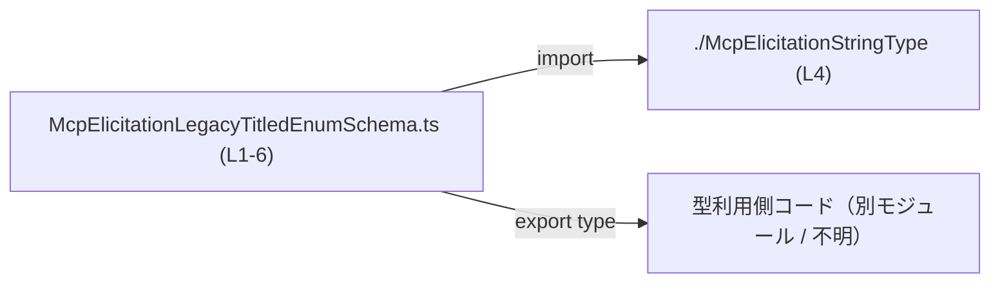
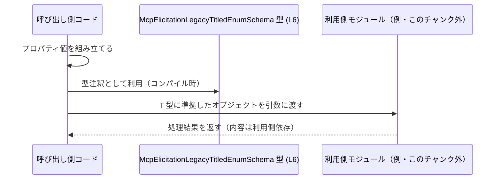

# app-server-protocol\schema\typescript\v2\McpElicitationLegacyTitledEnumSchema.ts

## 0. ざっくり一言

- `McpElicitationLegacyTitledEnumSchema` という 1 つのオブジェクト型を公開する、自動生成された TypeScript のスキーマ用型定義ファイルです（`McpElicitationLegacyTitledEnumSchema.ts:L1-3, L6`）。
- 列挙値（`enum`）と、任意のタイトルや説明などのメタ情報をまとめて表現できる型構造になっています（`McpElicitationLegacyTitledEnumSchema.ts:L6`）。

---

## 1. このモジュールの役割

### 1.1 概要

- このモジュールは、`McpElicitationLegacyTitledEnumSchema` という **オブジェクト型の型エイリアス**を 1 つ定義して公開します（`McpElicitationLegacyTitledEnumSchema.ts:L6`）。
- この型は、`type`・`enum` を必須プロパティとして持ち、`title`・`description`・`enumNames`・`default` を任意プロパティとして持つ構造を表します（`McpElicitationLegacyTitledEnumSchema.ts:L6`）。
- `type` プロパティには、別ファイルで定義された `McpElicitationStringType` 型が使われており、型レベルで値の種別を制約しています（`McpElicitationLegacyTitledEnumSchema.ts:L4, L6`）。

> 備考: 型名に `Schema` と含まれているため、何らかのスキーマ定義用途で使われている可能性はありますが、このファイル単体から用途を断定することはできません。

### 1.2 アーキテクチャ内での位置づけ

このファイルから読み取れる依存関係は、**1 つの import と 1 つの export** だけです。

- `McpElicitationLegacyTitledEnumSchema` は、`./McpElicitationStringType` から `McpElicitationStringType` を型として import しています（`McpElicitationLegacyTitledEnumSchema.ts:L4`）。
- その `McpElicitationStringType` を `type` プロパティの型として利用しています（`McpElicitationLegacyTitledEnumSchema.ts:L6`）。
- 他に、この型がどこから利用されているかは、このチャンクには現れません（不明）。

依存関係を簡略化した図です。



- ノード `C` は、この型を利用する側のコードを表す概念的なノードであり、このチャンクには具体的な定義は現れません。

### 1.3 設計上のポイント

コードから読み取れる設計上の特徴は次のとおりです。

- **自動生成ファイルであることが明示**  
  - 先頭コメントで「GENERATED CODE」「Do not edit this file manually」と書かれており、`ts-rs` による生成物であることが示されています（`McpElicitationLegacyTitledEnumSchema.ts:L1-3`）。
  - 手動での編集は想定されていません（コメントに基づく事実）。
- **実行ロジックを持たない純粋な型定義**  
  - 関数やクラス、定数は定義されておらず、唯一の export は型エイリアスです（`McpElicitationLegacyTitledEnumSchema.ts:L6`）。
  - そのため、ランタイムの動作・エラー・並行性などはこのファイル自身では発生せず、「コンパイル時の型安全性」のみを提供します。
- **必須・任意プロパティを明確に区別**  
  - `title?`・`description?`・`enumNames?`・`default?` に `?` が付いており「任意プロパティ」であることが示されています（`McpElicitationLegacyTitledEnumSchema.ts:L6`）。
  - `type` と `enum` は `?` が付いておらず、必須プロパティです（`McpElicitationLegacyTitledEnumSchema.ts:L6`）。
- **列挙値を文字列配列として表現**  
  - `enum` および `enumNames` は `Array<string>` 型であり、文字列の配列として列挙値や関連情報を表現する設計になっています（`McpElicitationLegacyTitledEnumSchema.ts:L6`）。

---

## 2. 主要な機能一覧

このファイルは型定義のみですが、その役割を「機能」として整理すると次のようになります。

- `McpElicitationLegacyTitledEnumSchema` 型定義:  
  必須の `type`・`enum` と、任意の `title`・`description`・`enumNames`・`default` を持つオブジェクトの構造を型として表現します（`McpElicitationLegacyTitledEnumSchema.ts:L6`）。
- `McpElicitationStringType` の利用:  
  `type` プロパティの型として `McpElicitationStringType` を利用し、`type` の取りうる値を別型に委譲しています（`McpElicitationLegacyTitledEnumSchema.ts:L4, L6`）。

---

## 3. 公開 API と詳細解説

### 3.1 型一覧（構造体・列挙体など）

このファイルが **直接公開** している主要な型は 1 つです。

| 名前 | 種別 | 役割 / 用途 | 定義位置 |
|------|------|-------------|----------|
| `McpElicitationLegacyTitledEnumSchema` | 型エイリアス（オブジェクト型） | プロパティ `type`, `title`, `description`, `enum`, `enumNames`, `default` を持つオブジェクトの構造を表現する型です。 | `McpElicitationLegacyTitledEnumSchema.ts:L6-6` |

このファイルで **外部から import して利用している型** は次のとおりです（公開はしていません）。

| 名前 | 種別 | 役割 / 用途 | 定義位置 |
|------|------|-------------|----------|
| `McpElicitationStringType` | import された型 | `McpElicitationLegacyTitledEnumSchema` の `type` プロパティの型として利用されます。実体は別ファイル `./McpElicitationStringType` に定義されています。 | `McpElicitationLegacyTitledEnumSchema.ts:L4-4` |

#### 3.1.1 `McpElicitationLegacyTitledEnumSchema` のプロパティ一覧

`McpElicitationLegacyTitledEnumSchema` は、次の 6 つのプロパティを持つオブジェクト型です（`McpElicitationLegacyTitledEnumSchema.ts:L6`）。

| プロパティ名 | 型 | 必須/任意 | 説明（構造上の事実） | 定義位置 |
|--------------|----|-----------|----------------------|----------|
| `type` | `McpElicitationStringType` | 必須 | 他ファイルで定義された `McpElicitationStringType` 型の値を保持するプロパティです。 | `McpElicitationLegacyTitledEnumSchema.ts:L4, L6` |
| `title` | `string` | 任意 | 文字列型の任意プロパティです。指定がない場合は存在しなくても構いません。 | `McpElicitationLegacyTitledEnumSchema.ts:L6-6` |
| `description` | `string` | 任意 | 文字列型の任意プロパティです。 | `McpElicitationLegacyTitledEnumSchema.ts:L6-6` |
| `enum` | `Array<string>` | 必須 | 文字列の配列型の必須プロパティです。空配列も型レベルでは許可されます。 | `McpElicitationLegacyTitledEnumSchema.ts:L6-6` |
| `enumNames` | `Array<string>` | 任意 | 文字列の配列型の任意プロパティです。 | `McpElicitationLegacyTitledEnumSchema.ts:L6-6` |
| `default` | `string` | 任意 | 文字列型の任意プロパティです。 | `McpElicitationLegacyTitledEnumSchema.ts:L6-6` |

> ここに記載しているのは、あくまで「型と必須/任意の区別」といった構造上の事実のみです。  
> それぞれがアプリケーション上で何を意味するか（例: `enum` が具体的に何の選択肢を表すか）は、このファイルからは分かりません。

#### 型安全性・エラー・並行性に関するポイント

- **型安全性**:  
  - TypeScript の型チェックにより、`type` に `McpElicitationStringType` 以外の型を代入したり、`enum` に `string[]` 以外の値を代入するとコンパイルエラーになります（`McpElicitationLegacyTitledEnumSchema.ts:L4, L6`）。
  - `title` などの任意プロパティを省略することは許容され、アクセス時には `undefined` である可能性を考慮する必要があります。
- **エラー**:  
  - このファイルには実行時処理がないため、直接的なランタイムエラーや例外処理は定義されていません（`McpElicitationLegacyTitledEnumSchema.ts:L1-6`）。
  - ただし、型を付けずに外部から受け取ったデータ（例: JSON）を利用する場合、この型に「適合しているか」をチェックしないと、後続処理でエラーが発生する可能性があります。これはこのファイルの外の責務になります。
- **並行性**:  
  - 単なる型定義であり、状態や I/O を持たないため、並行・非同期実行時に特有の問題（レースコンディションなど）はこのファイルには存在しません。

### 3.2 関数詳細（最大 7 件）

このファイルには関数・メソッドは定義されていません（`McpElicitationLegacyTitledEnumSchema.ts:L1-6`）。  
したがって、詳細解説すべき関数はありません。

### 3.3 その他の関数

- 該当なし（関数定義が 0 件のため）（`McpElicitationLegacyTitledEnumSchema.ts:L1-6`）。

---

## 4. データフロー

このファイル自体には処理フローは書かれていませんが、**代表的な利用シナリオの例**として、次のようなデータフローが想定されます。

1. 呼び出し側コードが `McpElicitationLegacyTitledEnumSchema` 型のオブジェクトを構築する。
2. 構築したオブジェクトを、別モジュールの処理（例: バリデーションやシリアライズ）に渡す。
3. 利用側モジュールは、この型に従ってプロパティを読み取り処理する。

この流れをシーケンス図で表すと次のようになります。



- `U`（利用側モジュール）は、このチャンクには登場しない仮想的なコンポーネントです。
- このファイルは上記フローのうち「T 型としての形を定める」部分（コンパイル時のみ）を担当します（`McpElicitationLegacyTitledEnumSchema.ts:L6`）。

---

## 5. 使い方（How to Use）

### 5.1 基本的な使用方法

`McpElicitationLegacyTitledEnumSchema` 型でオブジェクトを定義し、型安全に利用する基本例です。

```typescript
// 型定義をインポートする                                    // このファイルから型だけをインポート
import type { McpElicitationLegacyTitledEnumSchema } from "./McpElicitationLegacyTitledEnumSchema"; // ファイル名はこのモジュール自身

// 別ファイルで定義されていると想定される型をインポート    // type プロパティ用の型
import type { McpElicitationStringType } from "./McpElicitationStringType";                         // L4 と同じ import 先

// McpElicitationStringType 型の値をどこかから取得する        // 具体的な値の定義はこのチャンクには無いので、宣言だけ行う
declare const stringType: McpElicitationStringType;                                              // 実際の値の中身は別のコードで設定

// 型注釈付きでオブジェクトを作成する                         // McpElicitationLegacyTitledEnumSchema 型として宣言
const schema: McpElicitationLegacyTitledEnumSchema = {                                          // type と enum は必須
    type: stringType,                                                                           // type: McpElicitationStringType
    enum: ["value1", "value2", "value3"],                                                       // enum: string の配列（必須）
    title: "選択肢",                                                                            // title: string（任意）
    description: "選択肢の説明",                                                                // description: string（任意）
    enumNames: ["表示名1", "表示名2", "表示名3"],                                              // enumNames: string[]（任意）
    default: "value1",                                                                          // default: string（任意）
};

// schema を別の関数に渡して利用する例                        // 利用側は schema の各プロパティを参照する
function useSchema(s: McpElicitationLegacyTitledEnumSchema) {                                   // 引数に型注釈を付ける
    console.log(s.type);                                                                        // type プロパティにアクセス
    console.log(s.enum);                                                                        // enum プロパティにアクセス
}

useSchema(schema);                                                                              // 型が一致しているのでコンパイルが通る
```

この例では、TypeScript の型チェックにより以下が保証されます。

- `schema` には必ず `type` と `enum` が存在すること（`McpElicitationLegacyTitledEnumSchema.ts:L6`）。
- `enum` が `string[]` 以外の型（例: `number[]`）に変わればコンパイルエラーとなること。

### 5.2 よくある使用パターン

#### パターン 1: 関数の引数としてスキーマ型を利用する

```typescript
import type { McpElicitationLegacyTitledEnumSchema } from "./McpElicitationLegacyTitledEnumSchema"; // 型をインポート

// この型に従ったオブジェクトを受け取り、何らかの処理を行う関数                         // 利用側の関数を定義
function validateAndPrint(schema: McpElicitationLegacyTitledEnumSchema) {                          // 引数にスキーマ型を指定
    // enum が空でないと仮定して先頭要素を使う処理（実際はチェックした方が安全）             // 型レベルでは空配列も許容
    const first = schema.enum[0];                                                                  // string | undefined の可能性に注意
    console.log("type:", schema.type);                                                             // type プロパティの値を出力
    console.log("default:", schema.default);                                                       // default が undefined の場合がある
}
```

- 上記のように、関数引数にこの型を付けることで、呼び出し側は `type`・`enum` を必ず渡さなければならなくなり、型安全性が高まります。

#### パターン 2: JSON シリアライズ用として利用する

```typescript
import type { McpElicitationLegacyTitledEnumSchema } from "./McpElicitationLegacyTitledEnumSchema"; // 型インポート

declare const schema: McpElicitationLegacyTitledEnumSchema;                                         // どこかで構築済みとする

// JSON 文字列に変換する                                                                          // ランタイム上の処理
const json = JSON.stringify(schema);                                                                // 型定義はシリアライズ時の安全性の目安になる

console.log(json);                                                                                  // シリアライズ結果を出力
```

- 型定義はあくまでコンパイル時のものですが、開発者はこの型を前提として JSON 構造を扱うことができます。

### 5.3 よくある間違い

#### 間違い例: 必須プロパティ `enum` を省略してしまう

```typescript
import type { McpElicitationLegacyTitledEnumSchema } from "./McpElicitationLegacyTitledEnumSchema"; // 型インポート

declare const stringType: McpElicitationStringType;                                                 // type 用の値

// 間違い例: enum プロパティを定義していない                                                      // enum は必須
const badSchema: McpElicitationLegacyTitledEnumSchema = {                                           // コンパイル時にエラーになる
    type: stringType,                                                                               // OK
    // enum: ["value1"],                                                                           // 本来は必須
};
```

- `enum` は必須プロパティのため、このコードは TypeScript のコンパイルエラーになります（`McpElicitationLegacyTitledEnumSchema.ts:L6`）。

#### 間違い例: プロパティの型を誤る

```typescript
// 間違い例: enum に number[] を指定してしまう
const badSchema2: McpElicitationLegacyTitledEnumSchema = {
    type: stringType,
    // @ts-expect-error: enum は string[] 型であるべき                                  // コンパイル時エラーになる例
    enum: [1, 2, 3],                                                                        // number[] は不正
};
```

- `enum` は `Array<string>` 型のため、`number[]` を代入するとコンパイルエラーになります（`McpElicitationLegacyTitledEnumSchema.ts:L6`）。

### 5.4 使用上の注意点（まとめ）

- **必須プロパティの指定**  
  - `type` と `enum` は必須です。これらを省略するとコンパイルエラーになります（`McpElicitationLegacyTitledEnumSchema.ts:L6`）。
- **任意プロパティの `undefined` 可能性**  
  - `title`・`description`・`enumNames`・`default` は存在しない場合もあるため、アクセス時には `undefined` を考慮したコード（条件分岐など）が必要です（`McpElicitationLegacyTitledEnumSchema.ts:L6`）。
- **配列の中身の妥当性は型レベルでは保証されない**  
  - `enum`・`enumNames` は `string[]` として定義されていますが、「空でないこと」「要素数が一致していること」などは型レベルでは表現されていません。
  - 必要であれば、利用側で別途バリデーションを行う必要があります。このファイルから、そのようなバリデーションが行われているかどうかは分かりません。
- **ランタイムの安全性**  
  - この型はコンパイル時のチェックのみを提供し、ランタイムに自動でバリデーションが行われるわけではありません。
  - 外部から受け取ったデータに対しては、別途ランタイムバリデーションを実装しない限り、この型に準拠している保証はありません。
- **自動生成ファイルであることによる制約**  
  - 冒頭コメントにある通り、このファイルは `ts-rs` により生成されており、手動編集は推奨されません（`McpElicitationLegacyTitledEnumSchema.ts:L1-3`）。
  - 変更が必要な場合は生成元（Rust 側の型定義など）を変更する必要があります（生成元ファイルの場所はこのチャンクには現れません）。

---

## 6. 変更の仕方（How to Modify）

### 6.1 新しい機能を追加する場合

このファイルは `ts-rs` による自動生成物であるため、**直接編集は行わない前提**での説明になります（`McpElicitationLegacyTitledEnumSchema.ts:L1-3`）。

新しいプロパティを追加したい場合の一般的な手順は次のとおりです。

1. **生成元の型定義を特定する**  
   - `ts-rs` は Rust の型定義から TypeScript の型を生成するツールです。  
   - この `McpElicitationLegacyTitledEnumSchema` に対応する Rust 側の型定義（構造体など）をリポジトリ内から探す必要があります。  
   - 生成元ファイルのパスや内容は、このチャンクには現れません。
2. **生成元の型にプロパティを追加する**  
   - Rust 側の構造体などにフィールドを追加し、必要に応じて `ts-rs` 用の派生属性を更新します（この部分はリポジトリ全体の構成に依存します）。
3. **`ts-rs` による再生成を実行する**  
   - プロジェクト固有のビルド／生成手順に従い、`ts-rs` を再実行して TypeScript ファイルを更新します。
4. **TypeScript 側の利用箇所を更新する**  
   - 新プロパティが必須であれば、`McpElicitationLegacyTitledEnumSchema` を利用しているすべての箇所で値を設定する必要があります。
   - 任意プロパティにした場合でも、利用側がそのプロパティの有無を正しく扱っているか確認する必要があります。

### 6.2 既存の機能を変更する場合

既存プロパティの型や必須/任意を変更する場合も、基本方針は **生成元の変更 → 再生成** です。

- **影響範囲の確認**  
  - `McpElicitationLegacyTitledEnumSchema` を参照している TypeScript ファイルをすべて検索し、どのプロパティをどのように使っているか確認します。
  - 変更後にコンパイルエラーが発生した箇所は、契約（プロパティの存在・型）が変わったことによる影響箇所です。
- **契約（前提条件）の注意点**  
  - 必須から任意に変更した場合:  
    - 利用側で「必ず存在する」と仮定していたコード（null チェック無しのアクセスなど）を修正する必要があります。
  - 任意から必須に変更した場合:  
    - 既存コードのうち、そのプロパティを設定していない箇所はコンパイルエラーとなるため、すべてに値を設定する必要があります。
- **テストの更新**  
  - このファイルに直接のテストコードは含まれていませんが（`McpElicitationLegacyTitledEnumSchema.ts:L1-6`）、  
    `McpElicitationLegacyTitledEnumSchema` を使っている処理のテストがある場合、型変更に応じてテストデータや期待値を更新する必要があります。
- **パフォーマンス・スケーラビリティ**  
  - このファイルの変更は、コンパイル時の型情報にのみ影響し、ランタイムのパフォーマンスに直接大きな影響を与えることは一般的にはありません。
  - ただし、列挙値の数が極端に増えるなどで、利用側に大きな配列を渡す設計になった場合は、利用側の処理コストに影響する可能性があります（このファイルではそのような上限は定義されていません）。
- **観測性（ログ・メトリクス）**  
  - この型定義自体はログ出力やメトリクス収集には関与していませんが、  
    利用側のコードでこの型のオブジェクトをログに出す場合、個人情報や機微情報を含まないかどうかは別途確認が必要です。  
    どのプロパティがどのような情報を持つかは、このファイルからは分かりません。

---

## 7. 関連ファイル

このファイルと密接に関係するファイル・リソースは次のとおりです。

| パス / 名前 | 役割 / 関係 | 根拠 |
|------------|-------------|------|
| `./McpElicitationStringType` | `McpElicitationLegacyTitledEnumSchema` が import している型 `McpElicitationStringType` を定義するファイルです。`type` プロパティの型として利用されています。ファイル拡張子や中身はこのチャンクには現れません。 | `McpElicitationLegacyTitledEnumSchema.ts:L4-4` |
| `ts-rs`（外部ツール） | この TypeScript ファイルを生成したツールです。Rust 側の型定義から TypeScript 型を生成します。変更は原則として ts-rs の生成元に対して行う必要があります。 | 自動生成であることを示すコメント（`McpElicitationLegacyTitledEnumSchema.ts:L1-3`） |

このチャンクには、`McpElicitationLegacyTitledEnumSchema` 型を実際に利用しているコード（API 層や UI 層など）は現れないため、利用側の具体的なファイルパスやモジュール構成は不明です。
