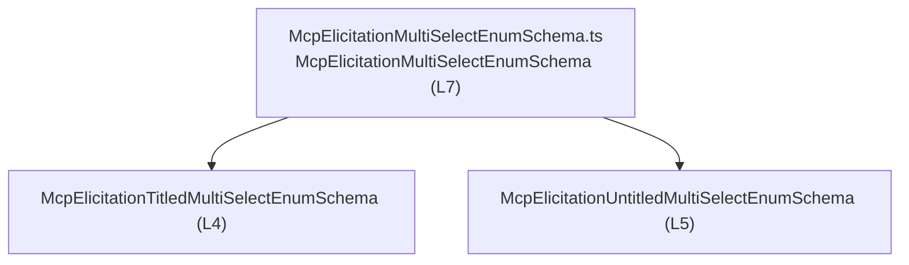
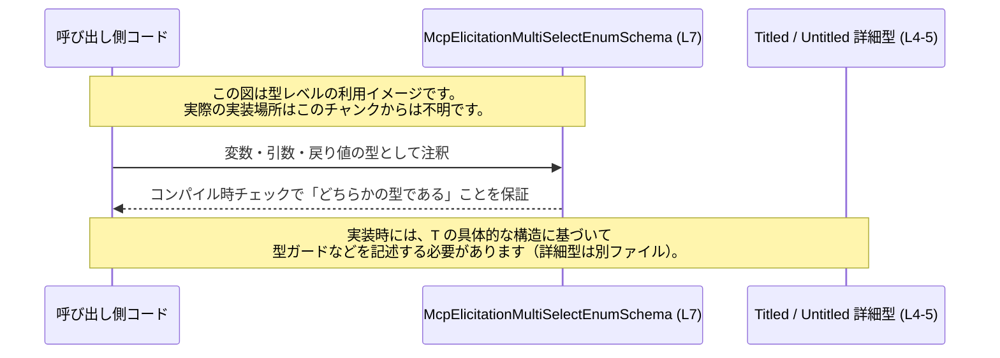

# app-server-protocol/schema/typescript/v2/McpElicitationMultiSelectEnumSchema.ts

## 0. ざっくり一言

- `McpElicitationMultiSelectEnumSchema` という **型エイリアス（union 型）** を定義し、「タイトル付き」と「タイトルなし」の 2 種類のマルチセレクト列挙スキーマをまとめて表現するためのファイルです（`McpElicitationMultiSelectEnumSchema.ts:L4-5,7`）。
- ファイルは `ts-rs` により自動生成されており、**手動編集は禁止**とコメントされています（`McpElicitationMultiSelectEnumSchema.ts:L1-3`）。

---

## 1. このモジュールの役割

### 1.1 概要

- このモジュールは、**マルチセレクト列挙スキーマの 2 つのバリエーション（タイトルあり / なし）を 1 つの型として扱えるようにする**ための型定義を提供します（`McpElicitationMultiSelectEnumSchema.ts:L4-5,7`）。
- 実行時処理・ビジネスロジック・エラー処理などは一切含まず、**コンパイル時の型安全性を提供するためだけのファイル**です（関数や値の定義が存在しないことから判断、`McpElicitationMultiSelectEnumSchema.ts:L1-7`）。

### 1.2 アーキテクチャ内での位置づけ

- このファイルは 2 つの型を `import type` し、それらの union 型をエクスポートしています（`McpElicitationMultiSelectEnumSchema.ts:L4-5,7`）。
- `import type` を使っているため、**型情報のみを依存関係として利用し、バンドルされる JavaScript には影響を与えない**構造になっています（`McpElicitationMultiSelectEnumSchema.ts:L4-5`）。

依存関係を簡略化して図示すると、以下のようになります。



- 実際にこの型がどこから使われるか（API 層、UI 層など）は、このチャンクのコードからは分かりません。

### 1.3 設計上のポイント

- **生成コード**  
  - `// GENERATED CODE! DO NOT MODIFY BY HAND!` と `ts-rs` による生成である旨が明記されています（`McpElicitationMultiSelectEnumSchema.ts:L1-3`）。
  - 意味のある変更は、**TypeScript 側ではなく Rust 側の元定義や `ts-rs` の設定を変更して行う前提**です（生成コードであることからの一般的な前提）。
- **union 型による表現**  
  - タイトル付き / なしの 2 種類のスキーマを union 型でまとめることで、「どちらか一方である」ことを型システムに表現しています（`McpElicitationMultiSelectEnumSchema.ts:L7`）。
- **状態・並行性**  
  - クラスや関数、変数定義はなく、**状態を保持しません**（`McpElicitationMultiSelectEnumSchema.ts:L1-7`）。
  - 実行時コードがないため、このファイル単体で **エラー処理や並行処理に関する懸念はありません**。

---

## 2. 主要な機能一覧

- `McpElicitationMultiSelectEnumSchema` 型:  
  タイトル付き / タイトルなしのマルチセレクト列挙スキーマのいずれかを表す union 型エイリアスです（`McpElicitationMultiSelectEnumSchema.ts:L4-5,7`）。

### 2.1 コンポーネント一覧（インベントリー）

このチャンクに現れる型・依存関係の一覧です。

| 名前 | 種別 | 公開性 | 役割 / 用途 | 根拠 |
|------|------|--------|-------------|------|
| `McpElicitationMultiSelectEnumSchema` | 型エイリアス（union 型） | `export` | `McpElicitationUntitledMultiSelectEnumSchema` または `McpElicitationTitledMultiSelectEnumSchema` のいずれかであることを表現する公開 API | `McpElicitationMultiSelectEnumSchema.ts:L7` |
| `McpElicitationTitledMultiSelectEnumSchema` | 型（外部定義） | `import type` | タイトル付きマルチセレクト列挙スキーマを表す型（詳細構造はこのチャンクには現れません） | `McpElicitationMultiSelectEnumSchema.ts:L4` |
| `McpElicitationUntitledMultiSelectEnumSchema` | 型（外部定義） | `import type` | タイトルなしマルチセレクト列挙スキーマを表す型（詳細構造はこのチャンクには現れません） | `McpElicitationMultiSelectEnumSchema.ts:L5` |

---

## 3. 公開 API と詳細解説

### 3.1 型一覧（構造体・列挙体など）

このファイルが直接公開している主要な型は 1 つです。

| 名前 | 種別 | 役割 / 用途 | 根拠 |
|------|------|-------------|------|
| `McpElicitationMultiSelectEnumSchema` | 型エイリアス（union 型） | タイトル付き / タイトルなしの 2 種類のマルチセレクト列挙スキーマを 1 つの型として扱うための公開インターフェース | `McpElicitationMultiSelectEnumSchema.ts:L7` |

#### `McpElicitationMultiSelectEnumSchema`

**概要**

- 下記 2 つのどちらか一方を取る union 型エイリアスです（`McpElicitationMultiSelectEnumSchema.ts:L4-5,7`）。
  - `McpElicitationUntitledMultiSelectEnumSchema`
  - `McpElicitationTitledMultiSelectEnumSchema`
- これにより、呼び出し側は「マルチセレクト列挙スキーマ」であることだけを意識し、タイトルの有無は後段で判定できる設計になっています。

```typescript
export type McpElicitationMultiSelectEnumSchema =
    McpElicitationUntitledMultiSelectEnumSchema
  | McpElicitationTitledMultiSelectEnumSchema;
```

**契約（Contract）**

- この型で注釈された値は、**コンパイル時の型チェック上**、  
  `McpElicitationUntitledMultiSelectEnumSchema` か `McpElicitationTitledMultiSelectEnumSchema` のいずれかに適合している必要があります（`McpElicitationMultiSelectEnumSchema.ts:L7`）。
- 実行時には TypeScript の型情報は消えるため、実際に渡されるデータがこの構造に従うかどうかは **別途ランタイムバリデーション** に依存します（一般的な TypeScript の仕様に基づく説明）。

**Errors / Panics / 安全性**

- このファイルには関数やランタイム処理が存在しないため、**直接的に例外がスローされたりパニックが発生する箇所はありません**（`McpElicitationMultiSelectEnumSchema.ts:L1-7`）。
- ただし、呼び出し側が `any` やキャスト (`as`) を多用すると、**実際にはこのスキーマに従わない値** をこの型として扱えてしまい、後続処理でランタイムエラーが発生する可能性があります（TypeScript の一般的な安全性の観点）。

**Edge cases（エッジケース）**

- `McpElicitationMultiSelectEnumSchema` は union 型なので、**どちらの構成型にも存在しないプロパティへ直接アクセスするとコンパイルエラー**になります。  
  具体的なプロパティ名はこのチャンクに現れないため不明です。
- 呼び出し側が `any` からこの型にキャストした場合など、**コンパイラがチェックできないケース**では、実際にはどちらのスキーマにも適合しない「不正な値」が混入しうる点に注意が必要です。

**使用上の注意点**

- **共通プロパティのみ安全に利用可能**  
  - union 型に対しては、両方の構成型に共通するプロパティ・メソッドだけが、型ガードなしで安全に利用できます。
  - 具体的な共通プロパティは、このチャンクには記述されていません。
- **型ガードの利用が前提**  
  - 片方のスキーマにしか存在しないプロパティを利用する場合は、`in` 演算子やユーザー定義型ガードを用いた **型の絞り込み（narrowing）** が必要です。
  - どのプロパティを discriminant として使うべきかは、各スキーマ定義ファイルを確認する必要があります（このチャンクには現れません）。
- **並行性・スレッド安全性**  
  - 型定義のみであり、状態やスレッドを扱いません。この型自体が並行処理に起因する問題を引き起こすことはありません。

### 3.2 関数詳細（最大 7 件）

- このファイルには **関数・メソッド・クラスの定義は存在しません**（`McpElicitationMultiSelectEnumSchema.ts:L1-7`）。
- したがって、このセクションに詳細解説すべき関数はありません。

### 3.3 その他の関数

- 該当なし（関数定義が存在しません）。

---

## 4. データフロー

このファイルは型定義のみを提供し、実行時の処理フローは含みません。そのため、ここでは **「典型的な利用イメージ」に基づいた型レベルのデータフロー** を示します。  
実際の呼び出し元や利用箇所は、このチャンクのコードだけからは分かりません。



要点:

- 呼び出し側は `McpElicitationMultiSelectEnumSchema` を使って、**「マルチセレクト列挙スキーマ」であることだけを前提にコードを書く**ことができます。
- 実際の分岐（タイトル付きかどうか）は、この union 型の構成要素である `McpElicitationTitledMultiSelectEnumSchema` / `McpElicitationUntitledMultiSelectEnumSchema` の定義内容に応じて、呼び出し側で型ガードを実装する必要があります（このチャンクには実装が現れません）。

---

## 5. 使い方（How to Use）

### 5.1 基本的な使用方法

この型を他のファイルから利用する基本パターンの例です。

```typescript
// McpElicitationMultiSelectEnumSchema を型としてインポートする例
import type {
    McpElicitationMultiSelectEnumSchema,            // union 型をインポート
} from "./McpElicitationMultiSelectEnumSchema";      // 同ディレクトリ内の生成ファイル

// マルチセレクト列挙スキーマを受け取って処理する関数
function handleMultiSelectSchema(
    schema: McpElicitationMultiSelectEnumSchema,     // タイトル有無を意識せず受け取る
): void {
    // ここでは schema が 2 つのどちらかの型であることだけが分かる
    // 共通プロパティだけを扱う処理を書くのが安全
    // 具体的なプロパティは各型定義ファイルを参照する必要がある
}

// どこか別の場所で、この型に適合する値を渡して呼び出すイメージ
declare const s: McpElicitationMultiSelectEnumSchema; // どちらかのスキーマであることを型で保証
handleMultiSelectSchema(s);                           // 正しい型ならコンパイルが通る
```

- この例では、**タイトル付きかどうかを意識せずに受け取る** API を定義しています。
- `schema` に対してどのプロパティが安全にアクセスできるかは、構成型 2 つの定義に依存します（このチャンクには現れません）。

### 5.2 よくある使用パターン

1. **関数引数・戻り値として利用**

```typescript
import type { McpElicitationMultiSelectEnumSchema } from "./McpElicitationMultiSelectEnumSchema";

// 入力スキーマを受け取り、同じ型を返す関数の例
function normalizeSchema(
    schema: McpElicitationMultiSelectEnumSchema,     // 入力も union 型
): McpElicitationMultiSelectEnumSchema {            // 出力も union 型
    // ここで何らかの正規化処理を行う想定（実装は利用側で定義）
    return schema;                                   // サンプルではそのまま返す
}
```

1. **他の型のプロパティとして利用**

```typescript
import type { McpElicitationMultiSelectEnumSchema } from "./McpElicitationMultiSelectEnumSchema";

// API レスポンスなどの一部として利用する例
interface ElicitationConfig {
    id: string;                                      // 識別子
    multiSelect: McpElicitationMultiSelectEnumSchema; // マルチセレクト列挙スキーマ
}
```

- いずれの例でも、**タイトル付き / なしを 1 つの型で統一して扱える**点が利点です。

### 5.3 よくある間違い

ここでは、TypeScript の union 型全般で起こりがちな誤用を挙げます。このファイル固有の挙動は、コードからは分かりません。

```typescript
import type { McpElicitationMultiSelectEnumSchema } from "./McpElicitationMultiSelectEnumSchema";

declare const schema: McpElicitationMultiSelectEnumSchema;

// ❌ よくない例: 片方の型にしかない前提のプロパティに直接アクセスする
// console.log(schema.someTitledOnlyProperty);       // コンパイルエラーになる可能性が高い

// ✅ 一般的な正しいパターン（イメージ）
// 実際にどのプロパティで判定すべきかは各型定義ファイルを確認する必要があります。
function processSchema(s: McpElicitationMultiSelectEnumSchema) {
    // ここで `in` 演算子やカスタム型ガードを使って
    // 「タイトル付きかどうか」を判定する実装を書くことが一般的です。
    // 具体的な実装は、このチャンクからは分かりません。
}
```

典型的な注意点:

- **両方の構成型を考慮しない実装**  
  - union 型にもかかわらず、一方の型の前提だけでコードを書くとコンパイルエラーやランタイムエラーの原因になります。
- **`any` や過度な型アサーションの乱用**  
  - `schema as any` などで型チェックを回避すると、**実際にはこのスキーマに適合しない値**が混入してもコンパイラが検出できなくなり、安全性が失われます（TypeScript 一般の注意点）。

### 5.4 使用上の注意点（まとめ）

- **生成コードを直接編集しない**  
  - ファイル先頭に「GENERATED CODE」「Do not edit manually」と明記されており（`McpElicitationMultiSelectEnumSchema.ts:L1-3`）、  
    意味のある変更は Rust 側など **生成元** に対して行う必要があります。
- **ランタイムバリデーションは別途必要**  
  - TypeScript の型はコンパイル時のみ有効なため、外部入力（HTTP リクエストや JSON など）をこの型として扱う場合は、  
    実行時にスキーマチェックを行わない限り、**不正データの混入を完全には防げません**。
- **セキュリティの観点**  
  - このファイル自体は型定義のみで、直接的なセキュリティホール（SQL インジェクション、XSS など）は含みません。
  - ただし型を過信し、未検証の入力データを「安全なスキーマ」とみなすと、**上流での不正入力が見逃される**可能性があります。
- **パフォーマンス・並行性**  
  - 型定義のみであり、パフォーマンスや並行処理に直接影響する処理はありません。

---

## 6. 変更の仕方（How to Modify）

### 6.1 新しい機能を追加する場合

- ファイル先頭のコメントにある通り、このファイルは `ts-rs` により生成されており、**手動編集は想定されていません**（`McpElicitationMultiSelectEnumSchema.ts:L1-3`）。
- 新しいバリエーション（例えば別の種類のマルチセレクト列挙スキーマ）を union に追加したい場合は、一般に次のような手順になります（具体的な生成元ファイルはこのチャンクからは特定できません）:
  1. Rust 側など `ts-rs` が参照する元の型定義に、新しいバリエーションとなる型を追加する。
  2. 必要に応じて `ts-rs` の derive や属性設定を更新する。
  3. `ts-rs` のコード生成を再実行し、このファイルを再生成する。
- TypeScript ファイル側で直接 union に型を追加しても、次回生成時に上書きされる可能性が高いため、**変更は生成元に集約する**のが前提です。

### 6.2 既存の機能を変更する場合

既存の union 構造（「タイトル付き / なし」の 2 種類）を変更したい場合も、基本方針は同じです。

- 影響範囲:
  - この union 型を利用しているすべての呼び出し元コードが影響を受ける可能性があります。  
    例えば、型ガードや `switch` 文で明示的に 2 ケースを列挙しているコードなどです。
- 変更時の注意点:
  - union の構成要素を削除あるいは名称変更する場合、**コンパイラエラー**として多くの呼び出し元が検出されるため、それらを修正する必要があります。
  - 生成元の Rust 型定義を変更した後、この TypeScript ファイルを再生成し、ビルドエラーで影響箇所を洗い出すのが一般的です。
- このチャンクだけでは、具体的にどのファイルが `McpElicitationMultiSelectEnumSchema` を利用しているかは分かりません。

---

## 7. 関連ファイル

このモジュールと密接に関係するファイル（このチャンクの import から読み取れる範囲）です。

| パス | 役割 / 関係 | 根拠 |
|------|------------|------|
| `app-server-protocol/schema/typescript/v2/McpElicitationTitledMultiSelectEnumSchema.ts` | タイトル付きマルチセレクト列挙スキーマの型を定義していると考えられるファイル。`McpElicitationMultiSelectEnumSchema` の union 構成要素として `import type` されています。詳細な構造はこのチャンクには現れません。 | `McpElicitationMultiSelectEnumSchema.ts:L4` |
| `app-server-protocol/schema/typescript/v2/McpElicitationUntitledMultiSelectEnumSchema.ts` | タイトルなしマルチセレクト列挙スキーマの型を定義していると考えられるファイル。`McpElicitationMultiSelectEnumSchema` の union 構成要素として `import type` されています。詳細な構造はこのチャンクには現れません。 | `McpElicitationMultiSelectEnumSchema.ts:L5` |
| （Rust 側の ts-rs 対応型定義ファイル） | `ts-rs` によりこの TypeScript ファイルを生成する元となっていると考えられる Rust の型定義ファイルです。具体的なパスや型名はこのチャンクには現れませんが、「This file was generated by ts-rs」とのコメントから存在が示唆されます。 | `McpElicitationMultiSelectEnumSchema.ts:L1-3` |

このチャンクにはテストコードやユーティリティ関数は含まれていないため、テストとの直接的な関係は読み取れません。
