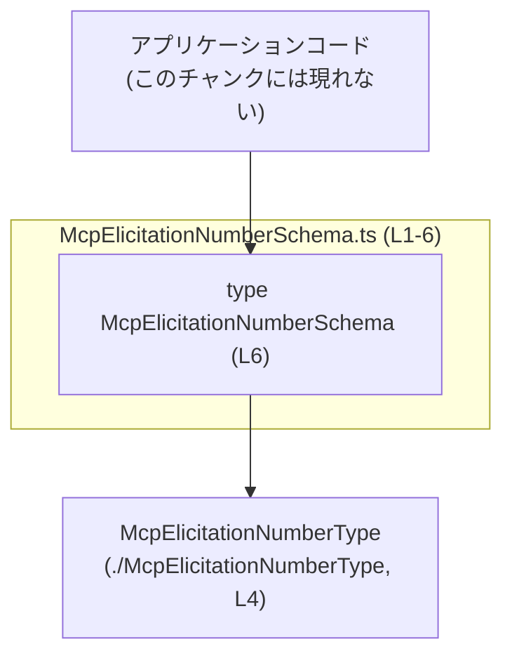
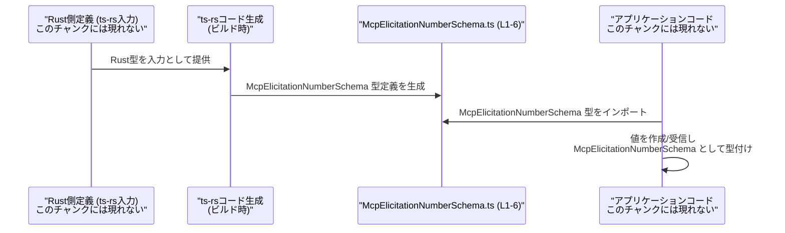

# app-server-protocol\schema\typescript\v2\McpElicitationNumberSchema.ts コード解説

## 0. ざっくり一言

`McpElicitationNumberSchema` は、`McpElicitationNumberType` を用いた「数値の問い合わせ（エリシテーション）」用スキーマオブジェクトの **型定義だけ** を提供する TypeScript ファイルです（実行時ロジックはありません）。  
このファイルは `ts-rs` によって自動生成されるため、手動編集しないことが前提になっています（`McpElicitationNumberSchema.ts:L1-3`）。

---

## 1. このモジュールの役割

### 1.1 概要

- このモジュールは、数値入力に関する情報（型・タイトル・説明・最小値・最大値・デフォルト値）をまとめたオブジェクトの **構造だけを型として定義** します（`McpElicitationNumberSchema.ts:L6-6`）。
- 実行時のバリデーションや処理は一切含まず、TypeScript の静的型チェックのための情報を提供します。
- `ts-rs` により Rust 側の型から自動生成されるコードであり、プロトコル定義の一部として位置付けられていると考えられます（コメントより。`McpElicitationNumberSchema.ts:L1-3`）。

### 1.2 アーキテクチャ内での位置づけ

- このファイルは、TypeScript クライアント側で利用される **型定義レイヤー** に属します。
- 他の TypeScript コードからは `McpElicitationNumberSchema` 型として参照され、**値の形** を制約します。
- 唯一の依存は `McpElicitationNumberType` 型です（`McpElicitationNumberSchema.ts:L4-4`）。



この図は、「アプリケーションコード」がこのファイルの `McpElicitationNumberSchema` 型を参照し、その内部で `McpElicitationNumberType` に依存している構造を表します。

### 1.3 設計上のポイント

- **自動生成コード**  
  - 先頭コメントに「GENERATED CODE! DO NOT MODIFY BY HAND!」とあり（`McpElicitationNumberSchema.ts:L1-3`）、手動変更が想定されていません。
- **型専用インポート**  
  - `import type { McpElicitationNumberType } from "./McpElicitationNumberType";` により、型情報のみをインポートし、コンパイル後の JavaScript には影響しません（`McpElicitationNumberSchema.ts:L4-4`）。
- **純粋な型定義（状態なし／ロジックなし）**  
  - エクスポートは `export type ... = { ... }` のみで、クラスや関数はありません（`McpElicitationNumberSchema.ts:L6-6`）。
  - したがって、状態管理・エラーハンドリング・並行性制御などの実行時挙動は一切含まれません。
- **オプショナルプロパティ**  
  - `title?`, `description?`, `minimum?`, `maximum?`, `default?` が `?` 付きで宣言されており、存在してもなくてもよいプロパティとして定義されています（`McpElicitationNumberSchema.ts:L6-6`）。

---

## 2. 主要な機能一覧

このファイルは型定義のみですが、機能的には次のように整理できます。

- `McpElicitationNumberSchema` 型: 数値入力スキーマオブジェクトの構造を定義する（`McpElicitationNumberSchema.ts:L6-6`）。
  - 数値タイプ（`type`）の指定
  - 表示用メタ情報（`title`, `description`）
  - 入力制約（`minimum`, `maximum`）
  - デフォルト値（`default`）

実行時の処理・検証ロジックはこのチャンクには含まれていません。

---

## 3. 公開 API と詳細解説

### 3.1 型一覧（コンポーネントインベントリー）

このチャンクに現れる型・シンボルの一覧です。

| 名前 | 種別 | 役割 / 用途 | 定義 / 使用位置 |
|------|------|-------------|-----------------|
| `McpElicitationNumberSchema` | 型エイリアス（オブジェクト型） | 数値エリシテーション用スキーマオブジェクトの構造を表す公開 API | 定義: `McpElicitationNumberSchema.ts:L6-6` |
| `McpElicitationNumberType` | 型（外部インポート） | `type` プロパティの型。具体的な中身はこのチャンクには現れない | 型インポート: `McpElicitationNumberSchema.ts:L4-4` |

> 関数・クラス・列挙体は、このチャンクには定義されていません（`McpElicitationNumberSchema.ts:L1-6`）。

#### `McpElicitationNumberSchema` の構造

```ts
// McpElicitationNumberSchema.ts:L6-6
export type McpElicitationNumberSchema = {
  type: McpElicitationNumberType,
  title?: string,
  description?: string,
  minimum?: number,
  maximum?: number,
  default?: number,
};
```

- `type`: 必須。`McpElicitationNumberType` 型。数値の種類（例: 整数/実数/スケールなど）を表すと推測できますが、具体的内容はこのチャンクでは不明です。
- `title`: 任意。UI 表示用の名前などの用途が考えられますが、コード上は単なる `string` 型です。
- `description`: 任意。タイトルより詳しい説明テキスト用途と考えられますが、型としては `string` のみが指定されています。
- `minimum`: 任意。最小値と思われる `number` 型フィールドです。
- `maximum`: 任意。最大値と思われる `number` 型フィールドです。
- `default`: 任意。既定値と思われる `number` 型フィールドです。

> 用途に関する説明（最小値・最大値など）はプロパティ名からの推測であり、このチャンクのコード自体は **意味付けや制約ロジックを持っていない** 点に注意が必要です。

### 3.2 関数詳細

このファイルには関数が定義されていないため、関数詳細テンプレートに該当する対象はありません（`McpElicitationNumberSchema.ts:L1-6`）。

- コアロジック（アルゴリズム）は一切存在せず、**静的な型情報のみ** が提供されます。
- したがって、エラー返却や panic、例外などのランタイム挙動もこのファイルだけからは発生しません。

### 3.3 その他の関数

- 該当なし（このチャンクには関数定義が現れません）。

---

## 4. データフロー

このファイル自体には実行時処理がないため、ここでは **型としての利用フロー** を概念的に示します。  
図は典型的な利用シナリオの一例であり、具体的な実装はこのチャンクには現れません。

### 4.1 型利用の代表的フロー（概念図）



要点:

- Rust 側で定義された型から `ts-rs` が TypeScript の型定義（このファイル）を生成します（コメントより。`McpElicitationNumberSchema.ts:L1-3`）。
- アプリケーションコードは `McpElicitationNumberSchema` を型としてインポートし、オブジェクトの構造を静的に保証します。
- 実際の JSON パースや数値チェックなどは、このファイルには含まれず、アプリ側または他モジュールの責務となります（このチャンクには現れない）。

---

## 5. 使い方（How to Use）

### 5.1 基本的な使用方法

`McpElicitationNumberSchema` を使う典型的なパターンは、「数値入力スキーマを表すオブジェクト」の型として利用する形です。

```ts
// 例: アプリケーションコード側での利用例（概念的なもの）
// 実際のインポートパスはプロジェクト構成に依存します。
import type { McpElicitationNumberType } from "./McpElicitationNumberType";          // L4 のインポートを想定した相対パス
import type { McpElicitationNumberSchema } from "./McpElicitationNumberSchema";      // このファイルをインポート

// ここでは具体的な中身は不明なため、既にどこかで用意されていると仮定します。
// McpElicitationNumberType の定義はこのチャンクには現れません。
declare const numberType: McpElicitationNumberType;  // 数値タイプを表す値

// 数値スキーマを定義する
const ageSchema: McpElicitationNumberSchema = {      // ageSchema は McpElicitationNumberSchema 型
    type: numberType,                                // 必須フィールド: 正しい型が必要
    title: "年齢",                                    // 任意の文字列
    description: "ユーザーの年齢（年）",             // 任意の文字列
    minimum: 0,                                      // 最小値（省略も可）
    maximum: 150,                                    // 最大値（省略も可）
    default: 30,                                     // デフォルト値（省略も可）
};

// ageSchema を使って UI やバリデーションロジックを構築するのは
// 別ファイルの責務であり、このチャンクには現れません。
```

ポイント:

- `type` プロパティが必須であるため、これを省略するとコンパイルエラーになります（型定義より。`McpElicitationNumberSchema.ts:L6-6`）。
- 他のプロパティはすべてオプショナルなので、必要なものだけを指定できます。

### 5.2 よくある使用パターン

1. **最小構成（必須フィールドのみ）**

```ts
declare const numberType: McpElicitationNumberType;

// 必須の type のみを指定したスキーマ
const simpleSchema: McpElicitationNumberSchema = {
    type: numberType,  // これだけあれば型としては成立する
};
```

1. **制約付きだがデフォルト値なし**

```ts
declare const numberType: McpElicitationNumberType;

const constrainedSchema: McpElicitationNumberSchema = {
    type: numberType,
    minimum: 1,        // 1以上
    maximum: 10,       // 10以下
    // default は設定しない
};
```

1. **説明情報のみを付与**

```ts
declare const numberType: McpElicitationNumberType;

const documentedSchema: McpElicitationNumberSchema = {
    type: numberType,
    title: "評価スコア",
    description: "1〜5 の評価スコアを入力します。",
    // 数値制約は別の層で行う場合
};
```

### 5.3 よくある間違い

コンパイル時に検出される典型的な誤用例と、正しい例を対比します。

```ts
declare const numberType: McpElicitationNumberType;

// 間違い例1: 必須フィールド type を指定していない
// const invalidSchema1: McpElicitationNumberSchema = {
//     title: "年齢",
// };
// → コンパイルエラー: Property 'type' is missing ... （必須プロパティ不足）

// 正しい例
const validSchema1: McpElicitationNumberSchema = {
    type: numberType,  // 必須フィールドを含める
    title: "年齢",
};

// 間違い例2: minimum に文字列を渡してしまう
// const invalidSchema2: McpElicitationNumberSchema = {
//     type: numberType,
//     minimum: "0",    // string は number に割り当て不可
// };
// → コンパイルエラー: Type 'string' is not assignable to type 'number'.

// 正しい例
const validSchema2: McpElicitationNumberSchema = {
    type: numberType,
    minimum: 0,        // number 型を指定
};
```

これらの例から分かるように、このモジュールは **TypeScript の型チェック** によって構造ミスや型ミスを防ぐ役割を果たしますが、  
`minimum > maximum` のような「意味的な不整合」は型だけでは検出されません（後述）。

### 5.4 使用上の注意点（まとめ）

この型を利用する際の注意点を、バグ・セキュリティ・エッジケース等の観点も含めて整理します。

- **前提条件 / 契約**
  - `type` は必須であり、常に `McpElicitationNumberType` 型の値を設定する必要があります（`McpElicitationNumberSchema.ts:L6-6`）。
  - 他のプロパティは省略可能であり、省略時の意味（例: 制約なし、デフォルトなし）はアプリ側の実装に依存します。このチャンクだけでは定義されていません。
- **エッジケース**
  - `minimum` と `maximum` の関係:
    - 型レベルでは `minimum > maximum` も許容されてしまいます（両方 `number` で関係条件がないため、`McpElicitationNumberSchema.ts:L6-6`）。
    - `default` が `minimum` 未満 / `maximum` 超過でも型的には問題ありません。
    - これらの整合性チェックは、別の層（バリデーションロジック）で行う必要があります。
  - フィールドの省略:
    - オプショナルなプロパティは未定義かもしれないため、利用側で `undefined` を考慮する必要があります。
- **バグ/セキュリティ面**
  - このファイル自体は型定義のみで実行時コードを含まないため、直接的なセキュリティホールやランタイムバグは生じません。
  - ただし、「この型が付いているから安全/検証済」と誤解すると、`minimum` や `maximum` をチェックせずに外部入力をそのまま信頼してしまうリスクがあります。
- **並行性・スレッド安全性**
  - 実行時の状態やスレッドは扱っていない純粋な型定義なので、このファイル単体では並行性に関する問題は発生しません。
- **パフォーマンス**
  - コンパイル時の型チェックにのみ関与し、ランタイムでのオーバーヘッドはありません（`import type` により JS 出力にも影響しません。`McpElicitationNumberSchema.ts:L4-4`）。

---

## 6. 変更の仕方（How to Modify）

### 6.1 新しい機能を追加する場合

コメントにある通り、このファイルは `ts-rs` により生成されています（`McpElicitationNumberSchema.ts:L1-3`）。  
そのため、**直接このファイルを編集するのではなく、生成元（Rust 側の型定義など）を変更する** 必要があります。

一般的な手順（具体的なファイル名やコマンドはこのチャンクには現れません）:

1. Rust 側で `ts-rs` 対象になっている型に、新しいフィールド（例: `step` など）を追加する。
2. プロジェクトのビルドまたは生成スクリプトを実行し、`ts-rs` によって TypeScript の型定義を再生成する。
3. 生成された `McpElicitationNumberSchema.ts` を確認し、新しいフィールドが `McpElicitationNumberSchema` に反映されていることを確認する。
4. TypeScript 側で `McpElicitationNumberSchema` を利用している箇所に対して、必要な対応（新フィールドの設定・扱い）を行う。

このチャンクにはテストやビルドスクリプトの情報がないため、具体的な生成手順は不明です。

### 6.2 既存の機能を変更する場合

`McpElicitationNumberSchema` の構造を変更する際に注意すべき点です。

- **影響範囲の確認**
  - この型を利用している全ての TypeScript ファイルが影響を受けます。  
    例えば、`minimum` を必須 (`minimum: number`) に変更した場合、これまで `minimum` を指定していなかった全てのコードがコンパイルエラーになります。
- **契約（前提条件・意味）への影響**
  - `minimum` や `maximum` の型を `number` 以外に変える、あるいは削除する場合、利用側のバリデーションロジックや UI 表示に影響します。
  - `type` をオプショナルに変更すると、「必ず type がある」という前提が崩れ、利用側のコードで `undefined` チェックが必要になります。
- **テスト**
  - このチャンクにはテストファイルが現れませんが、通常はこの型を利用するロジック側（バリデーションや UI）のテストを更新する必要があります。
- **再生成の必要性**
  - 手動で `McpElicitationNumberSchema.ts` を変更すると、次回コード生成時に上書きされる可能性があります（`McpElicitationNumberSchema.ts:L1-3`）。  
    そのため、変更は必ず生成元に対して行うべきです。

---

## 7. 関連ファイル

このチャンクから分かる、密接に関係するファイル・シンボルは次の通りです。

| パス / シンボル | 役割 / 関係 | 根拠 |
|-----------------|-------------|------|
| `./McpElicitationNumberType` | `McpElicitationNumberType` を定義するモジュール。`McpElicitationNumberSchema` の `type` プロパティで使用される。具体的な中身はこのチャンクには現れない。 | 型インポート: `McpElicitationNumberSchema.ts:L4-4` |
| Rust 側の ts-rs 対象型（ファイルパス不明） | この TypeScript ファイルの生成元となる Rust の型定義。`ts-rs` によって本ファイルが生成される。具体的な場所はこのチャンクには現れない。 | 生成コメント: `McpElicitationNumberSchema.ts:L1-3` |

> テストコードや他のスキーマ定義ファイルとの関係は、このチャンクからは読み取れません。

---

### まとめ

- `McpElicitationNumberSchema` は、数値エリシテーション用のスキーマオブジェクトの **構造だけ** を定義する、自動生成の TypeScript 型エイリアスです（`McpElicitationNumberSchema.ts:L6-6`）。
- 実行時のバリデーションやロジックは含まれず、型安全性と IDE 支援を提供します。
- `type` は必須、その他のフィールドはオプショナルであり、意味的な整合性（`minimum <= maximum` など）は別のロジックで保証する必要があります。
- このファイルを直接編集するのではなく、`ts-rs` の生成元である Rust 側の定義を変更し、再生成することが前提となっています（`McpElicitationNumberSchema.ts:L1-3`）。
