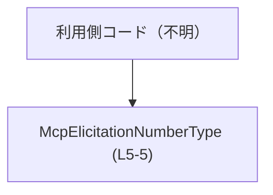
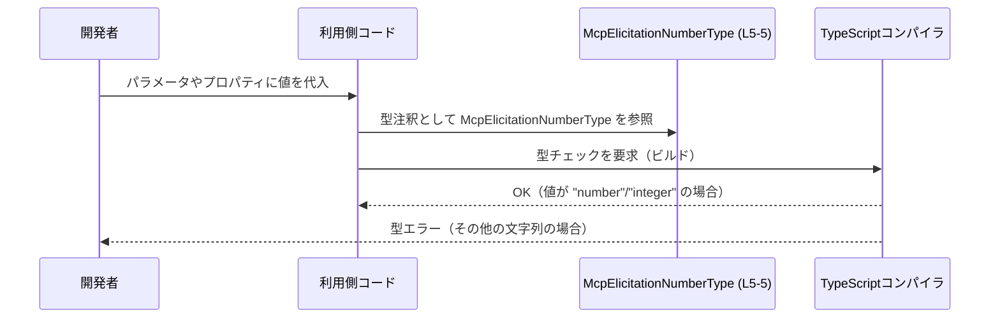

# app-server-protocol/schema/typescript/v2/McpElicitationNumberType.ts

## 0. ざっくり一言

`"number"` と `"integer"` の2種類だけを取りうる文字列リテラル型 `McpElicitationNumberType` を定義する、自動生成された型定義ファイルです（根拠: `McpElicitationNumberType.ts:L1-5`）。

---

## コンポーネントインベントリー（本チャンク）

このチャンクに現れる型・関数の一覧です。

| 名前                       | 種別                          | 公開 | 説明                                                                 | 定義位置                             |
|----------------------------|-------------------------------|------|----------------------------------------------------------------------|--------------------------------------|
| `McpElicitationNumberType` | 型エイリアス（文字列リテラル） | 公開 | `"number"` または `"integer"` のどちらかのみを許可する数値種別の型 | `McpElicitationNumberType.ts:L5-5` |

このファイルにはクラス・インターフェース・関数・メソッドは定義されていません（根拠: `McpElicitationNumberType.ts:L1-5`）。

---

## 1. このモジュールの役割

### 1.1 概要

- このモジュールは、数値に関する「種別」を `"number"` か `"integer"` の2つの文字列に限定して表現するための型 `McpElicitationNumberType` を提供します（根拠: `McpElicitationNumberType.ts:L5-5`）。
- ファイル先頭のコメントから、この型定義は `ts-rs` により自動生成されており、手動で編集しない前提になっています（根拠: `McpElicitationNumberType.ts:L1-3`）。

### 1.2 アーキテクチャ内での位置づけ

- ディレクトリパス `schema/typescript/v2` から、このファイルが **v2 の TypeScript スキーマ定義群の一部**であると解釈できますが、他モジュールとの具体的な依存関係はこのチャンクには現れません（import 文が存在しないため、依存しているモジュールはないと判断できます）（根拠: `McpElicitationNumberType.ts:L1-5`）。
- 一方で、他のファイルからは `McpElicitationNumberType` が型として参照されることが想定されますが、その呼び出し元はこのチャンクには現れません（不明）。

依存関係（概念図）:



### 1.3 設計上のポイント

- **自動生成コード**  
  - 冒頭コメントで「GENERATED CODE」「Do not edit this file manually」と明示されており、生成物として扱う前提になっています（根拠: `McpElicitationNumberType.ts:L1-3`）。
- **閉じた値集合を表す文字列リテラルのユニオン型**  
  - `McpElicitationNumberType` は `"number"` と `"integer"` の2つのみを取りうる文字列リテラル型として定義されています（根拠: `McpElicitationNumberType.ts:L5-5`）。
  - これにより、コンパイル時に値の取りうる範囲が制限され、型安全性が高まります（TypeScript の言語仕様に基づく一般的性質）。
- **状態やロジックを持たない**  
  - 関数やクラスが存在せず、純粋な型エイリアスのみのため、実行時の状態管理やエラーハンドリング、並行性に関するロジックは一切含まれていません（根拠: `McpElicitationNumberType.ts:L1-5`）。

---

## 2. 主要な機能一覧

このモジュールが提供する「機能」は1つの型定義に集約されています。

- `McpElicitationNumberType`: 数値の種別を `"number"` または `"integer"` の2種類に制限するための文字列リテラル型（根拠: `McpElicitationNumberType.ts:L5-5`）。

---

## 3. 公開 API と詳細解説

### 3.1 型一覧（構造体・列挙体など）

| 名前                       | 種別                                       | 役割 / 用途                                                                                   | 定義位置                             |
|----------------------------|--------------------------------------------|----------------------------------------------------------------------------------------------|--------------------------------------|
| `McpElicitationNumberType` | 型エイリアス（`"number"` \| `"integer"`） | 数値入力やパラメータの「型種別」を `"number"`/`"integer"` のいずれかに限定して表すために使用 | `McpElicitationNumberType.ts:L5-5` |

#### `McpElicitationNumberType`

**概要**

- TypeScript の文字列リテラル型 `"number"` と `"integer"` をユニオンした型エイリアスです（根拠: `McpElicitationNumberType.ts:L5-5`）。
- この型を用いることで、「この値は 'number' または 'integer' のどちらかでなければならない」という制約を型レベルで表現できます。

**型定義**

```typescript
export type McpElicitationNumberType = "number" | "integer"; // L5
```

**意味・用途**

- `"number"` と `"integer"` の2種類だけが許された識別子（タグ）のように扱われます。
- 例えば「数値の入力方式」や「数値フィールドのスキーマ上の型」を区別する用途に使われることが想定されますが、具体的な文脈はこのチャンクからは分かりません（用途は推測であり、コードからは確定できません）。

**Contracts（契約）**

- `McpElicitationNumberType` を型として指定された変数・プロパティ・引数には、**コンパイル時点で** `"number"` か `"integer"` 以外の文字列を代入すると型エラーになります（TypeScript の型システムに基づく一般的性質）。
- 実行時にはこの型情報は存在しないため、**ランタイムでの自動バリデーションは行われません**。ランタイムの検証は別途コードで実装する必要があります（このファイル内には存在しません: `McpElicitationNumberType.ts:L1-5`）。

**Edge cases（エッジケース）**

TypeScript の型として想定される代表的なケース:

- `null` や `undefined` を許容しない  
  - `McpElicitationNumberType` 自体には `null` / `undefined` は含まれていないため、それらを代入するとコンパイルエラーになります。
- 大文字・小文字の違い  
  - `"Number"` や `"INTEGER"` のような文字列は、リテラルが一致しないため代入できません（コンパイルエラー）。
- 任意文字列との混在  
  - `string` 型と違い、 `"number"`/`"integer"` 以外を含めた任意の文字列は許容されません。

これらは TypeScript の文字列リテラル・ユニオン型の一般的挙動にもとづく説明です。

**使用上の注意点**

- この型はコンパイル時チェック専用であり、ランタイムでの入力検証には別途ロジックが必要です。
- 自動生成ファイルであるため、直接このファイルを編集して値を追加・変更するのは意図されていません（根拠: `McpElicitationNumberType.ts:L1-3`）。

### 3.2 関数詳細（最大 7 件）

このファイルには関数・メソッドは定義されていません（根拠: `McpElicitationNumberType.ts:L1-5`）。  
したがって、本セクションで詳細解説すべき対象はありません。

### 3.3 その他の関数

- 該当なし（補助関数・ラッパー関数などは定義されていません）（根拠: `McpElicitationNumberType.ts:L1-5`）。

---

## 4. データフロー

このモジュールは型定義のみを含み、実行時の処理フローは持ちません（根拠: `McpElicitationNumberType.ts:L1-5`）。  
ここでは、**コンパイル時の型チェックという観点**で、`McpElicitationNumberType` が関与する典型的なデータフローを概念的に示します。

### 概念的なフロー概要

1. 利用側コードで、関数引数やオブジェクトプロパティの型として `McpElicitationNumberType` を指定する。
2. 開発者が `"number"` または `"integer"` を代入・渡した場合はコンパイル成功。
3. それ以外の文字列を指定すると、TypeScript コンパイラが型エラーを報告する。
4. 実行時にはこの型は消去されるため、追加のランタイム検証が必要な場合は別途処理を実装する。

Mermaid のシーケンス図（概念図）:



※ この図は **本チャンクの型定義にもとづく概念的な使用例**であり、実際にどのモジュールから呼び出されるかはこのチャンクには現れません（不明）。

---

## 5. 使い方（How to Use）

### 5.1 基本的な使用方法

`McpElicitationNumberType` を関数引数や設定オブジェクトのプロパティに用いる典型的な例です。

```typescript
// インポートパスはプロジェクト構成に依存します（このチャンクからは不明）
import type { McpElicitationNumberType } from "./McpElicitationNumberType";

// 数値型の種別を受け取る関数を定義する例
function configureNumberField(type: McpElicitationNumberType) { // type は "number" か "integer" のどちらか
    if (type === "integer") {
        // 整数専用の処理を行う
        console.log("Use integer field");
    } else {
        // 一般的な number の処理を行う
        console.log("Use number field");
    }
}

// 正しい呼び出し例
configureNumberField("number");  // OK: 型に一致
configureNumberField("integer"); // OK: 型に一致

// 間違い例（コンパイルエラーになる）
// configureNumberField("float");   // エラー: "float" は McpElicitationNumberType ではない
```

このように、`McpElicitationNumberType` を使うと、**許可されていない種別名の指定をコンパイル時に防ぐ**ことができます。

### 5.2 よくある使用パターン

1. **設定オブジェクトのプロパティとして使う**

```typescript
import type { McpElicitationNumberType } from "./McpElicitationNumberType";

interface NumberFieldConfig {
    type: McpElicitationNumberType; // "number" or "integer"
    label: string;
}

const config: NumberFieldConfig = {
    type: "integer",  // OK
    label: "Age",
};
```

1. **API リクエスト／レスポンスの型として使う**

※ 実際の API 型はこのチャンクには現れませんが、概念的な例です。

```typescript
import type { McpElicitationNumberType } from "./McpElicitationNumberType";

interface NumberFieldSchemaDto {
    // バックエンドと通信するスキーマの一部として利用
    numeric_type: McpElicitationNumberType;
}
```

### 5.3 よくある間違い

概念的に起こりやすい誤用例と、その修正例です。

```typescript
import type { McpElicitationNumberType } from "./McpElicitationNumberType";

// 間違い例: 任意の string 型をそのまま渡してしまう
function badSetType(type: string) {
    // const fieldType: McpElicitationNumberType = type; // エラー: string からは代入できない
}

// 正しい例: 型ガードや変換処理を挟む
function safeSetType(type: string): McpElicitationNumberType | null {
    if (type === "number" || type === "integer") {
        return type; // ここでは type は McpElicitationNumberType に絞り込まれている
    }
    return null; // 許可されない値の場合
}
```

- **誤用ポイント**: 汎用的な `string` をそのまま `McpElicitationNumberType` として扱おうとすると、コンパイラがエラーを出します。
- **対策**: 比較などで `"number"` / `"integer"` のいずれかに絞り込む型ガードを用いるか、入力段階で検証を行います。

### 5.4 使用上の注意点（まとめ）

- この型は **コンパイル時の安全性** を提供するものであり、ランタイムでのデータ検証は別途行う必要があります（このファイルにはランタイム検証ロジックは存在しません: `McpElicitationNumberType.ts:L1-5`）。
- 自動生成ファイルであるため、**手動で編集すると生成元との不整合が生じる**可能性があります（根拠: `McpElicitationNumberType.ts:L1-3`）。
- `any` や `unknown` を多用すると、この型によるチェックをすり抜ける可能性があるため、型安全性を損なわないように注意する必要があります（TypeScript の一般的注意点）。

---

## 6. 変更の仕方（How to Modify）

### 6.1 新しい機能を追加する場合

- ファイル先頭のコメントにある通り、**このファイルは `ts-rs` によって生成されるため、直接編集すべきではありません**（根拠: `McpElicitationNumberType.ts:L1-3`）。
- `"number"` / `"integer"` 以外の種別を追加したい場合でも、通常は:
  - 生成元（Rust 側など）の型定義
  - `ts-rs` の設定
  を変更し、その結果としてこのファイルが再生成される構造であると考えられますが、具体的な生成元コードはこのチャンクには現れません（不明）。

### 6.2 既存の機能を変更する場合

- `"integer"` を `"int"` に変えたい、といった変更も、**直接このファイルを編集せず、生成元を変更する**必要があります（根拠: `McpElicitationNumberType.ts:L1-3`）。
- 変更時に注意すべき契約:
  - `McpElicitationNumberType` を参照している全てのコードが、新しい文字列リテラルに対応する必要があります。
  - バックエンドなど他のコンポーネントとプロトコルを共有している場合、そちらとの整合性も確認する必要がありますが、関連コンポーネントはこのチャンクには現れないため詳細は不明です。

---

## 7. 関連ファイル

このチャンクには import や他ファイルへの参照が一切登場しません（根拠: `McpElicitationNumberType.ts:L1-5`）。そのため、**直接的にどのファイルと関係しているかは特定できません**。

推測される関係（パス名とコメントにもとづくが、コードからは確認できない点を含みます）:

| パス / 種別 | 役割 / 関係 |
|------------|------------|
| Rust 側の型定義（不明） | コメントに示される `ts-rs` による生成元。ここを変更すると本ファイルが再生成されると考えられますが、具体的なファイル名や型名はこのチャンクには現れません。 |
| `schema/typescript/v2` 配下の他の `.ts` ファイル（不明） | 同じスキーマバージョン v2 に属する他の型定義と組み合わせて使用されることが想定されますが、詳細は不明です。 |

---

## Bugs / Security / Tests / 性能などの補足

- **Bugs**  
  - このファイルは1つの型エイリアスのみを定義しており、実行時ロジックを持たないため、ファイル単体としての実行時バグは存在しません（根拠: `McpElicitationNumberType.ts:L1-5`）。
  - ただし、バックエンドや他のコンポーネントと期待される値（"number"/"integer"）が食い違った場合、プロトコル不整合によるバグが起こりうる可能性はありますが、その有無はこのチャンクからは判断できません（不明）。

- **Security**  
  - 型定義のみであり、入出力処理や認可・認証に関するロジックは一切含まれていません（根拠: `McpElicitationNumberType.ts:L1-5`）。

- **Tests**  
  - このファイル内にはテストコードは含まれていません（根拠: `McpElicitationNumberType.ts:L1-5`）。
  - 通常、このような型定義は他モジュールとの統合テストや型チェック（コンパイル）の一部として間接的に検証されますが、実際のテスト構成はこのチャンクには現れません。

- **Performance / Scalability / 並行性**  
  - 純粋な型定義のみであり、実行時パフォーマンス・スケーラビリティ・並行性には直接の影響はありません（根拠: `McpElicitationNumberType.ts:L1-5`）。
