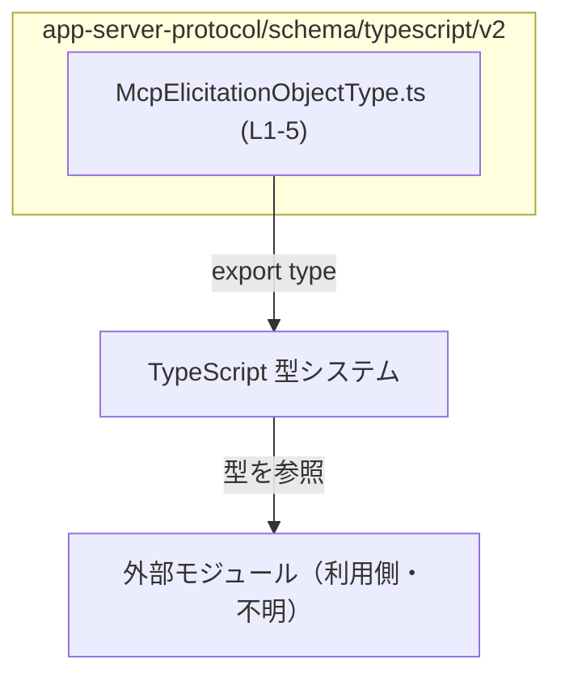
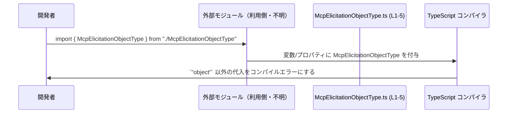

# app-server-protocol/schema/typescript/v2/McpElicitationObjectType.ts

## 0. ざっくり一言

`McpElicitationObjectType` という **文字列リテラル型**（`"object"` のみを許容する型）を公開する、自動生成された TypeScript 型定義ファイルです。

---

## 1. このモジュールの役割

### 1.1 概要

- このモジュールは、`McpElicitationObjectType` という型エイリアスを提供します。  
- 型は `"object"` という 1 つの文字列リテラルだけを許容する **ユニオンではない単一リテラル型** です。  
- ファイル先頭コメントから、この型定義は Rust から TypeScript への変換ツール **ts-rs** により自動生成されていることが分かります。  
  - 根拠: `// This file was generated by [ts-rs]...`（`McpElicitationObjectType.ts:L3-3`）

### 1.2 アーキテクチャ内での位置づけ

このファイル自身は 1 つの型をエクスポートするだけで、他モジュールの参照はありません（インポートもなし）。  
外部モジュールから、この型を使用することを想定した単純な「型定義の提供者」という位置づけです。

**依存関係（このファイル視点）**



- この図は「このファイルが TypeScript の型システムに型を提供し、外部モジュールがそれを参照する」という抽象的な関係を示しています。
- 実際にどのモジュールが利用しているかは、このチャンクには現れません。

### 1.3 設計上のポイント

- **自動生成コード**  
  - 手動編集は禁止されており、 Rust 側の定義変更から自動的に同期される前提です。  
    - 根拠: `// GENERATED CODE! DO NOT MODIFY BY HAND!`（`McpElicitationObjectType.ts:L1-1`）
- **単一リテラル型による厳密化**  
  - `"object"` 以外の文字列をコンパイル時に排除するための厳密な型として設計されています。  
    - 根拠: `export type McpElicitationObjectType = "object";`（`McpElicitationObjectType.ts:L5-5`）
- **状態・副作用を持たない**  
  - 関数やクラスを含まず、型定義のみであるため、実行時の状態管理や副作用はありません。
- **エラーハンドリング / 並行性**  
  - 実行時処理が存在しないため、エラーハンドリング・並行性（スレッド・非同期）に関するロジックはこのファイルには存在しません。

---

## 2. 主要な機能一覧

- `McpElicitationObjectType` 型定義: `"object"` という文字列のみを許容する型エイリアスを提供します。

---

## 3. 公開 API と詳細解説

### 3.1 型一覧（構造体・列挙体など）

このファイルに定義されている型（公開 API）は 1 つです。

| 名前 | 種別 | 役割 / 用途 | 定義位置 |
|------|------|-------------|----------|
| `McpElicitationObjectType` | 型エイリアス（文字列リテラル型） | 値が `"object"` に制限された文字列型を表現するための公開型 | `McpElicitationObjectType.ts:L5-5` |

補足:

- この型は `"object"` **のみ** を許容します。`"object"` 以外の文字列を代入するとコンパイルエラーになります。
- 型エイリアスであるため、実行時には存在せず、「コンパイル時の型チェック」専用の仕組みです。

### 3.2 関数詳細（最大 7 件）

このファイルには関数・メソッドは定義されていません。  
したがって、詳細解説すべき関数は **該当なし** です。

### 3.3 その他の関数

- 関数・ユーティリティはこのチャンクには現れません。

---

## 4. データフロー

このファイルには実行時処理が存在しないため、「値がどのように流れるか」というデータフローは定義されていません。  
ただし、**型レベル** の観点では、「外部モジュールがこの型を参照し、`"object"` という値を扱う」という流れが想定されます。

### 型利用の抽象的なフロー



- どのモジュールが実際に `import` しているかは、このチャンクには現れないため、「外部モジュール」として抽象的に表現しています。
- データフローというよりも、「型制約の適用フロー」として理解するのが適切です。

---

## 5. 使い方（How to Use）

### 5.1 基本的な使用方法

`McpElicitationObjectType` を使うと、特定のフィールドや変数の値を `"object"` に固定することができます。

```typescript
// McpElicitationObjectType をインポートする例                    // 実際のパスはプロジェクト構成に依存（このチャンクからは不明）
import type { McpElicitationObjectType } from "./McpElicitationObjectType";

// 型を利用したオブジェクト定義の例
interface ElicitationConfig {                                  // 何らかの設定用インターフェースを定義
    type: McpElicitationObjectType;                            // type プロパティは "object" のみ許容
}

// 正しい利用例
const configOk: ElicitationConfig = {                          // ElicitationConfig 型の値を作成
    type: "object",                                            // 許可されたリテラル値
};

// 誤った利用例（コンパイルエラーになる）
const configNg: ElicitationConfig = {
    // @ts-expect-error: "object" 以外は McpElicitationObjectType ではない
    type: "string",                                            // コンパイル時にエラー
};
```

- ここで示した `ElicitationConfig` は **利用例であり、このファイルには定義されていません**。

### 5.2 よくある使用パターン

1. **オブジェクトの種別を表すフィールドの型として利用**  
   - 例: `type: McpElicitationObjectType` のように、プロトコル上 `"object"` という固定文字列を持つフィールドを型レベルで保証する用途。
2. **ユニオン型の一部として利用**（設計例）  
   - 将来的に `"object"` 以外の種別が増える場合、`type SomeType = "object" | "array"` のようなユニオンにまとめる設計もありえますが、  
     そのような定義はこのファイルには存在しません（このチャンクには現れません）。

### 5.3 よくある間違い

考えられる誤用と、その訂正例を示します。

```typescript
// 誤り例: 任意の文字列として扱ってしまう
let t: McpElicitationObjectType;
// @ts-expect-error: "foo" は McpElicitationObjectType に代入できない
t = "foo";

// 正しい例: 許可されたリテラル値のみを代入
t = "object";                                                  // OK
```

- `"object"` 以外を代入するとコンパイルエラーになり、実行前に誤りが検出されます。

### 5.4 使用上の注意点（まとめ）

- **前提条件**
  - この型を付けた変数・プロパティには `"object"` 以外を代入できません。
- **禁止事項**
  - 文字列全般を扱いたい箇所にこの型を使うと、必要以上に厳しい制約になりコンパイルエラーの原因になります。
- **エラー・パニック条件**
  - 実行時エラーやパニックは発生しませんが、コンパイル時に `"object"` 以外の代入はエラーになります。
- **並行性・パフォーマンス**
  - 実行時のコードは増えず、型情報のみであるため、ランタイムのパフォーマンスや並行性への影響はありません。

---

## 6. 変更の仕方（How to Modify）

### 6.1 新しい機能を追加する場合

このファイルは **自動生成** であり、「DO NOT MODIFY BY HAND!」と明示されています（`McpElicitationObjectType.ts:L1-1`）。  
したがって、通常はこのファイルを直接変更せず、元になっている Rust 側の定義や ts-rs の設定を更新する必要があります。

一般的な手順（概念的なもの、コードからは詳細不明）:

1. Rust 側の型（おそらく `McpElicitationObjectType` に相当する型）を変更・追加する。  
   - 例: 列挙型に `"array"` などのバリアントを追加する、など。
2. ts-rs のコード生成を再実行する。  
3. 生成された TypeScript ファイルに新しいリテラル型・ユニオンが反映される。

※ Rust 側のファイル名や構成は、このチャンクには現れないため不明です。

### 6.2 既存の機能を変更する場合

- 直接編集は推奨されません（自動生成で上書きされるため）。  
- `"object"` 以外の値を許容したい場合は、元の Rust 型定義を変更し、再生成する必要があります。
- 影響範囲:
  - `McpElicitationObjectType` を参照しているすべての TypeScript コードが影響を受けます。  
  - コンパイルエラーが増減する可能性があるため、利用箇所の再コンパイル・テストが必要です。
- コントラクト（契約条件）の注意:
  - この型は「値が `"object"` である」という契約を表現しているため、内容を変更する際はプロトコル仕様との整合性を確認する必要があります。  
  - プロトコル仕様や Rust 側の型定義は、このチャンクには現れません。

---

## 7. 関連ファイル

このチャンクから分かる情報だけを列挙します。

| パス | 役割 / 関係 |
|------|------------|
| （不明）Rust 側の対応する型定義 | コメントから ts-rs による自動生成と分かりますが、具体的な Rust ファイルのパスはこのチャンクには現れません。 |
| app-server-protocol/schema/typescript/v2/McpElicitationObjectType.ts | 本ドキュメントの対象ファイル。`McpElicitationObjectType` 型を定義・エクスポートする自動生成 TypeScript ファイルです。 |

---

## 付録: コンポーネントインベントリー（このチャンク分）

このファイルチャンクに現れる型・関数などの一覧を行番号付きでまとめます。

### 型・エイリアス

| 名前 | 種別 | 定義 | 定義位置（根拠行） |
|------|------|------|--------------------|
| `McpElicitationObjectType` | 型エイリアス（文字列リテラル型） | `export type McpElicitationObjectType = "object";` | `McpElicitationObjectType.ts:L5-5` |

### 関数・クラス・その他

- 関数: なし（このチャンクには現れません）
- クラス / インターフェース / enum: なし（このチャンクには現れません）

---

## Bugs / Security / Contracts / Edge Cases / Tests / Performance まとめ

- **Bugs**  
  - 実行時ロジックがないため、ランタイムバグはこのファイル単独では発生しません。
- **Security**  
  - 型定義のみであり、直接的なセキュリティリスク（入力処理・暗号・認可など）は関与しません。
- **Contracts（契約）**  
  - `McpElicitationObjectType` は「必ず `"object"` である」という契約をコンパイル時に強制する型です。
- **Edge Cases（エッジケース）**  
  - `"object"` 以外を代入しようとするとコンパイルエラーになります。  
  - `string` 型の値をそのまま代入する場合、 `"object"` であることが型として保証されていないとエラーになります。
- **Tests**  
  - この種の型定義は通常、ユニットテストではなく TypeScript の型チェッカによるコンパイルエラーの有無で検証されます。  
  - 実際にどのようなテストが書かれているかは、このチャンクには現れません。
- **Performance / Scalability**  
  - 型情報のみであり、ランタイムのパフォーマンスやスケーラビリティへの影響はありません。
